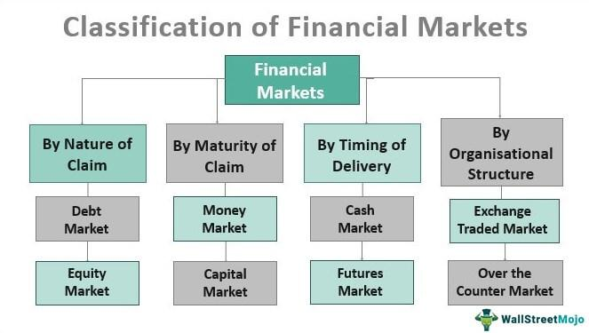

The global landscape of financial markets is a dynamic environment shaped by a myriad of factors such as technological advancements, regulatory changes, and the diverse activities of market participants. Financial markets serve as platforms for trading a variety of instruments, including stocks, bonds, commodities, and derivatives. These environments facilitate the allocation of resources, risk management, and price discovery, which are fundamental to economic growth and stability.

Technological advances, particularly in the realms of data processing and telecommunications, have profoundly transformed how financial markets operate. The introduction of electronic trading systems has streamlined the execution of transactions, reducing costs and improving market access. Moreover, regulatory frameworks continually evolve to address the complexities arising from globalization and technological innovation, ensuring market integrity and protecting investors.



Understanding the structure of these markets is essential for investors and traders who seek to optimize their strategies. Financial markets can be broadly categorized into primary markets, where new securities are issued, and secondary markets, where existing securities are traded. Each market type serves specific roles in capital formation and investment, influencing liquidity and price stability.

Simultaneously, the role of algorithmic trading has become increasingly prominent in these environments. Algorithmic trading employs sophisticated computer-encoded algorithms to execute trades based on pre-set criteria, offering significant advantages such as reduced transaction costs and enhanced market liquidity. As a critical component of modern trading systems, algorithmic trading necessitates a deep understanding of market structures and participant interactions.

This article explores the intricacies of financial markets and the different types of securities market structures, alongside the indispensable role of algorithmic trading. By gaining insights into these elements, market participants can better navigate the ever-evolving landscape, developing strategies that are well-suited to the modern financial ecosystem.

## Table of Contents

## Understanding Financial Markets

Financial markets are integral platforms where individuals and institutions engage in the trading of financial securities, commodities, derivatives, and other fungible assets. These markets facilitate the allocation of resources and the price discovery process, playing a crucial role in the economic framework by enabling capital formation and investment.

Financial markets are commonly divided into two distinct categories: primary markets and secondary markets. Primary markets are where new securities are issued and sold for the first time. Companies, governments, or public sector institutions utilize these markets to raise new capital by offering stocks and bonds. The process typically involves underwriters, often investment banks, who assess the value and viability of new issues and help facilitate their sale to investors. In contrast, secondary markets are venues where existing securities are traded among investors. The New York Stock Exchange (NYSE) and NASDAQ are quintessential examples where investors buy and sell shares that are already listed, providing [liquidity](/wiki/liquidity-risk-premium) to the securities and allowing investors to [exit](/wiki/exit-strategy) or enter investments with relative ease.

Key participants in financial markets include institutional investors, retail traders, and regulatory bodies. Institutional investors, such as pension funds, insurance companies, and mutual funds, are typically large entities that invest substantial sums of money on behalf of their clients. They contribute significantly to market liquidity due to the size of their transactions. Retail traders are individual investors who buy and sell securities for personal accounts. Despite often having less capital than institutional investors, the aggregation of retail trade activities can influence market dynamics and liquidity. Regulatory bodies, such as the Securities and Exchange Commission (SEC) in the United States, ensure fair practices, maintain market integrity, and protect investors. They enforce compliance with laws and regulations to prevent fraud, manipulation, and systemic risks in the financial system.

The roles played by these participants underscore the importance of liquidity and efficiency in the financial markets. Liquidity refers to the ease with which assets can be bought or sold without causing significant price changes. An efficient market, as proposed by the Efficient Market Hypothesis (EMH), is one where prices fully reflect all available information, allowing assets to be priced accurately based on fundamentals. While markets strive for efficiency, factors such as transaction costs, investor behavior, and regulatory interventions can cause deviations.

Understanding these components provides a foundation for investors and traders who continuously seek to optimize their strategies amidst the varying dynamics of financial markets.

## Types of Securities Market Structures

Securities market structures define the mechanisms through which trades are executed, influencing the efficiency and transparency of financial transactions. These structures can be broadly categorized into quote-driven, order-driven, hybrid, and brokered markets. Each type of structure carries distinct characteristics and operational dynamics that cater to various market needs.

**Quote-Driven Markets**: Also known as dealer markets, quote-driven markets rely on intermediaries, or dealers, to provide liquidity. In these markets, dealers post buy and sell prices for securities, and transactions take place directly between dealers and traders. The primary advantage of this structure is the provision of liquidity, as dealers are always ready to buy and sell securities, thus ensuring the continuity of trading. However, the disadvantage lies in the potential lack of transparency since the price discovery process is concentrated among a few dealers. An archetypal example of quote-driven markets is the over-the-counter (OTC) market, where instruments like corporate bonds and derivatives are often traded.

**Order-Driven Markets**: In contrast to quote-driven structures, order-driven markets operate through an electronic order book where all participants can place buy and sell orders. Transactions occur when compatible orders are matched, usually through a centralized auction mechanism. This structure promotes transparency, as the order book is typically visible to all market participants, thus aiding better price discovery. Exchanges like the Toronto Stock Exchange exemplify order-driven markets, offering an efficient environment for equities trading with visible market depth and pricing.

**Hybrid Markets**: Hybrid markets integrate elements of both quote-driven and order-driven systems, aiming to capitalize on the strengths of each. The New York Stock Exchange (NYSE) is a prototypical hybrid market; it retains a physical trading floor with designated market makers who facilitate liquidity, while simultaneously operating an order book system. This dual structure is designed to enhance liquidity provision while maintaining high transparency standards, allowing the coexistence of automated trading systems and human interaction.

**Brokered Markets**: Although not as prevalent as the aforementioned types, brokered markets exist when buyers and sellers are linked through brokers who charge a fee for their service. These markets are generally utilized for complex and less liquid transactions where direct matching of orders is inefficient. Brokered markets are prominent in large trades of real estate or special investment vehicles, avoiding the need for an exchange or a dealer. 

Each of these market structures serves different segments of the financial sector, offering varying levels of liquidity, transparency, and execution speed, thus helping participants to choose the most suitable platform for their trading requirements.

## Algorithmic Trading and Its Role

Algorithmic trading utilizes computer algorithms to execute trades with speed and precision, focusing on predefined criteria such as timing, price, and [volume](/wiki/volume-trading-strategy). This automated approach capitalizes on opportunities that human traders might overlook, thereby transforming the landscape of contemporary trading practices. 

One of the primary advantages of [algorithmic trading](/wiki/algorithmic-trading) is its ability to significantly reduce transaction costs. By minimizing the need for human intervention, trading algorithms operate with increased efficiency and lower execution costs. The agility of these algorithms allows for thousands of trades to be executed within fractions of a second, taking advantage of minute price discrepancies across different markets. This rapid execution is crucial for strategies such as [arbitrage](/wiki/arbitrage) and [market making](/wiki/market-making), where speed is a critical [factor](/wiki/factor-investing) in profitability.

Moreover, algorithmic trading enhances market liquidity. It facilitates smoother market operations by ensuring tighter spreads and continuous market presence. Liquidity is especially vital during periods of high [volatility](/wiki/volatility-trading-strategies), where the depth and breadth of the market can influence pricing dynamics and risk management.

The effectiveness of algorithmic trading relies on several critical components. First is the market structure analysis, where traders assess order [books](/wiki/algo-trading-books), market depth, and historical data to refine their strategies. Understanding the nuances of different market structures enables better prediction of market behavior and more informed trading decisions.

Liquidity considerations also play an integral role. Algorithms are often designed to estimate liquidity to determine the optimal size and timing of trades to minimize market impact. By integrating sophisticated models that assess liquidity events, traders can enhance the execution quality of their strategies.

The design and implementation of complex trading algorithms are foundational to successful algorithmic trading. These algorithms can range from simple rule-based systems to more sophisticated models incorporating elements of [machine learning](/wiki/machine-learning) and statistical methods. For instance, using Python, traders can employ libraries such as NumPy and Pandas to analyze data and design algorithms. Below is a basic template for an algorithmic trading strategy using Python:

```python
import pandas as pd
import numpy as np

# Load historical market data
data = pd.read_csv('market_data.csv')

# Simple moving average strategy
data['SMA_50'] = data['Close'].rolling(window=50).mean()
data['SMA_200'] = data['Close'].rolling(window=200).mean()

# Trading signal
data['Signal'] = np.where(data['SMA_50'] > data['SMA_200'], 1, 0)

# Generate trading orders
data['Position'] = data['Signal'].diff()

# Display trading orders
print(data[['Close', 'SMA_50', 'SMA_200', 'Signal', 'Position']])
```

In this example, the algorithm generates buy signals when the 50-day simple moving average crosses above the 200-day moving average, and sell signals when the reverse occurs. Such methodologies, though simplistic, can be expanded upon with additional indicators and conditions to suit more complex trading strategies. 

In conclusion, algorithmic trading is a pivotal element in modern financial markets, offering efficiency, liquidity, and lower transaction costs. As technology advances, the adoption of more sophisticated algorithms and data analysis methods will continue to shape the future of trade execution.

## Market Structure Analysis for Algo Trading

Market structure analysis for algorithmic trading is a sophisticated process that involves evaluating a range of factors to optimize trading strategies and manage risk effectively. The core components of this analysis include assessing order books, trading volume, transaction costs, and market impact. Each of these elements provides insights into market dynamics and helps traders navigate the complexities of financial markets.

Order books are essential for understanding the supply and demand dynamics of particular securities. They display the quantity of buy and sell orders at various price levels, offering a transparent view of market depth. Analyzing order books allows traders to assess liquidity, identify potential price levels for entry and exit points, and understand the impact of their trades. In algorithmic trading, this information can be used to program algorithms that adjust orders based on prevailing market conditions.

Volume is another critical component, representing the total quantity of shares or contracts traded over a specific period. High trading volumes generally indicate high liquidity, which can result in tighter bid-ask spreads and lower transaction costs. By analyzing volume patterns, traders can discern trends and [momentum](/wiki/momentum), helping them time their trades more effectively. Algorithms can be designed to react to volume changes, maximizing execution efficiency.

Transaction costs encompass all costs incurred during trading, including commissions, fees, and the bid-ask spread. Minimizing these costs is crucial for enhancing profitability, especially in high-frequency trading strategies. Algorithms can incorporate transaction cost analysis by adjusting execution strategies to favor times and venues with lower costs.

Market impact refers to the effect that a trade has on the price of a security. Large trades can move prices adversely, especially in illiquid markets. Algorithms aim to minimize market impact by breaking large orders into smaller ones or by executing trades incrementally over time to blend seamlessly with normal market activity.

In developing effective algorithmic strategies that adapt to evolving market conditions, traders must integrate these elements into their analysis practices. By doing so, they can enhance decision-making, manage risks, and optimize their trading strategies. As markets continue to change and new technologies emerge, the ability to perform granular market structure analysis becomes increasingly vital for maintaining a competitive edge in algorithmic trading.

## Challenges and Future Trends

One of the significant challenges in market structure analysis is dealing with data quality and availability. Financial markets generate vast amounts of data daily, yet ensuring data accuracy and reliability remains a hurdle. Inconsistent data collection methods and data fragmentation across different platforms can lead to discrepancies. Additionally, data latency— the delay in data transfer— affects trading strategies, particularly in high-frequency trading where milliseconds matter.

Regulatory constraints further complicate the landscape. As regulatory bodies aim to maintain fair and transparent markets, traders must navigate complex compliance requirements. These regulations can limit data accessibility and impose restrictions on trading practices. Compliance with varying international regulations adds another layer of complexity for traders operating in global markets.

Looking towards future trends, the integration of [artificial intelligence](/wiki/ai-artificial-intelligence) (AI) and machine learning offers promising enhancements to market structure analysis. Machine learning algorithms can process and analyze large datasets quickly, identifying patterns that may not be evident to human analysts. This capability aids in predictive analytics, providing traders with insights into potential market movements.

Blockchain technology presents another transformative potential. Its decentralized nature can enhance transparency and security in transaction recording. By providing immutable and verifiable transaction logs, blockchain can improve trust among market participants and simplify the verification process.

Real-time analytics is becoming increasingly essential. As technology advances, the ability to process and react to data in real time offers a competitive edge. Real-time analytics can facilitate faster decision-making and more accurate predictions, crucial in fast-paced trading environments.

To maintain a competitive advantage as financial markets evolve, staying abreast of these trends is vital. Embracing technological advancements such as AI and blockchain, along with enhancing data management practices, will enable traders to adapt to new challenges and leverage opportunities in the dynamic landscape of financial markets.

## Conclusion

Understanding financial markets, their structures, and the role of algorithmic trading is essential for traders aiming to optimize their strategies. As these markets become increasingly complex with the integration of technology, traders must adapt to stay competitive. The recognition of different market structures—such as quote-driven, order-driven, and hybrid markets—enables traders to make informed decisions regarding where and how to execute their trades. This knowledge, combined with the use of algorithmic trading, provides traders with tools to exploit market inefficiencies and minimize transaction costs.

Advancements in technology, such as the development of sophisticated algorithms and data analytics, have enabled traders to gain deeper insights into market trends and price movements. These tools facilitate timely decision-making and enhance the ability to respond swiftly to market fluctuations. While challenges such as data quality, regulatory constraints, and market volatility persist, they can be mitigated through thorough market structure analysis and adaptive algorithmic strategies.

Professionals who leverage these insights effectively will be better positioned to navigate the evolving landscape of financial markets. By combining a deep understanding of market structures with cutting-edge technology, traders can refine their strategies to achieve improved performance. This comprehensive approach to trading not only enhances profitability but also contributes to maintaining a competitive edge in the fast-paced world of finance.

## References & Further Reading

[1]: Bergstra, J., Bardenet, R., Bengio, Y., & Kégl, B. (2011). ["Algorithms for Hyper-Parameter Optimization."](https://dl.acm.org/doi/10.5555/2986459.2986743) Advances in Neural Information Processing Systems 24.

[2]: ["Advances in Financial Machine Learning"](https://www.amazon.com/Advances-Financial-Machine-Learning-Marcos/dp/1119482089) by Marcos Lopez de Prado.

[3]: ["Evidence-Based Technical Analysis: Applying the Scientific Method and Statistical Inference to Trading Signals"](https://www.amazon.com/Evidence-Based-Technical-Analysis-Scientific-Statistical/dp/0470008741) by David Aronson.

[4]: ["Machine Learning for Algorithmic Trading"](https://github.com/stefan-jansen/machine-learning-for-trading) by Stefan Jansen.

[5]: ["Quantitative Trading: How to Build Your Own Algorithmic Trading Business"](https://www.amazon.com/Quantitative-Trading-Build-Algorithmic-Business/dp/1119800064) by Ernest P. Chan.