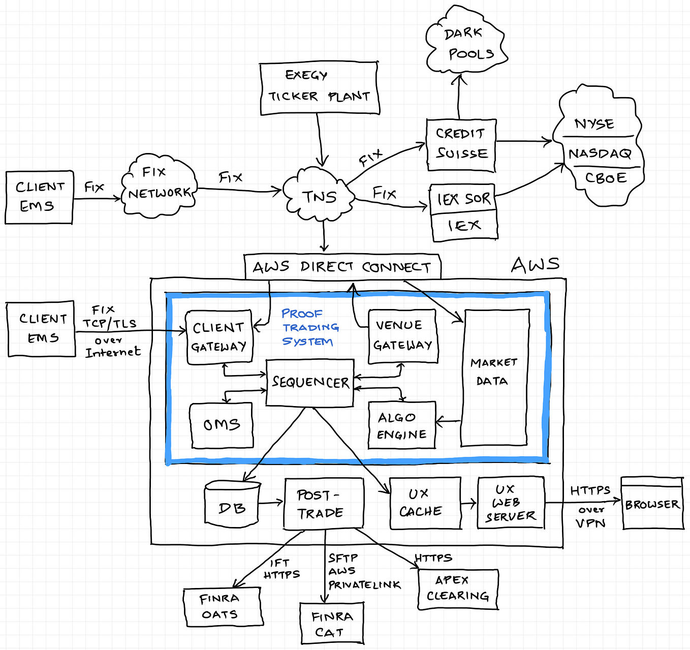

## Table of Contents

## What is a Securities Master Database?

A Securities Master Database is a big collection of information about different kinds of investments, like stocks, bonds, and mutual funds. It helps people who work with investments, like financial analysts and traders, to keep track of all the details they need. This database includes things like the price of the investment, how much it's worth, who issued it, and other important facts.

Having a Securities Master Database makes it easier for people to make smart choices about buying and selling investments. It's like a giant library where you can find all the information you need in one place. This helps everyone from big banks to individual investors to understand the market better and manage their investments more effectively.

## Why are Securities Master Databases important for algorithmic trading?

Securities Master Databases are really important for algorithmic trading because they give traders all the information they need in one place. When you're using computers to trade, you need to know a lot about different investments quickly. The database helps by keeping track of things like prices, how much an investment is worth, and other details. This way, the computer can make fast and smart decisions about buying or selling.

Also, these databases help keep everything organized and up-to-date. In [algorithmic trading](/wiki/algorithmic-trading), timing is everything. If the information is not current, the computer might make bad trades. The Securities Master Database makes sure that the data is always fresh and accurate, which is crucial for making the right moves at the right time. This helps traders trust their algorithms and make better profits.

## What types of data are typically stored in a Securities Master Database?

A Securities Master Database usually keeps a lot of different kinds of information about investments. This includes things like the name of the investment, its type (like stocks or bonds), who issued it, and its unique ID number. It also has details on how much the investment is worth, its price, and how many shares or units are available. This helps people know exactly what they are dealing with when they look at different investments.

The database also keeps track of other important facts, like when the investment was first issued and when it will stop being valid. It might include information on any dividends or interest payments, as well as any corporate actions like mergers or splits that could affect the investment's value. All this data helps traders and investors make smart choices by giving them a complete picture of the investment.

Sometimes, the database also includes more detailed information like the investment's risk level, how it's been performing over time, and any news or events that could impact its value. This extra information can be really helpful for people who need to understand the bigger picture before making trading decisions. Keeping all this data in one place makes it easier for everyone to use and understand.

## How does a Securities Master Database help in managing trading risks?

A Securities Master Database helps manage trading risks by providing traders with all the important information about different investments in one place. This means traders can see things like how much an investment is worth, how risky it is, and how it has been doing over time. With this information, traders can make better decisions about which investments to buy or sell, and they can also figure out how much risk they are taking on with each trade. By understanding the risks better, traders can avoid making big mistakes that could lose them money.

The database also helps by keeping the information up-to-date. In trading, things can change very quickly, and having old information can lead to bad decisions. A Securities Master Database makes sure that the data is always current, so traders can react to changes in the market right away. This helps them manage their risks better because they can adjust their trading strategies as soon as new information comes in. By using a Securities Master Database, traders can feel more confident that they are making the best choices to protect their investments.

## What are the key features to look for in a Securities Master Database?

When looking for a Securities Master Database, one of the most important things to consider is how complete and accurate the data is. The database should have all the details about different investments, like stocks, bonds, and mutual funds. This includes things like prices, how much they are worth, who issued them, and any important events that could affect their value. If the data is not complete or correct, it can lead to bad trading decisions. So, it's really important that the database keeps everything up-to-date and accurate.

Another key feature is how easy it is to use the database. It should be simple for traders and investors to find and understand the information they need. This means the database should have a good way to search for data and show it in a clear way. It should also work well with other tools that traders use, like trading platforms and risk management systems. If the database is hard to use, it can slow down trading and make it harder to manage risks effectively. So, choosing a user-friendly Securities Master Database can make a big difference in how well traders can do their jobs.

## How do you integrate a Securities Master Database with algorithmic trading systems?

To integrate a Securities Master Database with algorithmic trading systems, you need to make sure that the database can talk to the trading system easily. This means setting up a connection so that the trading system can pull information from the database whenever it needs to make a trade. This connection could be through an API (Application Programming Interface), which is like a special tool that lets different computer programs share information. Once the connection is set up, the trading system can use the data from the database to make smart decisions about buying and selling investments.

After the connection is in place, it's important to make sure that the data from the Securities Master Database is always up-to-date and accurate. The trading system needs to be able to trust the information it's getting, so the database should be updated in real-time or as close to real-time as possible. This helps the trading algorithms make the best decisions based on the latest information. By keeping the data fresh and the connection smooth, the integration of a Securities Master Database with an algorithmic trading system can help traders make better trades and manage their risks more effectively.

## What are the common challenges faced when using Securities Master Databases in algorithmic trading?

One common challenge when using Securities Master Databases in algorithmic trading is keeping the data up-to-date. Since trading happens very fast, the information in the database needs to be current. If the data is even a little bit old, it can lead to bad trading decisions. This means the database has to be updated in real-time or as close to real-time as possible. Making sure the data is always fresh can be hard, especially if there are a lot of investments to keep track of.

Another challenge is making sure the data is accurate. Mistakes in the data can cause big problems for traders. For example, if the price of a stock is wrong in the database, the trading algorithm might buy or sell at the wrong time. This can lead to losses. So, it's really important to have good ways to check and fix any errors in the data. This can be a lot of work and needs careful attention to detail.

Lastly, integrating the Securities Master Database with the trading system can be tricky. The database and the trading system need to work well together, which means setting up a good connection. This connection should be fast and reliable so that the trading system can get the information it needs quickly. If the connection is slow or breaks often, it can slow down trading and cause problems. Making sure everything works smoothly together takes time and technical know-how.

## How can data quality issues in Securities Master Databases impact algorithmic trading strategies?

Data quality issues in Securities Master Databases can really mess up algorithmic trading strategies. If the data in the database is wrong or not up-to-date, the trading algorithms might make bad decisions. For example, if the price of a stock is listed incorrectly, the algorithm might buy or sell at the wrong time. This can lead to big losses because the trades are based on bad information. It's like trying to drive a car with a broken speedometer; you can't make good choices if you don't have the right information.

Another problem is that if the data is not complete, the algorithms might miss important details. For instance, if the database doesn't have information about a company's upcoming dividend payment, the algorithm won't know to adjust its trading strategy. This can cause the algorithm to miss out on opportunities or take on more risk than it should. Keeping the data accurate and complete is crucial for algorithmic trading to work well and help traders make smart choices.

## What are the best practices for maintaining and updating a Securities Master Database?

To keep a Securities Master Database in good shape, it's important to update it regularly. This means making sure the information about prices, how much investments are worth, and any important events is always fresh. One way to do this is by setting up automatic updates that pull in new data from trusted sources. This helps keep everything current without a lot of extra work. It's also a good idea to check the data often to make sure it's correct. If you find any mistakes, fix them right away so the database stays accurate.

Another good practice is to have a team of people who are in charge of the database. These people can make sure the data is complete and up-to-date. They should also have a plan for what to do if something goes wrong, like if the database stops working or if there's a big change in the market. By having a team that knows what to do, you can keep the database running smoothly and help traders make the best decisions.

## How do Securities Master Databases support compliance and regulatory requirements in trading?

Securities Master Databases help with compliance and regulatory requirements by keeping all the important information about investments in one place. This makes it easier for traders and companies to follow the rules set by financial regulators. For example, the database can keep track of things like who owns what investments, how much they are worth, and any changes that happen, like mergers or splits. By having all this information organized and up-to-date, it's simpler for companies to make sure they are following the rules and can show this to regulators if needed.

Also, these databases help with reporting and audits. When regulators want to check if a company is following the rules, they can look at the data in the Securities Master Database. This data can show that the company is keeping accurate records and making trades the right way. By using a Securities Master Database, companies can make sure they are doing everything they need to do to stay compliant and avoid getting in trouble with regulators.

## What advanced analytics can be performed using data from Securities Master Databases?

Using data from Securities Master Databases, traders can do some really smart things to understand the market better. They can look at patterns over time to see how investments have been doing and predict what might happen next. This is called trend analysis. They can also compare different investments to see which ones are doing better than others, which is known as performance benchmarking. By doing these kinds of advanced analytics, traders can figure out the best times to buy or sell and make smarter choices about their investments.

Another cool thing they can do is risk analysis. This means they can use the data to understand how risky an investment might be. They can look at things like how much the price of an investment goes up and down, which is called [volatility](/wiki/volatility-trading-strategies), and how it might be affected by things like news or economic changes. By understanding these risks better, traders can make plans to protect their money and avoid big losses. All of this helps them manage their trading strategies more effectively and make the most out of their investments.

## How can machine learning and AI enhance the use of Securities Master Databases in algorithmic trading?

Machine learning and AI can make Securities Master Databases even better for algorithmic trading by finding patterns in the data that people might miss. These smart computers can look at a lot of information really quickly and learn from it. They can predict what might happen next with prices and how investments might do in the future. This helps traders make better choices about when to buy or sell. By using [machine learning](/wiki/machine-learning), the trading algorithms can get smarter over time and make more money for traders.

AI can also help keep the data in the Securities Master Database clean and accurate. It can check for mistakes and fix them automatically, which saves a lot of time. AI can also update the database faster by pulling in new information from different places. This means the data is always fresh, which is really important for making good trading decisions. By using AI, traders can trust that their database is up-to-date and accurate, which helps them manage their risks better and trade more successfully.

## References & Further Reading

[1]: Bergstra, J., Bardenet, R., Bengio, Y., & Kégl, B. (2011). ["Algorithms for Hyper-Parameter Optimization."](https://dl.acm.org/doi/10.5555/2986459.2986743) Advances in Neural Information Processing Systems 24.

[2]: ["Advances in Financial Machine Learning"](https://www.amazon.com/Advances-Financial-Machine-Learning-Marcos/dp/1119482089) by Marcos Lopez de Prado

[3]: ["Evidence-Based Technical Analysis: Applying the Scientific Method and Statistical Inference to Trading Signals"](https://www.amazon.com/Evidence-Based-Technical-Analysis-Scientific-Statistical/dp/0470008741) by David Aronson

[4]: ["Machine Learning for Algorithmic Trading"](https://github.com/stefan-jansen/machine-learning-for-trading) by Stefan Jansen

[5]: ["Quantitative Trading: How to Build Your Own Algorithmic Trading Business"](https://www.amazon.com/Quantitative-Trading-Build-Algorithmic-Business/dp/0470284889) by Ernest P. Chan