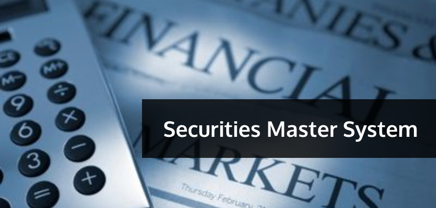

## Table of Contents

## What is a Securities Master System?

A Securities Master System is a type of database used by financial institutions to keep track of all the different kinds of securities they deal with. Securities can include things like stocks, bonds, and other financial instruments. The system helps to organize and store important information about each security, such as its price, how much of it the institution owns, and other details that are important for managing investments.

This system is very important for financial companies because it helps them make better decisions about buying and selling securities. It also makes sure that everyone in the company is using the same information, which helps avoid mistakes. By keeping everything in one place, the Securities Master System makes it easier for the company to manage its investments and keep track of what is happening in the financial markets.

## Why is a Securities Master System important in financial markets?

A Securities Master System is important in financial markets because it helps financial institutions keep track of all the different types of securities they deal with, like stocks and bonds. This system acts like a big, organized list that stores all the important information about each security, such as its price and how much of it the institution owns. By having all this information in one place, it makes it easier for the company to manage its investments and make smart decisions about buying and selling.

Having a Securities Master System also helps make sure that everyone in the company is looking at the same information. This is important because it reduces the chance of mistakes that can happen when people are working with different sets of data. When everyone uses the same up-to-date information, it helps the company work better together and make more accurate decisions about their investments.

## What are the key components of a Securities Master System?

A Securities Master System has a few main parts that help it work well. One important part is the database where all the information about different securities is stored. This includes details like the name of the security, its price, how many the company owns, and other important facts. This database needs to be very organized so that people can find what they need quickly and easily.

Another key part is the system's ability to update information in real-time. Because the prices and other details of securities can change quickly, it's important for the system to keep up with these changes. This helps make sure that everyone using the system has the most current information, which is crucial for making good investment decisions. The system also needs to be able to handle a lot of data and work quickly, so it doesn't slow down when people are trying to use it.

Lastly, the system should have good tools for reporting and analysis. These tools help people look at the data in different ways to understand trends and make better decisions. For example, they might use these tools to see how a certain stock has been doing over time or to compare different securities. Having these tools makes the Securities Master System more useful and helps the company manage its investments better.

## How does a Securities Master System handle data normalization and standardization?

A Securities Master System deals with data normalization and standardization by making sure all the information about securities is in the same format. This means that no matter where the data comes from, it gets changed into a standard way of writing things. For example, if one place writes "USD" for dollars and another writes "US Dollar," the system will change both to "USD." This helps everyone in the company understand the data the same way, which is important for making good decisions.

The system also uses rules to clean up the data. It checks for mistakes and fixes them, like making sure dates are written the same way everywhere. If there are different names for the same security, the system will pick one name to use all the time. This makes the data more reliable and easier to work with. By doing all this, the Securities Master System helps the company keep its information neat and accurate, which is key for managing investments well.

## What role does a Securities Master System play in risk management?

A Securities Master System helps with risk management by keeping all the information about securities in one place. This makes it easier for people to see the whole picture of what the company owns and what risks it might face. For example, if the company has a lot of money in one type of stock, the system can show this clearly. This helps the company decide if it should spread its money out more to lower the risk.

The system also helps by giving up-to-date information. Because prices and other details about securities can change quickly, having the latest data is important for managing risk. If something big happens in the market, the system can show these changes right away. This helps the company react fast to protect its investments. By using the Securities Master System, the company can make better choices to keep its money safe.

## How can a Securities Master System improve operational efficiency?

A Securities Master System can make a company work better by keeping all the information about securities in one place. This means people don't have to spend time looking for data in different places. When everything is organized, it's easier and faster to find what you need. This saves time and helps people do their jobs more quickly.

The system also helps because it makes sure everyone is using the same information. When everyone sees the same data, there are fewer mistakes. This means less time fixing errors and more time doing important work. By having a system that updates information quickly and keeps it neat, the company can work more smoothly and get more done.

## What are the common challenges faced when implementing a Securities Master System?

Implementing a Securities Master System can be hard because it needs a lot of work to set up. One big challenge is getting all the data from different places into the system. Companies often have information in different systems or formats, and it takes time to put it all together in one place. Another problem is making sure the data is right. When you move a lot of data, mistakes can happen, and it's important to check everything carefully to make sure it's correct.

Another challenge is training people to use the new system. Not everyone might be used to working with a Securities Master System, so they need to learn how it works. This can take time and might slow things down at first. Also, the system needs to keep running smoothly, which means it needs good support and updates. If something goes wrong, it can be a big problem, so having a good plan to fix issues quickly is important.

## How does a Securities Master System integrate with other financial systems?

A Securities Master System works together with other financial systems to make everything run smoothly. It shares information with systems like trading platforms, risk management tools, and accounting software. This sharing helps make sure that all parts of the company are using the same up-to-date information about securities. For example, when a trade happens, the Securities Master System sends the details to the accounting system so the [books](/wiki/algo-trading-books) stay correct. This connection helps the company keep track of everything and make better decisions.

Sometimes, connecting these systems can be tricky. The Securities Master System needs to be able to talk to different kinds of software, which might use different ways of sending and receiving data. This means the system has to be able to change the data into a format that other systems can understand. It's important to set up these connections carefully so that everything works well together. When done right, this integration helps the company work more efficiently and manage its investments better.

## What are the best practices for maintaining data quality in a Securities Master System?

Keeping the data in a Securities Master System good and accurate is really important. One way to do this is by checking the data often. This means looking at the information to make sure it's right and fixing any mistakes you find. It's also a good idea to have rules for how data should be entered into the system. These rules help make sure everyone puts in the information the same way, which makes the data more reliable. Another important thing is to keep the system updated with the latest information. This helps make sure the data stays correct even when things change in the market.

Another best practice is to use tools that can help clean up the data. These tools can find and fix common problems, like missing information or wrong numbers. It's also helpful to have people who are in charge of looking after the data. They can make sure the system is working well and that the data stays good quality. By following these practices, a company can keep its Securities Master System working well and make sure the information it uses for decisions is accurate and reliable.

## How do regulatory requirements impact the design and operation of a Securities Master System?

Regulatory requirements play a big role in how a Securities Master System is made and used. These rules are set by governments and financial watchdogs to make sure companies handle securities the right way. When designing the system, companies have to make sure it can keep track of all the information that these rules say they need to. For example, the system has to be able to show where the securities came from, how much they cost, and any other details the regulators want to see. This means the system needs to be very detailed and accurate to meet these requirements.

Once the system is up and running, it has to keep following these rules every day. This means the company needs to update the system regularly to make sure it still meets the latest regulations. They also need to have ways to report information to the regulators easily and on time. If the system doesn't follow the rules, the company could get in trouble, so it's really important to keep the system in line with what the law says. By doing this, the company can avoid fines and keep everything running smoothly.

## What advanced features can be found in modern Securities Master Systems?

Modern Securities Master Systems come with some really helpful advanced features. One cool feature is the ability to use [artificial intelligence](/wiki/ai-artificial-intelligence) (AI) and [machine learning](/wiki/machine-learning). These technologies help the system spot patterns and trends in the data, making it easier for people to understand what's going on in the market. The system can also use these tools to predict what might happen next, which can be a big help when making investment decisions. Another advanced feature is better data visualization. This means the system can show the information in charts and graphs that are easy to read and understand, helping people see the big picture quickly.

Another important feature in modern systems is better integration with other tools. For example, the system can connect with trading platforms, risk management software, and accounting systems more smoothly. This makes everything work together better, so the company can manage its investments more efficiently. Also, many modern Securities Master Systems have strong security features to protect the data. They use things like encryption and secure access controls to keep the information safe from hackers and other threats. These advanced features make the system more powerful and helpful for managing securities.

## How can artificial intelligence and machine learning enhance the functionality of a Securities Master System?

Artificial intelligence and machine learning can make a Securities Master System a lot smarter. These technologies can look at huge amounts of data to find patterns and trends that people might miss. For example, they can predict how the price of a security might change based on past data and other things happening in the market. This helps the company make better decisions about buying and selling securities. The system can also learn over time, getting better at understanding what's going on in the market and giving more accurate predictions.

Another way AI and machine learning help is by making the system easier to use. They can automatically sort and clean up data, so it's always in the right format and ready to use. This saves time and reduces mistakes. Plus, these technologies can make the system more personalized. They can learn what kind of information each user needs and show it to them in a way that's easy to understand. This makes the Securities Master System more helpful and efficient for everyone in the company.

## References & Further Reading

[1]: ["Algo Trading: Winning Strategies and Their Rationale"](https://books.google.com/books/about/The_Big_Book_Of_Algo_Trading.html?id=QmxizgEACAAJ) by Ernest P. Chan

[2]: ["The Handbook of Fixed Income Securities"](https://www.amazon.com/Handbook-Fixed-Income-Securities-Ninth/dp/1260473899) edited by Frank J. Fabozzi

[3]: Armon, Harold, and Nevo, Erez. (2017). ["The structure of securities identification: Past, present, and future developments"](https://www.researchgate.net/publication/324850641_Successful_Organizational_Change_Integrating_the_Management_Practice_and_Scholarly_Literatures). Journal of Financial Markets.

[4]: ["Trade Identification Numbers: CUSIP, ISIN, and FIGI"](https://www.investopedia.com/terms/c/cusipnumber.asp) on Investopedia

[5]: ["Financial Instrument Global Identifier (FIGI)"](https://en.wikipedia.org/wiki/Financial_Instrument_Global_Identifier) on OpenFIGI