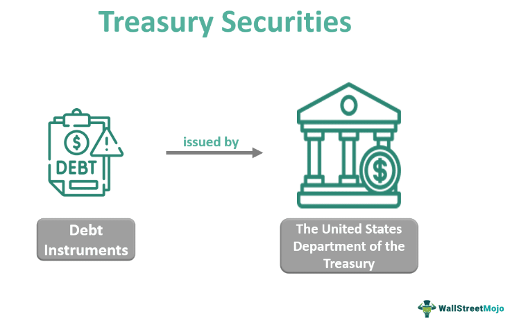

In the rapidly evolving world of finance, algorithmic trading and the offering of financial markets' securities are two pivotal aspects that have transformed the landscape of modern financial systems. These elements serve crucial functions, enabling market participants to engage with increased efficiency, precision, and adaptability. This article examines the intersection of securities offerings and algorithmic trading, focusing on their significance and the impact they have on contemporary financial markets.

Securities offerings are fundamental for companies aiming to raise capital, typically involving the issuance of shares, bonds, or other financial instruments. These offerings are vital for business expansion and corporate financing, providing a means for companies to gain access to funds from public investors. Meanwhile, algorithmic trading has gained prominence due to its capacity to execute high volumes of trades at unprecedented speeds. Utilizing complex algorithms, these trades are conducted based on predefined rules and criteria, largely eliminating human error and emotion, leading to increased trading efficiency and accuracy.



In exploring these foundational concepts, it becomes clear that the synergy between securities offerings and algorithmic trading creates a dynamic trading environment. The integration of algorithmic systems into the process of securities offerings facilitates rapid and efficient market transactions, enhancing liquidity and stability. As the financial markets continually adapt to technological advancements, understanding the roles and interactions of securities offerings and algorithmic trading becomes essential for financial professionals and investors aiming to stay informed about future trends and developments in this field.

## Table of Contents

## Understanding Securities Offerings

Securities offerings are fundamental instruments through which companies raise capital to fund operations, growth, and expansion. These offerings typically manifest in the form of stocks, bonds, or other financial instruments. Each type of offering is designed to cater to specific financial needs and investor appetites.

There are primarily two types of securities offerings: Initial Public Offerings (IPOs) and secondary offerings. An IPO is the process by which a private company becomes publicly traded by offering its shares to the public for the first time. This transition allows the company to raise significant capital while offering investors an opportunity to partake in the company's growth. In contrast, secondary offerings involve companies that are already public issuing additional shares or existing shareholders selling their stakes to the public. These offerings help in raising additional capital post-IPO or providing liquidity to existing shareholders without altering the company's equity structure significantly.

The issuance of securities is a complex process that involves underwriting, primarily managed by investment banks. Underwriting refers to the risk assessment and facilitation of the sale of the securities. Investment banks play a crucial role in this process by evaluating the risk associated with the offering, setting the initial price for the securities, and purchasing the securities from the issuer to sell them to the public. This ensures that the issuer secures the necessary capital while the risk of the sale is effectively managed. The process is meticulously planned to ensure that both the issuer's and investors' interests are adequately served, creating a balanced dynamic that supports market stability.

In summary, securities offerings are essential mechanisms for capital formation in financial markets, providing companies with the means to access vast pools of funds while offering investors a diverse range of investment opportunities.

 to Algorithmic Trading

Algorithmic trading, often abbreviated as algo trading, employs automated systems to execute trades based on a set of predefined rules and criteria. These systems leverage computer algorithms, enabling decision-making and trade execution at speeds and volumes that surpass human capabilities. The essence of [algorithmic trading](/wiki/algorithmic-trading) lies in its ability to exploit market conditions by automating processes that traditionally required extensive human intervention.

At the core of algorithmic trading are algorithms—step-by-step computational procedures—that analyze market data and execute trades while adhering to specific instructions. These algorithms can instantaneously process vast amounts of data to identify trading opportunities, thereby optimizing the timing and pricing of trades.

One of the most prevalent strategies employed in algorithmic trading is [trend following](/wiki/trend-following). This approach capitalizes on the [momentum](/wiki/momentum) of market prices, where algorithms identify and follow existing trends until a reversal in trend becomes apparent. Trend-following strategies often rely on technical indicators, such as moving averages or price breakouts, to determine entry and [exit](/wiki/exit-strategy) points.

Mean reversion is another key strategy in algo trading. It is predicated on the statistical assumption that asset prices and historical returns eventually revert to their long-term mean or average level. Algorithms using mean reversion strategies monitor price deviations from their average and place trades betting on a return to this average. This often entails buying underpriced securities or short-selling overpriced ones.

Statistical [arbitrage](/wiki/arbitrage) represents a sophisticated strategy that relies on mathematical models to identify and exploit price differences between related financial instruments. This strategy involves simultaneously buying and selling correlated assets, with the expectation that the price disparity will eventually self-correct. Statistical arbitrage requires meticulous risk management and a deep understanding of the underlying correlations between traded assets.

The integration of these strategies within algorithmic trading frameworks enhances market efficiency by facilitating [liquidity](/wiki/liquidity-risk-premium) and price discovery. As technology advances, the reliance on high-frequency trading platforms, where algorithms perform trades in fractions of a second, has increased. These platforms can quickly adapt to dynamic market conditions, thus ensuring optimal execution of trades.

In summary, algorithmic trading embodies a transformative shift in how financial markets operate by using algorithms to perform tasks traditionally executed by human traders. This paradigm shift not only accelerates trade execution but also enhances the precision and efficiency of trading operations.

## Benefits and Challenges of Algo Trading

Algorithmic trading, known for its speed and efficiency, plays a pivotal role in modern financial markets. One of its primary advantages is the ability to execute trades swiftly, significantly reducing the slippage and market impact associated with manual trading. By utilizing pre-programmed algorithms, trades can be carried out in milliseconds, enabling traders to capitalize on minute market movements that would be otherwise inaccessible through traditional trading methods.

Moreover, algorithmic trading mitigates the emotional bias inherent in human decision-making. By relying on data-driven strategies, it provides a more consistent and objective approach to trading. This helps in maintaining discipline, as the systems stick to predefined rules, avoiding decisions based on fear or greed. For instance, algorithms can apply strategies like moving average crossovers or Bollinger Bands without the subjective interpretations that might influence a human trader's decisions.

However, despite these benefits, algorithmic trading does present several challenges. One significant challenge lies in developing algorithms robust enough to handle unexpected market conditions. Markets can experience sudden [volatility](/wiki/volatility-trading-strategies) due to unforeseen events, and an algorithm's ability to adapt to such changes is crucial. This requires continuous monitoring and updating of algorithms to ensure their effectiveness in various market environments.

Technical issues are another concern. The infrastructure supporting algorithmic trading, including networks, servers, and software, must be resilient and efficient. System failures, latency issues, or glitches can lead to substantial losses, necessitating robust risk management protocols and fail-safes to be in place.

In conclusion, while algorithmic trading offers efficiency and objectivity by eliminating emotional biases, it is also crucial to address its technical and adaptive challenges to harness its full potential effectively.

## Integration of Securities Offerings and Algo Trading

Algorithmic trading platforms are integral in managing the complexities of buying and selling securities during offerings, particularly in high-frequency trading ([HFT](/wiki/high-frequency-trading-strategies)) contexts. These platforms utilize sophisticated algorithms capable of executing trades at microsecond intervals, a speed and precision unattainable by human traders. This is especially beneficial during significant market events such as Initial Public Offerings (IPOs) or secondary offerings, which typically involve substantial trading volumes and require swift, systematic execution to maintain market stability and liquidity.

Automated strategies are employed to efficiently distribute large volumes of securities, thus enhancing market liquidity. For instance, during an IPO, these strategies can be programmed to execute trades in a manner that minimizes market impact. By doing so, the algorithm reduces the susceptibility of the security to price fluctuations, thereby maintaining a stable market environment. Similarly, in the case of secondary offerings, algorithms can assist in the strategic placement of large orders, again ensuring smooth entry into the market without significant price disruption.

The synergy between securities offerings and algorithmic trading contributes to more efficient markets, characterized by enhanced price discovery and reduced bid-ask spreads. Price discovery, the process by which market prices adjust to reflect new information, is accelerated through algorithmic trading. Algorithms can swiftly aggregate and analyze vast amounts of market data to determine fair asset prices. This instantaneous processing facilitates quicker adjustments in security prices, allowing markets to reflect information more rapidly and accurately.

Moreover, the integration of algorithmic trading can lead to reduced spreads, the difference between the bid and ask prices. By continuously providing liquidity and executing trades at optimal prices, algorithms help narrow these spreads. A tighter spread indicates a more liquid market, benefiting all market participants by reducing transaction costs.

In conclusion, the intersection of securities offerings and algorithmic trading platforms optimizes market operations by improving liquidity and efficiency. This integration plays a crucial role in modern financial markets, ensuring that they operate with less friction and more precision. As these technologies continue to advance, their ability to streamline complex trading processes will likely deepen, further enhancing market efficiency.

## Regulatory Considerations

Securities offerings and algorithmic trading are pivotal elements of modern financial systems, necessitating rigorous regulatory frameworks to maintain market integrity and safeguard investor interests. Globally, regulatory bodies have instituted comprehensive measures to oversee these activities, ensuring that they function within the defined legal and ethical boundaries.

In the United States, the Securities and Exchange Commission (SEC) is the primary authority overseeing securities offerings. The SEC enforces a robust set of rules that require companies to register securities offerings unless they qualify for an exemption. These regulations are designed to ensure that investors have access to material information to make informed investment decisions. The SEC's Regulation D offers guidelines and exemptions for smaller securities offerings, balancing the need for capital formation with investor protection.

Algorithmic trading, particularly high-frequency trading (HFT), is monitored closely by various agencies due to its potential impact on market stability. The SEC and the Commodity Futures Trading Commission (CFTC) mandate that firms engaging in algo trading have adequate risk management and compliance systems. Ensuring transparency in algorithmic trading operations is crucial, with firms required to maintain records and report their trading activity.

In Europe, the Markets in Financial Instruments Directive II (MiFID II) provides a regulatory framework for algorithmic trading. MiFID II requires that firms engaged in algorithmic trading implement appropriate systems and controls to mitigate risks, including testing algorithms prior to deployment. The directive also demands firms have mechanisms to cancel or modify trades in adverse scenarios, thereby reducing systemic risk.

The Financial Conduct Authority (FCA) in the United Kingdom further establishes stringent controls over both securities offerings and algorithmic trading. The FCA insists on the proper conduct of participants in these markets, emphasizing the importance of transparency and investor protection.

Companies engaging in securities offerings and utilizing algorithmic trading strategies must navigate this complex regulatory landscape. Compliance entails not only adhering to reporting and operational standards but also staying updated with changes in regulations. Failure to comply can result in severe penalties, including fines and, in extreme cases, suspension from trading activities.

Hence, remaining informed about regulatory requirements and maintaining robust compliance systems is crucial for market participants. This vigilance ensures that they contribute positively to the financial ecosystem, fostering trust and stability within the markets.

## Future Trends in Algo Trading and Securities Offerings

As technology continues to evolve, the sophistication of algorithmic trading systems is expected to increase exponentially. This advancement will provide novel opportunities to refine trading strategies, optimize execution, and enhance market efficiency. One of the most significant technological advancements driving this evolution is the proliferation of [machine learning](/wiki/machine-learning) and [artificial intelligence](/wiki/ai-artificial-intelligence) (AI) in trading algorithms.

Machine learning algorithms excel in identifying complex patterns in data, enabling them to make predictions and decisions based on historical and real-time market data. These capabilities could be integrated into trading systems to improve predictive accuracy and adjust strategies dynamically. AI can also enhance risk management by better understanding market conditions and early detection of unusual activities or trends. For example, [reinforcement learning](/wiki/reinforcement-learning), a subset of machine learning, allows trading algorithms to learn from their decisions and improve over time, which could lead to more profitable trading strategies.

Python's extensive libraries, such as NumPy and Pandas for data manipulation, scikit-learn for machine learning, and TensorFlow or PyTorch for [deep learning](/wiki/deep-learning), provide powerful tools for developing and testing such sophisticated trading algorithms. Here's an example of a simple machine learning model using Python for predicting asset prices:

```python
import pandas as pd
from sklearn.model_selection import train_test_split
from sklearn.linear_model import LinearRegression
from sklearn.metrics import mean_squared_error

# Load market data
data = pd.read_csv('market_data.csv')

# Prepare features and target
X = data[['feature1', 'feature2', 'feature3']]
y = data['target_price']

# Split the data
X_train, X_test, y_train, y_test = train_test_split(X, y, test_size=0.2, random_state=42)

# Initialize and train the model
model = LinearRegression()
model.fit(X_train, y_train)

# Make predictions
predictions = model.predict(X_test)

# Evaluate the model
mse = mean_squared_error(y_test, predictions)
print(f'Mean Squared Error: {mse}')
```

The integration of algorithmic systems during securities offerings is another area poised for growth, potentially transforming the accessibility and efficiency of capital markets. Automated trading systems can manage the large volumes associated with IPOs and secondary offerings, ensuring that pricing remains efficient and volatility is minimized. Algorithmic trading's ability to analyze vast data sets quickly enables it to execute trades in milliseconds, which is crucial during significant market events like public offerings.

Moreover, the synergy between advanced analytics and trading platforms can lead to better price discovery and narrower spreads, beneficial to both issuers and traders. As these systems become more robust, they can also contribute to more inclusive markets by lowering barriers for smaller investors and facilitating participation in capital fundraising activities.

In conclusion, the future of algorithmic trading and securities offerings promises increased sophistication, largely driven by AI and machine learning. These technologies are set to redefine trading efficiency and market accessibility, making it an exciting prospect for financial institutions and traders alike. As advancements continue, staying informed and adapting to these changes will be essential for maintaining a competitive edge in the financial markets.

## Conclusion

Securities offerings and algorithmic trading are both critical components of modern financial markets, shaping how capital is raised and trades are executed. The integration of these elements results in more efficient, liquid, and accessible markets. Algorithmic trading leverages automation to execute trades with precision and speed, reducing the time and cost associated with traditional trading methods. This efficiency extends to securities offerings, where automated trading platforms can handle large volumes and facilitate smoother transactions.

The convergence of these technologies not only enhances market liquidity but also improves price discovery, leading to tighter spreads and better market conditions for all participants. By using sophisticated algorithms, traders can react to market conditions in real-time, providing stability and reducing the likelihood of drastic market fluctuations during capital-raising events such as initial public offerings (IPOs) and secondary offerings.

As the financial landscape continues to evolve, staying informed on these advancements is essential for investors and financial professionals. The rapid advancement of technology, including developments in machine learning and artificial intelligence, promises to further optimize trading strategies and market operations. This evolution underscores the need for continuous education and adaptation within the financial industry to harness the full potential of securities offerings and algorithmic trading.

## References & Further Reading

[1]: Bergstra, J., Bardenet, R., Bengio, Y., & Kégl, B. (2011). ["Algorithms for Hyper-Parameter Optimization."](https://dl.acm.org/doi/10.5555/2986459.2986743) Advances in Neural Information Processing Systems 24.

[2]: ["Advances in Financial Machine Learning"](https://www.amazon.com/Advances-Financial-Machine-Learning-Marcos/dp/1119482089) by Marcos Lopez de Prado

[3]: ["Evidence-Based Technical Analysis: Applying the Scientific Method and Statistical Inference to Trading Signals"](https://www.amazon.com/Evidence-Based-Technical-Analysis-Scientific-Statistical/dp/0470008741) by David Aronson

[4]: ["Machine Learning for Algorithmic Trading"](https://github.com/stefan-jansen/machine-learning-for-trading) by Stefan Jansen

[5]: ["Quantitative Trading: How to Build Your Own Algorithmic Trading Business"](https://www.amazon.com/Quantitative-Trading-Build-Algorithmic-Business/dp/1119800064) by Ernest P. Chan