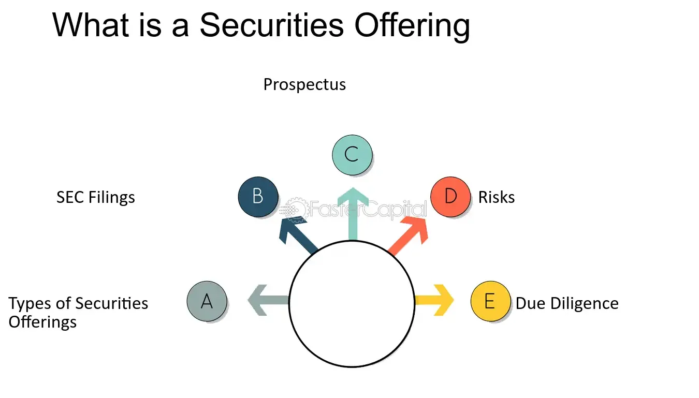

## Table of Contents

## What is a securities offering?

A securities offering is when a company sells stocks, bonds, or other types of securities to raise money. It's like asking people to invest in the company by buying a piece of it. This can happen in different ways, like an initial public offering (IPO) when a company first sells its stock to the public, or through private placements where the securities are sold to a select group of investors.

Companies do securities offerings to get money for things like expanding their business, paying off debts, or funding new projects. It's important for them to follow rules set by government agencies, like the Securities and Exchange Commission (SEC) in the United States, to make sure everything is done fairly and openly. When done right, a securities offering can help a company grow and attract more investors.

## What are the primary purposes of issuing securities?

When a company issues securities, the main purpose is to raise money. This money can be used for many things, like growing the business, starting new projects, or paying off debts. Imagine a company wants to build a new factory. Instead of borrowing money from a bank, it can sell stocks or bonds to people who want to invest in the company. This way, the company gets the money it needs, and the investors get a chance to own a part of the company or earn interest on their investment.

Another important reason for issuing securities is to spread out the ownership of the company. When a company goes public through an initial public offering (IPO), it sells its stock to the public for the first time. This not only raises money but also lets more people become part-owners of the company. It can make the company more well-known and attract more investors in the future. Plus, having shares traded on a stock market can make it easier for the company to raise more money later if it needs to.

## What are the different types of securities offerings?

There are different ways a company can issue securities to raise money. One common type is an initial public offering (IPO), which is when a company sells its stock to the public for the first time. This lets the company raise a lot of money and also lets regular people buy shares and become part-owners. Another type is a secondary offering, where a company that's already public sells more shares to the public. This can happen if the company needs more money for growth or other projects.

Another way to issue securities is through a private placement, where the company sells securities to a select group of investors instead of the general public. This can be faster and less costly than a public offering because it doesn't need to follow all the same rules. Companies might choose this if they want to raise money quickly or from specific investors. Lastly, there are rights offerings, where existing shareholders get the chance to buy more shares before they're offered to the public. This helps keep the ownership of the company more balanced among current investors.

Each type of securities offering has its own rules and benefits. Companies choose the type that best fits their needs, whether it's raising a lot of money from the public, getting funds quickly from private investors, or keeping things fair among current shareholders. Understanding these different types can help investors know what to expect when a company decides to issue securities.

## How does a public offering differ from a private offering?

A public offering is when a company sells its stocks or bonds to the general public. This is usually done through an initial public offering (IPO) when a company first goes public, or through a secondary offering if the company is already public. Public offerings have to follow strict rules set by government agencies like the Securities and Exchange Commission (SEC) in the United States. These rules are there to make sure the company shares all the important information with the public so people can make good choices about whether to invest. Because of these rules, public offerings can take longer and cost more money, but they let the company raise a lot of money from many different investors.

A private offering, on the other hand, is when a company sells its securities to a select group of investors instead of the general public. This is often called a private placement. Private offerings don't have to follow all the same strict rules as public offerings, which means they can be faster and less expensive for the company. Companies might choose a private offering if they want to raise money quickly or from specific investors they know well. While private offerings might not raise as much money as public ones, they give the company more control over who gets to invest and can be a good choice for certain situations.

## What is an initial public offering (IPO) and why is it significant?

An initial public offering (IPO) is when a company sells its stock to the public for the first time. Before an IPO, a company might be owned by just a few people or other companies. When it goes public, it lets regular people buy shares and become part-owners. This process is managed by investment banks that help set the price of the shares and make sure everything goes smoothly. The company has to share a lot of information about its business and finances so people can decide if they want to invest.

An IPO is significant for a few reasons. First, it's a big way for a company to raise a lot of money. This money can be used to grow the business, start new projects, or pay off debts. Second, going public can make a company more well-known and respected. It can attract more customers and investors in the future. Finally, an IPO can make it easier for the company to raise more money later if it needs to, because its shares are now traded on a stock market. So, an IPO is a big step that can help a company reach new heights.

## What are secondary offerings and how do they work?

A secondary offering is when a company that's already public sells more of its shares to the public. This happens after the company has done its first big sale of stock, called an initial public offering (IPO). The company might want to do a secondary offering if it needs more money for things like growing the business or starting new projects. When a company does a secondary offering, it works with investment banks to figure out how many shares to sell and what price to set for them. The company has to tell everyone about the offering and follow rules set by government agencies to make sure everything is fair and open.

Secondary offerings can be important for both the company and its investors. For the company, it's a way to get more money without taking on debt. This can help the company keep growing and stay strong. For investors, a secondary offering can be a chance to buy more shares in a company they like. But it can also affect the price of the stock. Sometimes, when a company sells more shares, it can make the stock price go down because there are more shares available. So, investors need to think carefully about whether to buy more shares during a secondary offering.

## What are the regulatory requirements for conducting a securities offering?

When a company wants to do a securities offering, it has to follow a bunch of rules set by government agencies. In the United States, the main agency is the Securities and Exchange Commission (SEC). The SEC makes sure companies share all the important information with people who might want to invest. This means the company has to write a detailed document called a prospectus, which explains things like what the company does, how it makes money, and any risks involved in investing. The company also has to file lots of forms with the SEC and wait for them to say it's okay to go ahead with the offering. All these rules help make sure the offering is fair and that people can make good choices about whether to invest.

For public offerings, the rules are even stricter. The company has to make sure everyone who might want to buy the securities can see the prospectus and learn about the offering. This is called "full and fair disclosure." The company also has to work with investment banks to help manage the offering and make sure everything goes smoothly. If the company doesn't follow these rules, it could get in big trouble with the SEC. For private offerings, the rules are a bit easier. The company can sell securities to a smaller group of investors without having to share as much information with the public. But they still have to follow some rules to make sure everything is done the right way.

## How do rights offerings function and who are they typically aimed at?

A rights offering is when a company gives its current shareholders the chance to buy more shares before they're offered to the public. This helps keep the ownership of the company more balanced among the people who already own shares. The company sends out something called a "rights certificate" to its shareholders. This certificate gives them the right to buy new shares at a special price, usually lower than what the shares are worth on the stock market. Shareholders have to decide if they want to use their rights to buy more shares or if they want to sell their rights to someone else.

Rights offerings are usually aimed at existing shareholders. The main reason is to give them a fair chance to keep their ownership percentage in the company the same, even when new shares are being sold. This can be important for shareholders who want to keep their say in how the company is run. Sometimes, rights offerings are also used to raise money quickly without going through a big public offering. By offering shares to current shareholders first, the company can get the money it needs while keeping things fair among its investors.

## What is a shelf offering and what are its advantages?

A shelf offering is when a company gets ready to sell its stocks or bonds but doesn't do it all at once. Instead, it registers the securities with the government and then can sell them little by little over time, whenever it needs to. This is like having a shelf full of goods that you can take off and sell whenever you want. In the United States, companies do this by filing a special form called an S-3 with the Securities and Exchange Commission (SEC). Once the SEC says it's okay, the company can start selling the securities whenever it's a good time.

The main advantage of a shelf offering is that it gives the company a lot of flexibility. Instead of having to do a big sale all at once, the company can sell securities slowly over time. This can help the company raise money when it needs it, without having to go through a long and expensive process each time. Another advantage is that it can help the company take advantage of good market conditions. If the stock market is doing well, the company can sell more shares at a higher price. This way, the company can get the best deal possible and keep its investors happy.

## How do convertible securities offerings work and what are their benefits?

Convertible securities offerings are when a company sells special types of securities that can be turned into regular stocks later on. These securities could be things like convertible bonds or convertible preferred stocks. When someone buys a convertible bond, they're lending money to the company and getting paid interest, just like with a regular bond. But they also have the option to turn that bond into shares of the company's stock if they want to. This can be a good deal for investors because they get the safety of a bond plus the chance to own stock if the company does well.

The benefits of convertible securities are pretty clear for both the company and the investors. For the company, it's a way to raise money without having to pay as much interest as they would with regular bonds. This can help the company save money and use it for other things like growing the business. For investors, convertible securities offer a mix of safety and potential for big gains. If the company's stock price goes up a lot, they can turn their securities into stock and make more money. But if the stock price doesn't go up, they still get their interest payments and can keep the bond. So, convertible securities can be a smart choice for people who want to play it safe but still have a chance to win big.

## What are the risks associated with participating in securities offerings?

When you decide to buy securities in an offering, there are some risks you should know about. One big risk is that the value of the securities can go down. If you buy stocks, the price might drop after the offering, and you could lose money. If you buy bonds, the company might not be able to pay you back, especially if it's having money problems. Another risk is that the company might not tell you everything you need to know. Even though there are rules to make sure companies share important information, sometimes they might leave out details that could affect your decision to invest.

Another thing to think about is how the market might react to the offering. Sometimes, when a company sells more shares, it can make the stock price go down because there are more shares available. This can happen with both public and private offerings. Also, if you're buying securities in a private offering, you might not be able to sell them easily later on. These securities are often less liquid, meaning you can't just sell them whenever you want. So, it's important to think carefully about these risks before you decide to participate in a securities offering.

## How do international securities offerings differ from domestic ones?

International securities offerings are when a company sells its stocks or bonds to people in different countries, not just in its home country. This can be more complicated than doing a domestic offering because the company has to follow the rules of each country where it's selling the securities. Different countries have different laws about what companies need to do to sell securities. For example, a company from the United States might need to follow rules set by the Securities and Exchange Commission (SEC) at home, but it also has to follow rules from other countries' financial regulators if it wants to sell securities there. This can make the process take longer and cost more money.

Another big difference is that international offerings can help a company reach more investors and raise more money. When a company sells securities in different countries, it can attract people from all over the world who want to invest. This can be good for the company because it might get a better price for its securities and raise more money than it could by just selling at home. But it also means the company has to think about things like different languages, cultures, and economic conditions in each country. So, while international offerings can open up new opportunities, they also come with extra challenges and risks that the company needs to manage carefully.

## References & Further Reading

[1]: Bergstra, J., Bardenet, R., Bengio, Y., & Kégl, B. (2011). ["Algorithms for Hyper-Parameter Optimization."](https://dl.acm.org/doi/10.5555/2986459.2986743) Advances in Neural Information Processing Systems 24.

[2]: ["Advances in Financial Machine Learning"](https://www.amazon.com/Advances-Financial-Machine-Learning-Marcos/dp/1119482089) by Marcos Lopez de Prado

[3]: ["Evidence-Based Technical Analysis: Applying the Scientific Method and Statistical Inference to Trading Signals"](https://www.amazon.com/Evidence-Based-Technical-Analysis-Scientific-Statistical/dp/0470008741) by David Aronson

[4]: ["Machine Learning for Algorithmic Trading"](https://github.com/stefan-jansen/machine-learning-for-trading) by Stefan Jansen

[5]: ["Quantitative Trading: How to Build Your Own Algorithmic Trading Business"](https://www.amazon.com/Quantitative-Trading-Build-Algorithmic-Business/dp/1119800064) by Ernest P. Chan