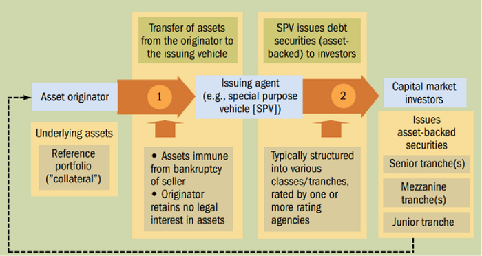

In today's financial landscape, liquidity, securitization, and algorithmic trading (algo trading) stand as pivotal components shaping market dynamics. Liquidity refers to the ease with which assets can be bought or sold in the market without causing significant price changes. High liquidity is crucial for the smooth operation of financial markets, as it ensures quick and efficient execution of trades, providing stability and confidence among market participants.

Securitization plays a key role by transforming illiquid assets into liquid, marketable securities. This process increases the efficiency and attractiveness of financial products, allowing a wider range of investors to participate. By converting loans and other non-liquid assets into securities, financial institutions can enhance liquidity, distribute risk, and free up capital for other investments.



Algorithmic trading, on the other hand, leverages complex algorithms to execute trades at high speeds, optimizing trade decisions based on real-time data. This technological advancement reduces transaction costs and improves accuracy by exploiting market inefficiencies. As a result, algo trading contributes significantly to market efficiency, often through high-frequency trading (HFT) strategies.

This article explores the interplay between these financial concepts, which are essential for modern market processes. Understanding and integrating liquidity, securitization, and algorithmic trading is crucial for navigating the complexities of today's financial markets and harnessing the opportunities they present.

## Table of Contents

## Understanding Liquidity in Financial Markets

Liquidity is a fundamental aspect of financial markets, facilitating the seamless execution of transactions by ensuring that assets can be bought or sold quickly without significantly impacting their prices. High liquidity is characterized by a market with numerous buy and sell orders at varying price levels, which tends to stabilize price fluctuations and provide a cushion against market volatility.

Several factors contribute to the liquidity levels within financial markets:

1. **Market Structure**: The organization and rules governing a market can greatly affect its liquidity. For instance, stock exchanges with electronic trading platforms that allow for continuous, automated transactions typically exhibit higher liquidity compared to less structured markets. The presence of various market participants including market makers, who provide buy and sell quotes, also contributes to liquidity by ensuring that there is always a counterparty for a trade.

2. **Participation Rates**: The number of active participants in a market influences liquidity. Markets with a large number of institutional and retail investors generally have higher liquidity due to a greater volume of trades. High participation rates ensure that there is a steady flow of orders, enhancing the ability to execute large trades without affecting the asset's price significantly.

3. **External Economic Conditions**: Economic factors such as interest rates, economic growth, and geopolitical events can influence market liquidity. For example, during periods of economic uncertainty, liquidity can dry up as investors might hold off on trading due to perceived risks. Conversely, stable economic conditions often boost investor confidence, thus enhancing liquidity. 

Overall, maintaining high [liquidity](/wiki/liquidity-risk-premium) is essential for the proper functioning of financial markets. It allows for efficient price discovery, reduces transaction costs, and ensures that markets remain attractive to investors. This is particularly important in enhancing the stability and resilience of financial systems, allowing them to withstand shocks and adjust to new economic realities efficiently. Markets with high liquidity are often more robust, adapting swiftly to changes while offering investment opportunities that are both reliable and predictable.

## The Process and Significance of Securitization

Securitization plays a vital role in modern finance by transforming non-liquid assets into marketable securities, thereby enhancing liquidity. At its core, the process of securitization involves aggregating various illiquid assets, such as mortgages, car loans, or credit card receivables, into a consolidated pool. Once pooled, these assets are utilized to issue new securities, typically known as asset-backed securities (ABS), which are then sold to investors. 

This transformation process primarily improves liquidity by converting assets that are traditionally challenging to buy and sell into securities that can be readily traded in financial markets. By creating a structured product that offers tradable interest to investors, securitization allows financial institutions to elevate the liquidity of their asset holdings significantly. This newfound liquidity provides these institutions the ability to reallocate or free up their capital more efficiently, thus potentially lowering the cost of resources and expanding their lending capabilities.

One of the key benefits of securitization is risk distribution. By pooling diverse assets, the risks associated with any single asset are diluted across the entire pool. This diversification reduces the impact of potential defaults on any specific loan or asset, thereby offering a more stable investment option. Additionally, securitization facilitates risk transfer from originators to investors who are more willing or better equipped to manage such risks. 

Furthermore, securitization can potentially lead to the development of customized investment opportunities that cater to a wide array of risk and return preferences among investors. By slicing the pooled assets into tranches of varying levels of risk, tranches can be tailored to fit different investment strategies.

In summary, securitization serves as a bridge converting traditionally stagnant resources into a component of a fluid, interconnected financial system by improving liquidity, distributing risk, and liberating capital. These advantages are pivotal in propelling economic activity and financial innovation, reinforcing the significance of securitization in contemporary financial markets.

## The Role of Asset-Backed Securities (ABS)

Asset-backed securities (ABS) are a sophisticated class of financial instruments derived from a process that involves pooling specific asset types such as auto loans, credit card receivables, and mortgages. These assets are often illiquid themselves, but through securitization, they are transformed into liquid, tradable securities. This transformation is significant because it provides enhanced liquidity, diversifies risk, and caters to a wide array of investment strategies.

ABS offers higher returns and better risk diversification compared to traditional bonds. This advantage stems from the structured finance nature of ABS, where a set of financial assets is converted into one or more tranches. These tranches are characterized by differing risk levels, repayment schedules, and interest rates. The tranching mechanism allows investors to make decisions based on their risk tolerance and return expectations.

For example, senior tranches, typically rated high due to their claim on cash flows being prioritized, offer lower returns but with reduced risk. Conversely, junior or mezzanine tranches offer higher returns but come with increased risk, as they absorb losses first in the event of asset defaults.

The utility of ABS is further compounded by their capacity to tap into specific asset pools. For instance, asset-backed securities created from consumer debt like auto loans generally exhibit different risk and return profiles than those backed by commercial loans. This allows investors to tailor their portfolios to exploit market niches and diversify their investment horizons beyond traditional government or corporate bonds.

In recent developments, technology has enhanced the structuring and analysis of ABS, allowing for more sophisticated modeling and prediction of cash flows. Machine learning models, for instance, can use historical data to forecast the performance of underlying assets, thus refining risk assessments and pricing strategies. These advancements not only improve transparency but also bolster the investor's ability to make informed decisions based on empirical data.

In summary, asset-backed securities play a critical role in modern financial markets by converting illiquid assets into valuable investment products. Their structured nature, combined with technological advancements in analytics, offers investors a range of opportunities to diversify their portfolios while managing risk and return preferences effectively.

## Algorithmic Trading: Driving Market Efficiency

Algorithmic trading employs sophisticated algorithms and computer programs to automate the process of trading securities. These algorithms make decisions on trade execution based on pre-defined criteria and market data, operating at speeds and efficiencies impossible for human traders to achieve. The primary objective of [algorithmic trading](/wiki/algorithmic-trading) is to optimize trade execution by minimizing transaction costs, improving accuracy, and capitalizing on fleeting market inefficiencies.

One of the cornerstone techniques in algorithmic trading is High-Frequency Trading ([HFT](/wiki/high-frequency-trading-strategies)), which involves executing a large number of orders within extremely short time frames, often measured in milliseconds. This strategy exploits minute price discrepancies that exist in markets temporarily, enabling traders to profit from these tiny price movements. By integrating algorithmic strategies, trading firms can achieve substantial profitability while maintaining a competitive advantage.

Algorithmic trading also benefits significantly from advancements in Artificial Intelligence (AI) and Machine Learning (ML). These technologies enable algorithms to adapt in real-time to ever-changing market conditions, enhancing decision-making processes. For instance, [machine learning](/wiki/machine-learning) algorithms can analyze large volumes of historical and real-time data to identify patterns that may predict future price movements. By continuously learning from new data, AI-driven algorithms refine their strategies, leading to more accurate predictions and effective trade executions.

Python, a prevalent programming language in the financial industry, provides robust libraries like pandas for data manipulation, NumPy for numerical operations, and scikit-learn for machine learning. These tools aid in developing and testing algorithmic trading strategies. Here's a simple Python snippet demonstrating a basic moving average crossover strategy, a common algorithmic trading technique:

```python
import pandas as pd

# Load historical market data
data = pd.read_csv('market_data.csv')

# Calculate moving averages
data['SMA_50'] = data['Close'].rolling(window=50).mean()
data['SMA_200'] = data['Close'].rolling(window=200).mean()

# Generate trading signals
data['Signal'] = 0
data['Signal'][50:] = np.where(data['SMA_50'][50:] > data['SMA_200'][50:], 1, 0)

# Calculate daily returns and strategy performance
data['Market_Returns'] = data['Close'].pct_change()
data['Strategy_Returns'] = data['Signal'].shift(1) * data['Market_Returns']

# Plotting signals and comparing returns
import matplotlib.pyplot as plt

plt.figure(figsize=(14, 7))
plt.plot(data['Close'], label='Close Price')
plt.plot(data['SMA_50'], label='50-Day SMA', alpha=0.7)
plt.plot(data['SMA_200'], label='200-Day SMA', alpha=0.7)
plt.plot(data[data['Signal'] == 1].index, data['SMA_50'][data['Signal'] == 1], '^', label='Buy Signal', color='g')
plt.plot(data[data['Signal'] == 0].index, data['SMA_200'][data['Signal'] == 0], 'v', label='Sell Signal', color='r')
plt.title('Moving Average Crossover Strategy')
plt.legend()
plt.show()
```

This script exemplifies a strategy where trading signals are generated based on the crossover of two simple moving averages (SMA). When the short-term average crosses above the long-term average, a buy signal is issued; conversely, when it crosses below, a sell signal is produced.

By adopting algorithmic trading strategies, market participants can significantly enhance market efficiency. The ability to quickly process vast amounts of data and execute trades with precision ensures more stable prices and liquidity in the market. However, market participants must also be mindful of the associated risks, such as increased [volatility](/wiki/volatility-trading-strategies) and potential for market disruptions.

## Synergies Between Securitization, ABS, and Algo Trading

The integration of algorithmic trading within Asset-Backed Securities (ABS) markets represents a significant advancement in improving both pricing and trading efficiency. Algorithmic trading leverages computer algorithms to automate trading processes, allowing for the rapid execution of trades based on predefined criteria. This capability is particularly beneficial in ABS markets, where the complexity and diversity of asset pools necessitate precise and efficient trading strategies.

Firstly, algorithmic trading enhances market liquidity by ensuring continuous buying and selling. By executing trades with precision and speed, algorithms maintain the flow of market activity, helping to stabilize prices even amidst fluctuations. This constant trading activity allows market participants to enter and [exit](/wiki/exit-strategy) positions more easily, contributing to an overall increase in market liquidity.

Moreover, the deployment of advanced algorithmic models within these markets provides crucial insights that surpass traditional human analysis. By analyzing vast datasets, these models can identify subtle patterns and correlations within ABS markets, facilitating more accurate pricing. For instance, machine learning algorithms can be trained to predict price movements based on historical data patterns, thereby optimizing pricing strategies.

Incorporating algorithmic trading in ABS also allows for the utilization of high-frequency trading (HFT) techniques. HFT strategies, empowered by powerful computational capabilities, can capitalize on fractional price changes by swiftly executing multiple trades in a short time frame. This high-speed trading technique can also exploit temporary market inefficiencies to generate profits, benefiting both traders and the overall market by aligning asset prices more closely with their intrinsic values.

Given the increased complexity and [volume](/wiki/volume-trading-strategy) of information in ABS markets, the role of data analytics has become indispensable. Algorithms that apply machine learning models can detect anomalies and trends faster than human traders, mitigating risks associated with mispricing or other inefficiencies. These insights enable traders to adjust their strategies dynamically, ensuring that pricing is reflective of real-time market conditions.

To demonstrate the implementation of algorithmic trading within ABS, consider the following simple Python example utilizing machine learning for predictive analytics:

```python
import pandas as pd
from sklearn.model_selection import train_test_split
from sklearn.ensemble import RandomForestRegressor

# Load historical ABS pricing data
data = pd.read_csv('abs_data.csv')

# Define features and target variable
features = data.drop('Price', axis=1)
target = data['Price']

# Split data into training and test sets
X_train, X_test, y_train, y_test = train_test_split(features, target, test_size=0.2, random_state=42)

# Train a Random Forest model
model = RandomForestRegressor(n_estimators=100, random_state=42)
model.fit(X_train, y_train)

# Predict prices on the test set
predictions = model.predict(X_test)

# Output predictions
print("Predicted prices:", predictions)
```

In this example, a Random Forest Regressor model is trained to predict ABS prices using historical data. Integrating such machine learning techniques within algorithmic trading can significantly enhance the accuracy and efficiency of pricing strategies in ABS markets. By doing so, it reinforces the crucial role of algorithmic advancements in transforming modern financial markets, particularly in complex securities trading like ABS.

## Challenges and Risks

Complexity and lack of transparency are inherent challenges in the asset-backed securities (ABS) market, often leading to issues like mispricing and illiquidity, particularly during periods of market stress. ABS products are structured in a way that can obscure their underlying risks, making them difficult to value accurately. This complexity is partly due to the tranching process, where different risk levels are created within the same ABS issue, allowing investors to choose securities based on their risk preferences. However, this can lead to difficulties in pricing each tranche accurately, particularly when market conditions change rapidly. During financial crises, the intrinsic lack of transparency can exacerbate liquidity issues as the market participants become uncertain about the true value of these securities, leading to wider bid-ask spreads and reduced trading volumes.

Algorithmic trading, while offering significant benefits such as improved market efficiency and reduced transaction costs, also presents its own set of challenges. One of the primary risks associated with algorithmic trading is its potential to exacerbate market volatility. Algorithms operating at [high frequency](/wiki/high-frequency-trading) can lead to situations where trades occur at a pace too rapid for human intervention, potentially triggering cascade effects in volatile market conditions. Flash crashes, where market indices drop significantly within minutes before recovering, are often cited examples of how algorithmic trading can contribute to extreme deviations in market prices.

To effectively mitigate these risks, robust risk management strategies and comprehensive regulatory oversight are essential. Financial institutions employing algorithms for trading must implement stringent monitoring systems to ensure the algorithms operate within predefined risk parameters. These systems can include circuit breakers or trading halts that activate when unusual trading patterns occur, thereby preventing the algorithms from operating unchecked during volatile periods. Regulatory bodies also play a crucial role by setting and enforcing guidelines that ensure transparency and fairness in trading operations. For instance, requiring detailed reporting of algorithmic trading activities and maintaining audit trails can help regulators understand and curtail potential market manipulation or undue risk-taking behaviors.

In conclusion, while the complexity of ABS and the speed of algorithmic trading offer lucrative opportunities and efficiencies, they must be balanced with appropriate mechanisms to handle the risks associated with them, ensuring stability and transparency within financial markets.

## Conclusion

Liquidity, securitization, and algorithmic trading, when combined, significantly alter the dynamics of financial markets by introducing innovative investment strategies. These elements not only foster an environment of increased market efficiency but also enable investors to manage risk more effectively and optimize returns. Liquidity ensures that assets can be traded swiftly with minimal impact on prices, enhancing the stability and transparency of market operations. Securitization transforms non-liquid assets into marketable securities, thereby freeing up capital and distributing risk across a broader spectrum of investors. Algorithmic trading, on the other hand, increases the speed and precision of trade execution, capitalizing on market movements and reducing transaction costs.

Despite these advantages, the confluence of these financial processes is not without its challenges. The complexity inherent in securitized products, such as asset-backed securities, can lead to issues of transparency and potential mispricing, particularly in times of market stress. Similarly, while algorithmic trading contributes to market fluidity, it also holds the risk of amplifying market volatility and triggering events like flash crashes if not properly managed. Therefore, it is crucial for market participants and regulators to adopt robust risk management practices and employ stringent oversight to mitigate these risks.

As financial markets continue to evolve, it is expected that these components will play an even more critical role. The ongoing development and integration of technologies, such as [artificial intelligence](/wiki/ai-artificial-intelligence) and machine learning, into these areas promise to offer deeper insights and more sophisticated tools for investors. These advancements underline the importance of continuous innovation, while also highlighting the need for adaptive regulatory frameworks to ensure the stability and integrity of financial systems.

## References & Further Reading

[1]: Bergstra, J., Bardenet, R., Bengio, Y., & Kégl, B. (2011). ["Algorithms for Hyper-Parameter Optimization."](https://dl.acm.org/doi/10.5555/2986459.2986743) Advances in Neural Information Processing Systems 24.

[2]: ["Advances in Financial Machine Learning"](https://www.amazon.com/Advances-Financial-Machine-Learning-Marcos/dp/1119482089) by Marcos Lopez de Prado

[3]: ["Evidence-Based Technical Analysis: Applying the Scientific Method and Statistical Inference to Trading Signals"](https://www.amazon.com/Evidence-Based-Technical-Analysis-Scientific-Statistical/dp/0470008741) by David Aronson

[4]: ["Machine Learning for Algorithmic Trading"](https://github.com/stefan-jansen/machine-learning-for-trading) by Stefan Jansen

[5]: ["Quantitative Trading: How to Build Your Own Algorithmic Trading Business"](https://www.amazon.com/Quantitative-Trading-Build-Algorithmic-Business/dp/1119800064) by Ernest P. Chan