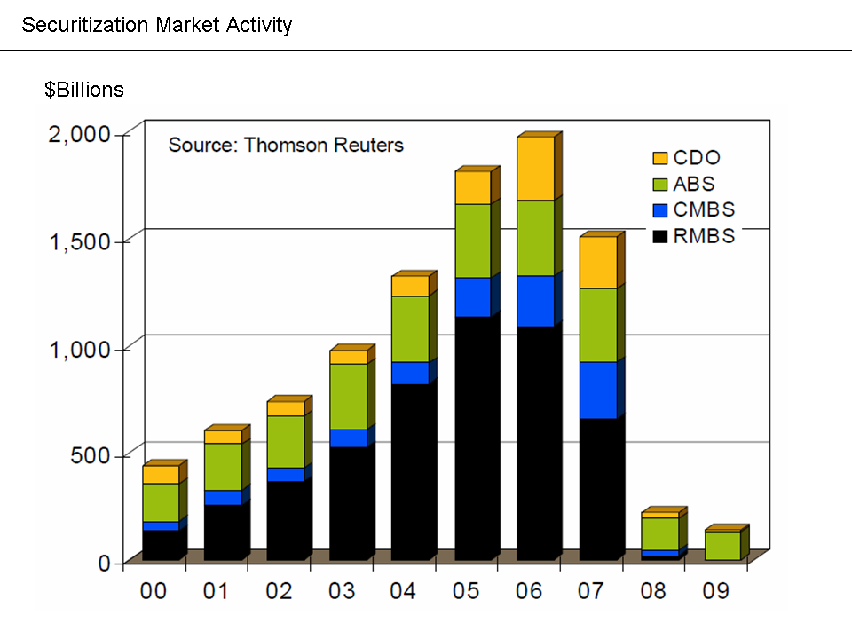

In the ever-evolving financial landscape, two significant trends have emerged: securitization and algorithmic trading. Securitization involves the process of converting illiquid assets, such as mortgages or loans, into tradable securities. This practice facilitates liquidity in financial markets, thereby enabling the redistribution of risk across different market participants. However, securitization is not without its financial drawbacks. It can obscure risk assessment for investors due to a lack of transparency concerning underlying assets. There is also the risk of default on the securitized loans, which could lead to substantial losses. Early loan prepayments can further complicate expected returns, highlighting potential financial instabilities inherent in such structured financial products.

Conversely, algorithmic trading, which uses complex algorithms and sophisticated computer systems to automate trading, has seen growing popularity. Known for its potential financial advantages, it provides increased trading speed and reduces the likelihood of human error. By executing trades based on predefined criteria such as timing, price, and volume, algorithmic trading enhances efficiency and accuracy in market operations. This article will explore these contrasting financial practices—detailing the disadvantages of securitization and the advantages of algorithmic trading. A comprehensive understanding of these concepts is invaluable for investors seeking to navigate today's complex financial markets effectively.

## Table of Contents

## Financial Disadvantages of Securitization

Securitization, a financial practice that involves pooling various types of financial assets and converting them into securities for sale to investors, possesses distinct financial disadvantages alongside its benefits. At its core, securitization's primary drawback is the lack of transparency regarding the underlying assets. This opacity can obscure the true risk profile and quality of the pooled assets, complicating risk assessment for investors and potentially leading to misinformed investment decisions.

A significant risk associated with securitization is the potential default on the underlying loans. When borrowers default on these loans, the cash flow to investors can be disrupted, resulting in substantial financial losses. This risk is further exacerbated by the complex and layered structure of securitized products, which can obfuscate the visibility of individual asset performance and related risks.

Moreover, the issue of early prepayments on loans poses a financial challenge. When borrowers repay their loans ahead of schedule, the expected yield on these securities can decrease, impacting investors' returns. This phenomenon, known as prepayment risk, can lead to unexpected cash flow variations and affect the securities' overall financial stability.

Securitization also involves intricate financial engineering, with products constructed in a manner that may misalign incentives among various stakeholders. For instance, originators of loans might not necessarily bear the consequences of loan defaults if these loans are quickly securitized and sold to investors. Such misalignments were notably highlighted during the global financial crisis of 2007-2008, where excessive risk-taking and inadequate assessment of asset quality led to systemic financial instability.

In conclusion, while securitization enhances market [liquidity](/wiki/liquidity-risk-premium) and facilitates credit risk transfer, it carries inherent financial drawbacks. These include transparency issues, default and prepayment risks, and misaligned incentives, which can collectively contribute to systemic financial risks. Understanding these disadvantages is critical for investors and regulators seeking to mitigate potential adverse impacts in the financial markets.

## Understanding Algorithmic Trading

Algorithmic trading utilizes complex algorithms to automate trading processes, achieving greater efficiency and execution speed. This approach leverages advanced computer systems to execute trades based on predefined criteria such as timing, price, and [volume](/wiki/volume-trading-strategy). By automating these tasks, [algorithmic trading](/wiki/algorithmic-trading) minimizes human intervention and reduces latency in trade execution.

The automation of trading strategies involves several types of algorithms, each devised to capitalize on different market opportunities. Market-making algorithms, for instance, continuously provide buy and sell quotes to profit from the spread, thereby enhancing liquidity. Arbitrage strategies exploit price discrepancies across different markets or financial instruments, executing trades almost instantaneously to capture risk-free profits. Trend-following algorithms, on the other hand, analyze market trends and act to buy or sell based on the upward or downward [momentum](/wiki/momentum) of asset prices.

Algorithmic trading first gained significant attention in the financial markets in the 1980s, thanks to advancements in computing power and data processing capabilities. This evolution was marked by its potential to handle vast amounts of data in real-time, providing traders with the capability to analyze market conditions continuously and execute strategies with precision. The ability to process data at high speeds and make rapid decisions is a cornerstone of the effectiveness of algorithmic trading.

Despite its complexity, algorithmic trading has become indispensable for institutional investors and large trading firms, which benefit from executing trades at optimal prices and managing portfolios more effectively. The scalability of algorithmic systems allows for handling increasing volumes and complexities of trades efficiently, maintaining competitive advantages in the high-frequency trading arena.

In conclusion, algorithmic trading stands at the forefront of modern financial markets, offering a transformative tool for trading efficiently. By employing algorithmic systems, traders can achieve higher speeds of execution, enhanced market penetration, and strategic precision, reinforcing their critical role in today's fast-paced trading environment.

## Financial Advantages of Algorithmic Trading

Algorithmic trading offers several financial advantages, with the most prominent being enhanced trading speed and accuracy. This methodology harnesses the power of advanced algorithms to facilitate trades at speeds and frequencies unattainable through manual trading. The use of algorithmic systems reduces the likelihood of human error, helping traders execute orders based on precise calculations while minimizing decision-making biases.

One significant benefit of algorithmic trading is its ability to perform trades continuously without fatigue. Unlike human traders, these systems can operate 24/7, allowing for perpetual market participation and enabling traders to capitalize on opportunities as they arise across global markets, irrespective of time differences.

Algorithmic trading systems also offer the capability for [backtesting](/wiki/backtesting), where traders can test their strategies using historical data before applying them in live environments. This process allows for the evaluation of strategy performance over past market conditions, facilitating the refinement of trading algorithms to improve outcomes.

Furthermore, algorithmic trading excels in swiftly managing large datasets, allowing for rapid adaptation to ever-changing market conditions. The ability to analyze complex data streams in real-time empowers traders to make informed decisions and adjust strategies promptly based on evolving market trends.

These advantages collectively contribute to increased market efficiency and improved execution quality, making algorithmic trading an essential tool for institutional investors and large trading firms managing substantial portfolios.

## Conclusion

Securitization and algorithmic trading represent two significant financial mechanisms, each with distinct impacts on the financial markets. Securitization, despite its challenges, such as transparency issues and potential for financial instability, plays an essential role in enhancing liquidity. By transforming illiquid assets into tradable securities, it provides a framework that facilitates market fluidity and capital access, albeit with a risk of default and complex structure that can obscure underlying asset profiles.

Conversely, algorithmic trading leverages technological advancements to improve market efficiency and trading accuracy. It reduces human error, enables fast transaction speeds, and provides continuous market participation. This approach, while beneficial, is not without risks, as it can lead to increased market [volatility](/wiki/volatility-trading-strategies) and requires robust systems to manage these rapid-fire trades effectively.

For investors, understanding these mechanisms' advantages and disadvantages is critical to successfully navigating the financial markets. Recognizing the liquidity benefits of securitization and the operational efficiencies of algorithmic trading allows for strategic investment decisions. As financial technologies continue to evolve, staying informed about these advancements is crucial. Such awareness ensures that investors can leverage these tools effectively, adapting to market changes and optimizing their investment outcomes.

## References & Further Reading

[1]: ["Securitization and the Global Economy: History and Prospects"](https://link.springer.com/book/10.1057/978-1-137-34287-4) by Kenneth A. Reinert

[2]: Gorton, G. B., & Metrick, A. (2012). ["Securitization"](https://www.nber.org/papers/w18611). Annual Review of Financial Economics, 4(1), 33-50.

[3]: ["Handbook of Financial Risk Management: Implementing Practical Approaches"](https://www.taylorfrancis.com/books/mono/10.1201/9781315144597/handbook-financial-risk-management-thierry-roncalli) by Thierry Roncalli

[4]: Aldridge, I., & Krawciw, S. (2017). ["Real-time risk: What investors should know about fin-tech, high frequency trading, and flash crashes"](https://en.wikipedia.org/wiki/Big_data) in Journal of Portfolio Management.

[5]: ["Algorithmic Trading: Winning Strategies and Their Rationale"](https://www.wiley.com/en-us/Algorithmic+Trading%3A+Winning+Strategies+and+Their+Rationale-p-9781118460146) by Ernie Chan