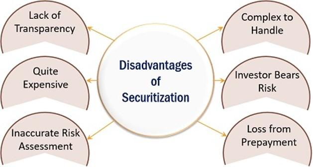

In the rapidly evolving world of finance, securitization, investment risks, financial processes, and algorithmic trading are interrelated concepts that significantly impact market dynamics. Securitization involves the pooling of various financial assets to create securities that are then sold to investors, fundamentally altering how liquidity is managed within the banking sector. On the other hand, investment risks are inherent in these financial products, often complicating the investors' ability to accurately assess the value and future performance of their investments, particularly with complex instruments like mortgage-backed securities (MBS) and collateralized debt obligations (CDOs).

Financial processes underpin the mechanics of securitization and investment. These processes involve a variety of participants including originators, special purpose vehicles (SPVs), and investors, each contributing to the structuring and management of securitized products. The precise orchestration of these processes is vital to ensuring that the securitization markets function efficiently and that associated risks are appropriately managed.



Algorithmic trading plays a pivotal role by leveraging sophisticated algorithms to execute trades based on predefined criteria. This technological advancement enhances decision-making speed and accuracy, thereby reducing transaction costs and minimizing human error. The integration of machine learning within these algorithms allows for real-time adaptation to market changes, enhancing performance and providing traders with a competitive advantage.

Understanding these elements is crucial for investors and financial professionals seeking to navigate and capitalize on the complexities of today's financial markets. Both securitization and algorithmic trading provide opportunities for diversification and efficiency but require careful consideration of the associated risks. As these components continue to evolve within the financial landscape, they offer a fascinating interplay of innovation, risk management, and potential returns, highlighting the need for continuous education and adaptation.

## Table of Contents

## Understanding Securitization

Securitization is a financial process that transforms a pool of illiquid assets into liquid securities, which can then be marketed and sold to investors. This process begins with the bundling of various financial assets, such as loans, credit card debts, or other receivables, into a consolidated entity. The primary objective is to enhance liquidity for financial institutions by converting these assets, which are traditionally challenging to trade, into securities that can be easily exchanged in financial markets.

The crux of securitization lies in its ability to offer more efficient management of a financial institution's balance sheet. By transforming assets into marketable securities, banks and similar entities can free up capital, which can be deployed for additional lending and other financial activities. This conversion process typically involves creating a Special Purpose Vehicle (SPV), a legally separated entity tasked with holding the asset pool and issuing securities to investors. The SPV structure helps isolate financial risks, offering an additional security layer for both the issuing institution and the investors.

However, securitization does not come without its set of challenges and risks. One significant concern is the potential misalignment of incentives among different parties involved. For instance, originators may not have an adequate stake in the performance of the securitized assets post-transfer, leading to a moral hazard. Additionally, investors may face difficulties in fully assessing the quality and risk profile of the underlying asset pool due to a lack of transparency. This lack of visibility can obscure the true risk characteristics, contributing to potential mispricing of the securities.

To mitigate these risks, securitization processes often require robust regulatory frameworks and diligent credit evaluations to ensure that the underlying asset pools are accurately represented and assessed. Understanding these dynamics is crucial for investors looking to engage with or analyze securitized products, particularly given the complex structure these financial instruments can exhibit.

## Types of Securitized Assets

Securitized assets represent a cornerstone of modern financial markets, allowing for the redistribution of risk and the provision of [liquidity](/wiki/liquidity-risk-premium). Three principal types stand out: mortgage-backed securities (MBS), asset-backed securities (ABS), and collateralized debt obligations (CDOs). Each of these securities offers distinct characteristics and diversification benefits, yet their complex structures necessitate thorough risk assessment.

Mortgage-backed securities (MBS) are created from pools of residential or commercial mortgages. Investors in MBS receive periodic payments derived from the mortgage payments of the underlying borrowers. The allure of MBS lies in their ability to diversify risk across numerous loans, reducing exposure to individual borrower defaults. However, the complexity of these securities requires a comprehensive understanding of prepayment risk, [interest rate](/wiki/interest-rate-trading-strategies) fluctuations, and the underlying credit quality of the borrowers.

Asset-backed securities (ABS) encompass a broader category of securitized products backed by various types of financial assets, such as credit card receivables, auto loans, and student loans. Unlike MBS, which are backed solely by mortgage loans, ABS can be formed from a diverse array of asset classes. This diversification offers investors an opportunity to gain exposure to different economic sectors and lending activities, but it also demands rigorous analysis of the creditworthiness and delinquency patterns associated with each asset type.

Collateralized debt obligations (CDOs) are highly structured products that pool together various credit instruments, including those mentioned above. CDOs are divided into different tranches, each carrying a distinct risk profile and return potential. Senior tranches are prioritized for payment and typically considered lower risk, whereas junior tranches bear higher risk but offer greater returns. The complexity of CDOs contributes to the challenge of accurately assessing the underlying risks, particularly evident during the 2007-2008 financial crisis when the mispricing of CDOs played a significant role in market destabilization.

In conclusion, while securitized assets such as MBS, ABS, and CDOs offer significant diversification and potential returns, they require a sophisticated understanding of their intrinsic complexities and risks. Investors must be vigilant in their risk assessment processes to mitigate potential adverse outcomes associated with these financial instruments.

## Investment Risks in Securitization

Securitization is a transformative tool in modern finance, offering advantages like liquidity and risk management. However, it also presents substantial investment risks. One of the primary concerns in securitization is the potential for obscuring the true risk profile of the underlying assets. This can occur when the financial instruments created are so complex that investors cannot accurately assess their risk, leading to potential mispricing and, consequently, significant investment losses.

### Risk Categories

Investment in securitized products involves several layers of risk:

1. **Credit Risk**: Credit risk is the potential for loss due to a borrower's failure to make payments as promised. In securitized products, this risk primarily stems from the underlying assets. For instance, if the pool consists of subprime mortgages, the likelihood of default is higher, increasing the credit risk for investors.

2. **Market Risk**: Market risk refers to the potential for an investor to experience losses due to fluctuations in market prices. Changes in interest rates, for instance, can significantly affect the value of mortgage-backed securities (MBS). A rise in interest rates usually leads to a decline in the value of existing MBS, exposing investors to market risk.

3. **Liquidity Risk**: Liquidity risk is the risk of not being able to sell an asset quickly enough to prevent a loss. Securitized products can be complex and less transparent, making them more challenging to trade in secondary markets compared to traditional securities. This complexity can result in lower demand and thus higher liquidity risk.

### Historical Context

The 2007-2008 financial crisis serves as a crucial lesson in the risks associated with securitization. The crisis highlighted how the opaqueness and complexity of securitized products, like collateralized debt obligations (CDOs) and MBS, could contribute to systemic financial instability. These products were often backed by high-risk mortgages, and when the housing market collapsed, the true extent of the embedded risks became apparent, leading to massive defaults and losses.

The use of these complex financial instruments without sufficient understanding or oversight allowed risk to accumulate within the financial system. As defaults rose, liquidity in these markets dried up, enhancing liquidity risk and exposing the fragility within the financial structures underpinning these securitized assets.

In conclusion, while securitization can provide significant financial benefits, it requires robust risk assessment and management. Investors must be keenly aware of credit, market, and liquidity risks when engaging with these products. Understanding the lessons from past financial disruptions can aid in better navigation and mitigation of potential pitfalls associated with securitization.

## Financial Processes and Securitization

Securitization is a financial process that involves the transformation of illiquid assets into marketable securities. This process plays a pivotal role in modern finance by providing liquidity and aiding in effective risk management. The process of securitization encompasses several key participants: originators, special purpose vehicles (SPVs), and investors. Each of these entities has a distinct function within the securitization framework, ensuring that the entire process operates smoothly and efficiently.

The originator is typically a financial institution, such as a bank or mortgage lender, that owns the original assets. These assets can range from mortgages and loans to receivables. The primary role of the originator is to identify and pool these financial assets, effectively creating a pool that serves as the basis for the securitized product. By transferring these assets to a special purpose vehicle, the originator can remove them from its balance sheet, thus improving liquidity and capital management.

SPVs are crucial in the securitization process as they are established solely to facilitate the issuance of asset-backed securities. Once the originator transfers the asset pool to the SPV, the SPV isolates the assets from the originator's bankruptcy risks. The SPV then structures these assets into tranches of securities, which are subsequently sold to investors. This structure provides a layer of protection to investors, ensuring that the performance of the securitized assets remains unaffected by the originator's potential financial distress.

Investors, the final participants in this process, purchase the securities issued by the SPV. These securities are often divided into different tranches, each carrying varying levels of risk and return profiles. Investors who choose lower-risk tranches receive securities with a higher credit rating but lower potential returns, while those opting for higher-risk tranches can potentially earn greater returns in exchange for taking on more risk. The availability of different tranches aligns the securitization product with the risk appetites of a wide array of investors.

The efficient functioning of securitization hinges on a deep understanding of each participant's role and the inherent risks. By understanding the interaction between originators, SPVs, and investors, stakeholders can better navigate the complexities of securitization. This comprehension is further enhanced by regulatory frameworks and credit rating agencies, which ensure transparency and risk mitigation in the securitization markets. Effective management of these processes not only optimizes operational performance but also unlocks potential investment opportunities within the financial sector.

## The Role of Algorithmic Trading

Algorithmic trading leverages sophisticated algorithms to execute large volumes of trades at speeds and frequencies that are unattainable for a human trader. These algorithms are designed to follow a set of predefined criteria, which could range from simple to highly complex strategies involving various market signals and historical data. A key advantage of [algorithmic trading](/wiki/algorithmic-trading) is its ability to operate with enhanced speed and accuracy, thereby reducing transaction costs and minimizing human error.

Historically, financial markets depended on human judgment and manual trade execution, which could be slow and often impacted by emotional biases. The introduction of algorithmic trading systems has revolutionized this process by enabling trades based on real-time data analysis and execution, offering a significant competitive advantage in increasingly fast-paced market environments.

Algorithmic trading systems often incorporate elements of [machine learning](/wiki/machine-learning) to further enhance their performance. Machine learning allows these algorithms to adapt dynamically to new data, identifying patterns and trends that may not be immediately apparent to human analysts. This adaptability also enables the refinement of trading strategies, potentially leading to improved outcomes over time. For example, in a machine learning framework, a trading algorithm might use supervised learning techniques to predict future stock prices based on historical data. This could be implemented using Python's `sklearn` library:

```python
from sklearn.model_selection import train_test_split
from sklearn.linear_model import LinearRegression
import numpy as np

# Example historical data
X = np.array([[1], [2], [3], [4], [5]])  # Time or index
y = np.array([100, 102, 104, 106, 108])  # Stock prices

# Splitting the dataset into training and testing sets
X_train, X_test, y_train, y_test = train_test_split(X, y, test_size=0.2, random_state=42)

# Creating and training the model
model = LinearRegression()
model.fit(X_train, y_train)

# Making predictions
predicted_prices = model.predict(X_test)
print(predicted_prices)
```

In this example, a linear regression model is trained on historical stock price data to predict future prices. Although simplistic, this illustrates the basic concept of how machine learning can be integrated into algorithmic trading systems.

Despite its benefits, algorithmic trading also poses certain risks, such as market manipulation and the amplification of systemic risks due to technology failures. Therefore, robust risk management and regulatory frameworks are crucial to safeguard the integrity and stability of financial markets as they continue to evolve with technological advancements in trading strategies.

## Synergies and Challenges

The combination of securitization and algorithmic trading represents a major advancement in financial market operations, leading to increased efficiency and precision. Securitization allows for the transformation of illiquid assets into tradable securities, thus enhancing liquidity and enabling more dynamic balance sheet management for financial institutions. Meanwhile, algorithmic trading employs advanced computational algorithms to execute trades at high speed and accuracy, mitigating human errors and reducing transaction costs. When combined, these two processes can significantly enhance the efficiency of capital markets by speeding up transactions and optimizing the capital allocation process.

Despite these benefits, the confluence of securitization and algorithmic trading also presents notable challenges. One of the primary concerns is the risk of market manipulation. The complexity and opacity of securitized products can sometimes obscure the true nature of the underlying assets, making it easier for malicious actors to exploit these products for manipulative activities. Similarly, algorithmic trading, particularly through high-frequency trading strategies, might influence price discovery mechanisms, causing short-term price distortions which can be detrimental to the overall market stability.

Additionally, the intricate nature of financial products originated through securitization necessitates comprehensive risk assessment methodologies. The diverse risk profiles inherent in these products, such as credit and liquidity risks, require sophisticated risk management techniques. Concurrently, the algorithmic models used in trading need constant monitoring and updating to prevent failures that could lead to substantial financial losses.

Addressing these challenges requires robust risk management and regulatory frameworks. Regulatory bodies must enforce transparency and accountability standards within securitization to ensure that investors have clear insights into the underlying assets. Similarly, oversight in algorithmic trading is critical to detect potential market abuses and ensure fair trading practices. This can include implementing circuit breakers to halt trading in times of extreme [volatility](/wiki/volatility-trading-strategies) or anomalies and setting strict compliance requirements for trading algorithms to prevent unfair market manipulation.

Incorporating robust machine learning models can further enhance the risk management capabilities, allowing algorithms to better predict and mitigate potential risks associated with both securitization and trading activities. Furthermore, developing ethical and responsive regulatory measures will help balance innovation with protection, thereby maximizing the benefits while minimizing the potential vulnerabilities inherent in the synergistic use of securitization and algorithmic trading.

## Conclusion

Securitization and algorithmic trading are integral components of the current financial landscape, providing both distinct advantages and complex challenges. Their influence can be observed across various aspects of finance, from increasing liquidity and diversification via securitization to optimizing trade execution and reducing costs through algorithmic trading. However, their complexities necessitate a comprehensive understanding by investors and financial professionals to effectively manage associated risks and maximize potential opportunities. 

Securitization enables the conversion of illiquid assets into tradable securities, thereby enhancing liquidity and market efficiency. Nevertheless, it requires vigilant risk management due to the inherent risks of credit mispricing and structural opacity that can lead to significant financial instability, as evidenced during the 2007-2008 financial crisis. On the other hand, algorithmic trading introduces heightened speed and precision in trade execution. While it minimizes human error and transaction costs, its susceptibility to issues such as market manipulation and the need for sophisticated regulatory oversight cannot be overstated.

For investors and professionals striving to capitalize on these financial innovations, continuous education and skill development are imperative. The volatile and ever-evolving nature of financial markets demands that industry participants keep pace with technological advancements and evolving financial instruments. By staying informed and adaptable, stakeholders can more effectively navigate the complexities of securitization and algorithmic trading, leveraging these tools to maintain a competitive advantage in the dynamic market environment.

## References & Further Reading

[1]: Gorton, G. B., & Metrick, A. (2012). ["Getting Up to Speed on the Financial Crisis: A One-Weekend-Reader's Guide."](https://www.nber.org/system/files/working_papers/w17778/w17778.pdf) Journal of Economic Literature, 50(1), 128-150.

[2]: Fabozzi, F. J., & Kothari, V. (2007). ["Securitization: The Tool of Financial Transformation."](http://depot.som.yale.edu/icf/papers/fileuploads/2495/original/07-07.pdf) CFA Institute Conference Proceedings Quarterly, 24(2), 24-38.

[3]: McDonald, L. G., & Robinson, P. (2009). ["A Colossal Failure of Common Sense: The Inside Story of the Collapse of Lehman Brothers."](https://en.wikipedia.org/wiki/A_Colossal_Failure_of_Common_Sense) Crown Business.

[4]: Hendershott, T., Jones, C. M., & Menkveld, A. J. (2011). ["Does Algorithmic Trading Improve Liquidity?"](https://onlinelibrary.wiley.com/doi/full/10.1111/j.1540-6261.2010.01624.x) The Review of Financial Studies, 24(4), 1411-1457.

[5]: ["Handbook of Mortgage-Backed Securities"](https://www.amazon.com/Handbook-Mortgage-Backed-Securities-7th/dp/0198785771) by Frank J. Fabozzi

[6]: ["High-Frequency Trading: A Practical Guide to Algorithmic Strategies and Trading Systems"](https://www.amazon.com/High-Frequency-Trading-Practical-Algorithmic-Strategies/dp/0470563761) by Irene Aldridge

[7]: Hull, J. (2018). ["Options, Futures, and Other Derivatives."](https://books.google.com/books/about/Options_Futures_and_Other_Derivatives.html?id=vpIYvgAACAAJ) Pearson Education.