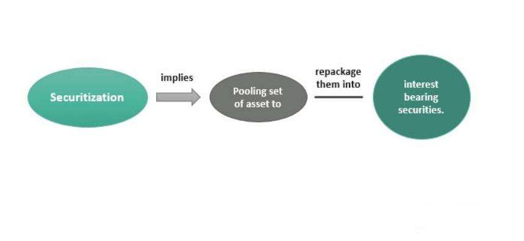

In today's rapidly evolving financial landscape, investors and financial professionals are continuously on the lookout for innovative strategies to optimize returns and effectively manage risk. Among these strategies, securitization and asset-backed securities (ABS) have become integral tools. Securitization allows for the transformation of illiquid assets into liquid securities, thus increasing liquidity in financial markets. ABS, backed by a pool of loans and receivables, offer investors higher yields and diversification opportunities compared to traditional fixed-income securities. Concurrently, algorithmic trading is fundamentally altering the way transactions are executed, leveraging sophisticated algorithms to automate and enhance trading strategies. By utilizing mathematical models and statistical analyses, algorithmic trading facilitates transactions with remarkable speed and accuracy, capturing even the smallest market inefficiencies.

This article aims to explore the synergies between these critical financial components: securitization, ABS, and algorithmic trading, and how they collectively influence the future of finance. Understanding these interconnected concepts is essential for professionals navigating the complexities of modern finance, providing them with a competitive edge in a rapidly changing environment. The convergence of these financial elements is not just transforming transactional methodologies but is also redefining risk management and investment opportunities. As the financial landscape continues to advance, staying informed about these trends will be paramount for seizing new financial opportunities and mastering the dynamic nature of today's markets.

## Table of Contents

## Understanding Financial Instruments and Securitization

Financial instruments are essential components of the financial system, functioning as contracts that establish a financial asset for one party and a corresponding financial liability for another. These instruments are diverse, encompassing equities, bonds, derivatives, and hybrid instruments, each serving specific purposes within the marketplace.

Securitization plays a crucial role in enhancing the liquidity of typically illiquid assets. The process involves pooling various forms of contractual debt—such as residential and commercial mortgages, automobile loans, and credit card receivables—and transforming them into marketable securities. This transformation is achieved by assembling these pooled assets into a security format that is then sold to investors, who receive payments derived from the cash flows of the underlying assets.

The securitization process involves several key steps. Initially, a sponsoring entity, typically a financial institution, identifies a pool of assets suitable for securitization. These assets are then transferred to a special-purpose vehicle (SPV), an entity created specifically to isolate financial risk from the sponsor's balance sheet. The SPV issues asset-backed securities (ABS) that are sold in the market, with the proceeds typically going to the sponsor.

One of the significant advantages of securitization is the facilitation of improved liquidity in financial markets. By converting non-liquid assets into liquid ones, institutions can free up capital, enhance liquidity ratios, and improve balance sheet management. This practice enables financial institutions to offer more loans and credit facilities, contributing to economic growth.

Furthermore, securitization allows for risk distribution among a wider range of investors. By purchasing asset-backed securities, investors take on the credit risk associated with the underlying assets, potentially leading to more diversified investment portfolios. However, the inherent complexity and structuring of these securities necessitate thorough understanding and analysis to accurately assess the associated risks and returns.

In conclusion, the process of securitization is central to modern finance, not only by augmenting [liquidity](/wiki/liquidity-risk-premium) and distributing risk but also by improving financial institutions' balance sheets. Understanding this process is vital for financial professionals engaged in asset management, risk assessment, and investment strategy.

## The Role of Asset-Backed Securities (ABS)

Asset-backed securities (ABS) represent an important segment of the securitized financial products market, designed to enhance liquidity and diversify risk for both issuers and investors. These instruments are constructed from a pool of underlying financial assets, typically comprising loans and receivables such as auto loans, credit card debt, and student loans. The process involves aggregating these cash-flow-generating assets into a single portfolio, which is then used to back the issuance of securities sold to investors. 

The primary appeal of ABS lies in their potential for higher returns compared to traditional fixed-income securities such as government or corporate bonds. This is largely because the yield on ABS is often augmented by the interest and principal payments derived from the underlying asset pool. The structure of ABS usually involves tranching, where the pool of assets is divided into different classes or "tranches" with varying levels of risk and return. This offers flexibility, enabling investors to choose tranches that align with their risk tolerance and investment goals.

One of the key benefits of ABS is the opportunity they present for portfolio diversification. Unlike traditional bonds, which are subject to [interest rate](/wiki/interest-rate-trading-strategies) risk and issuer credit risk, ABS offer exposure to a wide array of consumer-based debt instruments. This diversification helps investors spread risk across different types of assets. Furthermore, the higher yield potential of ABS can contribute to enhanced income generation within an investment portfolio, an attractive feature for investors seeking to optimize returns in low-interest rate environments.

Additionally, ABS are structured to provide a stable cash flow to investors, given that the underlying assets—loans and receivables—typically follow a predictable repayment schedule. However, it is crucial to note that the performance of ABS can be affected by the credit performance of the underlying assets and economic conditions that impact borrowers' ability to make repayments.

In summary, asset-backed securities offer a compelling investment option by combining higher yield potential with diversified risk exposure. Their unique structure allows for a tailored approach to investing in debt instruments across various consumer credit sectors.

 to Algorithmic Trading

Algorithmic trading, commonly known as algo trading, utilizes sophisticated algorithms to automate the process of executing trading strategies in financial markets. These algorithms are typically grounded in advanced mathematical models and rigorous statistical analyses. The primary objective is to perform trades at moments that maximize potential profitability, thereby optimizing trade outcomes. For instance, a basic algorithm might leverage moving averages to determine when to execute buy or sell orders.

The appeal of algo trading lies in its remarkable speed and precision, attributes that are vital in capitalizing on fleeting price disparities within the market. By minimizing reaction times, algorithms can exploit even the smallest differences in price across various exchanges or trading platforms, a practice known as [arbitrage](/wiki/arbitrage). This capability is crucial in high-frequency trading ([HFT](/wiki/high-frequency-trading-strategies)), where trading occurs at exceptionally high speeds, often in fractions of a second.

Moreover, [algorithmic trading](/wiki/algorithmic-trading) significantly diminishes transaction costs. By automating trade execution, it reduces the need for manual intervention and thus the associated labor costs. Additionally, the automation process helps in minimizing human errors, which are often costly in the fast-paced trading environment. For example, an algorithm will consistently execute trades based on predefined rules without succumbing to emotional biases that can affect human traders, such as fear or greed.

The prevalence of algorithmic trading is expanding rapidly, primarily propelled by advancements in technology and data science. Modern trading algorithms utilize large datasets to back-test strategies and refine them iteratively for better performance. Machine learning, a branch of [artificial intelligence](/wiki/ai-artificial-intelligence), is increasingly being integrated into these algorithms, allowing them to learn and adapt over time based on historical data. With the increasing availability of real-time data and more affordable computational power, the scope and complexity of algorithmic trading strategies continue to grow.

As technology continues to evolve, so does the landscape of algorithmic trading, with quant traders incessantly developing and enhancing algorithms to maintain a competitive edge in financial markets.

## Synergies Between Securitization, ABS, and Algo Trading

Securitization and Asset-Backed Securities (ABS) markets achieve heightened efficiency and agility with the integration of algorithmic trading techniques. These digital strategies enable precise pricing and trading of ABS by reducing latency through the use of advanced algorithms. Fast execution of trades is crucial in markets characterized by rapid fluctuations, and algorithmic trading provides the necessary speed and accuracy.

The employment of computer-driven models facilitates the analysis of large datasets, which is essential for structuring and valuing these securities. By employing advanced statistical and [machine learning](/wiki/machine-learning) techniques, these models can deliver insights that human analysts might overlook, ensuring fair and competitive pricing of ABS products. An example of such a model is a machine learning-based predictive algorithm that uses historical pricing data and macroeconomic indicators to forecast ABS performance.

Algorithmic trading significantly enhances liquidity within the ABS market by enabling continuous buying and selling activities. Liquidity, an important [factor](/wiki/factor-investing) for market participants, minimizes trading friction and supports better price discovery. Algo trading strategies, such as market-making algorithms, often function to narrow bid-ask spreads, facilitating more efficient transactions.

The advanced computational techniques in algorithmic trading are also instrumental in monitoring and managing risks associated with these complex financial instruments. For instance, modern risk management systems utilize real-time data analytics to monitor market conditions and automatically adjust trading strategies to mitigate risk exposures, such as those arising from interest rate changes or economic downturns.

In essence, the confluence of securitization, ABS, and algorithmic trading creates a robust framework for financial innovation, characterized by efficiency, enhanced liquidity, and dynamic risk management. This synergy is instrumental for investors and financial institutions aiming for competitive advantage in rapidly evolving markets.

## Challenges and Risks

Despite offering numerous benefits, securitization, asset-backed securities (ABS), and algorithmic trading present distinct challenges and risks that require careful consideration.

Complexity and lack of transparency in ABS can result in significant mispricing and illiquidity, especially during periods of financial stress. ABS often consist of underlying assets with varying degrees of risk and repayment structures. The complexity of these structures can obscure true risk profiles, leading investors to misjudge the value and risk involved. For example, if prevailing market conditions change abruptly, assets perceived as liquid may become difficult to trade, increasing the potential for sharp price corrections.

Algorithmic trading, while known for its speed and precision, poses risks such as market manipulation and flash crashes. Algorithms, capable of executing trades within milliseconds, can exacerbate market [volatility](/wiki/volatility-trading-strategies). Instances like the 2010 "Flash Crash" highlight how errant algorithms can lead to significant market disruptions, causing stock prices to plunge temporarily. Moreover, the opacity of algorithmic strategies complicates monitoring efforts, raising concerns about systemic risks if not adequately managed.

Addressing these risks necessitates the implementation of robust risk management frameworks. These frameworks should encompass detailed stress testing, valuation assessments, and liquidity management practices. Financial institutions must prioritize transparency and risk assessments to mitigate potential adverse outcomes.

Regulatory oversight plays a crucial role in balancing innovation and risk mitigation. Policymakers and regulators must ensure that regulations keep pace with technological advancements in finance without stifling innovation. For instance, algorithms could be subjected to pre-deployment testing to ensure they adhere to market standards and avoid predatory practices.

Additionally, technological advancements such as machine learning and artificial intelligence can enhance risk management capabilities. By leveraging data analytics, financial professionals can gain deeper insights into market behaviour, allowing for more precise predictions and better risk mitigation strategies.

In conclusion, while securitization, ABS, and algorithmic trading offer attractive opportunities, understanding and navigating the associated risks are imperative. Through a combination of comprehensive regulatory oversight and advanced technological tools, these risks can be managed without impeding the growth and evolution of modern financial markets.

## Conclusion

The interplay between financial instruments, securitization, asset-backed securities (ABS), and algorithmic trading (algo trading) represents a transformative shift in modern finance. Each of these elements brings unique benefits and opportunities for growth and efficiency. Financial instruments, through their various forms, facilitate the transfer of capital, enable risk management, and provide returns for investors. Securitization, by converting illiquid assets into securities, enhances market liquidity and offers companies a means to strengthen their balance sheets. ABS diversify investment portfolios and potentially yield higher returns, making them attractive to investors.

Algo trading enhances the execution of trades through speed and precision, capitalizing on fleeting market opportunities and reducing transactional costs. This technological advancement has been made possible due to innovations in data science and machine learning. Python, for instance, has become a favored programming language in algo trading due to its capabilities in data processing and application of statistical models.

The convergence of these financial innovations results in even greater potential. Professionals and investors who understand and leverage the interplay between these elements can gain a competitive advantage. The synergistic effects of integrating securitization, ABS, and algo trading not only improve market efficiency but also enable more sophisticated strategies for managing risk and optimizing returns.

As the financial landscape continues to evolve, staying informed about these trends remains crucial. Embracing rapid changes through ongoing education and adaptability is essential for thriving in this dynamic environment. Those who invest time in understanding these complexities will be better positioned to capitalize on future developments and innovations in finance.

## References & Further Reading

[1]: Fabozzi, F. J., & Kothari, V. (2007). ["Securitization: The Tool of Financial Transformation."](https://papers.ssrn.com/sol3/papers.cfm?abstract_id=997079) Yale ICF Working Paper No. 07-07.

[2]: ["Asset-Backed Securities: The Publishing Perspective"](https://www.guggenheiminvestments.com/perspectives/portfolio-strategy/asset-backed-securities-abs) by Michael S. Sivy, Financial Analysts Journal, Vol. 49, No. 1.

[3]: Gomber, P., Arndt, B., Lutat, M., & Uhle, T. (2011). ["High-Frequency Trading."](https://www.semanticscholar.org/paper/High-Frequency-Trading-Gomber-Arndt/3d0ba8179934e0a45e85a184d1ec526616e2e213) Business & Information Systems Engineering, 3(2), 63-69.

[4]: ["Risk Management and Securitization"](https://www.investopedia.com/terms/s/securitization.asp) by CFA Institute Research Foundation

[5]: Hasbrouck, J., & Saar, G. (2013). ["Low-Latency Trading."](https://www.sciencedirect.com/science/article/abs/pii/S1386418113000165) The Review of Financial Studies, 26(9), 2869-2894.

[6]: ["The Handbook of Fixed Income Securities"](https://www.amazon.com/Handbook-Fixed-Income-Securities-Ninth/dp/1260473899) by Frank J. Fabozzi

[7]: Aldridge, I., & Avellaneda, M. (2010). ["High-Frequency Trading: A Practical Guide to Algorithmic Strategies and Trading Systems."](https://books.google.com/books/about/High_Frequency_Trading.html?id=6l0DDQAAQBAJ)