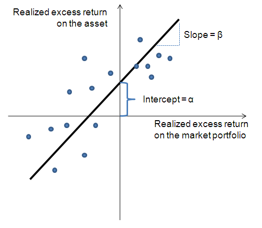

## Table of Contents

## What is a Security Characteristic Line (SCL)?

A Security Characteristic Line (SCL) is a tool used in finance to show how a specific investment, like a stock, moves compared to the overall market. It helps investors understand if their investment is doing better or worse than the market as a whole. The SCL is created by plotting the returns of the investment against the returns of the market, usually represented by a broad market index like the S&P 500. The line that best fits these points is the SCL.

The slope of the SCL is important because it tells us how sensitive the investment is to market movements. A steeper slope means the investment moves a lot when the market moves, while a flatter slope means it doesn't move as much. The point where the SCL touches the y-axis, called the intercept, shows the investment's performance when the market return is zero. This can help investors see if their investment has a tendency to outperform or underperform the market on average.

## How is the Security Characteristic Line calculated?

To calculate the Security Characteristic Line (SCL), you need data on the returns of the investment and the returns of the market over the same time periods. You start by plotting these returns on a graph, where the market returns go on the x-axis and the investment returns go on the y-axis. Each point on the graph represents a pair of returns from a specific time period. After plotting all the points, you draw a line that best fits these points. This line is the SCL.

The line is calculated using a method called linear regression. Linear regression finds the best straight line that minimizes the distance between itself and all the points on the graph. The slope of this line shows how much the investment's return changes for every one percent change in the market's return. The intercept, or where the line touches the y-axis, shows what the investment's return would be if the market return was zero. These two pieces of information help investors understand how their investment behaves compared to the market.

## What is the significance of the slope in the Security Characteristic Line?

The slope of the Security Characteristic Line (SCL) tells you how much the return of your investment changes when the market's return changes. Imagine the market goes up by 1%. If the slope of your investment's SCL is 1.5, that means your investment's return will go up by 1.5% on average. A bigger slope means your investment moves a lot with the market, which can be good if the market is doing well, but risky if the market goes down.

The slope also helps you see how sensitive your investment is to the market. If the slope is very steep, your investment is very sensitive and can be more volatile. If the slope is flat, your investment doesn't move much even when the market moves a lot. This can be safer but might mean you miss out on big gains when the market does well. Understanding the slope helps you pick investments that fit your comfort with risk and your investment goals.

## Can you explain the relationship between the Security Characteristic Line and the Capital Asset Pricing Model (CAPM)?

The Security Characteristic Line (SCL) and the Capital Asset Pricing Model (CAPM) are closely related because they both help us understand how investments move with the market. The SCL is a line you draw on a graph that shows how the returns of a specific investment, like a stock, go up and down compared to the market's returns. It's like a picture that shows you how much your investment moves when the market moves. The CAPM, on the other hand, is a formula that tells you what return you should expect from an investment based on how risky it is compared to the market. It uses something called beta, which is a number that shows how much an investment moves with the market.

The connection between SCL and CAPM is that the slope of the SCL is the same as the beta in the CAPM. If you draw the SCL and look at how steep it is, that steepness is the beta. So, the SCL gives you a visual way to see the beta of your investment. In the CAPM formula, this beta helps you figure out the expected return of your investment. By understanding the SCL, you can see how your investment's returns compare to the market and use that information in the CAPM to decide if the investment is worth it based on the risk and the expected return.

## How does the Security Characteristic Line help in assessing investment risk?

The Security Characteristic Line (SCL) helps you understand how much your investment moves when the market moves. By looking at the SCL, you can see if your investment is very sensitive to the market, which means it might go up a lot when the market goes up, but it could also go down a lot if the market goes down. This sensitivity is shown by the slope of the SCL. If the slope is steep, your investment moves a lot with the market, which can be riskier. If the slope is flat, your investment doesn't move much even when the market moves, which might be safer but could mean you miss out on big gains.

The SCL also shows you how your investment does compared to the market on average. The point where the SCL touches the y-axis, called the intercept, tells you what your investment's return would be if the market return was zero. If this point is high, your investment might do well even when the market isn't moving much. If it's low, your investment might struggle. By looking at both the slope and the intercept, you can get a good idea of how risky your investment is and decide if it fits with how much risk you're willing to take.

## What does it mean if a security plots above or below the Security Characteristic Line?

If a security plots above the Security Characteristic Line, it means that the security is doing better than you would expect based on how the market is doing. Imagine the market goes up by 1%, and your investment goes up by more than what the line predicts. This could mean your investment is outperforming the market, which is good news. It might be because the company is doing well or because it's less affected by what's happening in the market.

On the other hand, if a security plots below the Security Characteristic Line, it's not doing as well as expected. If the market goes up by 1%, and your investment goes up by less than what the line predicts, or even goes down, that's a sign that your investment is underperforming. This could happen if the company is facing challenges or if it's more sensitive to negative market movements. By looking at where your investment plots compared to the line, you can get a sense of how it's performing relative to the market.

## How can the Security Characteristic Line be used to evaluate portfolio performance?

The Security Characteristic Line (SCL) helps you see how your whole portfolio is doing compared to the market. You can plot the returns of your portfolio against the market's returns, just like you do for a single investment. By looking at the SCL of your portfolio, you can see if it's doing better or worse than the market. If your portfolio's returns plot above the line, it means your investments are doing better than expected based on the market's performance. If they plot below the line, your portfolio isn't doing as well as the market.

The slope of the SCL also tells you how much your portfolio moves with the market. A steeper slope means your portfolio is very sensitive to market changes, which can be risky but also rewarding if the market goes up. A flatter slope means your portfolio doesn't move much even when the market moves, which might be safer but could mean you miss out on big gains. By understanding both the position of your portfolio's returns on the SCL and the slope of the line, you can make better decisions about how to adjust your investments to meet your goals and manage your risk.

## What are the limitations of using the Security Characteristic Line for security analysis?

The Security Characteristic Line (SCL) can be a useful tool, but it has some limitations. One big limitation is that it's based on past data. Just because an investment did well in the past compared to the market doesn't mean it will keep doing well in the future. The market and the economy can change a lot, and what worked before might not work again. So, if you only look at the SCL, you might miss out on important changes that could affect your investment.

Another limitation is that the SCL doesn't tell you everything about an investment. It only shows how the investment moves with the market, but there are other things that can affect how well an investment does. For example, the SCL doesn't consider things like the company's management, its financial health, or what's happening in its industry. If you only use the SCL, you might miss these important details that can make a big difference in how your investment performs.

## How does the Security Characteristic Line adjust for different market conditions?

The Security Characteristic Line (SCL) shows how an investment moves with the market, but it doesn't change itself for different market conditions. It's like a picture of how the investment has done in the past compared to the market. If the market goes through different phases, like a boom or a bust, the SCL will still be based on all the past data, not just the current conditions. This means that if you're looking at the SCL during a time when the market is acting differently than usual, you might not get a clear idea of how your investment will do right now.

To adjust for different market conditions, you need to look at the SCL along with other tools and information. For example, you could look at how the SCL changes over different time periods to see if the investment behaves differently during good times versus bad times. You might also want to look at other things like news about the company, how its industry is doing, or what's happening in the economy. By using the SCL together with these other pieces of information, you can get a better sense of how your investment might do in the current market conditions.

## Can the Security Characteristic Line be applied to different asset classes, and if so, how?

Yes, the Security Characteristic Line (SCL) can be used for different types of investments, not just stocks. It can be used for bonds, real estate, commodities, and even mutual funds or exchange-traded funds (ETFs). The idea is the same: you compare how the returns of your investment move with the returns of the market. For example, if you have a bond, you would plot the bond's returns against the returns of a bond market index. This helps you see how sensitive your bond is to changes in the bond market.

Using the SCL for different asset classes can help you understand how each part of your investment portfolio behaves compared to its own market. For instance, if you're looking at real estate, you might compare the returns of your property to a real estate market index. This way, you can see if your property is doing better or worse than the overall real estate market. By applying the SCL to different asset classes, you get a clearer picture of how each investment is performing and how they all work together in your portfolio.

## What advanced statistical techniques can enhance the accuracy of the Security Characteristic Line?

To make the Security Characteristic Line more accurate, you can use a technique called robust regression. Regular regression tries to find the best line to fit your data, but it can be thrown off by unusual data points, called outliers. Robust regression is better at ignoring these outliers, so it gives you a more reliable line. This means your SCL will be more accurate because it won't be affected as much by weird data that doesn't fit the usual pattern.

Another way to improve the SCL is by using time-series analysis. This method looks at how your investment and the market have changed over time, not just at one point. By considering the time aspect, you can see if there are patterns or trends that regular regression might miss. This can help you understand how your investment behaves in different market conditions over time, making your SCL more useful for predicting future performance.

## How do recent developments in financial theory impact the interpretation of the Security Characteristic Line?

Recent developments in financial theory have brought new ways to understand the Security Characteristic Line (SCL). One big change is the focus on behavioral finance, which looks at how people's feelings and choices affect the market. This means that when you look at the SCL, you should think about how people's reactions to news or events might make the line move differently than you expect. For example, if everyone gets excited about a new product from a company, the stock might go up more than the SCL predicts because of this excitement, not just because of how the market is doing.

Another important development is the use of [machine learning](/wiki/machine-learning) and big data in finance. These tools can look at huge amounts of information to find patterns that traditional methods might miss. When you use these new tools with the SCL, you can get a more detailed picture of how your investment might behave. For instance, machine learning can help you see how different factors, like economic reports or social media trends, might affect your investment's returns compared to the market. This can make the SCL a more powerful tool for understanding and predicting how your investments will do in the future.

## What is the Security Characteristic Line and how can it be understood?

The Security Characteristic Line (SCL) is a pivotal concept in finance, representing a regression line that assesses the relationship between a security's excess return and the market's excess return. Mathematically, the SCL is expressed by the equation:

$$
R_i - R_f = \alpha_i + \beta_i (R_m - R_f) + \epsilon_i
$$

where $R_i$ is the return on the security, $R_f$ is the risk-free rate, $\alpha_i$ is the intercept representing the security's abnormal return, $\beta_i$ is the slope coefficient that measures the sensitivity of the security's returns to the market's returns, $R_m$ is the market return, and $\epsilon_i$ is the error term capturing idiosyncratic risk.

The primary function of the SCL is to juxtapose the performance of a specific security against the market portfolio. It provides a straightforward linear framework through which the individual return dynamics of securities can be evaluated relative to market movements. In constructing the SCL graph, the Y-axis denotes the excess return on a security, while the X-axis reflects the market's excess return. This graphical representation aids in visually analyzing how different securities respond to market fluctuations.

Key components of the SCL are integral to financial analysis:

- **Alpha ($\alpha_i$)**: This parameter serves as an indicator of abnormal return, which is the portion of return not explained by the market's performance. A positive alpha suggests that a security is expected to perform better than predicted by its beta coefficient, often interpreted as an indicator of superior management or inherent asset qualities.

- **Beta ($\beta_i$)**: This coefficient signifies the systematic risk or volatility of a security relative to the market. A beta greater than 1 implies that the security is more volatile than the market, whereas a beta less than 1 indicates reduced sensitivity to market movements.

- **Systemic and Idiosyncratic Risks**: Systemic risk derives from broad market factors, affecting all securities to some extent. In contrast, idiosyncratic risk, captured by the error term ($\epsilon_i$), pertains to individual security-specific factors. While systemic risk cannot be eliminated through diversification, idiosyncratic risk can be mitigated by holding a well-diversified portfolio.

In conclusion, the SCL is foundational for understanding the dynamics of asset returns. Its parameters, alpha and beta, provide critical insights into the potential for additional gains and the inherent risk profile of securities, aiding investors in crafting informed strategies.

## What is the role of SCL in financial analysis?

The Security Characteristic Line (SCL) plays a vital role in financial analysis, primarily in evaluating whether securities are appropriately priced relative to their respective levels of risk. By examining the relationship between a security's returns and market returns, investors can gain insights into the expected performance of the security as compared to the market as a whole. This evaluation is crucial for determining if a security is under or overvalued.

Investment analysts leverage the SCL by focusing on two key parameters: beta (β) and alpha (α). The SCL is mathematically expressed as:

$$
R_i - R_f = \alpha_i + \beta_i (R_m - R_f) + \epsilon_i
$$

where $R_i$ is the return on the security, $R_f$ is the risk-free rate, $R_m$ is the return on the market portfolio, and $\epsilon_i$ is the error term. 

Beta ($\beta_i$) measures a security's sensitivity to market movements and acts as an indicator of systemic risk. A beta greater than 1 suggests that the security is more volatile than the market, while a beta less than 1 indicates lower [volatility](/wiki/volatility-trading-strategies). Alpha ($\alpha_i$), on the other hand, indicates the security's ability to generate returns independent of market movements, reflecting the security's potential for excess returns.

Securities are assessed relative to the SCL to determine their pricing status. Securities positioned above the SCL are perceived as undervalued, as they provide higher returns for a given level of market risk. Conversely, securities below the SCL are considered overvalued, offering lower returns for the assumed risk. This evaluation is instrumental for investment analysts seeking to optimize asset pricing.

In portfolio management, the SCL assists investors by offering a framework to balance their risk-return profiles. By analyzing the relation of individual securities to the market via the SCL, portfolio managers can strategically allocate investments to maximize returns while managing risk effectively. This structured approach to security evaluation through the SCL aids in maintaining an investment portfolio that aligns with predefined risk tolerance and return objectives.

## References & Further Reading

### Academic Articles and Books

1. **"Portfolio Theory and Capital Markets" by William F. Sharpe**
   - This book provides foundational insights into portfolio theory and details the development of the Capital Asset Pricing Model (CAPM), which is integral to understanding the Security Characteristic Line (SCL).

2. **"Investments" by Zvi Bodie, Alex Kane, and Alan J. Marcus**
   - A comprehensive text that covers investment principles, including risk analysis and the Security Characteristic Line. It provides a detailed explanation of how SCL is used in evaluating securities.

3. **"Quantitative Equity Portfolio Management" by Ludwig B. Chincarini and Daehwan Kim**
   - This book presents advanced methods in portfolio management and includes sections on regression analyses and the application of SCL in quantitative strategies.

4. **"Algorithmic Trading: Winning Strategies and Their Rationale" by Ernest P. Chan**
   - This book explores trading strategies, including how algorithmic trading integrates models similar to SCL for optimizing risk and return.

5. **"The Econometrics of Financial Markets" by John Y. Campbell, Andrew W. Lo, and A. Craig MacKinlay**
   - This text delves into econometric techniques used in financial market analysis, offering insights into regression models like SCL applied in financial contexts.

### Online Resources

1. **Investopedia: Capital Asset Pricing Model (CAPM)**
   - [Investopedia CAPM Article](https://www.investopedia.com/terms/c/capm.asp)
   - A comprehensive guide to CAPM, including how the Security Characteristic Line fits within this framework.

2. **Financial Times: Lexicon - Security Characteristic Line**
   - [Financial Times SCL Lexicon](https://www.ft.com/lexicon)
   - Provides clear definitions and explanations about the Security Characteristic Line and its applications.

3. **Quantitative Finance Google Group**
   - [Quantitative Finance Group](https://groups.google.com/g/quantitative-finance)
   - An online forum where professionals discuss various aspects of quantitative finance, including SCL and its use in algorithmic trading.

4. **Python Library: statsmodels**
   - Documentation: [Statsmodels Documentation](https://www.statsmodels.org/stable/index.html)
   - A Python library that can be used to perform regression analysis and create SCL models. Here's a code snippet to fit an SCL model using statsmodels:

   ```python
   import statsmodels.api as sm
   import numpy as np

   # Example data
   market_returns = np.random.normal(0.05, 0.1, 100)
   security_returns = market_returns * 1.2 + np.random.normal(0, 0.05, 100)

   # Add a constant to the market returns for the intercept
   X = sm.add_constant(market_returns)
   y = security_returns

   # Fit the model
   model = sm.OLS(y, X).fit()

   # Print the results
   print(model.summary())
   ```

5. **Portfolio Visualizer: Asset Correlations**
   - [Portfolio Visualizer](https://www.portfoliovisualizer.com/)
   - An online tool that allows users to explore asset correlations and analyze portfolio performance, offering insights relevant to understanding SCL.

### Further Reading

- **"Applied Financial Macroeconomics and Investment Strategy" by Robert T. McGee**
  - This book connects macroeconomic factors with investment strategies, providing an expanded context for using SCL in various financial scenarios.

- **"The Risk Premium Factor" by Stephen D. Hassett**
  - Discusses risk premiums in investment and how tools like the SCL contribute to evaluating risk and potential investment returns.

These resources provide an insightful exploration into the concepts surrounding the Security Characteristic Line, capital asset pricing, and [algorithmic trading](/wiki/algorithmic-trading), offering both theoretical foundations and practical applications.

