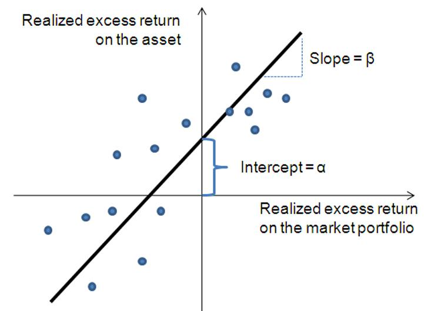

The Security Characteristic Line (SCL) is a fundamental concept in finance that plays a critical role in understanding the relationship between risk and return, particularly in the sphere of algorithmic trading. At its core, the SCL is a graphical representation that depicts how a specific security's returns compare to the market as a whole. By plotting an asset's performance against a benchmark market portfolio, the SCL serves as a key tool in investment analysis and strategizing within algorithmic trading systems.

The importance of the SCL in modern finance cannot be overstated. In an era where optimizing risk and return is paramount, the SCL provides valuable insights into an asset's risk-adjusted performance. It allows traders and investors to quantify and visualize the excess return of a security relative to the market, providing a basis for assessing whether an asset is outperforming or underperforming its expected behavior given the market dynamics. The SCL is instrumental in formulating trading strategies that aim to maximize returns while minimizing risk.



Within this article, readers will gain an understanding of how the SCL functions as a regression line in finance, encapsulating the essence of key parameters such as alpha and beta. Alpha represents the portion of a security’s return that exceeds the market expectation, while beta measures the volatility or systemic risk associated with the security. These concepts are vital for investors and traders when analyzing whether a security is properly priced relative to its inherent risk.

Furthermore, the article will explore the integration of SCL principles within algorithmic trading systems. As financial markets grow increasingly sophisticated, leveraging the insight provided by SCL can significantly enhance algorithmic strategies, allowing for dynamic adjustments in portfolios in response to market changes. This section will set the foundation for understanding how SCL-driven algorithms aid in identifying arbitrage opportunities and making precise investment decisions.

Readers will come away with a comprehensive understanding of the SCL’s application in financial analysis and algorithmic trading, positioning them to better navigate the complexities of modern investing.

## Table of Contents

## Understanding the Security Characteristic Line

The Security Characteristic Line (SCL) is a pivotal concept in finance, representing a regression line that assesses the relationship between a security's excess return and the market's excess return. Mathematically, the SCL is expressed by the equation:

$$
R_i - R_f = \alpha_i + \beta_i (R_m - R_f) + \epsilon_i
$$

where $R_i$ is the return on the security, $R_f$ is the risk-free rate, $\alpha_i$ is the intercept representing the security's abnormal return, $\beta_i$ is the slope coefficient that measures the sensitivity of the security's returns to the market's returns, $R_m$ is the market return, and $\epsilon_i$ is the error term capturing idiosyncratic risk.

The primary function of the SCL is to juxtapose the performance of a specific security against the market portfolio. It provides a straightforward linear framework through which the individual return dynamics of securities can be evaluated relative to market movements. In constructing the SCL graph, the Y-axis denotes the excess return on a security, while the X-axis reflects the market's excess return. This graphical representation aids in visually analyzing how different securities respond to market fluctuations.

Key components of the SCL are integral to financial analysis:

- **Alpha ($\alpha_i$)**: This parameter serves as an indicator of abnormal return, which is the portion of return not explained by the market's performance. A positive alpha suggests that a security is expected to perform better than predicted by its beta coefficient, often interpreted as an indicator of superior management or inherent asset qualities.

- **Beta ($\beta_i$)**: This coefficient signifies the systematic risk or volatility of a security relative to the market. A beta greater than 1 implies that the security is more volatile than the market, whereas a beta less than 1 indicates reduced sensitivity to market movements.

- **Systemic and Idiosyncratic Risks**: Systemic risk derives from broad market factors, affecting all securities to some extent. In contrast, idiosyncratic risk, captured by the error term ($\epsilon_i$), pertains to individual security-specific factors. While systemic risk cannot be eliminated through diversification, idiosyncratic risk can be mitigated by holding a well-diversified portfolio.

In conclusion, the SCL is foundational for understanding the dynamics of asset returns. Its parameters, alpha and beta, provide critical insights into the potential for additional gains and the inherent risk profile of securities, aiding investors in crafting informed strategies.

## SCL in Financial Analysis

The Security Characteristic Line (SCL) plays a vital role in financial analysis, primarily in evaluating whether securities are appropriately priced relative to their respective levels of risk. By examining the relationship between a security's returns and market returns, investors can gain insights into the expected performance of the security as compared to the market as a whole. This evaluation is crucial for determining if a security is under or overvalued.

Investment analysts leverage the SCL by focusing on two key parameters: beta (β) and alpha (α). The SCL is mathematically expressed as:

$$
R_i - R_f = \alpha_i + \beta_i (R_m - R_f) + \epsilon_i
$$

where $R_i$ is the return on the security, $R_f$ is the risk-free rate, $R_m$ is the return on the market portfolio, and $\epsilon_i$ is the error term. 

Beta ($\beta_i$) measures a security's sensitivity to market movements and acts as an indicator of systemic risk. A beta greater than 1 suggests that the security is more volatile than the market, while a beta less than 1 indicates lower [volatility](/wiki/volatility-trading-strategies). Alpha ($\alpha_i$), on the other hand, indicates the security's ability to generate returns independent of market movements, reflecting the security's potential for excess returns.

Securities are assessed relative to the SCL to determine their pricing status. Securities positioned above the SCL are perceived as undervalued, as they provide higher returns for a given level of market risk. Conversely, securities below the SCL are considered overvalued, offering lower returns for the assumed risk. This evaluation is instrumental for investment analysts seeking to optimize asset pricing.

In portfolio management, the SCL assists investors by offering a framework to balance their risk-return profiles. By analyzing the relation of individual securities to the market via the SCL, portfolio managers can strategically allocate investments to maximize returns while managing risk effectively. This structured approach to security evaluation through the SCL aids in maintaining an investment portfolio that aligns with predefined risk tolerance and return objectives.

## Algorithmic Trading and SCL

Incorporating Security Characteristic Line (SCL) principles into [algorithmic trading](/wiki/algorithmic-trading) systems enhances precision in investment decisions. Algorithms utilize SCL to identify [arbitrage](/wiki/arbitrage) opportunities by pinpointing deviations from the anticipated risk-return relationship. The core of this approach involves analyzing beta, which measures a security's volatility relative to the market, and alpha, representing the security’s abnormal return.

An algorithm can compare an asset's actual performance against its expected performance, as predicted by the SCL. For example, should a security exhibit an excess return inconsistent with its predicted beta and alpha, this variance signals potential arbitrage. Through regression analysis, the algorithm quantifies discrepancies, allowing traders to exploit these temporary inefficiencies until the market corrects itself.

To maintain optimal portfolio performance, SCL-driven algorithms can dynamically adjust portfolio holdings in response to market changes. This dynamic adjustment capability hinges on continuously recalibrating the SCL to reflect new data inputs, thereby preserving an accurate measure of risk and return. The algorithms can rebalance portfolios by altering positions in overvalued or undervalued securities as identified by their positioning above or below the SCL.

The advantages of integrating SCL into algorithmic trading are manifold. By systematically analyzing risk-return data, algorithms can implement highly nuanced trading strategies, reducing human error and reactiveness in volatile markets. The mathematical rigor behind SCL aids in the precise calibration of these strategies, ensuring alignment with the overall investment objectives. Furthermore, the ability to automatically detect and act on arbitrage opportunities provides traders a competitive edge, as they can swiftly capitalize on fleeting mispricings.

Thus, leveraging the SCL in algorithmic trading optimizes investment decision-making by coupling statistical insights with automation, facilitating a sophisticated approach to navigating modern financial markets.

## Real-World Applications of SCL

The Security Characteristic Line (SCL) plays a crucial role in real-world asset valuation and portfolio management by providing clear insights into the risk-return profile of securities. By comparing a specific asset's performance against the broader market, SCL aids in determining whether an asset is undervalued or overvalued, which is instrumental for asset valuation and portfolio design.

Portfolio managers employ SCL insights to align investment strategies with investors' risk preferences. This involves evaluating the portfolio's beta, a component of the SCL equation, which indicates the portfolio's volatility relative to the market. A portfolio manager designing a low-risk strategy may focus on securities with lower beta values, reducing market exposure. Conversely, for an aggressive growth strategy, securities with higher beta values might be prioritized to achieve higher returns, matching the investors' risk appetite.

Beyond portfolio management, the SCL has broader applications in capital budgeting and risk management. In capital budgeting, the SCL aids companies in evaluating potential investments by quantifying expected returns relative to market risk, enabling managers to make informed decisions about which projects to pursue. In risk management, understanding the systemic and idiosyncratic risks associated with assets, as highlighted by the SCL, assists in identifying and mitigating potential risks that could impact financial stability.

Financial advisors leverage the SCL as a teaching tool to help clients gain a better understanding of market risks and returns. By illustrating how a specific security's performance can deviate from market expectations, advisors can educate clients about the inherent risks and potential returns of their investment choices. This not only assists in setting realistic investment objectives but also empowers clients to make informed decisions aligned with their financial goals.

In summary, the SCL is an invaluable tool in real-world financial applications, providing essential insights for asset valuation, portfolio management, capital budgeting, risk management, and investor education. As financial markets continue to evolve, the application of SCL remains vital for optimizing investment strategies and making informed financial decisions.

## Conclusion

The Security Characteristic Line (SCL) plays a vital role in understanding and navigating the risk-return trade-off inherent in investment decision-making. By plotting the performance of a specific security relative to the overall market, the SCL provides critical insights into how a security's excess returns correlate with market movements, allowing investors to make more informed choices.

At the heart of its utility is the ability of the SCL to quantify a security's sensitivity to market risk through the beta coefficient, a measure of volatility compared to the market. Simultaneously, the alpha parameter offers a gauge of a security's abnormal returns, illustrating whether a security is consistently outperforming or underperforming relative to expected market returns. These metrics serve as foundational elements for investors seeking to optimize their portfolio's risk-return profile.

As financial markets increase in complexity, the SCL's role becomes even more pronounced. Modern investors and traders demand sophisticated tools to navigate volatile markets while aiming for superior returns. The SCL provides a systematic approach to demystifying these dynamics, offering a clear framework to assess the fair pricing of securities, evaluate investment strategies, and manage portfolios effectively. Its insights are invaluable not only for traditional investment analysis but also for powering algorithmic trading strategies, where real-time analysis and adjustments are paramount.

In conclusion, the Security Characteristic Line remains an essential tool for investors, enabling them to align their portfolios more closely with their risk tolerance levels and expected returns. Its growing relevance reflects the ongoing evolution of financial markets and underscores the need for analytical tools that adapt to new challenges and opportunities in investment strategy formulation and execution.

## References & Further Reading

### Academic Articles and Books

1. **"Portfolio Theory and Capital Markets" by William F. Sharpe**
   - This book provides foundational insights into portfolio theory and details the development of the Capital Asset Pricing Model (CAPM), which is integral to understanding the Security Characteristic Line (SCL).

2. **"Investments" by Zvi Bodie, Alex Kane, and Alan J. Marcus**
   - A comprehensive text that covers investment principles, including risk analysis and the Security Characteristic Line. It provides a detailed explanation of how SCL is used in evaluating securities.

3. **"Quantitative Equity Portfolio Management" by Ludwig B. Chincarini and Daehwan Kim**
   - This book presents advanced methods in portfolio management and includes sections on regression analyses and the application of SCL in quantitative strategies.

4. **"Algorithmic Trading: Winning Strategies and Their Rationale" by Ernest P. Chan**
   - This book explores trading strategies, including how algorithmic trading integrates models similar to SCL for optimizing risk and return.

5. **"The Econometrics of Financial Markets" by John Y. Campbell, Andrew W. Lo, and A. Craig MacKinlay**
   - This text delves into econometric techniques used in financial market analysis, offering insights into regression models like SCL applied in financial contexts.

### Online Resources

1. **Investopedia: Capital Asset Pricing Model (CAPM)**
   - [Investopedia CAPM Article](https://www.investopedia.com/terms/c/capm.asp)
   - A comprehensive guide to CAPM, including how the Security Characteristic Line fits within this framework.

2. **Financial Times: Lexicon - Security Characteristic Line**
   - [Financial Times SCL Lexicon](https://www.ft.com/lexicon)
   - Provides clear definitions and explanations about the Security Characteristic Line and its applications.

3. **Quantitative Finance Google Group**
   - [Quantitative Finance Group](https://groups.google.com/g/quantitative-finance)
   - An online forum where professionals discuss various aspects of quantitative finance, including SCL and its use in algorithmic trading.

4. **Python Library: statsmodels**
   - Documentation: [Statsmodels Documentation](https://www.statsmodels.org/stable/index.html)
   - A Python library that can be used to perform regression analysis and create SCL models. Here's a code snippet to fit an SCL model using statsmodels:

   ```python
   import statsmodels.api as sm
   import numpy as np

   # Example data
   market_returns = np.random.normal(0.05, 0.1, 100)
   security_returns = market_returns * 1.2 + np.random.normal(0, 0.05, 100)

   # Add a constant to the market returns for the intercept
   X = sm.add_constant(market_returns)
   y = security_returns

   # Fit the model
   model = sm.OLS(y, X).fit()

   # Print the results
   print(model.summary())
   ```

5. **Portfolio Visualizer: Asset Correlations**
   - [Portfolio Visualizer](https://www.portfoliovisualizer.com/)
   - An online tool that allows users to explore asset correlations and analyze portfolio performance, offering insights relevant to understanding SCL.

### Further Reading

- **"Applied Financial Macroeconomics and Investment Strategy" by Robert T. McGee**
  - This book connects macroeconomic factors with investment strategies, providing an expanded context for using SCL in various financial scenarios.

- **"The Risk Premium Factor" by Stephen D. Hassett**
  - Discusses risk premiums in investment and how tools like the SCL contribute to evaluating risk and potential investment returns.

These resources provide an insightful exploration into the concepts surrounding the Security Characteristic Line, capital asset pricing, and algorithmic trading, offering both theoretical foundations and practical applications.