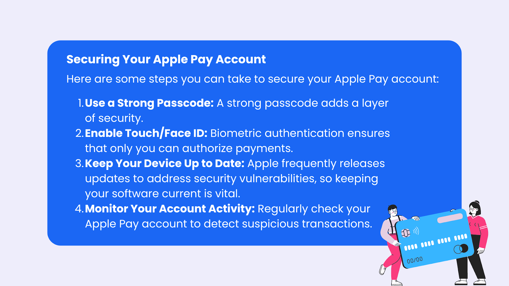

## Table of Contents

## What is Apple Pay and how does it work?

Apple Pay is a way to pay for things using your iPhone, iPad, or Apple Watch instead of using cash or a physical credit card. It's like having your wallet in your phone. When you want to pay, you just hold your device near a special payment machine and use your fingerprint or face to unlock it. This makes paying quick and easy, and you don't have to carry around a bunch of cards.

To set up Apple Pay, you add your credit or debit card to the Wallet app on your device. You can take a picture of your card or type in the card details. Once your card is added, you're ready to use Apple Pay at stores, online, or in apps that accept it. It's safe because your actual card numbers are not stored on your device or shared with the store. Instead, a special code is used to keep your information private.

## How does Apple Pay enhance security compared to traditional credit card payments?

Apple Pay makes paying safer than using a regular credit card. When you use Apple Pay, your card numbers are not given to the store. Instead, a special code is used that keeps your real card details secret. This means if someone tries to steal information from the store, they won't get your actual card number. Also, to use Apple Pay, you need to unlock your phone with your fingerprint or face, which adds another layer of safety. It's harder for someone else to use your phone to make payments without your permission.

Another way Apple Pay is more secure is through something called tokenization. This means your card number is turned into a unique code, or token, that can only be used once. If this token gets stolen, it can't be used again, so it's useless to thieves. Plus, Apple Pay uses a secure chip in your device to make sure the payment information is safe when it's sent. All these things together make Apple Pay a safer way to pay than just swiping or inserting your card at a store.

## What is tokenization and how does Apple Pay use it?

Tokenization is a way to keep your credit card information safe when you use Apple Pay. Instead of using your real card number when you pay, Apple Pay creates a special code, called a token, that is used just for that one payment. This token is unique and can't be used again, so if someone steals it, they can't do anything with it.

Apple Pay uses tokenization to make sure your card details stay private. When you add your card to Apple Pay, it doesn't store your actual card number on your device or share it with the store. Instead, it uses the token to complete the payment. This makes it much harder for anyone to steal your card information because they would only get the useless token, not your real card number.

## How does two-factor authentication work with Apple Pay?

Two-[factor](/wiki/factor-investing) authentication adds an extra layer of security to your Apple Pay account. It means you need two things to get into your account: something you know, like a password, and something you have, like your phone. When you try to add a new card to Apple Pay or make changes to your account, Apple might ask you to enter a code that they send to your phone. This makes sure it's really you making the changes and not someone else.

This extra step helps keep your Apple Pay account safe. If someone steals your password, they still can't get into your account without your phone. This makes it much harder for anyone to use your Apple Pay without your permission. It's like having a double lock on your account, making sure only you can use it.

## What are biometric security features used in Apple Pay?

Apple Pay uses biometric security features like Face ID and Touch ID to make sure only you can use it. Face ID uses the front camera on your iPhone or iPad to scan your face. It checks if it's really you by comparing the scan to the picture you saved when you set up your device. This way, only you can unlock your phone and use Apple Pay. If someone else tries to use your phone, it won't work because their face won't match.

Touch ID is another biometric feature that uses your fingerprint. When you want to use Apple Pay, you just put your finger on the home button or the side button on newer iPhones. If your fingerprint matches the one you saved, your phone unlocks and you can make a payment. This is quick and easy for you, but hard for anyone else because they don't have your fingerprint. Both Face ID and Touch ID help keep your Apple Pay safe and private.

## How does Apple Pay protect against fraudulent transactions?

Apple Pay protects against fraudulent transactions by using a special code called a token instead of your real card number. When you pay with Apple Pay, the store gets this token, not your actual card details. This means if someone steals the information from the store, they can't use it because the token is only good for one payment. This makes it much harder for thieves to use your card information fraudulently.

Another way Apple Pay keeps you safe is by using your fingerprint or face to unlock your phone before you can pay. This means even if someone gets your phone, they can't use Apple Pay without your fingerprint or face. This adds an extra layer of security, making it harder for anyone else to make payments with your card. Together, these features help prevent fraud and keep your money safe.

## What is the role of the Secure Element in Apple Pay transactions?

The Secure Element is like a tiny, safe box inside your iPhone or Apple Watch. It keeps your payment information, like your card details, locked up and safe. When you use Apple Pay to buy something, the Secure Element makes sure your real card number isn't shared with the store. Instead, it uses a special code called a token. This keeps your information private and makes it hard for anyone to steal your card details.

The Secure Element also works with your phone's security features, like Face ID or Touch ID. When you want to pay, you need to unlock your phone first. The Secure Element checks that it's really you by working with these security checks. This means even if someone else gets your phone, they can't use Apple Pay without your fingerprint or face. So, the Secure Element helps make sure your payments are safe and only you can use them.

## How does Apple Pay handle data privacy and what information does it share with merchants?

Apple Pay cares a lot about keeping your information private. When you use Apple Pay, it doesn't share your real card numbers with the store. Instead, it uses a special code called a token. This token is only good for one payment, so even if someone steals it, they can't use it again. This way, Apple Pay makes sure your card details stay safe and private.

When you pay with Apple Pay, the store might see your name and the last four digits of your card number. But they don't get your full card number or any other private details. Apple also doesn't keep track of what you buy or where you buy it. They only know which device was used to make the payment. This helps keep your shopping habits private and secure.

## What security measures does Apple Pay implement to prevent unauthorized device use?

Apple Pay uses strong security features to stop people from using your device without permission. One way it does this is by using your fingerprint or face to unlock your phone before you can pay. This means that even if someone else gets your phone, they can't use Apple Pay unless they have your fingerprint or can unlock your phone with your face. This adds an extra layer of safety, making sure only you can make payments.

Another way Apple Pay keeps your device safe is by using something called the Secure Element. This is like a tiny, locked box inside your phone that keeps your payment information safe. When you want to use Apple Pay, the Secure Element works with your phone's security features to make sure it's really you. This helps prevent anyone else from using your device to make payments without your permission.

## How can users report and manage lost or stolen devices with Apple Pay?

If your iPhone or Apple Watch with Apple Pay gets lost or stolen, you can quickly stop anyone else from using it. You can use the "Find My" app or go to iCloud.com on another device. There, you can mark your device as lost. This locks your device with a passcode and turns off Apple Pay so no one can use it to make payments. You can also see where your device is on a map, which might help you get it back.

If you can't find your device, you can choose to erase it remotely. This will delete all your information, including your Apple Pay cards, to keep your data safe. Remember to call your bank or card issuer too. Tell them your card on Apple Pay is lost or stolen. They can stop the card from being used and send you a new one. This way, even if someone finds your device, they can't use your Apple Pay to buy things.

## What are the advanced security protocols used by Apple Pay during transactions?

Apple Pay uses a special code called a token instead of your real card number when you pay. This token is only good for one payment, so if someone steals it, they can't use it again. This helps keep your card information safe because the store never sees your actual card details. Apple Pay also uses something called the Secure Element, which is like a tiny, safe box inside your device that keeps your payment information locked up and secure.

Another important security feature is two-factor authentication. When you want to add a new card to Apple Pay or make changes to your account, Apple might send a code to your phone that you need to enter. This makes sure it's really you making the changes and not someone else. Additionally, Apple Pay uses your fingerprint or face to unlock your phone before you can pay, adding an extra layer of security. All these measures work together to make sure your payments are safe and only you can use them.

## How does Apple Pay comply with international security standards and regulations?

Apple Pay follows important security rules from around the world to keep your payments safe. It meets standards like the Payment Card Industry Data Security Standard (PCI DSS), which is a set of rules that help protect card information. By using a special code called a token instead of your real card number, Apple Pay makes sure that your card details stay private and secure. This helps Apple Pay meet the strict security requirements set by banks and card companies.

Apple also works hard to make sure Apple Pay follows laws in different countries. For example, in Europe, Apple Pay follows the General Data Protection Regulation (GDPR), which is a big law that protects your personal information. By using strong security features like the Secure Element, two-factor authentication, and biometric checks like Face ID and Touch ID, Apple Pay helps keep your data safe and private no matter where you are. This way, you can use Apple Pay around the world knowing it meets high security standards.

## References & Further Reading

[1]: Clark, S. (2019). ["Digital Payment Applications: A Framework for Mobile Payment Security."](https://www.sciencedirect.com/science/article/pii/S0275531922002410) Journal of Payment Strategy & Systems.

[2]: Kharpal, A. (2021). ["Apple Pay explained: How you can use Apple’s payment system."](https://en.wikipedia.org/wiki/SoftBank_Vision_Fund) CNBC.

[3]: Ross, A. (2023). ["Convenience Meets Security: Mobile Payment Systems' Balancing Act."](https://www.benzinga.com/insights/short-sellers/24/10/41551380/looking-into-ross-storess-recent-short-interest) Forbes.

[4]: Narayanan, A., Bonneau, J., Felten, E., Miller, A., & Goldfeder, S. (2016). ["Bitcoin and Cryptocurrency Technologies: A Comprehensive Introduction."](https://press.princeton.edu/books/hardcover/9780691171692/bitcoin-and-cryptocurrency-technologies) Princeton University Press.

[5]: Reed, C. (2017). ["Tokenization: Securing Digital Payments with Advanced Encryption."](https://www.mckinsey.com/industries/financial-services/our-insights/from-ripples-to-waves-the-transformational-power-of-tokenizing-assets) Journal of Information Security.

