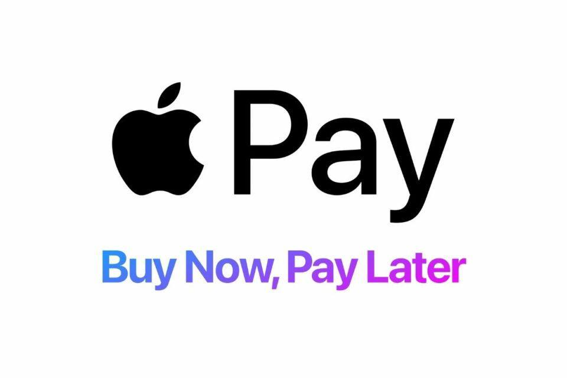

Digital payments have fundamentally transformed how we conduct financial transactions, surpassing traditional methods with their unparalleled convenience and rapidity. As the world becomes increasingly reliant on technology, these innovative payment solutions have emerged as a vital component of modern commerce. Mobile payment systems and digital wallets, such as Apple Pay, have been at the forefront of this transformation, providing users with swift and efficient transaction capabilities right at their fingertips. However, with the rising adoption of these technologies, understanding their security measures becomes crucial for users and businesses alike.

Apple Pay, among other mobile payment solutions, leverages advanced security protocols to safeguard user data and transactions. As we explore the safety of mobile payment methods, Apple Pay serves as an exemplary model of how technology is being utilized to enhance financial security. This is particularly significant in the context of financial technology, where secure transactions are paramount to maintaining trust and efficiency.

The connection between mobile payments and algorithmic trading further underscores the importance of secure transactions. Algorithmic trading, characterized by the execution of pre-programmed trading instructions, relies heavily on the seamless transfer of funds to operate efficiently. Any breach in security could have significant implications, affecting the accuracy and reliability of trading operations. Therefore, the integration of robust security measures within digital payments is critical for supporting the infrastructure of modern financial systems.

Globally, the use of mobile payments is on the rise, prompting increased scrutiny of their security features. As consumers embrace the convenience of digital wallets, ensuring the security of these transactions becomes more crucial than ever. The focus on mobile payment security not only protects users from potential fraud but also upholds the integrity of the broader financial ecosystem.

## Table of Contents

## The Growth of Mobile Payments

Mobile payments have experienced significant growth over recent years, fundamentally altering consumer behavior and transforming the global financial environment. This trend is primarily driven by the rapid advancement of near-field communication (NFC) technology and the widespread adoption of smartphones. NFC allows for seamless communication between devices, facilitating quick and contactless payment exchanges. As a result, mobile payments have emerged as a preferred method for numerous consumers seeking convenience and efficiency in their financial transactions.

According to industry projections, the mobile payment market is anticipated to expand significantly, reaching an estimated $587.52 billion by 2030. This growth reflects an impressive compound annual growth rate (CAGR) of 36.2%, demonstrating the increasing reliance on mobile solutions for everyday transactions. The expanding market size is indicative of a broader shift towards digital financial services, where ease of use and accessibility are prioritized.

At the forefront of this mobile payment revolution are key players such as Apple Pay and Google Pay. These platforms have been instrumental in driving the expansion of mobile payments by providing user-friendly interfaces and secure transaction processes. Apple Pay, for instance, integrates seamlessly with iOS devices, allowing users to conduct transactions with the touch of a finger or a glance using biometric authentication features like Touch ID and Face ID. Similarly, Google Pay offers an intuitive experience across Android devices, promoting widespread adoption among users who value speed and security in financial transactions.

The growth trajectory of mobile payments is also supported by an increasing range of service offerings. Mobile payment providers continually innovate to incorporate additional functionalities, such as personalized financial management tools and integration with loyalty programs. By enhancing their service spectrum, these platforms not only meet diverse consumer needs but also encourage the transition from traditional payment methods to digital solutions.

Overall, the expansion of mobile payments signifies a broader shift towards a digital-centric financial landscape, with technology playing a pivotal role in shaping consumer interactions with money. As the industry evolves, the incorporation of cutting-edge technologies and user-centric features will likely continue to drive adoption and market growth.

## Apple Pay: Safety Features and Concerns

Apple Pay is widely recognized for its commitment to security, making it a preferred choice among digital payment platforms. A cornerstone of Apple Pay's security is its use of tokenization. When a user adds a credit or debit card to Apple Pay, the actual card numbers are not stored on the device or on Apple servers. Instead, a unique device account number is assigned, encrypted, and securely stored in the Secure Element, a dedicated chip in iOS devices. Transactions are authorized with a one-time dynamic security code, adding an additional layer of protection against fraud.

Encryption plays a vital role in maintaining the confidentiality and integrity of transaction data. All transactions made via Apple Pay are encrypted and require authorization using Face ID, Touch ID, or a device passcode. This ensures that only the authorized user can initiate a payment. For those seeking extra security, Apple offers optional two-[factor](/wiki/factor-investing) authentication (2FA) for Apple ID, which provides an additional verification step when making transactions.

Despite these robust security features, vulnerabilities can emerge. These are often due to user errors or improper usage. For example, if a user's device is lost or stolen and their authentication method is compromised, unauthorized payments could occur. Moreover, even the strongest security systems can be vulnerable to social engineering attacks, such as phishing, where attackers may lure users into revealing personal information.

One prevalent concern is the exposure to phishing attacks. Cybercriminals may attempt to trick users into providing sensitive information by impersonating legitimate entities. Users must remain vigilant against such attacks, recognizing suspicious communications and verifying sources before sharing confidential details.

Another risk includes the use of unsecured public Wi-Fi networks. When users access Apple Pay over public Wi-Fi, their data could be intercepted by malicious actors if the network lacks adequate security measures. Therefore, it is advisable to perform financial transactions over secure, private networks whenever possible.

Apple continuously works to enhance the security of Apple Pay by regularly updating its security protocols. The company's commitment to staying ahead of threats involves timely software updates, which patch vulnerabilities and introduce new security features. Users are encouraged to install these updates promptly to benefit from the latest security enhancements.

In summary, Apple Pay offers advanced security measures, but user awareness and proactive behavior are critical in mitigating risks. By understanding potential vulnerabilities and adopting best practices, users can significantly enhance the security of their mobile payment transactions.

## Comparing Mobile Payment Security: Apple Pay vs. Others

Mobile payment platforms have developed various security features to protect users' financial and personal information. Apple Pay, renowned for its robust security measures, employs features such as tokenization, encryption, and optional two-factor authentication. Tokenization ensures that actual card details are never shared with merchants; instead, a unique digital token is generated for each transaction. Encryption safeguards data in transit and at rest, while two-factor authentication provides an additional layer of security by verifying user identity through an external device or method.

Other mobile payment platforms, like PayPal and Google Pay, incorporate similar security measures but may differ in implementation and user experience. For example, PayPal has built a reputation for its extensive buyer and seller protection policies, which add an extra layer of financial security. Google Pay, on the other hand, also uses tokenization and encryption, but it is deeply integrated with Google's suite of services, which can enhance user convenience in multi-platform environments.

Choosing the right payment method depends on user preferences, such as prioritizing convenience over comprehensive protection or vice versa. Apple Pay might appeal to users within the Apple ecosystem due to its seamless integration with Apple devices, while Google Pay could be more attractive to Android users due to similar integration. Additionally, the types of transactions might influence user choice; for instance, PayPal's protection features might be more desirable for users frequently engaging in e-commerce.

Users must evaluate their security needs based on their typical usage patterns and the environments in which they frequently conduct transactions. Each platform offers different strengths, and the decision often comes down to balancing convenience, security features, and ecosystem compatibility.

## Digital Payment Security in the FinTech Ecosystem

Secure digital payments form the backbone of the fintech ecosystem, enabling trust and efficient operation among participants. In this dynamic sector, [algorithmic trading](/wiki/algorithmic-trading) stands out as a prominent area that significantly benefits from secure digital transactions. Algorithmic trading relies on the automation of trade execution, using algorithms to analyze market data and execute trades at high speed and [volume](/wiki/volume-trading-strategy). This necessitates a robust, secure payment system to ensure that trades are executed accurately and without delay.

Algorithmic trading is a technique wherein computer programs follow a defined set of rules (an algorithm) to place trades in the financial markets at a speed and frequency that is impossible for human traders. These algorithms utilize complex mathematical models and take advantage of vast market data to determine market trends and opportunities. Given the sheer volume and velocity of trades, even a minor delay or error due to security issues could lead to significant financial losses. Therefore, secure digital payments are essential for maintaining the integrity of this process.

A breach in digital payment security can have severe repercussions, ranging from financial loss and data theft to damage to an organization's reputation. For instance, if an unauthorized party gains access to transaction data, it could lead to fraudulent activities and loss of sensitive information. Such events underscore the necessity for continuous advancements in payment security mechanisms.

Financial institutions and fintech companies must adopt advanced security technologies such as encryption, tokenization, and blockchain to minimize security threats. Encryption ensures that data transmitted during transactions is unreadable to unauthorized entities, while tokenization replaces sensitive data with unique identification symbols, maintaining data integrity without exposing actual information. Blockchain technology, with its decentralized and immutable ledger, offers an additional layer of security by providing a transparent and tamper-proof record of transactions.

Moreover, fintech entities need to comply with industry regulations and standards to secure their payment processes. Regulatory frameworks such as the Payment Card Industry Data Security Standard (PCI DSS) provide guidelines for protecting card data and maintaining a secure transaction environment. Compliance with these standards helps companies build trust with their consumers and safeguard their financial transactions.

In summary, securing digital payment processes is crucial for the efficient functioning of the fintech ecosystem. By leveraging advanced security technologies and adhering to regulatory standards, fintech companies can protect their transaction environments, ensuring smooth and secure operations, particularly in high-frequency trading scenarios prevalent in algorithmic trading.

## Best Practices for Mobile Payment Security

To ensure secure mobile payment transactions, users should adopt several best practices to bolster their security measures. Firstly, activating all available security features within mobile payment apps is essential. Most platforms, including Apple Pay, provide options such as two-factor authentication (2FA), which adds an extra layer of security beyond passwords. Additionally, utilizing complex passcodes or biometric authentication methods, such as fingerprints or facial recognition, further safeguards sensitive financial information from unauthorized access.

It is crucial to refrain from using public Wi-Fi networks for processing financial transactions. Public Wi-Fi is notoriously insecure, as these networks lack encryption, making it easier for malicious actors to intercept and steal data. Users should opt for personal and secure internet connections whenever making payments or accessing sensitive information.

Regularly monitoring account activity is another vital practice to bolster mobile payment security. By keeping a close watch on transactions, users can quickly detect any unauthorized or suspicious activity and take swift action to mitigate potential losses. Establishing alerts or notifications from financial institutions or payment providers can aid in this continuous oversight.

Staying informed about the latest security updates and patches from payment providers is equally important. Mobile payment systems continually evolve to address new security threats, and providers often issue updates that fix vulnerabilities or enhance existing security features. Users should ensure their apps and software are always up-to-date to benefit from these improvements.

By incorporating these practices, users significantly reduce the risk of fraud and unauthorized transactions, thereby enhancing the overall security of their mobile payments.

## Future Trends in Mobile Payment Security

As digital payments continue to grow, the integration of advanced technologies promises to enhance security significantly. Artificial Intelligence (AI) is leading this transformation by enabling systems to detect fraudulent activities more accurately through the analysis of transaction patterns and user behaviors. Machine learning models can be trained on vast datasets to identify anomalies, which are often indicative of fraud. For example, if a user regularly makes transactions in one country, and a sudden attempted purchase occurs from another, AI can flag this as suspicious activity.

Biometric authentication is another critical advancement enhancing mobile payment security. Biometrics, which include fingerprint scanning, facial recognition, and voice identification, offer an additional layer of verification that is difficult to replicate. These methods leverage unique human characteristics, thereby reducing the likelihood of unauthorized access. As smartphones become increasingly equipped with these biometric sensors, their integration into payment systems is expected to rise, offering users a more secure and seamless payment experience.

Blockchain technology is emerging as a promising solution for secure transactions. By leveraging a decentralized ledger system, blockchain provides transparency and immutability, reducing the risk of data manipulation and fraud. Cryptographic techniques intrinsic to blockchain ensure that transactions are both secure and verifiable. As blockchain-based payment solutions gain [momentum](/wiki/momentum), they may offer more secure frameworks compared to traditional payment systems.

Alongside technological advancements, there is a global push towards standardizing mobile payment security measures through regulatory efforts. Governments and international bodies are increasingly recognizing the need for comprehensive frameworks to protect consumers. By establishing uniform standards and practices, these regulations aim to mitigate risks associated with digital transactions. This initiative not only bolsters consumer confidence but also fosters innovation by providing a clear regulatory environment for companies to operate in.

Future trends indicate a convergence of these technologies and regulatory efforts, creating a robust environment for mobile payment security. As these trends evolve, stakeholders must remain vigilant and adaptive to emerging threats while leveraging these advances to protect users in the digital payment ecosystem.

## Conclusion

Mobile payments have transformed the landscape of financial transactions by providing unparalleled convenience. Whether through Apple Pay, Google Pay, or other digital wallets, they enable swift and efficient exchanges of money with just a few taps or waves, eliminating the need for cash or physical cards. This revolution in payment systems, however, hinges on robust security measures to protect users from potential threats.

Apple Pay, along with other mobile payment platforms, has established a benchmark in terms of security features. These systems utilize advanced technologies such as tokenization, encryption, and biometric authentication, which significantly reduce the opportunity for fraud and data breaches. Tokenization replaces sensitive information with uniquely generated tokens for each transaction, ensuring that personal data remains secure. Despite these formidable security frameworks, users must remain vigilant at all times. Adopting best practices, such as regularly updating apps, using complex passwords, and avoiding transactions over public Wi-Fi, is crucial for maintaining the integrity of mobile payments.

As mobile payments continue to gain traction, their intersection with algorithmic trading grows more pronounced. Algorithmic trading, which relies on the rapid execution of trades and processing of vast amounts of data, mandates seamless and secure payment systems. Any breach or delay can have profound implications on financial markets, highlighting the necessity for state-of-the-art security measures in digital transactions.

Going forward, the challenge for technology providers is to ensure that these payment systems are not only convenient but also impenetrably secure. This requires continuous advancements in security technologies, user education, and strict compliance with evolving regulatory standards. As both digital payments and algorithmic trading expand, guaranteeing secure transactions will remain a pivotal concern for providers and users alike, necessitating ongoing innovation and vigilance in the fintech landscape.

## References & Further Reading

[1]: Clark, S. (2019). ["Digital Payment Applications: A Framework for Mobile Payment Security."](https://www.sciencedirect.com/science/article/pii/S0275531922002410) Journal of Payment Strategy & Systems.

[2]: Kharpal, A. (2021). ["Apple Pay explained: How you can use Apple’s payment system."](https://en.wikipedia.org/wiki/SoftBank_Vision_Fund) CNBC.

[3]: Ross, A. (2023). ["Convenience Meets Security: Mobile Payment Systems' Balancing Act."](https://www.benzinga.com/insights/short-sellers/24/10/41551380/looking-into-ross-storess-recent-short-interest) Forbes.

[4]: Narayanan, A., Bonneau, J., Felten, E., Miller, A., & Goldfeder, S. (2016). ["Bitcoin and Cryptocurrency Technologies: A Comprehensive Introduction."](https://press.princeton.edu/books/hardcover/9780691171692/bitcoin-and-cryptocurrency-technologies) Princeton University Press.

[5]: Reed, C. (2017). ["Tokenization: Securing Digital Payments with Advanced Encryption."](https://www.mckinsey.com/industries/financial-services/our-insights/from-ripples-to-waves-the-transformational-power-of-tokenizing-assets) Journal of Information Security.

