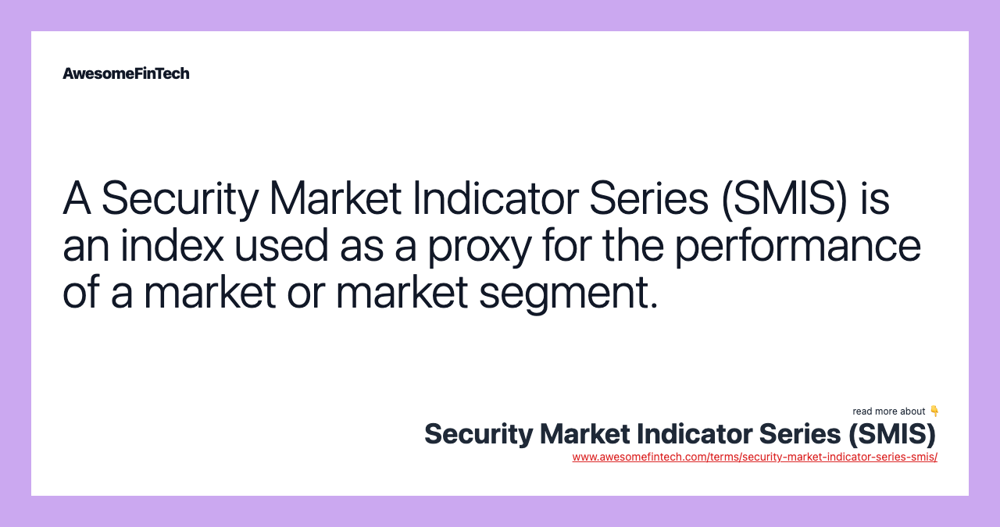

## Table of Contents

## What is the Security Market Indicator Series?

The Security Market Indicator Series, often called SMIS, is a set of numbers that help people understand how well the stock market is doing. It includes different types of data, like stock prices, how many stocks are being bought and sold, and how much money is being made or lost. This information is useful for investors who want to know if the market is going up or down.

SMIS is important because it gives a clear picture of the market's health. By looking at these indicators, people can make better decisions about buying or selling stocks. For example, if the SMIS shows that stock prices are going up and more people are buying, it might be a good time to invest. On the other hand, if the indicators show that prices are falling and fewer people are buying, it might be wise to wait or sell.

## What are the main components of the Security Market Indicator Series?

The Security Market Indicator Series, or SMIS, has several main parts that help people understand the stock market. One important part is stock prices. This tells us how much stocks are worth at different times. Another part is trading volume, which shows how many stocks are being bought and sold. This can tell us if the market is busy or quiet. The last main part is market returns, which show how much money people are making or losing from their investments.

These components work together to give a full picture of the market. For example, if stock prices are going up and trading [volume](/wiki/volume-trading-strategy) is high, it might mean that people are feeling good about the market and want to invest more. On the other hand, if stock prices are falling and trading volume is low, it might mean that people are worried and not wanting to buy stocks. By looking at all these parts, investors can make smarter choices about when to buy or sell.

## How does the Security Market Indicator Series help in analyzing market trends?

The Security Market Indicator Series helps people see market trends by showing them important information about the stock market. It includes things like stock prices, how many stocks are being bought and sold, and how much money people are making or losing. By looking at these numbers, people can figure out if the market is going up or down. For example, if stock prices are going up and a lot of stocks are being traded, it might mean that people are feeling good about the market and want to invest more.

This series is useful because it gives a clear picture of what's happening in the market over time. If someone sees that stock prices have been going up for a few months and more people are buying stocks, they might think it's a good time to invest. On the other hand, if they see that prices are falling and fewer people are buying, they might decide to wait or sell their stocks. By using the Security Market Indicator Series, people can make better decisions about their investments based on what the market is doing.

## What are the different types of indicators included in the series?

The Security Market Indicator Series includes different types of indicators that help people understand the stock market. One type of indicator is stock prices. This shows how much stocks are worth at different times. Another type is trading volume, which tells us how many stocks are being bought and sold. This can show if the market is busy or quiet. The last type is market returns, which show how much money people are making or losing from their investments.

These indicators work together to give a full picture of the market. For example, if stock prices are going up and trading volume is high, it might mean that people are feeling good about the market and want to invest more. On the other hand, if stock prices are falling and trading volume is low, it might mean that people are worried and not wanting to buy stocks. By looking at all these indicators, investors can see trends and make smarter choices about when to buy or sell stocks.

## How is data collected and processed for the Security Market Indicator Series?

Data for the Security Market Indicator Series is collected from various sources, mainly stock exchanges and financial data providers. Stock exchanges keep track of all the trades happening on their platforms, including the price at which stocks are bought and sold and the number of stocks traded. Financial data providers gather this information from the stock exchanges and also collect other relevant data, like company earnings reports and economic indicators. This raw data is then sent to the organizations that create the Security Market Indicator Series, where it is checked for accuracy and completeness.

Once the data is collected and verified, it goes through a processing stage. During this stage, the data is organized and analyzed to create the indicators that make up the Security Market Indicator Series. This involves calculating average stock prices, summing up trading volumes, and figuring out market returns. The processed data is then used to update the indicators, which are published regularly to help investors understand the current state of the market. By looking at these updated indicators, people can see trends and make informed decisions about their investments.

## What are the key benefits of using the Security Market Indicator Series for investors?

The Security Market Indicator Series helps investors by giving them a clear picture of what's happening in the stock market. It tells them about stock prices, how many stocks are being bought and sold, and how much money people are making or losing. This information is important because it helps investors see if the market is going up or down. By knowing these trends, investors can make better choices about when to buy or sell their stocks.

Another benefit is that the Security Market Indicator Series makes it easier for investors to understand the market without having to look at a lot of different data sources. It puts all the important information in one place, which saves time and helps investors make quick decisions. This can be really helpful, especially when the market is changing fast and investors need to act quickly to protect their money or make more of it.

## How can beginners interpret the data from the Security Market Indicator Series?

For beginners, understanding the Security Market Indicator Series can seem hard at first, but it's really about looking at three main things: stock prices, trading volume, and market returns. Stock prices tell you how much stocks are worth at different times. If you see that stock prices are going up over time, it might mean that the market is doing well. Trading volume shows how many stocks are being bought and sold. If a lot of stocks are being traded, it means the market is busy, and people are interested in buying and selling. Market returns show how much money people are making or losing from their investments. If returns are high, it means people are making more money.

To use this information, beginners should look at these indicators together to see the bigger picture. For example, if stock prices are going up, trading volume is high, and market returns are good, it might be a good time to invest because the market seems to be doing well. On the other hand, if stock prices are going down, trading volume is low, and market returns are bad, it might be better to wait or sell your stocks. By paying attention to these trends, beginners can start to understand what's happening in the market and make smarter choices about their investments.

## What advanced techniques can experts use to maximize the utility of the Security Market Indicator Series?

Experts can use advanced techniques to get more out of the Security Market Indicator Series. One way is by using technical analysis, which involves looking at past data to find patterns that can help predict what the market might do next. Experts might use tools like moving averages, which smooth out price data to see trends more clearly, or the Relative Strength Index (RSI), which helps figure out if a stock is overbought or oversold. By combining these tools with the indicators from the SMIS, experts can make more accurate predictions about market movements and find the best times to buy or sell stocks.

Another advanced technique is using quantitative analysis, where experts build mathematical models to understand the market better. They might use data from the SMIS to create these models, which can help them see how different factors affect stock prices and trading volume. For example, they could use regression analysis to see how economic indicators, like interest rates or employment numbers, affect the market. By doing this, experts can find hidden patterns and make smarter investment decisions. This way, they can use the SMIS not just to see what's happening now, but to plan for the future and manage their investments more effectively.

## How does the Security Market Indicator Series compare to other market analysis tools?

The Security Market Indicator Series (SMIS) is a helpful tool for understanding the stock market. It looks at stock prices, how many stocks are being bought and sold, and how much money people are making or losing. This gives a clear picture of what's happening in the market right now. Compared to other tools, SMIS is easy to understand and gives a quick overview of the market. For example, other tools like technical analysis might focus more on past patterns and use complicated charts, which can be hard for beginners to understand. SMIS, on the other hand, is simpler and helps people see the big picture without getting lost in details.

Another way SMIS is different from other tools is that it can be used with other analysis methods to get even better results. For example, experts might use SMIS along with [fundamental analysis](/wiki/fundamental-analysis), which looks at a company's financial health and future growth, to make smarter investment choices. While SMIS gives a broad view of the market, fundamental analysis gives a deeper look into individual companies. This combination can help investors understand both the overall market trends and the specific details about the companies they're interested in. By using SMIS with other tools, investors can get a more complete picture of the market and make more informed decisions.

## What historical data is available through the Security Market Indicator Series, and how can it be used?

The Security Market Indicator Series (SMIS) gives us a lot of historical data about the stock market. It includes information on stock prices, how many stocks were bought and sold, and how much money people made or lost over time. This data can go back many years, which helps us see how the market has changed and what patterns it follows. For example, we can look at stock prices from ten years ago and compare them to now to see if the market has grown or shrunk.

This historical data is really useful for understanding market trends and making smart investment choices. By looking at past stock prices and trading volumes, we can see if the market usually goes up or down at certain times of the year. We can also use this data to see how the market reacts to big events, like economic changes or new laws. This helps investors predict what might happen next and decide when to buy or sell stocks. By using the SMIS historical data, people can learn from the past to make better decisions in the future.

## Can the Security Market Indicator Series predict market movements, and if so, how accurate is it?

The Security Market Indicator Series (SMIS) can help predict market movements by showing us patterns and trends in stock prices, trading volume, and market returns. By looking at this data over time, we can see if the market usually goes up or down at certain times. For example, if stock prices have been going up every spring for the last few years, we might guess they'll go up again this spring. But, SMIS doesn't tell us exactly what will happen. It's like a weather forecast; it can give us a good idea, but it's not always right.

The accuracy of SMIS in predicting market movements depends on a lot of things. It's good at showing big trends and patterns, but smaller, sudden changes can be hard to predict. Also, things like new laws, big news, or changes in the economy can affect the market in ways that SMIS can't see coming. So, while SMIS can be a helpful tool for guessing what the market might do, it's not perfect. It's best used with other tools and a bit of common sense to make the smartest investment choices.

## What are the limitations and potential pitfalls of relying on the Security Market Indicator Series for investment decisions?

The Security Market Indicator Series (SMIS) can be a helpful tool for investors, but it has some limitations. One big problem is that it can't predict everything. The stock market is affected by many things, like new laws, big news, or changes in the economy. SMIS can show us patterns and trends, but it can't see these sudden changes coming. So, if an investor relies only on SMIS, they might be surprised by events that weren't predicted by the data.

Another potential pitfall is that SMIS gives us a broad view of the market, but it doesn't tell us about individual companies. If someone wants to invest in a specific company, they need to look at more than just the overall market trends. SMIS doesn't give us details about a company's financial health or future growth plans. So, if an investor uses SMIS without looking at other information, they might miss important details that could affect their investment choices.

## What is the significance of financial indicators in algo trading?

Financial indicators play a vital role in [algorithmic trading](/wiki/algorithmic-trading) by supplying quantitative data that aid decision-making processes. These indicators are integral in assessing market trends, identifying potential entry and [exit](/wiki/exit-strategy) points, and evaluating the strength and [momentum](/wiki/momentum) of price movements.

Traders often employ several key financial indicators when constructing algorithmic trading strategies:

1. **Moving Averages (MA)**: Moving averages are used to smooth price data, making it easier to identify trends. The two most common types are the Simple Moving Average (SMA) and the Exponential Moving Average (EMA). The SMA calculates the average of a selected range of prices, usually closing prices, by the number of periods in that range. The EMA gives more weight to recent prices, making it more responsive to new information.

   Formula for Simple Moving Average:  
$$
   \text{SMA} = \frac{P_1 + P_2 + \ldots + P_n}{n}

$$
   where $P_1, P_2, \ldots, P_n$ are the closing prices, and $n$ is the number of periods.

2. **Relative Strength Index (RSI)**: The RSI is a momentum oscillator that measures the speed and change of price movements. It ranges from 0 to 100 and is typically used to identify overbought or oversold conditions.

   Formula for RSI:  
$$
   \text{RSI} = 100 - \left(\frac{100}{1 + \text{RS}}\right)

$$
   where RS is the average of $n$ days' up closes divided by the average of $n$ days' down closes.

3. **Moving Average Convergence Divergence (MACD)**: This indicator is a trend-following momentum indicator that shows the relationship between two moving averages of a security’s price. The MACD is calculated by subtracting the 26-period EMA from the 12-period EMA.

   Formula for MACD line:  
$$
   \text{MACD} = \text{EMA}_{12} - \text{EMA}_{26}

$$

4. **Bollinger Bands**: These consist of a middle band (SMA) and two outer bands (standard deviations away from the SMA). The bands expand and contract based on market volatility, helping traders identify potential breakout or reversal scenarios.

   Bollinger Bands formula:  
$$
   \text{Upper Band} = \text{SMA}(n) + k \times \sigma
   \]  
$$
   \text{Lower Band} = \text{SMA}(n) - k \times \sigma
   \]  
   where $\sigma$ is the standard deviation, and $k$ is a constant number of standard deviations.

5. **Stochastic Oscillator**: This momentum indicator compares a particular closing price of a security to a range of its prices over a certain period of time. Its sensitivity to market movements is reducible by adjusting that time period or by taking a moving average of the result.

   Formula for Stochastic Oscillator:  
$$
   \%K = 100 \times \frac{\text{(Current Close - Lowest Low)}}{\text{(Highest High - Lowest Low)}}

$$
   over a defined period.

These indicators provide an objective framework for traders, minimizing subjective biases and facilitating the implementation of automated trading strategies. By analyzing patterns and interpreting data through these quantitative tools, traders can make well-informed decisions, optimizing the effectiveness of their algorithmic trading strategies.

## What are the popular technical indicators for algorithmic trading?

Moving Averages are fundamental tools in technical analysis, providing a simplified view of market trends. The Simple Moving Average (SMA) is calculated by averaging a specific number of past data points. For example, an SMA of 10 days would be the average of the last 10 closing prices. The mathematical formula for SMA is:

$$
\text{SMA} = \frac{P_1 + P_2 + \cdots + P_n}{n}
$$

where $P_i$ represents the price on day $i$ and $n$ is the number of periods.

Exponential Moving Average (EMA) assigns more weight to recent prices, making it more responsive to new information. It is calculated using the following formula:

$$
\text{EMA} = \text{Price}_{\text{current}} \times \left(\frac{2}{n+1}\right) + \text{EMA}_{\text{previous}} \times \left(1 - \frac{2}{n+1}\right)
$$

Relative Strength Index (RSI) is a momentum oscillator that measures the speed and change of price movements. It is primarily used to identify overbought or oversold conditions in a market. RSI values range from 0 to 100, with levels above 70 indicating overbought conditions and levels below 30 indicating oversold conditions. The formula for RSI is:

$$
\text{RSI} = 100 - \left(\frac{100}{1 + \text{RS}}\right)
$$

where RS (Relative Strength) is the average of $n$ days' up closes divided by the average of $n$ days' down closes.

Moving Average Convergence Divergence (MACD) is a trend-following momentum indicator that highlights the relationship between two moving averages of a security’s price. It is calculated by subtracting the 26-period EMA from the 12-period EMA. MACD signals are generated when it crosses above or below a signal line, which is a 9-day EMA of the MACD line. The MACD formula is:

$$
\text{MACD} = \text{EMA}_{12} - \text{EMA}_{26}
$$

Bollinger Bands are [volatility](/wiki/volatility-trading-strategies) bands placed above and below a moving average, typically using the SMA. The bands expand and contract based on market volatility, helping traders identify potential price [breakout](/wiki/breakout-trading) opportunities. The standard calculation is:

- Middle Band = 20-day SMA
- Upper Band = 20-day SMA + (2 × 20-day standard deviation)
- Lower Band = 20-day SMA - (2 × 20-day standard deviation)

These indicators, among others, are vital for traders implementing automated strategies, as they provide quantitative data that can be programmed into trading algorithms. Python, with libraries like NumPy and pandas, is often used to calculate these indicators, enabling traders to build robust trading systems. Here's an example of calculating SMA, EMA, RSI, and MACD using Python:

```python
import pandas as pd

def calculate_sma(data, window):
    return data.rolling(window=window).mean()

def calculate_ema(data, span):
    return data.ewm(span=span, adjust=False).mean()

def calculate_rsi(data, periods=14):
    delta = data.diff(1)
    gain = delta.where(delta > 0, 0)
    loss = delta.where(delta < 0, 0).abs()
    avg_gain = gain.rolling(window=periods).mean()
    avg_loss = loss.rolling(window=periods).mean()
    rs = avg_gain / avg_loss
    rsi = 100 - (100 / (1 + rs))
    return rsi

def calculate_macd(data, short_span=12, long_span=26, signal_span=9):
    ema_short = calculate_ema(data, span=short_span)
    ema_long = calculate_ema(data, span=long_span)
    macd = ema_short - ema_long
    signal = calculate_ema(macd, span=signal_span)
    return macd, signal

# Example usage with a pandas DataFrame `df` containing a `close` column
sma_10 = calculate_sma(df['close'], window=10)
ema_10 = calculate_ema(df['close'], span=10)
rsi_14 = calculate_rsi(df['close'], periods=14)
macd, signal = calculate_macd(df['close'])
```

Incorporating these indicators into algorithmic trading systems allows traders to generate signals systematically and execute trades with reduced emotional interference.

## References & Further Reading

[1]: Marcos Lopez de Prado, ["Advances in Financial Machine Learning"](https://www.amazon.com/Advances-Financial-Machine-Learning-Marcos/dp/1119482089), Wiley, 2018.

[2]: David Aronson, ["Evidence-Based Technical Analysis: Applying the Scientific Method and Statistical Inference to Trading Signals"](https://www.amazon.com/Evidence-Based-Technical-Analysis-Scientific-Statistical/dp/0470008741), Wiley, 2006.

[3]: Stefan Jansen, ["Machine Learning for Algorithmic Trading - Second Edition"](https://github.com/stefan-jansen/machine-learning-for-trading), Packt Publishing, 2020.

[4]: Ernest P. Chan, ["Quantitative Trading: How to Build Your Own Algorithmic Trading Business"](https://www.amazon.com/Quantitative-Trading-Build-Algorithmic-Business/dp/0470284889), Wiley, 2009.

[5]: John F. Ehlers, ["Cybernetic Analysis for Stocks and Futures"](https://www.amazon.com/Cybernetic-Analysis-Stocks-Futures-Cutting-Edge/dp/0471463078), Wiley, 2004.