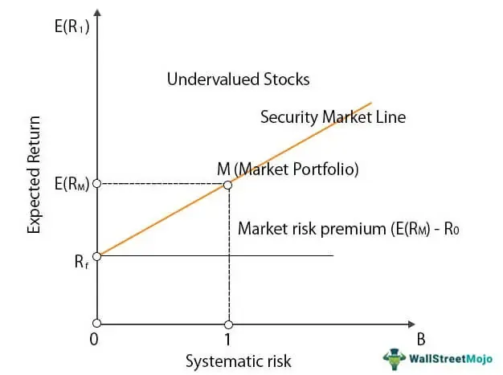

The rapidly evolving financial markets have significantly transformed with the advent of algorithmic trading. As technology continues to advance, traders are increasingly relying on data-driven techniques such as market analysis, security market indicators, financial indicators, and algorithmic trading to optimize their investment strategies. Algorithmic trading allows market participants to execute orders at speeds and frequencies that would be impossible for a human trader. This shift is largely driven by the advantages that automated trading strategies offer, such as increased accuracy, reduced emotional biases, and the ability to process vast amounts of data in real-time.

Understanding the complexity of market analysis is essential for traders who wish to benefit from these technological advances. Key to this is the deployment of Security Market Indicator Series (SMIS) and technical indicators, which are fundamental tools in algorithmic trading. SMIS, such as the Dow Jones Industrial Average (DJIA), the Nasdaq Composite Index, and the S&P 500 Index, serve as benchmarks for gauging the performance of a market or segment. These indexes are utilized not only for evaluating investment performance but also for setting up passive investment products and assessing economic strength.



Technical indicators, on the other hand, provide quantitative data for decision-making in trading. Indicators like Moving Averages, Relative Strength Index (RSI), MACD, Bollinger Bands, and the Stochastic Oscillator help traders identify market trends, potential entry and exit points, and the strength and momentum of price movements. These indicators support a more objective approach to trading, decreasing dependence on subjective analysis and facilitating automated trading strategies.

As traders leverage these tools, understanding the interplay between financial indicators and their application in trading algorithms becomes pivotal. Both novice and seasoned traders need to build a comprehensive understanding of these elements to enhance their strategies, manage risks effectively, and improve overall performance. This knowledge equips traders to harness the full potential of algorithmic trading, ensuring they remain competitive in the fast-paced financial markets.

## Table of Contents

## Understanding Security Market Indicators

Security Market Indicators, often represented by indices such as the Security Market Indicator Series (SMIS), are essential for traders and investors seeking to gauge the overall market or specific market segments. An SMIS aggregates the performance of a selected group of securities, providing a benchmark that reflects market movements. These indicators are indispensable tools for analyzing market trends and informing investment strategies.

Notable examples of SMIS include the Dow Jones Industrial Average (DJIA), Nasdaq Composite Index, and S&P 500 Index. Each of these indices captures a specific facet of market performance. For instance, the DJIA comprises 30 significant publicly traded companies in the United States, serving as a bellwether for the country's industrial sector. The Nasdaq Composite Index, on the other hand, encompasses a broader range of over 3,000 stocks, primarily from the technology sector, while the S&P 500 Index includes 500 large-cap U.S. stocks, providing a more comprehensive view of the American economy.

These indices are not just statistical tools; they serve multiple functions. They provide a basis for evaluating the performance of investment managers by comparing fund returns against index benchmarks. Additionally, they are pivotal in constructing passive investment products, such as index funds and exchange-traded funds (ETFs), which aim to replicate the performance of these indices. This approach allows investors to achieve diversification with reduced costs, compared to actively managed funds.

Moreover, security market indicators offer insights into economic strength. A rising index may imply a robust economy, while a declining index might signal economic challenges. For instance, during periods of economic expansion, stock indices often trend upwards, reflecting increased corporate profits and investor confidence. Conversely, during economic downturns, indices may decline as company earnings fall and investor sentiment becomes bearish.

To utilize these indicators effectively, traders and investors must understand the composition and methodology behind each index. For example, the DJIA is price-weighted, meaning that stocks with higher prices have a more significant impact on the index's movement. In contrast, the S&P 500 is market-cap weighted, where larger companies influence the index more than smaller ones. This fundamental understanding helps in making informed investment decisions and in interpreting market conditions accurately.

In summary, Security Market Indicators like the SMIS are invaluable for assessing market performance, informing investment strategies, and providing economic insights. Their role in evaluating manager performance, establishing passive investment products, and providing economic indications underscores their significance in the financial markets.

## Significance of Financial Indicators in Algo Trading

Financial indicators play a vital role in [algorithmic trading](/wiki/algorithmic-trading) by supplying quantitative data that aid decision-making processes. These indicators are integral in assessing market trends, identifying potential entry and [exit](/wiki/exit-strategy) points, and evaluating the strength and [momentum](/wiki/momentum) of price movements.

Traders often employ several key financial indicators when constructing algorithmic trading strategies:

1. **Moving Averages (MA)**: Moving averages are used to smooth price data, making it easier to identify trends. The two most common types are the Simple Moving Average (SMA) and the Exponential Moving Average (EMA). The SMA calculates the average of a selected range of prices, usually closing prices, by the number of periods in that range. The EMA gives more weight to recent prices, making it more responsive to new information.

   Formula for Simple Moving Average:  
$$
   \text{SMA} = \frac{P_1 + P_2 + \ldots + P_n}{n}

$$
   where $P_1, P_2, \ldots, P_n$ are the closing prices, and $n$ is the number of periods.

2. **Relative Strength Index (RSI)**: The RSI is a momentum oscillator that measures the speed and change of price movements. It ranges from 0 to 100 and is typically used to identify overbought or oversold conditions.

   Formula for RSI:  
$$
   \text{RSI} = 100 - \left(\frac{100}{1 + \text{RS}}\right)

$$
   where RS is the average of $n$ days' up closes divided by the average of $n$ days' down closes.

3. **Moving Average Convergence Divergence (MACD)**: This indicator is a trend-following momentum indicator that shows the relationship between two moving averages of a security’s price. The MACD is calculated by subtracting the 26-period EMA from the 12-period EMA.

   Formula for MACD line:  
$$
   \text{MACD} = \text{EMA}_{12} - \text{EMA}_{26}

$$

4. **Bollinger Bands**: These consist of a middle band (SMA) and two outer bands (standard deviations away from the SMA). The bands expand and contract based on market volatility, helping traders identify potential breakout or reversal scenarios.

   Bollinger Bands formula:  
$$
   \text{Upper Band} = \text{SMA}(n) + k \times \sigma
   \]  
$$
   \text{Lower Band} = \text{SMA}(n) - k \times \sigma
   \]  
   where $\sigma$ is the standard deviation, and $k$ is a constant number of standard deviations.

5. **Stochastic Oscillator**: This momentum indicator compares a particular closing price of a security to a range of its prices over a certain period of time. Its sensitivity to market movements is reducible by adjusting that time period or by taking a moving average of the result.

   Formula for Stochastic Oscillator:  
$$
   \%K = 100 \times \frac{\text{(Current Close - Lowest Low)}}{\text{(Highest High - Lowest Low)}}

$$
   over a defined period.

These indicators provide an objective framework for traders, minimizing subjective biases and facilitating the implementation of automated trading strategies. By analyzing patterns and interpreting data through these quantitative tools, traders can make well-informed decisions, optimizing the effectiveness of their algorithmic trading strategies.

## Popular Technical Indicators for Algorithmic Trading

Moving Averages are fundamental tools in technical analysis, providing a simplified view of market trends. The Simple Moving Average (SMA) is calculated by averaging a specific number of past data points. For example, an SMA of 10 days would be the average of the last 10 closing prices. The mathematical formula for SMA is:

$$
\text{SMA} = \frac{P_1 + P_2 + \cdots + P_n}{n}
$$

where $P_i$ represents the price on day $i$ and $n$ is the number of periods.

Exponential Moving Average (EMA) assigns more weight to recent prices, making it more responsive to new information. It is calculated using the following formula:

$$
\text{EMA} = \text{Price}_{\text{current}} \times \left(\frac{2}{n+1}\right) + \text{EMA}_{\text{previous}} \times \left(1 - \frac{2}{n+1}\right)
$$

Relative Strength Index (RSI) is a momentum oscillator that measures the speed and change of price movements. It is primarily used to identify overbought or oversold conditions in a market. RSI values range from 0 to 100, with levels above 70 indicating overbought conditions and levels below 30 indicating oversold conditions. The formula for RSI is:

$$
\text{RSI} = 100 - \left(\frac{100}{1 + \text{RS}}\right)
$$

where RS (Relative Strength) is the average of $n$ days' up closes divided by the average of $n$ days' down closes.

Moving Average Convergence Divergence (MACD) is a trend-following momentum indicator that highlights the relationship between two moving averages of a security’s price. It is calculated by subtracting the 26-period EMA from the 12-period EMA. MACD signals are generated when it crosses above or below a signal line, which is a 9-day EMA of the MACD line. The MACD formula is:

$$
\text{MACD} = \text{EMA}_{12} - \text{EMA}_{26}
$$

Bollinger Bands are [volatility](/wiki/volatility-trading-strategies) bands placed above and below a moving average, typically using the SMA. The bands expand and contract based on market volatility, helping traders identify potential price [breakout](/wiki/breakout-trading) opportunities. The standard calculation is:

- Middle Band = 20-day SMA
- Upper Band = 20-day SMA + (2 × 20-day standard deviation)
- Lower Band = 20-day SMA - (2 × 20-day standard deviation)

These indicators, among others, are vital for traders implementing automated strategies, as they provide quantitative data that can be programmed into trading algorithms. Python, with libraries like NumPy and pandas, is often used to calculate these indicators, enabling traders to build robust trading systems. Here's an example of calculating SMA, EMA, RSI, and MACD using Python:

```python
import pandas as pd

def calculate_sma(data, window):
    return data.rolling(window=window).mean()

def calculate_ema(data, span):
    return data.ewm(span=span, adjust=False).mean()

def calculate_rsi(data, periods=14):
    delta = data.diff(1)
    gain = delta.where(delta > 0, 0)
    loss = delta.where(delta < 0, 0).abs()
    avg_gain = gain.rolling(window=periods).mean()
    avg_loss = loss.rolling(window=periods).mean()
    rs = avg_gain / avg_loss
    rsi = 100 - (100 / (1 + rs))
    return rsi

def calculate_macd(data, short_span=12, long_span=26, signal_span=9):
    ema_short = calculate_ema(data, span=short_span)
    ema_long = calculate_ema(data, span=long_span)
    macd = ema_short - ema_long
    signal = calculate_ema(macd, span=signal_span)
    return macd, signal

# Example usage with a pandas DataFrame `df` containing a `close` column
sma_10 = calculate_sma(df['close'], window=10)
ema_10 = calculate_ema(df['close'], span=10)
rsi_14 = calculate_rsi(df['close'], periods=14)
macd, signal = calculate_macd(df['close'])
```

Incorporating these indicators into algorithmic trading systems allows traders to generate signals systematically and execute trades with reduced emotional interference.

## Integrating Indicators in Algorithmic Trading Strategies

The integration of technical indicators into trading algorithms is essential for developing rule-based strategies that enhance trading precision and reduce emotional decision-making. By automating the generation of trade signals using indicators like Moving Averages, RSI, and MACD, traders can focus on capitalizing on market opportunities with increased accuracy. This process involves setting precise criteria for trade entry and exit, thus ensuring consistency in trade execution.

Risk management in algorithmic trading is notably improved through the application of technical indicators. These tools can be employed to determine stop-loss levels, define profit targets, and adjust position sizes dynamically based on the prevailing market conditions. For example, a trading algorithm might use the ATR (Average True Range) indicator to set stop-loss levels by calculating volatility-adjusted stops, thus preventing premature exits or losses during volatile market phases.

Moreover, [backtesting](/wiki/backtesting) plays a crucial role in the successful implementation of technical indicators in algorithmic trading. By backtesting strategies against historical data, traders can assess the viability and performance of their algorithms under different market conditions. This involves simulating trades using past data to ensure that the strategy performs well across various market scenarios. Modern trading platforms and programming environments like Python provide tools for backtesting, allowing traders to optimize parameters and refine their strategies. Below is a simple example of backtesting a moving average crossover strategy in Python using the `pandas` and `numpy` libraries:

```python
import pandas as pd
import numpy as np

def moving_average_crossover(data, short_window=50, long_window=200):
    signals = pd.DataFrame(index=data.index)
    signals['price'] = data['close']
    signals['short_mavg'] = data['close'].rolling(window=short_window, min_periods=1, center=False).mean()
    signals['long_mavg'] = data['close'].rolling(window=long_window, min_periods=1, center=False).mean()

    # Generating signals
    signals['signal'] = 0.0
    signals['signal'][short_window:] = np.where(signals['short_mavg'][short_window:] 
                                                > signals['long_mavg'][short_window:], 1.0, 0.0)   
    signals['positions'] = signals['signal'].diff()

    return signals

# Example usage with a DataFrame `df` containing historical price data
signals = moving_average_crossover(df)
print(signals.head())
```

Through backtesting, traders can iteratively refine their algorithms to enhance strategy performance over time. This iterative process ensures that algorithms remain robust and adaptive to evolving market dynamics. By integrating such technical indicators into their strategies, traders can not only optimize the execution of trades but also build a resilient approach to navigating the complexities of financial markets.

## Challenges and Considerations

While technical indicators serve as essential components in algorithmic trading, a dependency that lacks discernment may result in misguided decision-making. The root of such issues arises from indicators' inherent limitations, particularly their inability to always accurately represent current or predictive future market conditions. Markets are dynamic, and the historical data which indicators rely on might not always be a reliable foundation for current or forward-looking trading decisions.

False signals, especially prevalent in choppy or sideways markets, pose a significant challenge. These conditions can manifest when indicators suggest potential trading opportunities that do not materialize, leading to suboptimal executions. For example, indicators like the Moving Average Convergence Divergence (MACD) may produce signals based on historical averages that are rendered ineffective in volatile or range-bound conditions. This is due in part to lagging characteristics inherent in most technical indicators, which base their calculations on past price behavior and therefore may not adjust swiftly to new market developments.

Understanding market dynamics is essential to mitigating these challenges. Traders are advised to continually refine their understanding of both macroeconomic factors and specific market conditions that might impact price movements. This knowledge allows for better judgment and adaptation of strategies to ensure that trading decisions are driven by a comprehensive analysis rather than a sole reliance on technical indicators.

A balanced approach involves combining technical indicators with other forms of analysis such as [fundamental analysis](/wiki/fundamental-analysis), sentiment analysis, or [machine learning](/wiki/machine-learning) techniques. For instance, machine learning algorithms can be used to detect patterns or anomalies in market data that traditional indicators might miss. By integrating diverse analytical techniques, traders enhance their capability to assess market conditions more holistically and make more informed decisions.

Here's a sample Python code demonstrating how traders might integrate different indicators and analyses to reduce the risk of false signals:

```python
import pandas as pd
import numpy as np

# Sample data and indicators
data = pd.DataFrame(...)
data['SMA'] = data['Close'].rolling(window=20).mean()
data['RSI'] = 100 - (100 / (1 + RSI(data['Close'], 14)))

# Custom function for MACD
def calculate_macd(df, span1=12, span2=26, signal_span=9):
    exp1 = df['Close'].ewm(span=span1, adjust=False).mean()
    exp2 = df['Close'].ewm(span=span2, adjust=False).mean()
    macd_line = exp1 - exp2
    signal_line = macd_line.ewm(span=signal_span, adjust=False).mean()
    return macd_line, signal_line

data['MACD'], data['Signal_Line'] = calculate_macd(data)

# Example strategy combining indicators
def trade_signal(row):
    if row['RSI'] < 30 and row['MACD'] > row['Signal_Line']:
        return 'Buy'
    elif row['RSI'] > 70 and row['MACD'] < row['Signal_Line']:
        return 'Sell'
    else:
        return 'Hold'

data['Signal'] = data.apply(trade_signal, axis=1)

print(data[['Close', 'SMA', 'RSI', 'MACD', 'Signal_Line', 'Signal']])
```

This code snippet illustrates a basic strategy that combines simple moving averages (SMA), the relative strength index (RSI), and the MACD. By integrating these indicators, traders aim not only to identify trade signals but also to corroborate them through multiple perspectives. Though beneficial, this approach is not foolproof and should be used alongside deeper market insights and risk management techniques.

## Conclusion

Market analysis, alongside the strategic use of security market indicators and financial indicators, is crucial for successful algorithmic trading strategies. These tools enable traders to gain significant insights into market behavior, improving both trading decisions and overall performance. For example, by employing indicators such as Moving Averages or the Relative Strength Index (RSI), traders can quantitatively define trends, pinpoint entry and exit points, and manage risk more effectively.

The landscape of trading technologies is constantly evolving, highlighting the necessity for traders to remain informed and flexible. This adaptability ensures they can capitalize on new developments and maintain a competitive edge. Algorithmic trading, when executed with a strong comprehension of market analysis and indicator application, allows traders to automate strategies, minimize emotional bias, and conduct systematic backtesting. These features not only enhance precision and efficiency but also facilitate informed decision-making processes.

Ultimately, with a proficient understanding and implementation of these tools, traders are well-positioned to maximize the potential of algorithmic trading. They can effectively navigate the complexities present in modern financial markets, ensuring success through sound strategy and continual adaptation to technological advancements.

## References & Further Reading

[1]: Marcos Lopez de Prado, ["Advances in Financial Machine Learning"](https://www.amazon.com/Advances-Financial-Machine-Learning-Marcos/dp/1119482089), Wiley, 2018.

[2]: David Aronson, ["Evidence-Based Technical Analysis: Applying the Scientific Method and Statistical Inference to Trading Signals"](https://www.amazon.com/Evidence-Based-Technical-Analysis-Scientific-Statistical/dp/0470008741), Wiley, 2006.

[3]: Stefan Jansen, ["Machine Learning for Algorithmic Trading - Second Edition"](https://github.com/stefan-jansen/machine-learning-for-trading), Packt Publishing, 2020.

[4]: Ernest P. Chan, ["Quantitative Trading: How to Build Your Own Algorithmic Trading Business"](https://www.amazon.com/Quantitative-Trading-Build-Algorithmic-Business/dp/0470284889), Wiley, 2009.

[5]: John F. Ehlers, ["Cybernetic Analysis for Stocks and Futures"](https://www.amazon.com/Cybernetic-Analysis-Stocks-Futures-Cutting-Edge/dp/0471463078), Wiley, 2004.