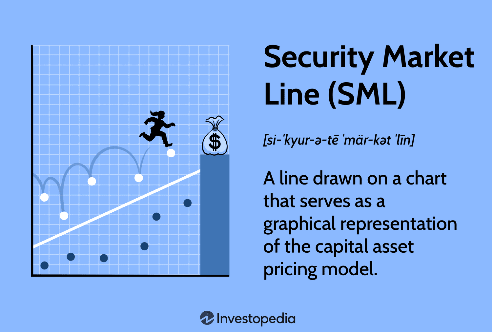

## Table of Contents

## What is the Security Market Line (SML)?

The Security Market Line (SML) is a line on a graph that shows the relationship between the risk of an investment and its expected return. It's used in finance to help investors see if an investment is a good deal. The risk is measured by something called "beta," which shows how much the investment's price moves compared to the overall market. If an investment's expected return is above the SML, it might be a good investment because it offers more return for the risk you're taking.

The SML starts from a point on the graph called the "risk-free rate," which is the return you can get from an investment with no risk, like a government bond. From there, the line slopes upwards, showing that as risk (beta) increases, so should the expected return. If an investment falls below the SML, it means the expected return isn't high enough for the risk involved, and it might not be a good investment. By comparing where an investment sits on the SML, investors can make better choices about where to put their money.

## How is the Security Market Line used in the Capital Asset Pricing Model (CAPM)?

The Security Market Line (SML) is a key part of the Capital Asset Pricing Model (CAPM). CAPM is a way to figure out how much return an investment should give you based on how risky it is. The SML is like a guide that helps you see if an investment is worth it. It shows a straight line on a graph where the bottom left corner starts at the risk-free rate, which is what you'd earn from a very safe investment like a government bond. As you move up and to the right along the line, the risk (measured by something called beta) goes up, and so does the expected return.

In CAPM, the SML helps investors decide if a stock or other investment is a good deal. If a stock's expected return is above the SML, it means the stock might be undervalued because it's offering more return for the risk you're taking. On the other hand, if the expected return is below the SML, the stock might be overvalued because it's not giving enough return for the risk. By using the SML, investors can compare different investments and choose the ones that offer the best balance of risk and return according to CAPM.

## What does the slope of the SML represent?

The slope of the Security Market Line (SML) is important because it shows how much more return you can expect for taking on more risk. In simple terms, the slope tells you the extra reward you get for each bit of extra risk you're willing to take. This is called the "market risk premium." If the slope is steep, it means you can get a lot more return for a little bit more risk. If it's flat, you don't get much more return even if you take on more risk.

This slope is calculated by subtracting the risk-free rate from the expected return of the market and then dividing by the market's beta, which is usually set to 1. So, if the risk-free rate is 2% and the market's expected return is 8%, the slope (or market risk premium) would be 6% (8% - 2%). This means for every unit of risk (beta) you take on, you should expect an extra 6% return. The slope of the SML helps investors understand if the extra risk they are taking is worth the potential reward.

## How can the SML help in determining if a security is undervalued or overvalued?

The Security Market Line (SML) helps investors figure out if a security is a good deal by showing where it should sit on a graph based on its risk and expected return. If a security's expected return is higher than what the SML suggests for its level of risk, it might be undervalued. This means the security is giving you more return than you'd expect for the risk you're taking, which could be a good investment opportunity. 

On the other hand, if a security's expected return is lower than what the SML suggests for its risk, it might be overvalued. This means you're not getting enough return for the risk you're taking, and it might not be a good investment. By comparing a security's actual expected return to where it should be on the SML, investors can make smarter choices about whether to buy, hold, or sell the security.

## What is the significance of the risk-free rate on the SML?

The risk-free rate is a really important part of the Security Market Line (SML). It's the starting point on the left side of the SML graph. This rate is what you can earn from super safe investments, like government bonds. It's called "risk-free" because these investments are very unlikely to lose money. The risk-free rate sets the baseline for all other investments. If an investment can't beat the risk-free rate, there's no point in taking the risk.

As you move up and to the right on the SML, you're looking at investments that are riskier than the risk-free rate. The SML shows how much more return you should expect for taking on more risk. The difference between the risk-free rate and the expected return of the market is called the market risk premium. This helps investors see if the extra risk they're taking is worth it. If an investment's expected return is too close to the risk-free rate for the amount of risk involved, it might not be a good deal.

## How does beta affect the position of a security on the SML?

Beta is a measure of how much a security's price moves compared to the overall market. It's a number that shows how risky a security is. On the Security Market Line (SML), beta decides where a security sits on the graph. If a security has a high beta, it means it's more risky than the market, so it should be higher up on the SML. That's because investors expect more return for taking on more risk. If a security has a low beta, it's less risky, so it will be lower down on the SML.

The SML starts at the risk-free rate, which is what you'd earn from a very safe investment like a government bond. From there, as beta increases, the expected return goes up too. This makes a straight line going up and to the right. If a security's expected return matches what the SML says it should be for its beta, it's right on the line. But if the expected return is higher than the SML suggests, the security might be undervalued, which could be a good deal. If it's lower, the security might be overvalued, and not such a good investment.

## What happens to the SML when market risk premiums change?

When the market risk premium changes, it affects the whole Security Market Line (SML). The market risk premium is the extra return you get for taking on more risk than a super safe investment like a government bond. If the market risk premium goes up, it means investors want more reward for taking on risk. This makes the SML steeper because the expected returns for all securities go up as the risk (beta) increases. If the market risk premium goes down, it means investors are okay with less reward for the same amount of risk, so the SML gets less steep.

Imagine the SML as a line on a graph. The left side starts at the risk-free rate, which stays the same no matter what happens to the market risk premium. But as you move to the right on the graph, the line's slope changes with the market risk premium. A steeper SML means that for the same amount of risk, you expect a higher return. A flatter SML means you expect less return for that risk. So, changes in the market risk premium can really change how investors see the value of different investments.

## Can the SML be used to assess the performance of a portfolio?

Yes, the Security Market Line (SML) can be used to assess the performance of a portfolio. By plotting each security in the portfolio on the SML, you can see if the expected return of the whole portfolio is in line with the risk it's taking. If the portfolio's expected return is above the SML, it means the portfolio might be doing better than expected for the level of risk. This could mean the portfolio is undervalued and a good investment. On the other hand, if the portfolio's expected return is below the SML, it might be doing worse than expected for the risk, suggesting it could be overvalued and not a good investment.

The SML helps investors understand if the risk they are taking with their portfolio is worth it. If the portfolio's actual return is higher than what the SML predicts for its level of risk, it's performing well. But if the return is lower than what the SML suggests, it's not doing as well as it should. By comparing the portfolio's position on the SML, investors can decide if they need to adjust their investments to get a better balance of risk and return.

## How does the SML relate to the concept of systematic and unsystematic risk?

The Security Market Line (SML) helps investors understand how much return they should expect for the risk they take. Risk is split into two types: systematic risk and unsystematic risk. Systematic risk is the risk that affects the whole market, like economic changes or [interest rate](/wiki/interest-rate-trading-strategies) shifts. This risk can't be gotten rid of by diversifying your investments. The SML focuses on this type of risk, which is measured by something called beta. Beta shows how much a security's price moves compared to the market. If a security has a high beta, it means it's more affected by market changes and is riskier.

Unsystematic risk, on the other hand, is the risk that's specific to a single company or industry. This could be things like a company's management problems or a new competitor entering the market. This type of risk can be reduced by spreading your investments across different companies and industries. The SML doesn't directly account for unsystematic risk because it's assumed that investors can get rid of this risk by having a well-diversified portfolio. So, when you look at the SML, you're really looking at how much return you should expect for the systematic risk you can't avoid.

## What are the limitations of using the SML for investment decisions?

The Security Market Line (SML) is a helpful tool, but it has some limitations that investors should know about. One big problem is that it relies on estimates of future returns and beta, which can be hard to predict accurately. If the guesses about the future are wrong, the SML might not give the right advice. Also, the SML assumes that all investors have the same view on risk and return, which isn't true in the real world. People have different ideas about what's risky and what's not, so the SML might not work the same for everyone.

Another issue is that the SML only looks at systematic risk, which is the risk that affects the whole market. It doesn't consider unsystematic risk, which is the risk that's specific to a single company or industry. If an investor doesn't have a well-diversified portfolio, the SML might not give a full picture of the risk involved. Plus, the SML assumes that markets are always efficient, meaning all information is already included in stock prices. But sometimes markets can be wrong or slow to react to new information, which can make the SML less useful for making investment choices.

## How do changes in economic conditions affect the SML?

Changes in economic conditions can really shake up the Security Market Line (SML). When the economy is doing well, people might feel more confident and be willing to take on more risk. This can push up the expected returns for the whole market, making the SML steeper. On the other hand, if the economy is struggling, people might want safer investments and expect less return for taking on risk. This can make the SML flatter because the market risk premium, which is the extra return you get for taking on risk, goes down.

Also, changes in things like interest rates can move the SML around. If interest rates go up, the risk-free rate, which is the starting point of the SML, goes up too. This shifts the whole line up, meaning investors expect higher returns even for safe investments. If interest rates drop, the risk-free rate goes down, and the SML shifts down. So, economic conditions can change how steep the SML is and where it starts, which affects how investors see the value of different investments.

## How can advanced investors use the SML in conjunction with other financial models to optimize their investment strategies?

Advanced investors can use the Security Market Line (SML) along with other financial models to make their investment strategies even better. One way to do this is by using the SML with the Capital Asset Pricing Model (CAPM). The SML helps investors see if a stock or a portfolio is a good deal by comparing its expected return to the risk it takes. But, CAPM goes a step further by helping calculate the expected return of an asset based on its beta, which is a measure of how much the asset's price moves with the market. By using both together, investors can figure out if their investments are giving them enough return for the risk they're taking and adjust their portfolios to get the best balance of risk and return.

Another useful model to use with the SML is the Arbitrage Pricing Theory (APT). APT looks at how different economic factors, like inflation or interest rates, affect the returns of an investment. While the SML focuses on the overall market risk, APT can help investors understand how other risks might impact their investments. By combining these models, advanced investors can see a fuller picture of the risks and returns. This can help them pick investments that not only fit well with the SML but also take into account other economic factors, making their strategies more robust and tailored to their specific needs and market conditions.

## What is the Security Market Line and how can it be understood?

The Security Market Line (SML) is a graphical representation that showcases the expected return of an asset based on its systematic risk, commonly measured by beta ($\beta$), relative to the market. The SML is a pivotal part of the Capital Asset Pricing Model (CAPM), serving as a tool for illustrating the trade-offs between systematic risk and expected return.

**Core Components of SML**

1. **Visual Representation:**
   - The SML graph takes the form of a straight line, where the x-axis denotes the asset's beta ($\beta$), symbolizing the level of systematic risk. The y-axis represents the expected return. 

2. **Positioning of SML:**
   - The line typically starts at the risk-free rate ($R_f$), which indicates the return of an investment considered free of risk, such as government bonds.
   - The market risk premium, calculated as the difference between the expected market return ($E(R_m)$) and the risk-free rate ($R_f$), is a crucial factor that determines the slope of the line. The formula for expected return ($E(R_i)$) on an asset is given by the CAPM equation:
$$
   E(R_i) = R_f + \beta_i \times (E(R_m) - R_f)

$$

   Here, $\beta_i$ is the beta of the individual asset.

3. **Investment Valuation:**
   - Assets plotted on the SML can be evaluated based on their positioning relative to the line. A security above the SML is considered undervalued, suggesting it offers a higher return for its risk. Conversely, a security below the line is deemed overvalued, indicating it provides lower returns for its risk level.

**Implications of SML**

Understanding the SML allows investors to make informed judgments about securities' risk-return profiles. By analyzing the SML, investors can assess whether assets are priced accurately with respect to their level of systematic risk. This capability is essential in constructing investment portfolios that aim to optimize the balance between risk exposure and potential returns, particularly by selecting investments with favorable positions on the SML.

## What is the role of SML in Financial Analysis?

The Security Market Line (SML) is a pivotal analytic tool in financial analysis, allowing analysts to identify whether securities are mispriced relative to the market risk. At its core, the SML provides a graphical representation that associates the expected return of an investment with its market risk, encapsulated by the beta coefficient (β). 

Securities situated above the SML are identified as undervalued. These securities offer a greater potential return for their level of systematic risk compared to the market, making them attractive options for investors looking for higher returns. This relationship can be expressed through the Capital Asset Pricing Model (CAPM) formula:

$$

E(R_i) = R_f + \beta_i (E(R_m) - R_f) 
$$

where $E(R_i)$ is the expected return of the investment, $R_f$ is the risk-free rate, $\beta_i$ represents the beta of the investment, and $E(R_m) - R_f$ is the market risk premium. Investments plotted above this line have a higher $E(R_i)$ than their calculated CAPM value, suggesting an opportunity for excess returns.

Conversely, securities below the SML are perceived as overvalued. These investments yield lower returns for their risk level compared to the market expectation, indicating potential weaknesses or overpriced conditions in those securities.

The SML is instrumental in portfolio management, assisting in aligning investment selections with an investor's risk tolerance and return expectations. By blending various securities, portfolio managers can construct a portfolio that remains optimal and consistent with the SML's risk-return criterion. This alignment ensures that the chosen investment opportunities offer returns appropriate for the predefined level of risk.

Moreover, the SML serves as a critical benchmark in financial decision-making. By evaluating the performance of assets relative to the SML, analysts and investors can determine whether a security's performance justifies its associated risks. This benchmarking process supports more informed financial decisions, guiding actions such as buying, holding, or selling assets.

In sum, the SML provides a framework that assists financial analysts in evaluating investment opportunities, managing portfolios effectively, and making decisions rooted in a coherent risk-return analysis. Employing the SML, analysts and investors can better navigate the intricate landscape of financial markets, enhancing their capacity to achieve desired financial outcomes.

## References & Further Reading

[1]: Fama, E.F., & French, K.R. (2004). ["The Capital Asset Pricing Model: Theory and Evidence."](https://www.aeaweb.org/articles?id=10.1257/0895330042162430) Journal of Economic Perspectives, 18(3), 25-46.

[2]: Sharpe, W.F. (1964). ["Capital Asset Prices: A Theory of Market Equilibrium under Conditions of Risk."](https://onlinelibrary.wiley.com/doi/full/10.1111/j.1540-6261.1964.tb02865.x) The Journal of Finance, 19(3), 425-442.

[3]: Black, F., Jensen, M.C., & Scholes, M. (1972). ["The Capital Asset Pricing Model: Some Empirical Tests."](https://papers.ssrn.com/sol3/papers.cfm?abstract_id=908569) Studies in the Theory of Capital Markets.

[4]: Ross, S.A. (1976). ["The Arbitrage Theory of Capital Asset Pricing."](https://www.sciencedirect.com/science/article/pii/0022053176900466) Journal of Economic Theory, 13(3), 341-360.

[5]: Malkiel, B.G. (2003). ["A Random Walk Down Wall Street."](https://yourknowledgedigest.org/wp-content/uploads/2020/04/a-random-walk-down-wall-street.pdf) W.W. Norton & Company.

[6]: Bodie, Z., Kane, A., & Marcus, A.J. (2018). ["Investments."](https://www.amazon.com/Investments-Zvi-Bodie/dp/1260013839) McGraw-Hill Education.

[7]: Fabozzi, F.J., Gupta, F., & Markowitz, H.M. (2002). ["The Legacy of Modern Portfolio Theory."](https://www.semanticscholar.org/paper/The-Legacy-of-Modern-Portfolio-Theory-Fabozzi-Gupta/6619eebc6957d7c101112a041942c4df61783616) The Journal of Investing, 11(3), 7-22.