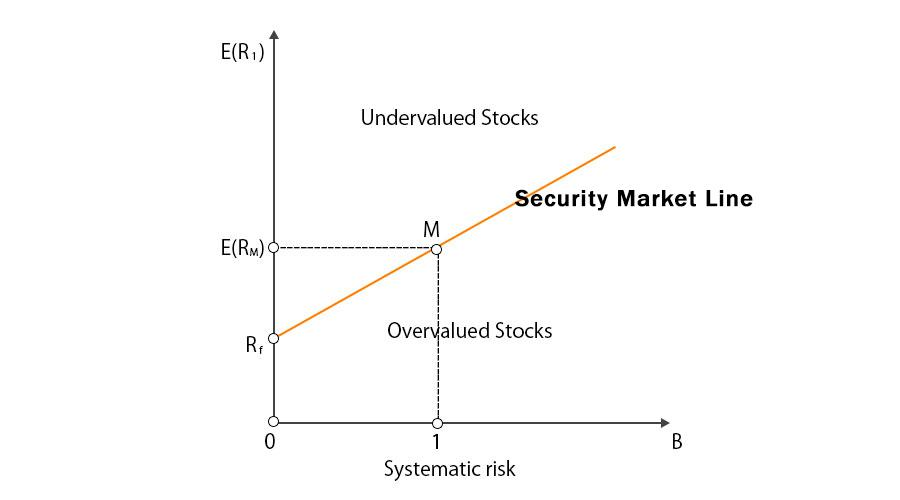

The financial markets offer an array of models designed to comprehend the intricate relationship between risk and return. Among these models, the Security Market Line (SML) holds a significant place as part of the Capital Asset Pricing Model (CAPM), which fundamentally alters how investors assess securities. The CAPM framework posits that the expected return of a security is determined by its systematic risk, measured by beta ($\beta$), in relation to the market as a whole. The Security Market Line graphically represents this relationship, providing a linear depiction where the risk-free rate intersects with the market risk premium to form a basis for evaluation.

Understanding the SML enables investors and analysts to discern whether asset prices are aligned with their inherent risks. This article focuses on imparting knowledge about the SML, revealing its relevance in financial analysis and its integration into algorithmic trading systems. By dissecting its core principles, readers will gain insights into how the SML can guide informed investment strategies and enrich market analysis.



The discussion will cover how SML can be applied in real-world scenarios, from asset valuation to strategic portfolio management. The article will also explore the algorithmic implications of the SML, as its integration into trading algorithms can facilitate the identification of arbitrage opportunities based on deviations from expected risk-return equilibria.

The goal is to equip readers with a profound understanding of the Security Market Line, illuminating its crucial function in assessing the risk-return trade-off. This knowledge is particularly relevant in algorithmic trading, where precision and efficiency in trade execution are paramount. By mastering the concepts associated with the SML, investors can position themselves for success in today's dynamic financial environment.

## Table of Contents

## Understanding the Security Market Line

The Security Market Line (SML) is a graphical representation that showcases the expected return of an asset based on its systematic risk, commonly measured by beta ($\beta$), relative to the market. The SML is a pivotal part of the Capital Asset Pricing Model (CAPM), serving as a tool for illustrating the trade-offs between systematic risk and expected return.

**Core Components of SML**

1. **Visual Representation:**
   - The SML graph takes the form of a straight line, where the x-axis denotes the asset's beta ($\beta$), symbolizing the level of systematic risk. The y-axis represents the expected return. 

2. **Positioning of SML:**
   - The line typically starts at the risk-free rate ($R_f$), which indicates the return of an investment considered free of risk, such as government bonds.
   - The market risk premium, calculated as the difference between the expected market return ($E(R_m)$) and the risk-free rate ($R_f$), is a crucial factor that determines the slope of the line. The formula for expected return ($E(R_i)$) on an asset is given by the CAPM equation:
$$
   E(R_i) = R_f + \beta_i \times (E(R_m) - R_f)

$$

   Here, $\beta_i$ is the beta of the individual asset.

3. **Investment Valuation:**
   - Assets plotted on the SML can be evaluated based on their positioning relative to the line. A security above the SML is considered undervalued, suggesting it offers a higher return for its risk. Conversely, a security below the line is deemed overvalued, indicating it provides lower returns for its risk level.

**Implications of SML**

Understanding the SML allows investors to make informed judgments about securities' risk-return profiles. By analyzing the SML, investors can assess whether assets are priced accurately with respect to their level of systematic risk. This capability is essential in constructing investment portfolios that aim to optimize the balance between risk exposure and potential returns, particularly by selecting investments with favorable positions on the SML.

## SML in Financial Analysis

The Security Market Line (SML) is a pivotal analytic tool in financial analysis, allowing analysts to identify whether securities are mispriced relative to the market risk. At its core, the SML provides a graphical representation that associates the expected return of an investment with its market risk, encapsulated by the beta coefficient (β). 

Securities situated above the SML are identified as undervalued. These securities offer a greater potential return for their level of systematic risk compared to the market, making them attractive options for investors looking for higher returns. This relationship can be expressed through the Capital Asset Pricing Model (CAPM) formula:

$$

E(R_i) = R_f + \beta_i (E(R_m) - R_f) 
$$

where $E(R_i)$ is the expected return of the investment, $R_f$ is the risk-free rate, $\beta_i$ represents the beta of the investment, and $E(R_m) - R_f$ is the market risk premium. Investments plotted above this line have a higher $E(R_i)$ than their calculated CAPM value, suggesting an opportunity for excess returns.

Conversely, securities below the SML are perceived as overvalued. These investments yield lower returns for their risk level compared to the market expectation, indicating potential weaknesses or overpriced conditions in those securities.

The SML is instrumental in portfolio management, assisting in aligning investment selections with an investor's risk tolerance and return expectations. By blending various securities, portfolio managers can construct a portfolio that remains optimal and consistent with the SML's risk-return criterion. This alignment ensures that the chosen investment opportunities offer returns appropriate for the predefined level of risk.

Moreover, the SML serves as a critical benchmark in financial decision-making. By evaluating the performance of assets relative to the SML, analysts and investors can determine whether a security's performance justifies its associated risks. This benchmarking process supports more informed financial decisions, guiding actions such as buying, holding, or selling assets.

In sum, the SML provides a framework that assists financial analysts in evaluating investment opportunities, managing portfolios effectively, and making decisions rooted in a coherent risk-return analysis. Employing the SML, analysts and investors can better navigate the intricate landscape of financial markets, enhancing their capacity to achieve desired financial outcomes.

## Algorithmic Trading and SML

Algorithmic trading relies strongly on the integration of mathematical and statistical models to make swift and precise trading decisions, and the Security Market Line (SML) is crucial in this context. The SML aids in detecting [arbitrage](/wiki/arbitrage) opportunities by identifying deviations from the standard risk-return relationship predicted by the Capital Asset Pricing Model (CAPM). When assets are not aligned with the SML, they indicate potential mispricing—assets priced above the SML are undervalued, offering higher returns for their risk, while those below are overvalued. Such insights enable algorithmic systems to exploit discrepancies, facilitating profitable trades.

Automated trading systems can dynamically adjust portfolios as market conditions evolve, responding swiftly to changes in risk premiums and interest rates that influence the SML. By continuously monitoring the market and adjusting investment allocations based on SML insights, these systems ensure that portfolios are optimized for current risk-return conditions.

Using SML-driven algorithms, traders can precisely identify investment opportunities that align with their risk management strategies. By quantifying expected returns against an asset's systematic risk (beta), these algorithms ensure that traders select investments offering superior returns for well-defined risk levels. For instance, an algorithm might utilize a simple Python function like the following to calculate expected returns based on SML:

```python
def expected_return(risk_free_rate, beta, market_return):
    return risk_free_rate + beta * (market_return - risk_free_rate)

# Example
risk_free_rate = 0.03  # 3% risk-free rate
market_return = 0.08  # 8% expected market return
beta = 1.2  # example beta

print(expected_return(risk_free_rate, beta, market_return))
```

This mathematical representation underpins algorithmic strategies, enhancing the precision of trade execution and portfolio balancing decisions. By reinforcing the alignment of investment choices with the anticipated risk-return framework, the incorporation of the SML in trading algorithms not only bolsters profit potential but also improves overall market efficiency.

In summary, the integration of SML principles into [algorithmic trading](/wiki/algorithmic-trading) empowers systems to exploit market inefficiencies, offering a robust framework for optimizing returns while effectively managing risk. This strategic application of SML serves as a keystone for sophisticated trading models, ensuring informed and agile decision-making in the ever-evolving financial markets.

## Real-World Applications of SML

The Security Market Line (SML) plays a crucial role in practical financial applications, especially in asset valuation. By illustrating the relationship between the expected return of an asset and its beta, the SML helps investors determine whether securities are fairly priced. If a security's expected return lies above the SML, it suggests the asset is undervalued, offering a higher return for its risk level. Conversely, if a security's return falls below the SML, it implies overvaluation, providing lower returns than expected for the associated risk.

Portfolio managers often leverage the insights from the SML to design diversified portfolios aligned with clients' risk preferences and return expectations. By comparing the risk-return profiles of various assets against the SML, managers can select investments that optimize the trade-off between risk and expected returns, leading to more robust portfolio construction.

Beyond investment strategies, the SML informs broader strategic business decisions, including capital budgeting and risk management. In capital budgeting, the SML helps evaluate potential projects by assessing whether the anticipated returns adequately compensate for their inherent risks. By setting a benchmark for the cost of capital, companies can better allocate resources and prioritize projects that align with their risk-return profiles.

Financial advisors use the SML as an educational tool to guide clients in understanding the potential returns and risks associated with their investments. By illustrating how different assets perform relative to the market portfolio, advisors can help clients make informed decisions that match their financial goals and risk tolerance levels. This clarity is particularly beneficial in volatile or uncertain market conditions, where understanding the SML can guide investors toward effective risk management strategies.

Overall, the SML remains an invaluable framework for navigating today's financial markets. It aids individual and institutional investors in making informed, data-driven decisions, ensuring that asset selections and portfolio compositions reflect both current market conditions and future return expectations. This foundational tool continues to support investor success by providing a clear, systematic approach to evaluating risk and return.

## Conclusion

The Security Market Line (SML) serves as an essential framework for assessing and comprehending the intricate dynamics between risk and return in financial markets. By presenting a linear relationship between an asset's expected return and its systemic risk, SML facilitates the development of pragmatic investment strategies. In both financial analysis and algorithmic trading, the SML allows investors to make informed decisions by providing a benchmark against which the risk-adjusted performance of securities can be evaluated. This positions investors to balance risk and reward more effectively, ensuring that investment choices align with financial goals and risk tolerance.

As financial markets continue to evolve, the significance of the SML is likely to increase. It plays a critical role in strategic financial planning, enabling investors and traders to anticipate and react to market changes swiftly and effectively. The adaptability of the SML in evolving markets underscores its potential for expanded application in strategic decision-making and dynamic portfolio management.

Mastering the principles underpinning the SML is crucial for success in today's complex investment landscape. The ability to leverage the insights provided by the SML equips investors with the tools to optimize their portfolios in alignment with market expectations, maximizing potential returns relative to risk. The SML thus remains a pivotal instrument in guiding financial decisions, offering a structured approach to navigating the uncertainties of market dynamics.

## References & Further Reading

[1]: Fama, E.F., & French, K.R. (2004). ["The Capital Asset Pricing Model: Theory and Evidence."](https://www.aeaweb.org/articles?id=10.1257/0895330042162430) Journal of Economic Perspectives, 18(3), 25-46.

[2]: Sharpe, W.F. (1964). ["Capital Asset Prices: A Theory of Market Equilibrium under Conditions of Risk."](https://onlinelibrary.wiley.com/doi/full/10.1111/j.1540-6261.1964.tb02865.x) The Journal of Finance, 19(3), 425-442.

[3]: Black, F., Jensen, M.C., & Scholes, M. (1972). ["The Capital Asset Pricing Model: Some Empirical Tests."](https://papers.ssrn.com/sol3/papers.cfm?abstract_id=908569) Studies in the Theory of Capital Markets.

[4]: Ross, S.A. (1976). ["The Arbitrage Theory of Capital Asset Pricing."](https://www.sciencedirect.com/science/article/pii/0022053176900466) Journal of Economic Theory, 13(3), 341-360.

[5]: Malkiel, B.G. (2003). ["A Random Walk Down Wall Street."](https://yourknowledgedigest.org/wp-content/uploads/2020/04/a-random-walk-down-wall-street.pdf) W.W. Norton & Company.

[6]: Bodie, Z., Kane, A., & Marcus, A.J. (2018). ["Investments."](https://www.amazon.com/Investments-Zvi-Bodie/dp/1260013839) McGraw-Hill Education.

[7]: Fabozzi, F.J., Gupta, F., & Markowitz, H.M. (2002). ["The Legacy of Modern Portfolio Theory."](https://www.semanticscholar.org/paper/The-Legacy-of-Modern-Portfolio-Theory-Fabozzi-Gupta/6619eebc6957d7c101112a041942c4df61783616) The Journal of Investing, 11(3), 7-22.