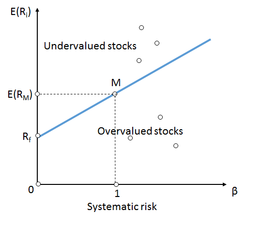

## Table of Contents

## What is the Security Market Line (SML)?

The Security Market Line (SML) is a line on a graph that shows the relationship between the risk of an investment and its expected return. It is used in the Capital Asset Pricing Model (CAPM) to help investors understand how much return they should expect for taking on a certain level of risk. The risk is measured by something called "beta," which tells you how much the price of an investment might go up or down compared to the overall market.

The SML starts at a point where the risk is zero, and this point represents the risk-free rate of return, like what you might get from a government bond. As you move along the line, the risk (beta) increases, and so does the expected return. If an investment is plotted above the SML, it means it might be a good deal because its expected return is higher than what the market suggests for its level of risk. If it's below the line, it might not be worth the risk because the expected return is lower than what the market suggests.

## How does the Security Market Line relate to the Capital Asset Pricing Model (CAPM)?

The Security Market Line (SML) is a key part of the Capital Asset Pricing Model (CAPM). CAPM is a way to figure out how much return an investment should give you based on how risky it is. The SML is a line on a graph that shows this relationship. It starts at the risk-free rate, which is the return you get from super safe investments like government bonds. As you move along the SML, the risk (measured by something called "beta") goes up, and so does the expected return.

The SML helps you see if an investment is a good deal. If an investment is above the SML, it means you might get more return than the risk you're taking, which is good. If it's below the line, the return might not be worth the risk. So, the SML is like a guide that CAPM uses to help you decide if an investment is worth it based on its risk and expected return.

## What does the slope of the SML represent?

The slope of the Security Market Line (SML) tells you something important about the market. It shows how much more return you can expect for taking on more risk. Think of it like climbing a hill: the steeper the hill, the harder it is to climb, but the higher you go, the better the view. In the same way, a steeper SML means you get a bigger reward for taking on more risk.

This slope is also known as the market risk premium. It's the difference between what you can earn from a totally safe investment, like a government bond, and what you might earn from the whole market. If the market risk premium is high, it means investors want a lot more money to take on extra risk. If it's low, they're okay with less extra return for that risk. So, the slope of the SML helps you understand what the market thinks about risk and reward right now.

## How is the expected return of a security calculated using the SML?

To figure out the expected return of a security using the Security Market Line (SML), you need to know two things: the risk-free rate and the security's beta. The risk-free rate is what you get from super safe investments like government bonds. Beta tells you how much the price of the security might go up or down compared to the whole market. Once you have these, you can use the SML formula to find the expected return. The formula is: Expected Return = Risk-Free Rate + (Beta x Market Risk Premium). The market risk premium is the extra return you get for taking on the risk of the market.

Let's break it down with an example. Imagine the risk-free rate is 2%, and the market risk premium is 5%. If you have a security with a beta of 1.2, you can plug these numbers into the formula. So, the expected return would be 2% + (1.2 x 5%) = 2% + 6% = 8%. This means you should expect to get an 8% return on this security, given its risk level. If the security's actual expected return is higher than 8%, it might be a good deal because it's giving you more return for the risk you're taking. If it's lower, you might want to think twice before investing.

## What is the significance of the risk-free rate on the SML?

The risk-free rate is super important on the Security Market Line (SML) because it's the starting point. It's like the base camp before you start climbing a mountain. The risk-free rate is the return you get from super safe investments, like government bonds. On the SML graph, this rate is where the line touches the y-axis, showing what you can earn without taking any risk. It sets the stage for figuring out how much more return you should expect if you decide to take on some risk.

The risk-free rate also helps you understand the whole idea of risk and reward. When you look at the SML, you can see how much extra return you get for each bit of risk you take on, and this all starts from the risk-free rate. If the risk-free rate goes up or down, it changes the whole line. A higher risk-free rate means the whole line moves up, so you need more return from risky investments to make them worth it. A lower risk-free rate means the line moves down, making risky investments look more attractive. So, the risk-free rate is a big deal because it shapes how we think about risk and return in the market.

## How can the SML be used to identify if a security is undervalued or overvalued?

The Security Market Line (SML) helps you figure out if a security is a good deal or not by showing you where it should be based on its risk. You plot a security on the SML graph using its beta, which tells you how risky it is compared to the whole market. If the security's expected return is higher than where the SML says it should be, that means it's above the line. This suggests the security might be undervalued because you're getting more return for the risk you're taking than what the market thinks you should get.

On the other hand, if a security's expected return is lower than where the SML says it should be, it's below the line. This means the security might be overvalued because you're not getting enough return for the risk you're taking. By comparing the actual expected return of a security to where it should be on the SML, you can decide if it's a good investment or if you should look elsewhere.

## What factors can cause the SML to shift?

The Security Market Line (SML) can move around because of changes in the economy or what investors are feeling. One big thing that can make the SML shift is a change in the risk-free rate. If the risk-free rate goes up, the whole line moves up too. This means you need more return from risky investments to make them worth it. If the risk-free rate goes down, the line moves down, making risky investments look more attractive. Another thing that can shift the SML is the market risk premium, which is how much extra return you expect for taking on the risk of the market. If people start feeling more scared about the market, they might want a bigger reward for taking risks, so the market risk premium goes up and the SML gets steeper.

Also, changes in how much people want to take risks can make the SML shift. If everyone feels good about the economy and wants to take more risks, the market risk premium might go down, making the SML less steep. But if people are worried and don't want to take risks, the market risk premium goes up, making the SML steeper. So, the SML isn't just a fixed line; it moves around based on what's happening in the world and how people feel about investing.

## How does beta affect the position of a security on the SML?

Beta is a number that tells you how much a security's price might go up or down compared to the whole market. If a security has a beta of 1, it moves just like the market. If it's more than 1, it's riskier and moves more than the market. If it's less than 1, it's less risky and doesn't move as much. When you plot a security on the Security Market Line (SML), you use its beta to find its spot on the line. The higher the beta, the further to the right on the SML the security will be, showing it's riskier and should give you a higher return.

The SML shows you what return you should expect for the risk you're taking. If a security's actual expected return is higher than where the SML says it should be for its beta, it's above the line. This means the security might be a good deal because you're getting more return for the risk. If the security's expected return is lower than where the SML says it should be, it's below the line. This means the security might not be worth the risk because you're not getting enough return. So, beta helps you see where a security should be on the SML and whether it's a good investment or not.

## Can you explain the difference between systematic and unsystematic risk in the context of the SML?

Systematic risk is the kind of risk that affects the whole market and can't be avoided by just [picking](/wiki/asset-class-picking) different investments. It's like the weather affecting everyone in a city. Things like big economic changes, interest rates going up or down, or even big world events can cause systematic risk. On the Security Market Line (SML), systematic risk is measured by something called beta. The higher the beta, the more sensitive the security is to these market-wide changes. So, if a security has a high beta, it will be further to the right on the SML, showing that it's riskier and should give you a higher return to make up for that risk.

Unsystematic risk, on the other hand, is the risk that's specific to one company or industry. It's like a problem with your car that doesn't affect anyone else's car. Things like a company's management making bad decisions, a new product failing, or a factory burning down can cause unsystematic risk. The good news is that you can reduce unsystematic risk by spreading your investments across different companies and industries. This is called diversification. The SML doesn't show unsystematic risk because it focuses on the risk you can't get rid of, which is the systematic risk. So, when you look at the SML, you're seeing how much return you should expect for the risks that affect the whole market, not just one company.

## How do changes in market risk premium impact the SML?

The market risk premium is the extra return you expect for taking on the risk of the whole market. When the market risk premium changes, it makes the Security Market Line (SML) move too. If the market risk premium goes up, it means people want more money to take on the same amount of risk. This makes the SML steeper because for each level of risk, you now expect a higher return. If the market risk premium goes down, it means people are okay with less extra return for the same risk, so the SML becomes less steep.

Changes in the market risk premium can happen because of how people feel about the economy. If everyone is feeling good and not worried about taking risks, the market risk premium might go down, making the SML less steep. But if people are scared and want a bigger reward for taking risks, the market risk premium goes up, making the SML steeper. So, the SML isn't just a fixed line; it moves around based on what's happening in the world and how people feel about investing.

## What are the limitations of using the SML for investment decisions?

Using the Security Market Line (SML) for investment decisions has some problems. One big issue is that it assumes everyone can borrow and lend money at the same risk-free rate, which isn't true in real life. People and companies often have to pay different rates depending on their credit. Also, the SML depends a lot on the idea of beta, which measures how much a security moves with the market. But figuring out the right beta for a security can be tricky because it can change over time and might not be the same for everyone.

Another problem is that the SML doesn't take into account things like taxes or how easy it is to buy or sell a security. These things can make a big difference in how much money you actually make from an investment. Plus, the SML is based on what people expect the market to do in the future, but those expectations can be wrong. If everyone's guesses about the future are off, the SML won't be very helpful for making smart investment choices.

## How can investors use the SML to optimize their portfolio's risk-return profile?

Investors can use the Security Market Line (SML) to see if the investments in their portfolio are giving them enough return for the risk they're taking. By plotting each investment on the SML based on its beta, which tells you how risky it is compared to the whole market, investors can see if an investment is above or below the line. If an investment is above the SML, it means it's giving a higher return than expected for its level of risk, suggesting it might be a good deal. If it's below the line, the return might not be worth the risk, and the investor might want to think about selling it or finding a better investment.

To optimize their portfolio's risk-return profile, investors can use the SML to make changes. If they find investments that are below the SML, they might want to replace them with ones that are above the line to get a better return for the same amount of risk. They can also look at the overall risk of their portfolio by considering the average beta of all their investments. If they want to take on more risk for a chance at higher returns, they can add investments with higher betas. If they want to be safer, they can add investments with lower betas. By using the SML, investors can keep adjusting their portfolio to make sure they're getting the best possible return for the level of risk they're comfortable with.

## What is the Understanding of the Security Market Line?

The Security Market Line (SML) is a visual representation used in financial analysis to depict the relationship between the expected return of an asset and its systematic risk, commonly measured by the beta (β) coefficient. As a foundational element of the Capital Asset Pricing Model (CAPM), the SML serves as a benchmark for evaluating whether a given security provides adequate compensation for its inherent risk relative to the market as a whole.

At its core, the SML graphically plots the expected return of securities against their respective betas, illustrating a linear relationship. The key components of the SML include the risk-free rate (Rf), the expected market return (E(Rm)), and the individual asset's beta (βi). The equation governing the SML is the CAPM formula, expressed as:

$$
E(R_i) = R_f + \beta_i \times (E(R_m) - R_f)
$$

In this equation, $E(R_i)$ represents the expected return on investment for a specific asset. The risk-free rate (Rf) is typically associated with government bonds, reflecting the return on a theoretically risk-free asset. The market risk premium, $(E(R_m) - R_f)$, denotes the additional return expected from investing in a risky market portfolio over the risk-free rate. The beta coefficient, βi, measures the sensitivity of the asset's returns to movements in the overall market, indicating its systematic risk.

The linear relationship articulated by the SML is of significant importance in asset pricing. It implies that an asset with a higher beta, thus higher systematic risk, should yield a proportionally higher expected return to compensate investors for taking on additional risk. This principle provides a framework for determining whether assets are fairly valued. If an asset's expected return is above the SML, it is considered undervalued, as it offers a higher return for its level of risk. Conversely, if an asset's expected return falls below the SML, it may be deemed overvalued.

Ultimately, the SML's ability to relate risk and return in a straightforward linear model makes it a powerful tool in financial analysis, allowing for benchmark assessments of securities and informing investment decisions across a wide range of applications.

## What is the role of SML in Financial Analysis?

The Security Market Line (SML) serves as a fundamental tool for analysts in determining whether securities are fairly priced relative to the market. The evaluation process involves plotting individual securities on the SML, which graphically represents the relationship between the expected return of a security and its systematic risk, quantified by beta (β). 

To assess whether a security is undervalued or overvalued, analysts compare its position against the SML. A security is considered fairly priced if it lies on the SML. If it lies above the SML, the security is undervalued, as it offers a higher expected return for its level of risk than the market suggests is appropriate. Conversely, if a security falls below the SML, it is deemed overvalued, given that it offers a lower expected return than justified by its risk level. This evaluation aids investors in identifying potential investment opportunities and risks, guiding buy or sell decisions.

Moreover, the SML is instrumental in portfolio management, assisting managers in aligning their investments with expected returns adjusted for risk. By using the SML, portfolio managers can construct optimized portfolios that aim to maximize returns for a given level of risk. This involves selecting a mix of securities that collectively lie on or above the SML, thereby ensuring that the portfolio's expected return is in alignment with its systematic risk.

The SML is derived from the Capital Asset Pricing Model (CAPM), expressed as:

$$
E(R_i) = R_f + \beta_i(E(R_m) - R_f)
$$

where $E(R_i)$ is the expected return of the security, $R_f$ is the risk-free rate, $\beta_i$ is the beta of the security, and $E(R_m)$ is the expected market return. This formula provides the basis for assessing the required rate of return for securities considering their systemic risk.

Portfolio managers and analysts use this relationship to ensure that portfolios are structured optimally, offering expected returns that commensurate with their risk levels. By continuously monitoring and adjusting portfolios based on the SML, it becomes possible to maintain an appropriate balance between risk and return, thereby enhancing portfolio performance and managing risk exposure effectively.

## What is the relationship between Algorithmic Trading and the SML?

The integration of the Security Market Line (SML) into [algorithmic trading](/wiki/algorithmic-trading) systems offers a framework for identifying [arbitrage](/wiki/arbitrage) opportunities by exploiting asset mispricing. Algorithmic trading, characterized by using automated systems for making trading decisions, benefits significantly from the systematic evaluation of risk-return profiles that the SML provides.

The SML, derived from the Capital Asset Pricing Model (CAPM), expresses the expected return of an asset as a function of its systematic risk, or beta. This relationship can be mathematically represented as:

$$
E(R_i) = R_f + \beta_i (E(R_m) - R_f)
$$

Where:
- $E(R_i)$ is the expected return on the investment.
- $R_f$ is the risk-free rate.
- $\beta_i$ is the beta of the investment.
- $E(R_m)$ is the expected market return.

In the context of algorithmic trading, the SML is utilized to gauge whether assets are mispriced by comparing their expected returns, as predicted by the SML, against their actual observed returns. If an asset’s actual return is above the SML, it may be undervalued, indicating a potential buy opportunity. Conversely, if the return is below the SML, the asset could be overvalued, suggesting a sell opportunity.

Algorithms can systematically apply this principle across multiple securities in real-time, seeking to generate profit from discrepancies between calculated and market-expected returns. This approach allows traders to exploit fleeting price inefficiencies before they are corrected by market forces.

Consider a simple example in Python that demonstrates how to compute expected returns using the SML formula, providing a basic framework for algorithmic trading strategies:

```python
def calculate_expected_return(risk_free_rate, beta, market_return):
    """
    Calculate the expected return of an asset using the Security Market Line (SML) formula.

    Parameters:
    risk_free_rate (float): The risk-free rate of return
    beta (float): The beta of the asset
    market_return (float): The expected market return

    Returns:
    float: The expected return based on SML
    """
    expected_return = risk_free_rate + beta * (market_return - risk_free_rate)
    return expected_return

# Sample data
risk_free_rate = 0.03  # 3% risk-free rate
beta = 1.2            # Asset beta
market_return = 0.08  # 8% market return

# Calculate the SML expected return for the asset
expected_return = calculate_expected_return(risk_free_rate, beta, market_return)
print(f"Expected Return: {expected_return:.2%}")
```

This code snippet calculates the expected return for an asset given its beta, risk-free rate, and expected market return. Algorithmic traders can extend this example to analyze large datasets of securities, regularly scanning for mispricing and executing trades based on calculated disparities between the estimated expected return and the actual market return.

By leveraging the SML in this manner, algorithmic systems can improve the precision of investment decisions and enhance profitability through informed risk-return assessments.

## References & Further Reading

1. **Sharpe, W. F. (1964).** "Capital Asset Prices: A Theory of Market Equilibrium under Conditions of Risk." *The Journal of Finance*, 19(3), 425-442. This seminal paper by William Sharpe introduces the Capital Asset Pricing Model (CAPM) and lays the foundation for the Security Market Line (SML). The work is pivotal in understanding the relationship between risk and expected return in financial markets.

2. **Fama, E. F., & French, K. R. (2004).** "The Capital Asset Pricing Model: Theory and Evidence." *Journal of Economic Perspectives*, 18(3), 25-46. This paper provides an analysis of the CAPM, scrutinizing its theoretical assumptions and empirical validity. Fama and French's work is crucial for assessing the SML within the context of market efficiency and multifactor models.

3. **Bodie, Z., Kane, A., & Marcus, A. J. (2014).** *Investments*. McGraw-Hill Education. This textbook provides comprehensive coverage of investment principles, including detailed discussions on CAPM and the SML. It serves as an invaluable resource for understanding modern portfolio theory and risk-return dynamics.

4. **Hull, J. C. (2021).** *Options, Futures, and Other Derivatives*. Pearson. While primarily focused on derivatives, Hull's book also provides insights into financial market behaviors and the application of theoretical models like the SML in financial strategies and risk management.

5. **Fabozzi, F. J., & Markowitz, H. M. (2002).** *The Theory and Practice of Investment Management*. John Wiley & Sons. This book integrates investment management theory with practical applications, discussing how models like the SML assist in portfolio construction and evaluation.

6. **Python for Finance: Analyze Big Financial Data** by Yves Hilpisch (2014). This book serves as a guide for applying Python in financial analytics, covering algorithmic trading strategies that utilize CAPM and SML principles for investment decisions.

7. Online Resource: *Investopedia* provides numerous articles and tutorials that explore the fundamentals of SML, CAPM, and their applications in various financial contexts. It is a useful platform for both beginners and professionals seeking to deepen their understanding of these models.

8. Online Resource: *Khan Academy* offers educational videos and materials on finance and economics, including free lessons on the CAPM and SML. This resource is beneficial for learners looking for a straightforward explanation of complex financial concepts. 

These resources collectively offer an in-depth exploration of the Security Market Line, aiding both theoretical understanding and practical application in financial analysis and algorithmic trading.

