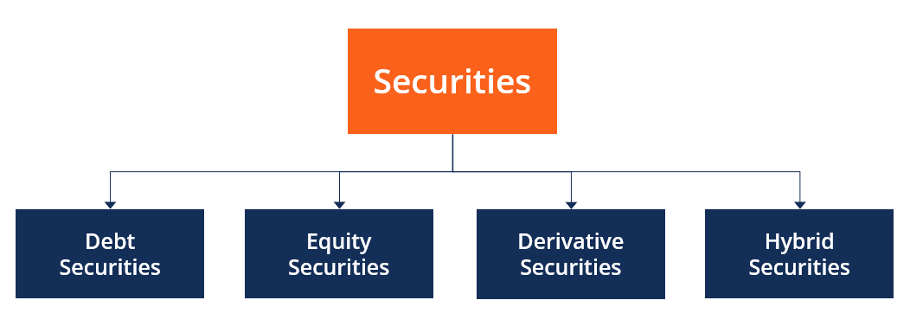

## Table of Contents

## What are corporate bonds?

Corporate bonds are a type of loan that companies take from investors. When a company needs money, it can issue bonds instead of borrowing from a bank. Investors buy these bonds, and in return, the company promises to pay back the money with interest over a certain period of time. This interest is usually paid regularly, like every six months, until the bond reaches its maturity date, when the company pays back the full amount.

These bonds are considered a safer investment than stocks because they offer a fixed return and the company is legally obligated to pay back the money. However, they are riskier than government bonds because companies can go bankrupt. If a company goes bankrupt, bondholders might not get all their money back. The risk level of a corporate bond depends on the financial health of the company issuing it. Ratings agencies like Moody's and Standard & Poor's evaluate this risk and give bonds a rating to help investors decide if they want to buy them.

## Why is security important in corporate bonds?

Security is important in corporate bonds because it helps protect the investors' money. When a company issues a bond, it's basically borrowing money from the investors. If the company has trouble paying back the money, having security means there's something valuable that the investors can take instead. This could be things like buildings, equipment, or other assets that the company owns. By having security, investors feel safer because they know they have a backup plan if the company can't pay them back.

Security also makes corporate bonds more attractive to investors. When bonds are backed by specific assets, they are seen as less risky. This can lead to lower interest rates for the company because investors are willing to accept less return for a safer investment. On the other hand, if a bond doesn't have any security, it's called an unsecured bond, and it's riskier. Investors might demand higher interest rates for these bonds to make up for the extra risk. So, having security can help a company borrow money at a lower cost and make their bonds more appealing to investors.

## What are the basic types of security for corporate bonds?

There are two main types of security for corporate bonds: secured bonds and unsecured bonds. Secured bonds are backed by specific assets of the company. This means if the company can't pay back the money, the investors can take the assets that were promised as security. These assets could be things like buildings, machines, or other valuable items the company owns. Because these bonds have something valuable backing them up, they are seen as safer for investors.

Unsecured bonds, on the other hand, don't have any specific assets backing them. If the company can't pay back the money, investors don't have anything specific they can take. These bonds are riskier because there's no safety net. But companies that are financially strong and trusted might still issue unsecured bonds because investors believe they will get their money back. Unsecured bonds usually offer higher interest rates to make up for the extra risk.

## How does a secured bond differ from an unsecured bond?

A secured bond is a type of bond that is backed by specific assets of the company. This means if the company can't pay back the money they borrowed from investors, the investors can take those assets instead. These assets could be things like buildings, machines, or other valuable things the company owns. Because there's something valuable backing the bond, it's seen as safer for investors. They feel more secure knowing they have a backup plan if the company can't pay them back.

An unsecured bond, on the other hand, doesn't have any specific assets backing it. If the company can't pay back the money, investors don't have anything specific they can take. This makes unsecured bonds riskier because there's no safety net. But companies that are financially strong and trusted might still issue unsecured bonds because investors believe they will get their money back. To make up for the extra risk, unsecured bonds usually offer higher interest rates to attract investors.

## What is a mortgage bond and how does it work?

A mortgage bond is a type of secured bond. This means it's backed by something valuable, like a house or a building. When a company issues a mortgage bond, it's promising to pay back the money it borrowed from investors. If the company can't pay back the money, the investors can take the house or building that was used as security.

Mortgage bonds are often used by companies that need a lot of money to buy or build things. For example, a company might use a mortgage bond to build a new factory. Investors buy these bonds because they feel safer knowing there's a valuable asset backing the bond. If the company does well, investors get their money back with interest. But if the company fails, the investors can take the asset and sell it to get their money back.

## Can you explain what a collateral trust bond is?

A collateral trust bond is another kind of secured bond. This means it's backed by something valuable, but instead of a building or a machine, it's backed by other investments. These investments could be stocks, bonds, or other things the company owns that can be sold to pay back the money if needed.

When a company wants to borrow money from investors, it can use a collateral trust bond. The company puts up these other investments as security. If the company can't pay back the money it borrowed, the investors can take these investments and sell them to get their money back. This makes investors feel safer because they know there's a backup plan if the company can't pay them back.

## What are equipment trust certificates and how are they used in corporate bonds?

Equipment trust certificates are a type of secured bond. They are used by companies that need money to buy equipment, like airplanes or trains. When a company issues these certificates, it promises to pay back the money it borrowed from investors. The equipment itself is used as security. This means if the company can't pay back the money, the investors can take the equipment instead.

These certificates are popular in industries where equipment is very expensive, like airlines or railroads. Investors like them because they feel safe knowing the equipment backs the bond. If the company does well, investors get their money back with interest. But if the company fails, the investors can take the equipment and sell it to get their money back.

## How do debentures function as a type of corporate bond security?

Debentures are a type of corporate bond that is not backed by any specific assets. This means if the company can't pay back the money it borrowed from investors, there's nothing specific the investors can take. Because debentures are riskier, they usually offer higher interest rates to attract investors. Companies that are financially strong and trusted often issue debentures because investors believe they will get their money back.

Even though debentures don't have specific assets backing them, they still have some protection for investors. If the company goes bankrupt, debenture holders are paid back before shareholders. This makes debentures a bit safer than stocks, but still riskier than secured bonds. Investors choose debentures when they believe in the company's ability to pay back the money, and they want a higher return for taking on more risk.

## What are the risks associated with different types of secured corporate bonds?

Secured corporate bonds, like mortgage bonds, collateral trust bonds, and equipment trust certificates, all have some risks. The main risk is that the company might not be able to pay back the money it borrowed. If this happens, the investors can take the assets that back the bond, like a building or equipment. But there's still a risk that these assets might not be worth enough to cover what the investors are owed. For example, if a company goes bankrupt and the value of the building or equipment has gone down, the investors might not get all their money back.

Another risk is that the assets backing the bond might be hard to sell quickly. If the company can't pay back the money and the investors need to sell the assets to get their money back, it might take a long time to find a buyer. This can be a problem if the investors need their money right away. Also, the costs of selling the assets, like legal fees or other expenses, can eat into the money the investors get back. So, even though secured bonds are safer than unsecured bonds, there are still risks that investors need to think about.

## How do covenants affect the security of corporate bonds?

Covenants are rules that companies have to follow when they issue bonds. These rules help protect the investors by making sure the company does not do things that could hurt its ability to pay back the money. For example, a covenant might say the company can't borrow more money or sell important assets without asking the bondholders first. By having these rules, covenants make the bonds safer for investors because they help keep the company financially stable.

Even though covenants make bonds safer, they don't make them completely safe. If the company breaks a covenant, it might have to pay back the money sooner than planned, or the bondholders might be able to take over the company. But if the company is already in big trouble, breaking a covenant might not help the bondholders much. So, while covenants add an extra layer of security, they can't fix all the problems if the company is doing very badly.

## What role does the seniority of a bond play in its security?

The seniority of a bond decides the order in which investors get paid back if the company can't pay its debts. Bonds that are higher up in seniority, called senior bonds, get paid back before bonds that are lower down, called junior bonds. This means if the company goes bankrupt, senior bondholders get their money back first. Because of this, senior bonds are seen as safer than junior bonds. Investors feel more secure knowing they will be paid back before others.

Even though senior bonds are safer, they still have risks. If the company goes bankrupt and doesn't have enough money or assets to pay everyone, even senior bondholders might not get all their money back. But because they are paid first, they have a better chance of getting more of their money back compared to junior bondholders. So, the seniority of a bond plays a big role in how secure it is, but it's not a guarantee that investors will get all their money back if the company fails.

## How can investors assess the security level of a corporate bond before investing?

Investors can assess the security level of a corporate bond by looking at several things. First, they should check if the bond is secured or unsecured. Secured bonds are backed by specific assets, like buildings or equipment, which means if the company can't pay back the money, investors can take these assets. Unsecured bonds, or debentures, don't have specific assets backing them, so they are riskier. Investors should also look at the seniority of the bond. Senior bonds get paid back before junior bonds if the company goes bankrupt, making them safer.

Another important thing to look at is the company's financial health. Investors can check the company's credit rating, which is given by agencies like Moody's or Standard & Poor's. A high credit rating means the company is less likely to have trouble paying back the money. Investors should also read the bond's covenants, which are rules the company must follow. These rules can make the bond safer by keeping the company financially stable. By looking at all these things, investors can get a good idea of how secure a corporate bond is before they decide to invest.

## References & Further Reading

[1]: ["Bond Markets, Analysis, and Strategies"](https://www.amazon.com/Bond-Markets-Analysis-Strategies-tenth/dp/026204627X) by Frank J. Fabozzi

[2]: Choudhry, M. (2010). ["Fixed Income Markets: Instruments, Applications, Mathematics."](https://books.google.com/books/about/Fixed_Income_Markets.html?id=T_QmYOitrqQC) Wiley.

[3]: Allen, F., & Yago, G. (2003). ["Financing the Future: Market-Based Innovations for Growth."](https://archive.org/details/financingfuturem0000alle) Pearson Education.

[4]: Treynor, J. L. (2020). ["The Financial Theory of Risk Measurement, Hedging, and Capital Structure"](https://www.semanticscholar.org/paper/Market-Value,-Time,-and-Risk-Treynor/42cf5304b6807d1fa3d99169a5b77f81389d1ee2) 

[5]: ["Algorithmic Trading and DMA: An Introduction to Direct Access Trading Strategies"](https://www.amazon.com/Algorithmic-Trading-DMA-introduction-strategies/dp/0956399207) by Barry Johnson

[6]: ["High-Frequency Trading: A Practical Guide to Algorithmic Strategies and Trading Systems"](https://www.amazon.com/High-Frequency-Trading-Practical-Algorithmic-Strategies/dp/1118343506) by Irene Aldridge

[7]: Barth, J. R. (2000). ["The Impact of Financial Innovation on Monetary Policy."](https://www.researchgate.net/profile/James-Barth-2/publication/256041404_The_Evolution_and_Impact_of_Bank_Regulations/links/5485ffbd0cf268d28f0438bc/The-Evolution-and-Impact-of-Bank-Regulations.pdf) 

[8]: ["Financial Innovation and Risk Sharing"](https://mitpress.mit.edu/9780262514651/financial-innovation-and-risk-sharing/) by Franco Modigliani & Frank J. Fabozzi