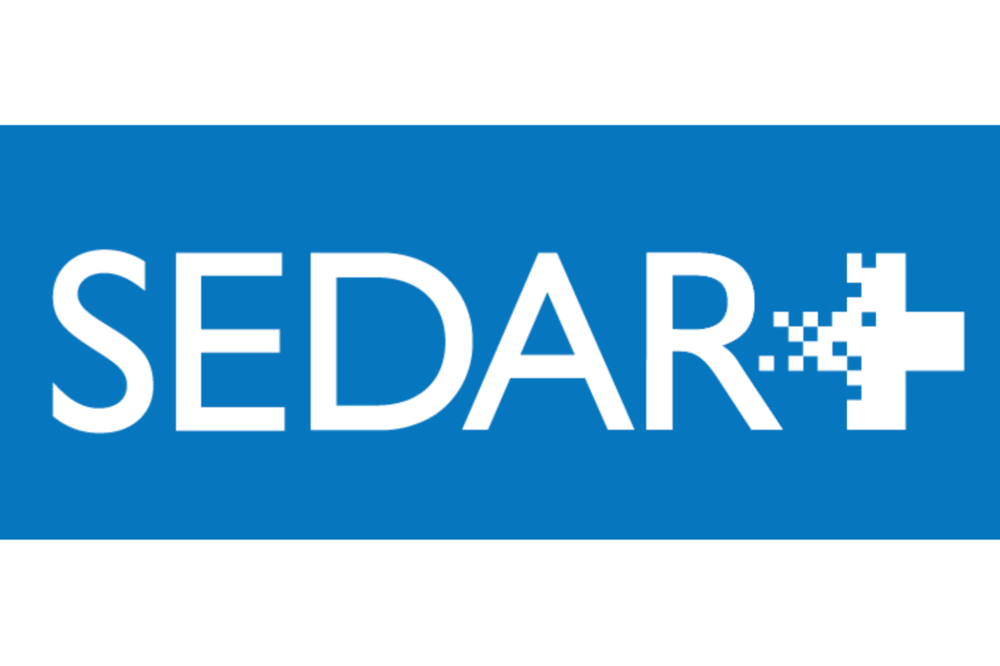

## Table of Contents

## What is SEDAR?

SEDAR stands for System for Electronic Document Analysis and Retrieval. It is an online system used in Canada for companies to file public documents. These documents include things like financial statements and news releases. SEDAR helps make sure that important information about companies is easy to find and access for investors and the public.

Using SEDAR, companies can send their documents to the right places quickly and easily. This system is managed by the Canadian Securities Administrators (CSA). The CSA is a group that helps oversee the securities markets in Canada. SEDAR is important because it helps keep the market fair and open by making sure everyone can see the same information at the same time.

## Who uses SEDAR?

SEDAR is mainly used by companies in Canada that need to share their important documents with the public. These companies use SEDAR to send their financial statements, news releases, and other reports. By using SEDAR, companies can make sure that everyone can see their information easily and at the same time.

Investors and the public also use SEDAR. They use it to look up information about companies they might want to invest in. This helps them make smart choices about where to put their money. SEDAR makes it easy for anyone to find the documents they need to learn about a company.

The Canadian Securities Administrators (CSA) manage SEDAR. They make sure the system works well and that the information shared on it is correct. This helps keep the market fair and open for everyone.

## What types of documents can be found on SEDAR?

SEDAR has many types of documents that companies need to share with the public. These include financial statements, which show how much money a company made and spent. Another type is news releases, which tell people about important events or changes in the company. Companies also put their annual reports on SEDAR, which give a full picture of what the company did over the year.

There are also documents like prospectuses, which companies use when they want to sell new stocks or bonds. SEDAR has management's discussion and analysis (MD&A) reports too, where the company's leaders explain their financial results and what they plan to do next. All these documents help investors and the public understand more about the company.

SEDAR also includes documents about important company meetings, like shareholder meetings. These documents tell people when and where the meeting will happen and what will be discussed. This way, everyone can stay informed about the company's plans and decisions.

## How can someone access SEDAR?

To access SEDAR, you need to go to their website. Just type "SEDAR" into your internet search and click on the official SEDAR website link. Once you're on the site, you can look up documents by searching for a company's name or by using the document type and date. It's easy to use and you don't need any special tools or accounts to view the documents.

SEDAR is free for anyone to use. You can read all the documents that companies have filed without paying any fees. This makes it easy for investors and the public to stay informed about the companies they are interested in. Just remember, while you can view documents for free, if you want to file documents as a company, you will need to set up an account and pay a fee.

## What is the purpose of SEDAR in the financial industry?

SEDAR, which stands for System for Electronic Document Analysis and Retrieval, is a very important tool in Canada's financial world. Its main job is to help companies share their important documents with the public easily and quickly. These documents include things like financial statements, news releases, and annual reports. By using SEDAR, companies can make sure that everyone can see their information at the same time. This is important because it keeps things fair for everyone who might want to invest in the company.

SEDAR also helps investors and the public. People can go to the SEDAR website to find out more about a company before deciding to invest their money. This way, they can make smart choices based on the latest and most accurate information. The Canadian Securities Administrators (CSA) manage SEDAR to make sure it works well and that the information on it is correct. This helps keep the market fair and open for everyone.

## How does SEDAR ensure the security and integrity of documents?

SEDAR takes several steps to make sure that the documents on its system are safe and accurate. When a company sends a document to SEDAR, it goes through a special process to check that it is real and correct. This helps stop fake documents from getting onto the system. SEDAR also uses strong security measures to protect the documents once they are on the website. This means that only people who are supposed to see the documents can access them.

Another way SEDAR keeps documents safe is by making sure they are not changed after they are uploaded. Once a document is on SEDAR, it stays the same and cannot be edited. This helps keep the information honest and reliable for everyone who looks at it. By doing all these things, SEDAR helps make sure that the information shared on its system is secure and trustworthy.

## Can SEDAR be used for real-time data analysis?

SEDAR is not really meant for real-time data analysis. It's more like a big library where companies in Canada put their important documents for everyone to see. You can go to the SEDAR website and look up these documents whenever you want, but the information in them isn't updated live. It's more like a snapshot of what was true at the time the document was filed.

If you need real-time data, you might need to use other tools or websites that are made for that. SEDAR is great for finding out about a company's past performance and important events, but it doesn't give you the minute-by-minute updates that some investors might want. So, while SEDAR is very useful, it's not the right place to go if you're looking for real-time data analysis.

## What are the differences between SEDAR and similar systems in other countries?

SEDAR, which stands for System for Electronic Document Analysis and Retrieval, is used in Canada for companies to share their important documents with the public. It's managed by the Canadian Securities Administrators (CSA) and helps keep the market fair by making sure everyone can see the same information at the same time. SEDAR is free for anyone to use when looking up documents, but companies need to pay a fee to file their documents. It's focused on Canadian companies and follows Canadian rules about what needs to be shared.

In other countries, there are similar systems but they work a bit differently. For example, in the United States, there's a system called EDGAR (Electronic Data Gathering, Analysis, and Retrieval) managed by the Securities and Exchange Commission (SEC). Like SEDAR, EDGAR is used for companies to file their documents, but it follows U.S. rules and covers American companies. Another example is the UK's Financial Conduct Authority (FCA) which uses a system for companies to report their information, but it might have different rules and ways of working compared to SEDAR. Each country's system is tailored to its own laws and needs, but they all aim to make important company information available to the public.

## How has SEDAR evolved since its inception?

Since SEDAR started in 1997, it has changed a lot to keep up with new technology and rules. At first, it was just a way for companies to send their documents to the right places in Canada. But as time went on, SEDAR added more features to make it easier for companies to file their documents and for people to find them. Now, SEDAR has a better search tool and can handle more types of documents than before.

SEDAR also works better now because it can deal with more documents at the same time. This makes it faster for companies to share their information and for investors to see it. The Canadian Securities Administrators (CSA) have made sure that SEDAR stays up-to-date with the latest security measures to keep the documents safe. Overall, SEDAR has grown from a simple filing system to a big, helpful tool for the Canadian financial world.

## What are the common challenges faced by users when navigating SEDAR?

Some people find SEDAR a bit hard to use because it has a lot of documents and information. If you are new to SEDAR, it might take some time to figure out how to search for what you need. The website can seem confusing at first because there are so many different types of documents and ways to look them up. Sometimes, the search results might show too many documents, making it hard to find the exact one you want.

Another challenge is that SEDAR's website might not be as user-friendly as some other websites. It can be tricky to understand all the different rules and steps you need to follow to file documents correctly if you are a company. Also, because SEDAR is only for Canadian companies, people looking for information about companies from other countries won't find it here. This can be frustrating if you are trying to compare companies from different places.

## How does SEDAR integrate with other regulatory systems?

SEDAR works together with other systems to make sure everything runs smoothly in the Canadian financial world. It is managed by the Canadian Securities Administrators (CSA), which is a group that helps oversee the securities markets in Canada. SEDAR shares information with other systems like the National Registration Database (NRD), which keeps track of people and companies that are allowed to sell investments. This helps make sure that all the information about companies and their documents is correct and up-to-date.

Another way SEDAR integrates with other systems is through its connection with the System for Electronic Disclosure by Insiders (SEDI). SEDI is used for people inside companies to report when they buy or sell their company's stocks. By working together, SEDAR and SEDI help make sure that everyone can see important information about what insiders are doing with their stocks. This helps keep the market fair and open for everyone.

## What future developments are expected for SEDAR?

In the future, SEDAR is expected to keep getting better to make it easier for companies to share their documents and for people to find them. One big change coming up is the move to SEDAR+, which is a new and improved version of SEDAR. SEDAR+ will have a better website that is easier to use and will work faster. It will also be able to handle more types of documents and will have stronger security to keep everything safe.

Another thing that might happen is that SEDAR could start working more closely with other systems around the world. This would make it easier for people to find information about companies from different countries all in one place. As technology keeps changing, SEDAR will need to keep up by adding new features and making sure it can work well with other tools that investors use. This will help make sure that SEDAR stays a helpful tool for everyone in the Canadian financial world.

## References & Further Reading

[1]: Lehavy, R., Li, F., & Merkley, K. J. (2020). ["The Effect of Annual Report Readability on Analyst Following and the Properties of Their Earnings Forecasts."](https://webuser.bus.umich.edu/rlehavy/LLM.pdf) The Journal of Finance.

[2]: Securities and Exchange Commission. ["EDGAR - How Do I Use EDGAR?"](https://www.sec.gov/search-filings/edgar-search-assistance/how-do-i-use-edgar) U.S. Securities and Exchange Commission.

[3]: Lopez de Prado, M. (2018). ["Advances in Financial Machine Learning."](https://www.amazon.com/Advances-Financial-Machine-Learning-Marcos/dp/1119482089) Wiley.

[4]: CSA Staff Notice 51-346. ["Continuous Disclosure Review Program Activities for the Fiscal Year Ended March 31, 2021."](https://www.osc.ca/en/securities-law/instruments-rules-policies/5/51-346/csa-staff-notice-51-346-continuous-disclosure-review-program-activities-fiscal-year-ended-march-31) Canadian Securities Administrators.

[5]: Jansen, S. (2020). ["Machine Learning for Algorithmic Trading - Second Edition."](https://www.amazon.com/Machine-Learning-Algorithmic-Trading-alternative-ebook/dp/B08D9SP6MB) Packt Publishing.