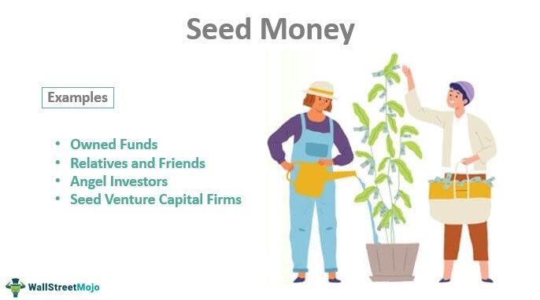

The intersection of agriculture and finance has led to the emergence of seed stock investment, a specialized area within the stock market focusing on companies that produce agricultural seeds. These seed companies are pivotal in advancing agricultural technology through the development and commercialization of seeds engineered for higher yields and resilience. They play a crucial role in the global food supply chain, underscoring their importance in addressing food security challenges.

Seed stocks present a compelling investment opportunity due to the fundamental necessity of agricultural products worldwide. As the global population continues to grow, the demand for efficient and sustainable agricultural practices becomes increasingly critical. Investment in seed stocks aligns with this need, offering potential returns through support of innovations in food production.



In recent years, the integration of technology into finance has brought algorithmic trading to the forefront of modern investment strategies. Algorithmic trading involves the use of automated systems to execute trades based on pre-defined instructions, leveraging mathematical models and market data to optimize trading decisions. This approach is particularly beneficial in the seed stock sector, as it allows investors to enhance yield and efficiency while managing risks associated with volatile market conditions. 

Combining seed stock investment with algorithmic trading strategies can provide a competitive edge, allowing investors to react swiftly to market changes and ensure optimal portfolio performance. This synergy between agriculture and advanced trading technologies offers innovative ways to capture gains, appealing to those looking for unique investment opportunities.

Understanding these concepts is valuable for both seasoned investors and newcomers, as they offer insight into a growing and dynamic segment of the stock market. As agricultural innovations continue to develop and financial technologies become more sophisticated, seed stock investment represents a forward-thinking approach to achieving financial and strategic goals in an ever-evolving market landscape.

## Table of Contents

## Understanding Seed Stock

Seed stock investment centers on companies that specialize in developing and marketing seeds engineered to provide higher yield and greater resilience against environmental challenges. These companies are at the forefront of agricultural innovation, utilizing advanced biotechnology and research and development (R&D) strategies to enhance crop performance.

Key players in the seed stock market include Bayer Crop Science and Syngenta, both of which are renowned for their comprehensive agricultural research programs. These companies focus on creating patented, genetically modified seeds designed to improve yield, pest resistance, and climate adaptability. By pushing the boundaries of traditional agriculture, they contribute significantly to the global agricultural supply chain, making them attractive targets for investors seeking unique opportunities within the agricultural sector.

Investing in seed stocks necessitates an understanding of both the agricultural processes and the cutting-edge technological advancements driving this sector forward. Increased agricultural efficiency is crucial as the global population continues to grow, placing greater demands on food production systems. Thus, seed companies that develop innovative solutions to enhance crop yields are critical to meeting these demands.

However, the rise of genetically modified organisms (GMOs) in agriculture has sparked widespread debate and concern. While GMOs hold promise for sustainable agriculture by increasing efficiency and reducing the need for chemical inputs, they also pose potential risks related to health and environmental impacts. These concerns can affect the valuation and market performance of seed stock companies, as regulatory and consumer pressures shape the landscape in which they operate.

Overall, understanding seed stock investment involves navigating a complex interplay of agriculture, biotechnology, and market dynamics. As these companies continue to develop solutions to global food security challenges, investors who can effectively analyze technological advancements and market trends stand to gain from this unique and evolving sector.

## Market Potential and Investment Opportunities

The market for seed stocks encompasses a broad array of essential crops, such as corn, soy, and rice, which are critical to meeting the dietary needs of a rapidly growing global population. The demand for these staple crops is continually increasing, driven by factors such as population growth, urbanization, and changing dietary preferences, particularly in emerging markets. As such, investment in seed stocks is propelled by the imperative to enhance agricultural efficiency and productivity to meet the ever-increasing demand for food.

Investors are increasingly recognizing the value of companies that develop seeds with high yield potentials and resilience to environmental stresses. These traits are crucial for maintaining food security and ensuring a reliable food supply. The focus on genetically modified seeds and advanced breeding techniques has opened up substantial investment opportunities. Companies that specialize in agricultural research and development (R&D) are at the forefront of creating innovative solutions to bolster crop performance and are therefore considered attractive investment targets.

Aside from yield enhancements, ethical and sustainable agricultural practices are becoming significant criteria for investors. Sustainable practices not only address environmental concerns but also respond to consumer demand for transparency and responsibility. Consequently, companies that demonstrate a commitment to sustainability and ethical agriculture are likely to experience a positive reception in the stock market.

Engagement with seed stocks can offer potential returns aligned with the confluence of food security needs and innovative agricultural solutions. The importance of securing reliable food supplies has been underscored by recent global challenges, emphasizing the necessity for resilient agricultural systems and practices. This underscores the importance of seed stock investments as part of a strategic portfolio seeking growth aligned with global necessities.

To identify promising seed stock investments, it is crucial to analyze market trends and the performance of specific companies. Investors should consider factors such as R&D capabilities, innovation pipelines, market share, and geographical diversification. Financial performance metrics, such as revenue growth and profit margins, should also be considered in evaluating the potential of seed stock investments.

In conclusion, the seed stock market presents a wide array of investment opportunities, driven by the dual imperatives of enhancing agricultural productivity and adhering to ethical standards. By focusing on companies committed to innovation and sustainability, investors can potentially realize strong returns while contributing to global food security efforts.

## Algorithmic Trading in Seed Stock Investment

Algorithmic trading represents a transformative approach to managing investments in seed stocks, employing sophisticated algorithms to automate the process of buying and selling shares. At its core, [algorithmic trading](/wiki/algorithmic-trading) is designed to enhance trading speed and efficiency, enabling investors to execute numerous trades in fractions of a second. This speed is crucial in today's fast-paced stock markets, where prices fluctuate rapidly and opportunities can vanish just as quickly.

In the context of seed stock investment, algorithmic trading can be particularly advantageous. Algorithms can be programmed to analyze large volumes of market data, identifying trends and patterns that may not be immediately apparent to human traders. For instance, algorithms can monitor price movements, trading volumes, and even news feeds related to companies like Bayer Crop Science and Syngenta. By processing this data in real-time, these algorithms can optimize trade execution to buy or sell shares at the most favorable prices, while also managing risk by avoiding trades when market conditions are unfavorable.

One of the key benefits of algorithmic trading in seed stocks is its precision. Algorithms can be tailored to specific investment strategies, ensuring that trades are executed according to predefined criteria. This precision minimizes human error and emotional decision-making, two factors that often undermine investment performance. By relying on data-driven strategies, investors can respond rapidly to market changes, thereby preserving capital and maximizing potential returns.

Furthermore, the integration of [artificial intelligence](/wiki/ai-artificial-intelligence) (AI) and [machine learning](/wiki/machine-learning) into trading algorithms offers additional advantages. Machine learning algorithms can learn from historical data and past trades to improve their predictions of future market movements. For example, a machine learning model might be trained on historical seed stock price data to forecast future price trends. This capability allows for more refined trading strategies that can adapt to evolving market conditions. 

Here's a simple example of how a machine learning model might be used to predict stock prices using Python:

```python
import numpy as np
from sklearn.model_selection import train_test_split
from sklearn.ensemble import RandomForestRegressor

# Sample data: Features (e.g., historical prices, trading volumes), Target (future prices)
X = np.array([[10, 200], [15, 250], [20, 300], [30, 400], [40, 500]])
y = np.array([12, 18, 22, 35, 45])

# Splitting data into training and test sets
X_train, X_test, y_train, y_test = train_test_split(X, y, test_size=0.2, random_state=42)

# Defining and training the model
model = RandomForestRegressor(n_estimators=100, random_state=42)
model.fit(X_train, y_train)

# Predicting future prices
predictions = model.predict(X_test)
print("Predicted Prices:", predictions)
```

This code demonstrates the use of a random forest regression model to predict future stock prices based on historical data. By continuously training such models on new data, investors can potentially improve their decision-making processes in seed stock investments. 

Overall, the use of algorithmic trading, coupled with advancements in AI and machine learning, provides a powerful toolkit for investors seeking to navigate the complexities of the seed stock market.

## Challenges and Considerations

Investing in seed stocks with the assistance of algorithmic trading presents several challenges and considerations. Data integrity and market [volatility](/wiki/volatility-trading-strategies) are primary concerns. The reliability and accuracy of data used to automate trading strategies directly impact the success of algorithmic trading. Inconsistent or inaccurate data can lead to misguided strategies, resulting in potential financial losses. Furthermore, market volatility, driven by a variety of economic, geopolitical, and environmental factors, can cause unexpected fluctuations in seed stock prices, complicating algorithmic predictions and trade executions.

Regulatory concerns, particularly surrounding genetically modified organisms (GMO), can significantly affect seed stock valuation and performance. Countries and regions have varying regulations regarding the use and sale of GMOs. These regulations can influence market accessibility and public perception, affecting the potential profitability of investing in seed stock companies. Investors must stay informed about regulatory changes and their impacts on seed stock markets to navigate potential risks effectively.

Ethical considerations in seed engineering are pivotal for maintaining investor trust and market reputation. Public concerns about food safety, environmental impact, and sustainability of genetically modified seeds necessitate transparency and adherence to ethical standards by seed companies. Investors and companies must advocate for sustainable and ethical practices to foster consumer trust and align with global sustainable development goals.

Algorithmic trading necessitates robust technological infrastructure and expertise for effective execution. The development and deployment of complex algorithms require a solid understanding of both stock market dynamics and computational techniques. Investors and traders need access to advanced hardware, software, and reliable internet connectivity to maintain competitiveness in executing trades with minimal latency.

Continuous monitoring and adaptation of trade algorithms are essential to cope with evolving market conditions and technological advancements. Algorithims must be regularly updated and tested to accommodate new market data, emerging technologies, and changing investor behaviors to stay competitive. This requires a proactive approach, combining human oversight with technological refinement, to ensure that algorithmic strategies remain relevant and effective in rapidly changing financial landscapes.

## Conclusion

Seed stock investment, when combined with algorithmic trading, provides a contemporary approach to extracting value in the stock market. This synergy between the agriculture sector and advanced trading technologies creates new avenues for investors seeking innovative strategies. By understanding the intricate workings of seed stock companies and implementing algorithmic trading, investors gain a structured pathway to enhance their investment tactics.

As the lines between agriculture and technology continue to blur, a robust and forward-thinking market emerges. This convergence invites investors to engage with a sector characterized by resilience and innovation. The application of algorithmic trading in seed stock investments not only optimizes trade execution but also anticipates market shifts and adapts strategies in real time.

The growing influence of artificial intelligence and sustainable agricultural practices will likely redefine the seed stock market's potential. Machine learning models can enhance prediction accuracy for market movements, thus providing strategic advantages. Additionally, sustainable approaches in agriculture can align investment strategies with global environmental goals, appealing to socially-conscious investors.

Ultimately, the key to success in this evolving market lies in the readiness to embrace change. Investors equipped with knowledge and strategic insights will be well-positioned to navigate the upcoming landscape transitions. By staying informed and adapting to emerging trends, they can maximize the opportunities presented by seed stock investments and algorithmic trading.

## References & Further Reading

[1]: ["Advances in Financial Machine Learning"](https://www.amazon.com/Advances-Financial-Machine-Learning-Marcos/dp/1119482089) by Marcos Lopez de Prado

[2]: ["Machine Learning for Algorithmic Trading"](https://github.com/PacktPublishing/Machine-Learning-for-Algorithmic-Trading-Second-Edition) by Stefan Jansen

[3]: ["Quantitative Trading: How to Build Your Own Algorithmic Trading Business"](https://www.amazon.com/Quantitative-Trading-Build-Algorithmic-Business/dp/1119800064) by Ernest P. Chan

[4]: Stein, A. J., & Rodríguez-Cerezo, E. (2009). ["The global pipeline of new GM crops: Implications of asynchronous approval for international trade."](https://www.nature.com/articles/nbt0110-23b) Nature Biotechnology.

[5]: James, J. S. (2010). ["Agricultural Supply Chain Issues in Developing Countries: Shortages, Quality, and Food Safety."](https://www.sciencedirect.com/science/article/pii/S2214785321045594) Annual Review of Resource Economics.