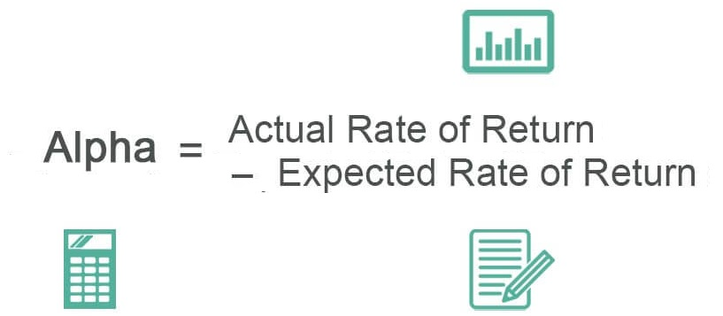

In an age where technology and finance converge, algorithmic trading has become a critical component of modern investing, significantly transforming how financial markets operate. At its core, algorithmic trading employs computer programs to conduct trading activities using pre-defined rules and sophisticated algorithms. This approach enables traders to execute orders with precision and speed that far surpass human capabilities. A primary motivation for many investors engaging in algorithmic trading is the pursuit of alpha—aiming to achieve returns that exceed the market average while minimizing associated risks.

The concept of seeking alpha involves outperforming a benchmark index or market standard, a challenging feat necessitating advanced strategies and robust decision-making frameworks. In traditional investing, human biases and emotions can often cloud judgment, leading to suboptimal decisions. Algorithmic trading addresses this issue by automating trade execution, thus removing emotional decision-making and harnessing the power of data-driven insights. By leveraging historical data, machine learning models, and statistical analysis, algorithmic traders strive to identify lucrative investment opportunities that are otherwise undetectable through conventional means.



Algorithmic trading isn't merely about executing trades automatically; it's about employing a sophisticated toolset designed to analyze market conditions in real-time and make informed trading decisions. This sophistication allows traders to deploy strategies that are tailored to various market scenarios, improving their chances of achieving higher returns with lowered risks. As technology continues to advance, so too does the potential for algorithmic trading to enhance financial performance and empower investors in their quest for alpha.

This article will explore the vital role algorithmic trading plays in modern financial markets and how investors can leverage these advanced tools and strategies to seek alpha efficiently. With ongoing innovations in technology, the landscape of algorithmic trading is evolving rapidly, promising exciting opportunities for those who can adeptly navigate this dynamic domain.

## Table of Contents

## Understanding Algorithmic Trading

Algorithmic trading leverages sophisticated computer programs to execute trades at optimal moments and prices, enhancing efficiency and precision in financial markets. These programs operate based on pre-defined sets of instructions, known as algorithms, which continually evolve to capture potential gains. The core function of an algorithm in this context is to analyze extensive data sets, identify trading opportunities, and execute transactions faster than a human trader ever could.

The primary advantage of [algorithmic trading](/wiki/algorithmic-trading) is its ability to minimize human emotion from trading decisions. Emotions such as fear and greed often lead to irrational decisions, resulting in suboptimal trading outcomes. By using algorithms, traders can consistently apply a disciplined strategy, relying on data-driven conclusions rather than intuition or emotion. This is particularly beneficial in high-frequency trading environments, where speed and accuracy are paramount.

An algorithm typically follows a sequence of steps designed to analyze market data and make trading decisions based on set criteria. For example, a simple algorithm might be instructed to buy a stock when its 50-day moving average price crosses above its 200-day moving average—a technical indicator that some traders interpret as a bullish signal. The algorithm can monitor market data continuously and execute this strategy without human intervention.

To stay competitive, these algorithms are refined regularly to adapt to changing market conditions. By back-testing various strategies against historical data, developers can optimize algorithms, tweaking parameters to improve performance while avoiding overfitting, where an algorithm models noise rather than underlying trends. Python is a popular language for crafting these algorithms due to its robust libraries, such as NumPy and pandas, which facilitate data manipulation and analysis.

```python
import pandas as pd
import numpy as np

# Example of a simple moving average crossover strategy
def moving_average_crossover(data, short_window, long_window):
    signals = pd.DataFrame(index=data.index)
    signals['price'] = data['price']
    signals['short_mavg'] = data['price'].rolling(window=short_window, min_periods=1, center=False).mean()
    signals['long_mavg'] = data['price'].rolling(window=long_window, min_periods=1, center=False).mean()

    # Create signals to buy (1) or sell (-1)
    signals['signal'] = 0.0
    signals['signal'][short_window:] = np.where(signals['short_mavg'][short_window:] > signals['long_mavg'][short_window:], 1.0, 0.0)   
    signals['positions'] = signals['signal'].diff()

    return signals

# Assume 'data' is a DataFrame with a 'price' column
```

This code demonstrates a basic moving average crossover strategy, which is foundational to many algorithmic trading systems. The ability to automate and optimize strategies allows traders to seek out minute inefficiencies in the market and make decisions based on empirical evidence rather than speculation.

## The Quest for Alpha

Alpha represents the performance of an investment relative to a market index or benchmark, serving as a key measurement for traders aiming to surpass broad market returns. For traders employing algorithmic strategies, achieving alpha entails capitalizing on inefficiencies through sophisticated data analysis and automation.

Algorithmic traders employ a variety of techniques to seek alpha. One predominant method is statistical [arbitrage](/wiki/arbitrage), which involves evaluating price movements and relationships between financial instruments. By analyzing historical price trends and identifying mean reversion patterns, traders can automate trades to exploit temporary market inefficiencies. Mean reversion suggests that prices will return to a historical average over time, thus algorithms can execute trades when prices deviate considerably from this average, offering opportunities to procure alpha.

Another strategy leveraging automation is [trend following](/wiki/trend-following). Algorithms designed for this approach identify and participate in existing market trends by buying securities in an upward trend and selling them in a downward trend. The efficacy of such strategies emanates from the algorithm's capacity to process massive datasets and react to market signals more promptly than human traders.

Algorithmic trading also integrates [machine learning](/wiki/machine-learning) to refine strategies iteratively, enhancing the quest for alpha. By applying models that adapt based on new data inputs, traders can dynamically recalibrate algorithms to improve decision-making accuracy. For instance, machine learning-based algorithms may learn from historical trade data to identify patterns and correlations that machines—not humans—can detect with precision.

Python is a prevalent programming language in algorithmic trading due to its versatility and extensive libraries tailored for financial computation. Libraries such as NumPy, pandas, and scikit-learn support the construction and testing of algorithmic models. A simple example in Python could involve using historical stock prices to simulate a mean reversion strategy:

```python
import pandas as pd
import numpy as np

# Load historical stock data
data = pd.read_csv('historical_prices.csv')
data['Returns'] = data['Close'].pct_change()

# Calculate mean and standard deviation
mean = data['Returns'].mean()
std_dev = data['Returns'].std()

# Generate buy/sell signals
data['Signal'] = np.where(data['Returns'] > mean + std_dev, 'Sell', np.where(data['Returns'] < mean - std_dev, 'Buy', 'Hold'))

print(data[['Date', 'Signal']])
```

This strategy automates the detection of buy or sell signals based on statistical thresholds, exemplifying how algorithms operate to achieve alpha.

Despite the allure of algorithmic strategies in achieving alpha, the success rate is contingent on meticulous testing and understanding of market dynamics. Continually refining algorithms in response to changing market conditions is paramount for sustained outperformance. Through automation and data analysis, traders are equipped to transcend traditional constraints, aiming for superior market returns.

## Tools and Strategies in Algo Trading

Algorithmic trading employs a variety of strategies, each designed to exploit different market conditions and behaviors. One of the most popular strategies is trend following. This involves identifying and executing trades based on the direction of market trends. By analyzing historical data, these algorithms aim to capitalize on continued [momentum](/wiki/momentum) in price movements. A basic trend-following strategy might involve moving averages, where an algorithm might buy when the short-term average price crosses above the long-term average, signaling an upward trend, and sell when the reverse occurs.

Mean reversion, another common strategy, operates on the principle that asset prices will revert to their mean or average over time. Algorithms designed for mean reversion identify securities that have deviated significantly from their historical averages and make trades anticipating that prices will return to these averages. This could involve taking a long position when a stock is perceived as oversold and undervalued, or a short position when it seems overbought.

Statistical arbitrage is a more complex strategy that often involves [pair trading](/wiki/pair-trading) or taking advantage of pricing inefficiencies between related securities. This strategy uses statistical methods to identify pricing relationships and anomalies, often involving significant computational resources to process large volumes of data. The goal is to make simultaneous trades that exploit these discrepancies, usually involving rapid buying and selling to capture small profits that add up over time.

Technological advancements, particularly in machine learning and [artificial intelligence](/wiki/ai-artificial-intelligence), have dramatically enhanced the capabilities of these strategies. Machine learning algorithms, for example, can analyze vast datasets to uncover patterns and relationships that human traders might miss. Techniques such as [reinforcement learning](/wiki/reinforcement-learning) can be particularly useful, allowing algorithms to learn optimal trading strategies through trial and error in simulated markets.

In the implementation of these strategies, a wide range of tools is employed, from high-frequency trading platforms requiring ultra-low latency infrastructures, to Python libraries like pandas and numpy for data analysis, and TensorFlow for building sophisticated machine learning models. Developers often use a mix of off-the-shelf software solutions and custom-built algorithms to cater to specific market needs, ensuring a competitive edge tailored to their unique trading objectives.

Utilizing programming languages such as Python allows for the creation of flexible and dynamic algorithms. For instance, a trend-following strategy could be implemented as follows:

```python
import pandas as pd

def moving_average_strategy(data, short_window=40, long_window=100):
    data['short_mavg'] = data['Close'].rolling(window=short_window, min_periods=1).mean()
    data['long_mavg'] = data['Close'].rolling(window=long_window, min_periods=1).mean()

    buy_signals = data[data['short_mavg'] > data['long_mavg']]
    sell_signals = data[data['short_mavg'] < data['long_mavg']]

    return buy_signals, sell_signals
```

This code calculates the short and long moving averages, and identifies buy and sell signals when these averages cross, exemplifying how trends can be computationally identified and acted upon. The integration of machine learning and AI, combined with sophisticated software infrastructures, is propelling algorithmic trading toward increasingly effective strategies for capturing alpha in diverse market environments.

## Challenges in Seeking Alpha with Algorithms

Algorithmic trading, while a powerful tool for seeking alpha, is fraught with challenges that can hinder its effectiveness. One of the principal challenges lies in regulatory hurdles that govern the financial markets. Regulations intended to maintain market integrity and protect investors may impose constraints on the algorithms, affecting their implementation and potentially their success rate. For instance, regulatory bodies like the U.S. Securities and Exchange Commission (SEC) impose strict compliance measures that may affect how algorithms are developed and executed.

Over-optimization is another significant challenge. This occurs when algorithms are excessively fine-tuned to historical data, a phenomenon known as "curve fitting." Although this practice may result in impressive backtested results, it frequently leads to poor performance in live trading environments. The optimization process can inadvertently incorporate noise and anomalies peculiar to the historical dataset, leading to models that lack generalizability. Overcoming this requires rigorous out-of-sample testing and validation to ensure algorithms can handle new data effectively.

Furthermore, market conditions such as high [volatility](/wiki/volatility-trading-strategies) introduce complexities that are difficult for algorithms to preemptively resolve. Algorithms designed under stable market conditions may falter when volatility spikes, causing unpredictable market behavior. Volatility affects [liquidity](/wiki/liquidity-risk-premium) conditions, spreads, and price movements, which may not be adequately captured by a static algorithmic model. This unpredictability necessitates adaptive algorithms that can dynamically adjust to real-time market changes. For example, implementing machine learning models that can learn from recent data trends may provide a solution, but these methods still require robust testing to ensure reliability.

In summary, while algorithms can theoretically outperform the market, various challenges—ranging from regulatory constraints to over-optimization and the unpredictable nature of market volatility—pose significant barriers. Addressing these issues involves a combination of regulatory awareness, robust model validation, and the incorporation of adaptive technologies.

## Success Stories and Case Studies

Numerous hedge funds and financial institutions have leveraged algorithmic trading to achieve substantial success in financial markets. These success stories often exemplify the effectiveness and scalability of sophisticated trading algorithms.

One notable case is Renaissance Technologies, founded by Jim Simons. The firm is renowned for its Medallion Fund, which has consistently delivered returns far above market averages since its inception. The success of Renaissance Technologies is largely attributed to its data-driven trading strategies, powered by complex mathematical models and algorithms. The firm employs quantitative techniques and a multitude of data sets to capture subtle patterns in market behavior, thereby achieving impressive levels of alpha.

Another example is Two Sigma Investments, a [hedge fund](/wiki/hedge-fund-trading-strategies) that applies [statistics](/wiki/bayesian-statistics), technology, and mathematics to formulate trading strategies. Two Sigma uses machine learning and distributed computing systems to refine its algorithms continually. The firm's emphasis on data science and technology enables it to explore a vast array of data, including non-traditional sources, to enhance its trading decisions and maintain a competitive edge.

In institutional trading, Goldman Sachs has also demonstrated the efficacy of algorithmic trading. The firm has developed advanced trading platforms that utilize algorithms to execute large volumes of transactions with minimal market impact. These platforms capitalize on algorithms designed to optimize trade execution, thereby reducing trading costs and improving overall performance.

These examples indicate the transformative power of algorithmic strategies in achieving alpha. They showcase the ability to scale operations effectively while maintaining a robust risk management framework. The success of these firms highlights how algorithms can process and analyze vast amounts of data with speed and accuracy beyond human capabilities, resulting in superior investment outcomes. As technology continues to evolve, these strategies are expected to become even more sophisticated, offering further opportunities for financial gains.

## The Future of Seeking Alpha in Algo Trading

With continuous advancements in technology, the potential for seeking alpha through algorithmic trading is continually evolving. Emerging technologies like blockchain and [cryptocurrency](/wiki/cryptocurrency) markets offer new avenues for traders to explore. Blockchain technology, with its decentralized and transparent nature, provides a robust infrastructure for maintaining secure and immutable transaction records. This can enhance algorithmic trading strategies by ensuring greater data integrity and reducing the risk of fraud. Cryptocurrencies, being highly volatile and traded 24/7, present unique opportunities for algorithms designed to exploit market inefficiencies and capture alpha through rapid buy and sell decisions.

Moreover, the integration of artificial intelligence (AI) and machine learning is poised to further revolutionize algorithmic trading. These technologies enable the creation of more sophisticated algorithms that can learn from historical data patterns, adapt to changing market conditions, and make decisions with minimal human intervention. Machine learning models, such as neural networks, can process vast amounts of data at high speeds, identifying trends and correlations that may not be apparent to human traders. For example, predictive models can forecast price movements or volatility spikes based on complex datasets, improving the chances of achieving alpha.

Traders can leverage machine learning techniques such as reinforcement learning, where algorithms learn optimal strategies through trial and error, continually improving their performance. Python, a popular programming language in the finance sector, facilitates this with libraries like TensorFlow and PyTorch, which are used to build and train machine learning models. An example Python snippet for setting up a basic machine learning model might look like this:

```python
import tensorflow as tf
from tensorflow.keras import layers

# Define a simple neural network model
model = tf.keras.Sequential([
    layers.Dense(64, activation='relu', input_shape=(input_shape,)),
    layers.Dense(64, activation='relu'),
    layers.Dense(1)
])

# Compile the model
model.compile(optimizer='adam', loss='mse')

# Fit the model with data
model.fit(X_train, y_train, epochs=10, batch_size=32)
```

The ongoing evolution of technologies like blockchain and AI not only broadens the horizon for algorithmic trading but also demands that traders stay informed and adaptable. Developing and fine-tuning algorithms that leverage these advanced technologies will be crucial for those seeking alpha in the future financial landscape. As new markets and innovative tools continue to rise, the potential for greater returns through algorithmic trading remains substantial.

## Conclusion

Algorithmic trading has emerged as a formidable approach to seeking alpha in financial markets, driven by its capacity to enhance precision and efficiency. By leveraging complex algorithms, traders can systematically identify and exploit market inefficiencies, aiming to achieve returns that surpass those of traditional investment strategies. Despite the inherent challenges, such as regulatory hurdles and the risks associated with over-optimization, the potential for generating above-average returns through well-crafted algorithmic strategies remains significant.

The continuous evolution of technology serves as a catalyst for innovation within algorithmic trading. Advances in artificial intelligence and machine learning enable the development of more sophisticated models that can adapt to dynamic market conditions. Moreover, the integration of blockchain technology and the growing interest in cryptocurrency markets offer novel opportunities for further algorithmic trading exploration.

To maintain their competitive edge, traders must stay vigilant and informed about the latest strategies and tools in algorithmic trading. By doing so, they can not only mitigate existing challenges but also harness the evolving technological landscape to uncover fresh avenues for seeking alpha. As markets continue to evolve, the ongoing refinement and adaptation of algorithmic methods will be crucial for traders aiming to sustain success in the pursuit of exceptional returns.

## References & Further Reading

[1]: Bergstra, J., Bardenet, R., Bengio, Y., & Kégl, B. (2011). ["Algorithms for Hyper-Parameter Optimization"](https://papers.nips.cc/paper/4443-algorithms-for-hyper-parameter-optimization). Advances in Neural Information Processing Systems 24.

[2]: ["Advances in Financial Machine Learning"](https://www.amazon.com/Advances-Financial-Machine-Learning-Marcos/dp/1119482089) by Marcos Lopez de Prado

[3]: ["Evidence-Based Technical Analysis: Applying the Scientific Method and Statistical Inference to Trading Signals"](https://www.amazon.com/Evidence-Based-Technical-Analysis-Scientific-Statistical/dp/0470008741) by David Aronson

[4]: ["Machine Learning for Algorithmic Trading"](https://github.com/stefan-jansen/machine-learning-for-trading) by Stefan Jansen

[5]: ["Quantitative Trading: How to Build Your Own Algorithmic Trading Business"](https://books.google.com/books/about/Quantitative_Trading.html?id=j70yEAAAQBAJ) by Ernest P. Chan