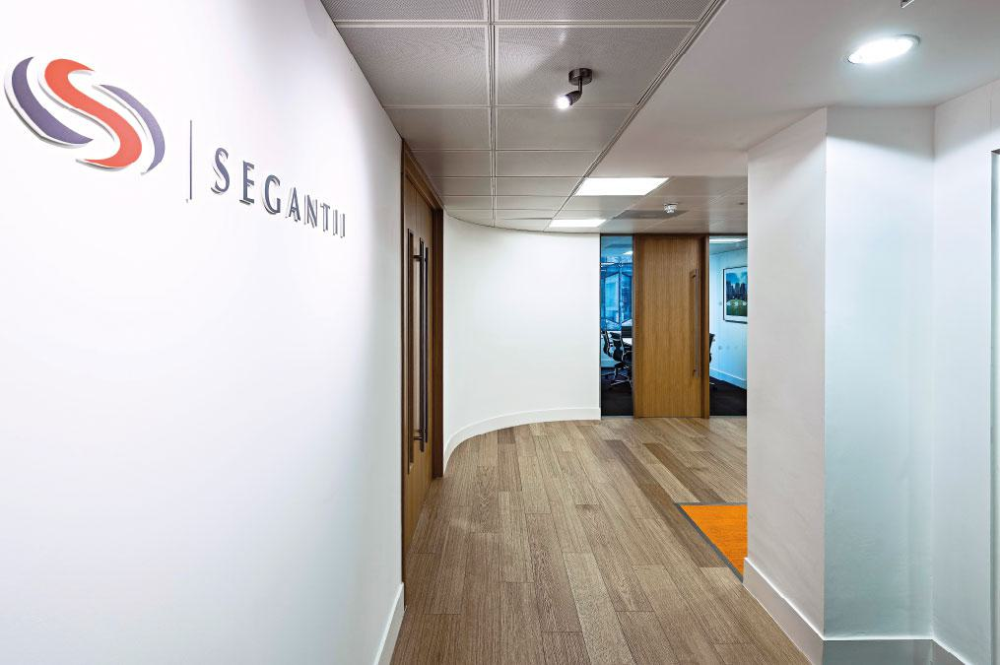

## Table of Contents

## What is Segantii Capital Management?

Segantii Capital Management is a hedge fund that was started in 2007. It is based in Hong Kong and focuses on trading stocks in Asia. The company was founded by Simon Sadler, who used to work at big banks like Deutsche Bank and Dresdner Kleinwort Wasserstein. Segantii is known for using a strategy called market-neutral investing, which means they try to make money no matter if the stock market goes up or down.

The firm has grown a lot since it started. It now manages billions of dollars for investors from around the world. Segantii is respected in the financial world for its smart trading strategies and good performance. They have offices in several cities, including London and New York, to help them keep a close eye on markets everywhere.

## Who founded Segantii Capital Management and when was it established?

Segantii Capital Management was founded by Simon Sadler. He started the company in 2007. Simon Sadler used to work at big banks like Deutsche Bank and Dresdner Kleinwort Wasserstein before he started Segantii.

Segantii is based in Hong Kong and focuses on trading stocks in Asia. The company uses a strategy called market-neutral investing. This means they try to make money whether the stock market goes up or down.

## What is the main focus of Segantii Capital Management's investment strategy?

Segantii Capital Management mainly focuses on a strategy called market-neutral investing. This means they try to make money no matter if the stock market goes up or down. They do this by balancing their investments so that gains in one area can offset losses in another. This approach helps them manage risk better and aim for steady returns.

The company trades stocks mainly in Asia. They use their deep knowledge of the Asian markets to find good investment opportunities. By keeping a close eye on different markets, Segantii tries to take advantage of price differences and trends to make profits for their investors.

## In which countries does Segantii Capital Management operate?

Segantii Capital Management has its main office in Hong Kong. This is where they started and where they focus a lot of their work. Hong Kong is important for them because it's a big financial center in Asia.

They also have offices in other places to help them watch different markets. They have an office in London, which helps them keep an eye on European markets. They also have an office in New York to stay connected with the American markets. This way, they can trade stocks and make investments all around the world.

## How does Segantii Capital Management generate returns for its investors?

Segantii Capital Management makes money for its investors by using a strategy called market-neutral investing. This means they try to make profits no matter if the stock market goes up or down. They do this by balancing their investments so that if one investment loses money, another one might gain money. This helps them manage risk and aim for steady returns. They focus on trading stocks in Asia, where they have a lot of knowledge and experience.

They also use their offices in different places like Hong Kong, London, and New York to keep a close eye on markets all around the world. By watching different markets, they can find good opportunities to buy and sell stocks. This helps them take advantage of price differences and trends to make profits. Their deep understanding of the Asian markets, combined with their global reach, allows them to generate returns for their investors.

## What types of funds does Segantii Capital Management manage?

Segantii Capital Management manages different types of hedge funds. Their main focus is on market-neutral funds. This means they try to make money no matter if the stock market goes up or down. They do this by balancing their investments so that gains in one area can offset losses in another. This helps them manage risk better and aim for steady returns.

They mostly trade stocks in Asia because they know a lot about those markets. But they also keep an eye on markets in other places like Europe and the US. They use their offices in Hong Kong, London, and New York to watch these markets and find good opportunities to buy and sell stocks. This helps them make profits for their investors.

Overall, Segantii's funds are designed to take advantage of price differences and trends in the stock market. By using their deep understanding of Asian markets and their global reach, they aim to generate good returns for their investors.

## What are some notable achievements or milestones of Segantii Capital Management?

Segantii Capital Management has grown a lot since it started in 2007. It began with a small team and now manages billions of dollars for investors from around the world. This growth shows how good they are at what they do. They have become well-known in the financial world for their smart trading strategies and strong performance. Their focus on market-neutral investing has helped them make money even when the stock market goes up and down.

One big achievement for Segantii is how they have expanded their reach. They started in Hong Kong but now have offices in London and New York too. This helps them watch markets all around the world and find good opportunities to buy and sell stocks. Their deep knowledge of Asian markets, combined with their global presence, has helped them stay ahead in the competitive world of hedge funds. They are respected for their ability to manage risk and generate steady returns for their investors.

## How does Segantii Capital Management approach risk management?

Segantii Capital Management uses a strategy called market-neutral investing to manage risk. This means they try to balance their investments so that if one investment loses money, another one might gain money. By doing this, they can make money no matter if the stock market goes up or down. This approach helps them keep their risk low and aim for steady returns for their investors.

They also use their deep knowledge of Asian markets and their offices around the world to keep a close eye on different markets. This helps them find good opportunities and make smart decisions about when to buy and sell stocks. By watching markets in Hong Kong, London, and New York, they can take advantage of price differences and trends, which helps them manage risk better.

## Can you explain the organizational structure of Segantii Capital Management?

Segantii Capital Management is led by its founder, Simon Sadler. He used to work at big banks like Deutsche Bank and Dresdner Kleinwort Wasserstein before he started Segantii. At the top of the company, there are also other important people who help make big decisions. They work together to make sure the company does well and makes money for its investors. 

The company has offices in different places like Hong Kong, London, and New York. Each office has its own team of people who watch the markets in their area. The teams in these offices work together to find good opportunities to buy and sell stocks. This helps the company keep a close eye on markets all around the world and manage their investments well.

## What is the performance history of Segantii Capital Management's flagship fund?

Segantii Capital Management's flagship fund has done well since it started. It uses a strategy called market-neutral investing. This means they try to make money no matter if the stock market goes up or down. They do this by balancing their investments so that if one investment loses money, another one might gain money. This helps them keep their risk low and aim for steady returns for their investors. Over the years, the fund has grown a lot and now manages billions of dollars.

The fund's performance has been strong and consistent. It has beaten many other funds in its category. This is because Segantii has a deep knowledge of Asian markets and uses offices in Hong Kong, London, and New York to watch markets all around the world. By finding good opportunities to buy and sell stocks, they have been able to make good returns for their investors. Their smart trading strategies and good performance have made them well-known in the financial world.

## How does Segantii Capital Management integrate ESG (Environmental, Social, and Governance) factors into its investment decisions?

Segantii Capital Management cares about [ESG](/wiki/esg-investing) factors, which means they think about the environment, how companies treat people, and how well companies are run when they make investment choices. They believe that looking at these things can help them make better decisions and find companies that will do well in the future. So, they look at how companies handle things like pollution, worker rights, and honest business practices. This helps them pick investments that not only make money but also help make the world a better place.

They use special tools and data to check how good companies are at ESG. This helps them understand the risks and chances that come with investing in these companies. By thinking about ESG, Segantii tries to make sure their investments are not just good for their investors' wallets but also good for society and the planet. This way, they can keep making money while also doing the right thing.

## What are the future growth plans or strategic directions of Segantii Capital Management?

Segantii Capital Management wants to keep growing and getting better at what they do. They plan to use their deep knowledge of Asian markets to find more good investments. They also want to use their offices in Hong Kong, London, and New York to watch markets all around the world even more closely. This will help them find more chances to buy and sell stocks and make money for their investors.

They also want to keep using their market-neutral investing strategy. This means they will keep trying to make money no matter if the stock market goes up or down. They will keep balancing their investments so that if one loses money, another one might gain money. This helps them manage risk and aim for steady returns. By doing this, they hope to keep doing well and growing their business in the future.

## What are Segantii's Algo Trading Strategies?

Segantii Capital Management employs a diverse array of [algorithmic trading](/wiki/algorithmic-trading) strategies, each designed to capitalize on specific market conditions and opportunities. Among its most prominent strategies is [statistical [arbitrage](/wiki/arbitrage)](/wiki/statistical-arbitrage), a method that relies on statistical and econometric techniques to exploit inefficiencies and short-term mispricings in the market. This approach typically involves identifying price discrepancies between correlated instruments and executing trades to profit from mean reversion once these discrepancies are corrected.

For instance, [statistical arbitrage](/wiki/statistical-arbitrage) often employs pairs trading strategies where two historically correlated stocks are traded—one is bought and the other is sold short when their spread deviates from the historical average. The goal is to gain as the spread between the stocks converges back to the mean. Mathematically, if we denote the prices of the two stocks as $P_1$ and $P_2$, the spread $S$ can be represented as:

$$

S = \log(P_1) - \beta \log(P_2) 
$$

where $\beta$ is a coefficient derived from historical data to adjust for the relative movements of the stocks. The strategy profits as the spread $S$ returns to its long-term mean.

Another critical strategy employed by Segantii is market-making, which provides [liquidity](/wiki/liquidity-risk-premium) to the market by continuously quoting both bid and ask prices for securities and profiting from the bid-ask spread. This approach necessitates the deployment of advanced algorithms capable of handling rapid market movements and optimally adjusting quotes in real-time. 

Each of these strategies is subjected to rigorous testing and constant improvement, allowing Segantii to adapt swiftly to market changes. The firm employs a team of skilled data scientists and quantitative analysts who ensure the models are both innovative and grounded in extensive market data. This continuous evolution of trading strategies is crucial, given the dynamic nature of financial markets.

Diversity in algorithmic strategies is integral to Segantii's risk management framework. By employing a mix of trading approaches, the firm mitigates risks associated with the over-reliance on a single method. This diversification helps in spreading out the exposure across different market situations and asset classes, thereby enhancing the robustness of their trading operations against unforeseen market events.

Overall, Segantii Capital Management's strategy development is characterized by deep quantitative research, sophisticated technological infrastructure, and a commitment to continually refining their methodologies to maintain a competitive advantage in algorithmic trading.

## References & Further Reading

[1]: ["Advances in Financial Machine Learning"](https://www.amazon.com/Advances-Financial-Machine-Learning-Marcos/dp/1119482089) by Marcos Lopez de Prado

[2]: ["Automated Trading with R: Quantitative Research and Platform Development"](https://link.springer.com/book/10.1007/978-1-4842-2178-5) by Chris Conlan

[3]: ["Algorithmic Trading: Winning Strategies and Their Rationale"](https://www.amazon.com/Algorithmic-Trading-Winning-Strategies-Rationale-ebook/dp/B00CY5HC0U) by Ernie Chan

[4]: Chan, E. P. (2009). ["Quantitative Trading: How to Build Your Own Algorithmic Trading Business"](https://github.com/ftvision/quant_trading_echan_book).

[5]: ["The Science of Algorithmic Trading and Portfolio Management"](https://www.amazon.com/Science-Algorithmic-Trading-Portfolio-Management/dp/0124016898) by Robert Kissell

[6]: Aldridge, I. (2013). ["High-Frequency Trading: A Practical Guide to Algorithmic Strategies and Trading Systems"](https://onlinelibrary.wiley.com/doi/pdf/10.1002/9781119203803.fmatter).

[7]: ["Building Winning Algorithmic Trading Systems"](https://www.amazon.com/Building-Winning-Algorithmic-Trading-Systems/dp/1118778987) by Kevin Davey

[8]: Narang, R. K. (2013). ["Inside the Black Box: A Simple Guide to Quantitative and High Frequency Trading"](https://onlinelibrary.wiley.com/doi/book/10.1002/9781118662717).