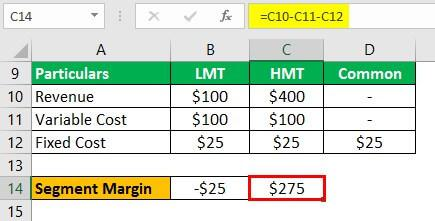

In finance and investments, understanding financial metrics and the key role they play is critical. Financial metrics are fundamental tools that help traders and investors evaluate the performance, health, and potential of their portfolios and strategies. Among these metrics, margin calculations and segment margins stand out due to their significance in the analysis and management of financial resources.

Margin calculations are essential in trading, particularly in leveraged environments where the potential for gains and losses is magnified. They represent the collateral required by brokers to cover potential losses, ensuring that both parties in a trading transaction maintain financial stability. Accurate margin calculations allow for optimized capital use and effective risk management, enabling traders to maximize their investment strategies while minimizing exposure to potential losses.



Segment margin, on the other hand, plays a pivotal role in assessing the profitability of different sections or divisions within a business. It enables companies to evaluate the performance of individual segments, allowing for informed decisions about resource allocation and strategic shifts. Understanding segment margin is crucial for businesses looking to identify their strengths and weaknesses and tailor their operations to enhance profitability.

Algorithmic trading, characterized by automated trading strategies, heavily relies on precise margin calculations. The use of advanced algorithms that consider real-time market conditions and asset-specific volatility can significantly improve decision-making and execution speed. This synthesis of financial metrics and technology provides opportunities to refine trading strategies, enhance precision, and reduce risks.

By understanding these concepts, traders and investors can better navigate the financial markets and optimize their strategies, allowing them to make informed decisions and confidently manage risks. Embarking on this exploration of financial metrics and algorithmic trading, we aim to uncover the connections between these elements and their practical applications, empowering market participants to thrive in a competitive landscape.

## Table of Contents

## Understanding Financial Metrics: Segment Margin

Segment margin is a vital financial metric used to evaluate the profitability of distinct business divisions or segments within a company. This metric serves as a tool for identifying which segments contribute most to the overall profitability, thereby enabling businesses to allocate resources more efficiently. The segment margin not only highlights profitable segments but also uncovers areas requiring strategic improvements.

**Calculation of Segment Margin:**

The segment margin is calculated by subtracting the direct costs associated with a business segment from its sales revenue. It can be expressed by the formula:

$$
\text{Segment Margin} = \text{Segment Revenue} - \text{Segment Direct Costs}
$$

Where:
- **Segment Revenue** refers to the total income earned by the segment.
- **Segment Direct Costs** include expenses directly attributable to the segment, such as cost of goods sold and specific marketing expenses.

Understanding segment margin allows businesses to effectively evaluate the strengths and weaknesses of their business strategies. By analyzing which segments yield higher margins, companies can adjust their strategies to capitalize on efficient operations or improve underperforming sectors.

**Strategic Implications:**

1. **Resource Allocation** - Organizations can use segment margin data to allocate resources towards more profitable segments, enhancing overall operational efficiency.

2. **Performance Evaluation** - Regular monitoring of segment margins helps in assessing the impact of strategic decisions on each segment, thus facilitating timely improvements.

3. **Cost Management** - Identifying segments with low margins enables more targeted cost control measures.

**Impact on Investor and Analyst Perceptions:**

Segment margin reporting can significantly influence the perceptions of investors and analysts. Detailed segment financial data provides a more granular insight into company operations, beyond the general financial statements. High segment margins might signal robust operational health, attracting investors, while declining margins can warrant questions and concern.

Therefore, transparent and accurate segment margin reporting is crucial as it can sway stakeholder confidence, directly impacting investment decisions and company valuation.

## Importance of Margin Calculations in Trading

Margin calculations are pivotal in the trading sector, serving as the collateral necessary to undertake leveraged financial positions. Traders need to efficiently calculate margins to optimize their use of capital and manage associated risks appropriately. Leveraged trading allows individuals to control larger positions with a smaller amount of capital, amplifying both potential gains and losses. Therefore, understanding and calculating margin requirements accurately is essential to avoid unnecessary financial exposure.

Margin calculators are indispensable tools that aid traders by providing the necessary margin requirements for specific trades. These calculators consider various trading parameters such as the trader's account type, leverage ratio, and the financial instrument being traded. For instance, if a trader wants to buy a financial asset worth $100,000 using a leverage of 10:1, the margin required can be calculated simply as:

$$
\text{Margin Required} = \frac{\text{Total Trade Value}}{\text{Leverage}} = \frac{100,000}{10} = 10,000
$$

Such computation enables traders to efficiently manage their capital and evaluate their financial capacity to support the desired positions.

The significance of accurate margin calculations extends to risk management. By understanding margin requirements, traders can manage their exposures and make informed decisions on position sizing. This practice helps mitigate the risk of margin calls, which occur when the value of an investor's account falls below the required maintenance margin. A margin call requires the investor to deposit additional funds or liquidate positions, potentially locking in losses.

The practical application of margin calculations is evident in modern trading environments, where sophisticated trading platforms offer seamless integration with margin calculators. These platforms often provide scenario analysis features, helping traders visualize potential outcomes based on different market conditions. For example, consider a Python script that estimates the impact of market changes on required margin:

```python
def calculate_margin(position_value, leverage):
    return position_value / leverage

def simulate_market_conditions(position_value, leverage, market_change):
    new_value = position_value * (1 + market_change)
    return calculate_margin(new_value, leverage)

# Example usage
original_margin = calculate_margin(100000, 10)
simulated_margin = simulate_market_conditions(100000, 10, -0.05)  # Simulate a 5% market drop

print(f"Original Margin: {original_margin}")
print(f"Simulated Margin after 5% drop: {simulated_margin}")
```

In this example, a trader can simulate how a 5% market drop would affect their margin requirement, assisting in proactive risk management. By leveraging margin calculators and integrating scenario analysis, traders enhance their strategic approach to capital use and risk mitigation. Margin calculations, therefore, play an essential role in optimizing trading efficiency and ensuring that traders navigate the volatile landscapes of financial markets with calculated precision.

## The Role of Margin Calculation in Algorithmic Trading

Algorithmic trading relies on precise margin calculations to execute trades effectively and minimize risk. Margin acts as collateral for leveraged positions, and accurate calculations are crucial to prevent unnecessary financial exposure. Margin calculators are tools designed to assist traders and automated systems in determining the necessary collateral based on various trading parameters, such as position size and asset [volatility](/wiki/volatility-trading-strategies).

Advanced margin calculators incorporate variables such as asset-specific volatility and prevailing market conditions, offering tailored margin requirements for a wide range of trading scenarios. This adaptability ensures that traders maintain adequate capital buffers, thereby enhancing risk management and optimizing trade execution.

A step-by-step guide for using margin calculators in [algorithmic trading](/wiki/algorithmic-trading) involves several key stages:

1. **Input Parameters**: Initially, the system requires inputs like the trading instrument, position size, leverage ratio, and current market price. This information forms the foundation of the margin calculation.

2. **Volatility Assessment**: The algorithm evaluates the asset's volatility, often using historical data as a benchmark. This assessment helps in adjusting the margin requirement relative to market risk.

3. **Margin Requirement Computation**: Based on the inputs and volatility analysis, the margin calculator computes the amount of collateral necessary to support the trade. The formula typically involves multiplying the position size by a risk factor, which accounts for volatility and leverage:
$$
   \text{Required Margin} = \text{Position Size} \times \text{Volatility Adjustment} \times \frac{1}{\text{Leverage Ratio}}

$$

4. **Scenario Analysis**: Traders can simulate different market conditions, examining how shifts in volatility or liquidity might impact margin requirements. This scenario analysis capability allows for proactive risk management by anticipating potential margin calls.

5. **Real-Time Updates**: Modern margin calculators are equipped to provide real-time updates. As market conditions evolve, the calculators automatically adjust margin requirements, ensuring that trades are consistently backed by sufficient collateral.

Incorporating margin calculators into algorithmic trading frameworks allows for dynamic decision-making, enhancing both trade efficiency and risk mitigation. Automated systems can adjust strategies in response to real-time margin adjustments, ensuring adherence to predetermined risk thresholds and maximizing capital utilization.

## Connecting Financial Metrics with Algorithmic Strategies

Integrating financial metrics, such as segment margin, into algorithmic trading strategies offers traders enhanced precision and a reduced risk profile. Segment margin analysis provides insights into the profitability of different business areas, which can be crucial when developing algorithmic trading strategies. By leveraging this metric, traders can better understand which segments are performing well, allowing them to allocate capital more efficiently and reduce exposure to riskier investments.

Incorporating these financial metrics into trading algorithms enhances decision-making by making them data-driven and reflective of a company's operational strengths. For example, segment margin analysis can identify profitable industry sectors which might be less known or counterintuitive, guiding the algorithm to prefer these areas for capital allocation.

An example of this integration can be structured through the development of an algorithm that adjusts trading positions based on segment margin indicators. Consider the following pseudocode for a simple algorithmic strategy:

```python
def trading_strategy(segment_data, threshold):
    for segment in segment_data:
        margin = calculate_segment_margin(segment.revenue, segment.cost)
        if margin > threshold:
            allocate_investment(segment)
        else:
            divest_investment(segment)

def calculate_segment_margin(revenue, cost):
    return (revenue - cost) / revenue
```

In this example, the trading strategy calculates the segment margin for each business segment and makes investment decisions based on whether the margin surpasses a pre-defined threshold. This allows the algorithm to favor segments that demonstrate higher profitability, potentially securing better returns.

The synergy between financial metrics like segment margin and algorithmic trading facilitates the optimization of risk exposure and capital allocation. By employing real-time data and updating algorithms with current market and financial information, traders can achieve a more responsive and agile trading system.

Real-world case studies demonstrate the effectiveness of integrating financial metrics into trading strategies. For instance, a trading floor may utilize segment margin reports to inform automated trading systems about the allocation of resources to various industry segments, potentially achieving a balanced risk profile across a diverse portfolio. One study might show how a trading strategy improved its return on investment by 15% by adjusting its market exposure based on segment profitability.

Such strategic decisions reinforce the notion that a solid understanding of financial metrics can lead to a more robust and successful algorithmic trading strategy. By marrying these metrics with advanced trading algorithms, traders can pave the way for smarter investment endeavors that not only optimize capital but also safeguard against market fluctuations.

## Conclusion: Navigating Financial Markets with Confidence

Financial metrics such as margin calculations and segment margin play critical roles in today's finance and trading sectors. Understanding these key concepts allows traders to fine-tune their strategic approaches and manage risks more effectively. Margin calculations, for example, ensure that traders maintain adequate collateral, protecting both themselves and the market from excessive risk.

Algorithmic trading has gained prominence as it leverages technologically advanced strategies and accurate margin mechanics to execute trades with increased precision and confidence. By automating trading processes based on predefined criteria, algorithmic systems utilize financial metrics to optimize trade execution and resource allocation. This alignment with modern financial dynamics not only enhances efficiency but also integrates risk management practices seamlessly into trading operations.

The insights offered in this article underscore the importance of integrating these metrics into trading strategies. By fully grasping the complexity and utility of financial metrics, traders and investors can navigate the intricate financial landscape more proficiently. This empowers market participants to make informed decisions, thereby optimizing their trades and aligning their activities with dynamic market opportunities. Embracing these advancements in trading techniques is essential for achieving sustainable success in the rapidly evolving world of finance.

## References & Further Reading

[1]: ["Advances in Financial Machine Learning"](https://www.amazon.com/Advances-Financial-Machine-Learning-Marcos/dp/1119482089) by Marcos Lopez de Prado

[2]: ["Evidence-Based Technical Analysis: Applying the Scientific Method and Statistical Inference to Trading Signals"](https://www.amazon.com/Evidence-Based-Technical-Analysis-Scientific-Statistical/dp/0470008741) by David Aronson

[3]: ["Machine Learning for Algorithmic Trading"](https://github.com/stefan-jansen/machine-learning-for-trading) by Stefan Jansen

[4]: ["Quantitative Trading: How to Build Your Own Algorithmic Trading Business"](https://www.amazon.com/Quantitative-Trading-Build-Algorithmic-Business/dp/1119800064) by Ernest P. Chan

[5]: Bergstra, J., Bardenet, R., Bengio, Y., & Kégl, B. (2011). ["Algorithms for Hyper-Parameter Optimization."](https://dl.acm.org/doi/10.5555/2986459.2986743) Advances in Neural Information Processing Systems 24.