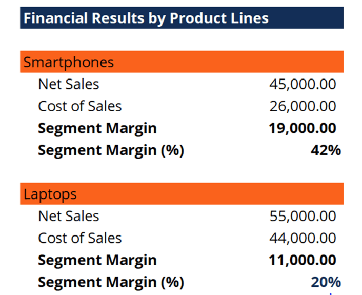

## Table of Contents

## What is segment margin?

Segment margin is a way to measure how much money a specific part of a business is making. It's calculated by taking the sales from that part of the business and subtracting the costs that are directly related to those sales. This helps business owners see which parts of their company are doing well and which ones might need more attention.

Understanding segment margin is important because it shows the profit made by each segment before other company-wide costs are taken into account. This can help managers make better decisions about where to focus their efforts and resources. For example, if one segment has a high margin, the business might decide to invest more in that area to grow it even further.

## Why is segment margin important for businesses?

Segment margin is important for businesses because it helps them see how well each part of their company is doing. By looking at the segment margin, business owners can tell which parts of their business are making money and which ones are not. This is like checking the health of different parts of your body; if one part is not doing well, you can focus on making it better.

Knowing the segment margin also helps businesses make smart decisions about where to spend their money. If one segment has a high margin, it means that part of the business is very profitable. The company might decide to put more money into that segment to make it grow even more. On the other hand, if a segment has a low margin, the business might need to find ways to cut costs or improve sales in that area. This way, segment margin acts like a guide, helping businesses to use their resources wisely.

## How do you calculate segment margin?

To calculate segment margin, you start by taking the sales from a specific part of the business. This part is called a segment. After you know the sales, you subtract the costs that are directly related to those sales. These costs are called direct costs or variable costs. They include things like the cost of the materials used to make the products or the wages of the people who work directly on that segment. Once you subtract these costs from the sales, you get the segment margin.

Segment margin is important because it shows how much profit a segment makes before other costs that the whole company has to pay are taken into account. These other costs might include things like rent for the office or salaries for managers who work across different segments. By focusing on the segment margin, you can see which parts of your business are doing well and which ones need more work. This helps you make better decisions about where to spend your money and how to grow your business.

## What are the key components needed to calculate segment margin?

To calculate segment margin, you need to know the sales from a specific part of your business, which we call a segment. Sales are the total amount of money you make from selling products or services in that segment. It's important to keep track of these sales accurately because they are the starting point for figuring out the segment margin.

The next key component you need is the direct costs, also known as variable costs, that are related to those sales. Direct costs are the expenses that you can directly link to the products or services you sell in that segment. This includes things like the cost of materials used to make the products and the wages of the people who work directly on that segment. Once you subtract these direct costs from the sales, you get the segment margin. This tells you how much profit that segment makes before other costs that affect the whole company are taken into account.

## Can you provide a simple example of segment margin calculation?

Let's say you own a small bakery and you want to see how your cake segment is doing. In one month, you sold $1,000 worth of cakes. That's your sales for the cake segment. Now, you need to figure out the direct costs for making those cakes. You spent $300 on ingredients like flour, sugar, and eggs, and another $200 on the wages of the people who bake the cakes. So, your total direct costs for the cake segment are $500.

To find the segment margin, you subtract the direct costs from the sales. In this case, you take the $1,000 in sales and subtract the $500 in direct costs. That leaves you with a segment margin of $500. This means that before you pay for other costs like rent or utilities that the whole bakery has to cover, your cake segment made a profit of $500. Knowing this helps you see if your cake segment is doing well and if you should focus more on selling cakes.

## How does segment margin differ from gross margin?

Segment margin and gross margin are both ways to measure how much money a business is making, but they look at different parts of the business. Gross margin is calculated by taking the total sales of the whole business and subtracting the cost of goods sold (COGS), which includes all the direct costs of making the products or services the business sells. This gives you a broad view of how profitable the entire business is.

Segment margin, on the other hand, focuses on a specific part of the business, called a segment. To find the segment margin, you take the sales from that segment and subtract only the direct costs related to that segment. This helps you see how well each part of your business is doing on its own, before you consider other costs that affect the whole company. By comparing segment margins, you can decide where to put more effort or resources to improve your business.

## What are common mistakes to avoid when calculating segment margin?

One common mistake when calculating segment margin is mixing up direct costs with indirect costs. Direct costs are the ones you can link straight to the segment, like the cost of materials or the wages of people working on that segment. Indirect costs, like rent or utilities, affect the whole business and should not be included when finding the segment margin. If you add indirect costs by mistake, your segment margin will be lower than it should be, and you might think the segment is not doing as well as it really is.

Another mistake is not tracking sales and costs accurately. If you don't keep good records, you might miss some sales or forget to count all the direct costs. This can lead to a wrong segment margin, making it hard to know if a segment is really making money or losing it. It's important to be careful and make sure all the numbers are right so you can make good decisions for your business.

## How can segment margin analysis improve business decision-making?

Segment margin analysis helps business owners see how well different parts of their company are doing. By looking at the segment margin, you can tell which parts of your business are making money and which ones are not. This is important because it helps you focus on the parts that need more work. For example, if one segment has a high margin, it means that part is doing well, and you might want to put more money into it to help it grow even more. On the other hand, if another segment has a low margin, you might need to find ways to cut costs or increase sales in that area to make it more profitable.

Using segment margin analysis also helps you make better decisions about where to spend your money. When you know which segments are doing well and which ones are struggling, you can choose to invest more in the successful ones or work on improving the others. This way, you can use your resources wisely and make your whole business stronger. By keeping an eye on segment margins, you can spot problems early and fix them before they get worse, helping your business run smoothly and grow over time.

## What are the challenges in accurately measuring segment margin?

One of the main challenges in accurately measuring segment margin is correctly identifying and separating direct costs from indirect costs. Direct costs are the expenses that you can directly link to a specific segment, like the cost of materials or the wages of people working on that segment. Indirect costs, like rent or utilities, affect the whole business and should not be included in the segment margin calculation. If you mix up these costs, your segment margin numbers will be wrong, and you might make bad decisions about which parts of your business are doing well.

Another challenge is keeping accurate records of sales and costs. If you don't track everything carefully, you might miss some sales or forget to count all the direct costs. This can lead to a wrong segment margin, making it hard to know if a segment is really making money or losing it. It's important to be careful and make sure all the numbers are right so you can make good decisions for your business.

## How do different industries apply segment margin differently?

Different industries use segment margin in their own special ways because each type of business has different parts that they need to keep an eye on. In the retail industry, for example, a store might look at segment margins for different departments like clothing, electronics, or home goods. They do this to see which departments are making money and which ones might need more attention or changes. This helps them decide where to put more effort or money to make the store more profitable. In the manufacturing industry, companies might break down their business into segments based on different products or production lines. They use segment margin to see if making one type of product is more profitable than another, which helps them decide what to focus on making more of.

In the service industry, like a hotel or a restaurant, segment margin can be used to look at different services or locations. A hotel might calculate segment margins for its rooms, its restaurant, and its spa to see which part is doing the best. This helps them decide where to spend money on improvements or marketing. A restaurant might look at segment margins for different types of food, like pizza or burgers, to see which is more popular and profitable. By understanding segment margins, businesses in different industries can make better decisions about how to grow and improve their operations.

## What advanced techniques can be used to enhance segment margin analysis?

One advanced technique to enhance segment margin analysis is using data analytics and machine learning. These tools can help you look at a lot of information quickly and find patterns or trends that you might miss otherwise. For example, you can use data analytics to see how different factors, like the time of year or customer feedback, affect your segment margins. Machine learning can even predict future segment margins based on past data, helping you plan better for the future. By using these tools, you can make smarter decisions about where to focus your efforts and how to improve your business.

Another technique is to use activity-based costing (ABC). This method helps you understand the true cost of each segment by looking at all the activities involved in making your products or services. With ABC, you can see which activities are costing you a lot of money and find ways to make them cheaper or more efficient. This can give you a clearer picture of your segment margins and help you find new ways to save money and increase profits. By using ABC, you can make sure that your segment margin analysis is as accurate and helpful as possible.

## How does segment margin relate to overall company profitability and strategic planning?

Segment margin is a big part of understanding how profitable a whole company is. It shows how much money each part of the business is making before you take away the costs that affect the whole company. By looking at segment margins, you can see which parts of your business are doing well and which ones are not. This helps you know where your company is making money and where it might be losing money. When you add up all the segment margins, you get a good idea of your company's overall profit. This way, segment margin helps you see the big picture of your business's health.

Segment margin also plays a key role in making smart plans for the future. When you know which segments are doing well, you can decide to put more money and effort into those areas to help them grow even more. If some segments are not doing so well, you might need to find ways to cut costs or improve sales in those areas. By using segment margin in your planning, you can focus on what will make your business stronger and more profitable. This helps you make choices that will help your company do better in the long run.

## What is Understanding Financial Metrics: Segment Margin?

Segment margin is a vital financial metric used to evaluate the profitability of distinct business divisions or segments within a company. This metric serves as a tool for identifying which segments contribute most to the overall profitability, thereby enabling businesses to allocate resources more efficiently. The segment margin not only highlights profitable segments but also uncovers areas requiring strategic improvements.

**Calculation of Segment Margin:**

The segment margin is calculated by subtracting the direct costs associated with a business segment from its sales revenue. It can be expressed by the formula:

$$
\text{Segment Margin} = \text{Segment Revenue} - \text{Segment Direct Costs}
$$

Where:
- **Segment Revenue** refers to the total income earned by the segment.
- **Segment Direct Costs** include expenses directly attributable to the segment, such as cost of goods sold and specific marketing expenses.

Understanding segment margin allows businesses to effectively evaluate the strengths and weaknesses of their business strategies. By analyzing which segments yield higher margins, companies can adjust their strategies to capitalize on efficient operations or improve underperforming sectors.

**Strategic Implications:**

1. **Resource Allocation** - Organizations can use segment margin data to allocate resources towards more profitable segments, enhancing overall operational efficiency.

2. **Performance Evaluation** - Regular monitoring of segment margins helps in assessing the impact of strategic decisions on each segment, thus facilitating timely improvements.

3. **Cost Management** - Identifying segments with low margins enables more targeted cost control measures.

**Impact on Investor and Analyst Perceptions:**

Segment margin reporting can significantly influence the perceptions of investors and analysts. Detailed segment financial data provides a more granular insight into company operations, beyond the general financial statements. High segment margins might signal robust operational health, attracting investors, while declining margins can warrant questions and concern.

Therefore, transparent and accurate segment margin reporting is crucial as it can sway stakeholder confidence, directly impacting investment decisions and company valuation.

## What is the Importance of Margin Calculations in Trading?

Margin calculations are pivotal in the trading sector, serving as the collateral necessary to undertake leveraged financial positions. Traders need to efficiently calculate margins to optimize their use of capital and manage associated risks appropriately. Leveraged trading allows individuals to control larger positions with a smaller amount of capital, amplifying both potential gains and losses. Therefore, understanding and calculating margin requirements accurately is essential to avoid unnecessary financial exposure.

Margin calculators are indispensable tools that aid traders by providing the necessary margin requirements for specific trades. These calculators consider various trading parameters such as the trader's account type, leverage ratio, and the financial instrument being traded. For instance, if a trader wants to buy a financial asset worth $100,000 using a leverage of 10:1, the margin required can be calculated simply as:

$$
\text{Margin Required} = \frac{\text{Total Trade Value}}{\text{Leverage}} = \frac{100,000}{10} = 10,000
$$

Such computation enables traders to efficiently manage their capital and evaluate their financial capacity to support the desired positions.

The significance of accurate margin calculations extends to risk management. By understanding margin requirements, traders can manage their exposures and make informed decisions on position sizing. This practice helps mitigate the risk of margin calls, which occur when the value of an investor's account falls below the required maintenance margin. A margin call requires the investor to deposit additional funds or liquidate positions, potentially locking in losses.

The practical application of margin calculations is evident in modern trading environments, where sophisticated trading platforms offer seamless integration with margin calculators. These platforms often provide scenario analysis features, helping traders visualize potential outcomes based on different market conditions. For example, consider a Python script that estimates the impact of market changes on required margin:

```python
def calculate_margin(position_value, leverage):
    return position_value / leverage

def simulate_market_conditions(position_value, leverage, market_change):
    new_value = position_value * (1 + market_change)
    return calculate_margin(new_value, leverage)

# Example usage
original_margin = calculate_margin(100000, 10)
simulated_margin = simulate_market_conditions(100000, 10, -0.05)  # Simulate a 5% market drop

print(f"Original Margin: {original_margin}")
print(f"Simulated Margin after 5% drop: {simulated_margin}")
```

In this example, a trader can simulate how a 5% market drop would affect their margin requirement, assisting in proactive risk management. By leveraging margin calculators and integrating scenario analysis, traders enhance their strategic approach to capital use and risk mitigation. Margin calculations, therefore, play an essential role in optimizing trading efficiency and ensuring that traders navigate the volatile landscapes of financial markets with calculated precision.

## What is the Role of Margin Calculation in Algorithmic Trading?

Algorithmic trading relies on precise margin calculations to execute trades effectively and minimize risk. Margin acts as collateral for leveraged positions, and accurate calculations are crucial to prevent unnecessary financial exposure. Margin calculators are tools designed to assist traders and automated systems in determining the necessary collateral based on various trading parameters, such as position size and asset [volatility](/wiki/volatility-trading-strategies).

Advanced margin calculators incorporate variables such as asset-specific volatility and prevailing market conditions, offering tailored margin requirements for a wide range of trading scenarios. This adaptability ensures that traders maintain adequate capital buffers, thereby enhancing risk management and optimizing trade execution.

A step-by-step guide for using margin calculators in [algorithmic trading](/wiki/algorithmic-trading) involves several key stages:

1. **Input Parameters**: Initially, the system requires inputs like the trading instrument, position size, leverage ratio, and current market price. This information forms the foundation of the margin calculation.

2. **Volatility Assessment**: The algorithm evaluates the asset's volatility, often using historical data as a benchmark. This assessment helps in adjusting the margin requirement relative to market risk.

3. **Margin Requirement Computation**: Based on the inputs and volatility analysis, the margin calculator computes the amount of collateral necessary to support the trade. The formula typically involves multiplying the position size by a risk factor, which accounts for volatility and leverage:
$$
   \text{Required Margin} = \text{Position Size} \times \text{Volatility Adjustment} \times \frac{1}{\text{Leverage Ratio}}

$$

4. **Scenario Analysis**: Traders can simulate different market conditions, examining how shifts in volatility or liquidity might impact margin requirements. This scenario analysis capability allows for proactive risk management by anticipating potential margin calls.

5. **Real-Time Updates**: Modern margin calculators are equipped to provide real-time updates. As market conditions evolve, the calculators automatically adjust margin requirements, ensuring that trades are consistently backed by sufficient collateral.

Incorporating margin calculators into algorithmic trading frameworks allows for dynamic decision-making, enhancing both trade efficiency and risk mitigation. Automated systems can adjust strategies in response to real-time margin adjustments, ensuring adherence to predetermined risk thresholds and maximizing capital utilization.

## References & Further Reading

[1]: ["Advances in Financial Machine Learning"](https://www.amazon.com/Advances-Financial-Machine-Learning-Marcos/dp/1119482089) by Marcos Lopez de Prado

[2]: ["Evidence-Based Technical Analysis: Applying the Scientific Method and Statistical Inference to Trading Signals"](https://www.amazon.com/Evidence-Based-Technical-Analysis-Scientific-Statistical/dp/0470008741) by David Aronson

[3]: ["Machine Learning for Algorithmic Trading"](https://github.com/stefan-jansen/machine-learning-for-trading) by Stefan Jansen

[4]: ["Quantitative Trading: How to Build Your Own Algorithmic Trading Business"](https://www.amazon.com/Quantitative-Trading-Build-Algorithmic-Business/dp/1119800064) by Ernest P. Chan

[5]: Bergstra, J., Bardenet, R., Bengio, Y., & Kégl, B. (2011). ["Algorithms for Hyper-Parameter Optimization."](https://dl.acm.org/doi/10.5555/2986459.2986743) Advances in Neural Information Processing Systems 24.