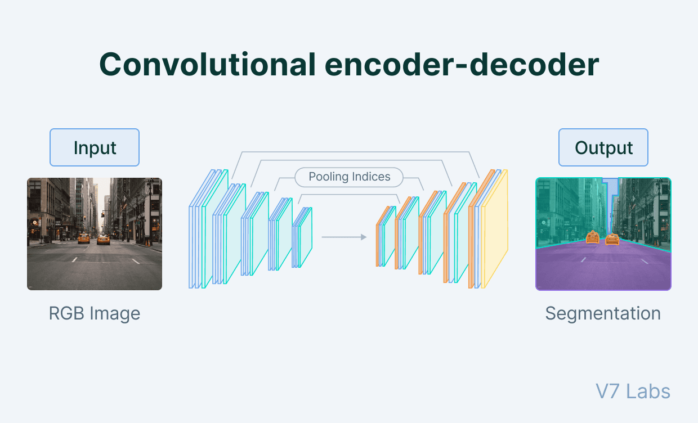

## Table of Contents

## What is semantic segmentation in the context of machine learning?

Semantic segmentation is a type of image analysis in machine learning where the goal is to label each pixel in an image with a class that represents what the pixel is part of. For example, in a picture of a street, semantic segmentation would label all pixels that are part of cars as "car," all pixels that are part of the road as "road," and so on. This is different from just recognizing that there is a car in the image; it's about understanding exactly where the car is, pixel by pixel.

This technique is very useful in many applications, like self-driving cars, where knowing the exact location of objects in the environment is crucial for safe navigation. To perform semantic segmentation, machine learning models, often deep neural networks, are trained on large datasets of images where each pixel is already labeled. These models learn to predict the class of each pixel in new images. The accuracy of these predictions can be measured using metrics like the Intersection over Union (IoU), which compares the predicted segmentation to the actual segmentation.

## How does semantic segmentation differ from instance segmentation and object detection?

Semantic segmentation, instance segmentation, and object detection are all about understanding what's in an image, but they do it in different ways. Semantic segmentation looks at every single pixel in an image and labels it with a category. For example, if you have a picture with cars and trees, semantic segmentation would label all the pixels that are part of cars as "car" and all the pixels that are part of trees as "tree". It doesn't care if there are multiple cars; it just sees "car" pixels.

Instance segmentation takes it a step further. It not only labels each pixel with a category, but it also tells you which specific object that pixel belongs to. So, if you have three cars in your picture, instance segmentation would label the pixels of each car separately, like "car 1", "car 2", and "car 3". This way, you can tell them apart, even if they're the same type of object. Object detection, on the other hand, doesn't care about every pixel. It just draws a box around each object it finds and labels it. So, it would put a box around each car and label it "car", but it wouldn't tell you exactly where the car ends and the road begins.

In summary, semantic segmentation is about labeling every pixel with a category, instance segmentation is about labeling every pixel and distinguishing between different instances of the same category, and object detection is about finding and labeling objects with boxes. Each method has its own use, depending on how much detail you need about the objects in the image.

## What are some common applications of semantic segmentation?

Semantic segmentation is used a lot in self-driving cars. It helps the car understand what it's seeing on the road. By labeling every pixel in the view from the car's cameras, the car can tell the difference between the road, other cars, pedestrians, and signs. This is really important for the car to drive safely and make good decisions about where to go and how fast to go.

Another common use of semantic segmentation is in medical imaging. Doctors use it to look at scans of the body, like MRIs or CT scans. Semantic segmentation can help label different parts of the body or find diseases. For example, it can show the difference between healthy tissue and a tumor, which helps doctors plan treatments better. This makes it easier for doctors to see what's going on inside the body and make better decisions about how to help their patients.

## Can you explain the basic architecture of a U-Net model?

The U-Net model is a popular type of [neural network](/wiki/neural-network) used for semantic segmentation. It's called U-Net because its architecture looks like the letter "U" when you draw it out. The model has two main parts: an encoder and a decoder. The encoder part takes the input image and makes it smaller and smaller, kind of like zooming out. It does this by using layers that reduce the size of the image while also finding important features. Each time the image gets smaller, the model learns more about what's in the picture. The decoder part does the opposite. It takes the small image and makes it bigger and bigger, kind of like zooming in, until it's the same size as the original image. While doing this, it uses the information from the encoder to label each pixel in the final image.

The cool thing about U-Net is how it connects the encoder and decoder. At each step where the encoder makes the image smaller, it saves some information. Then, when the decoder is making the image bigger again, it uses this saved information to help it figure out what to do. These connections are called skip connections. They help the model keep important details that might get lost when the image is made smaller. By using skip connections, U-Net can make very accurate segmentations, even for small objects in the image. This makes it really useful for tasks like medical imaging, where you need to see small details clearly.

## How does Fully Convolutional Network (FCN) approach semantic segmentation?

A Fully Convolutional Network (FCN) is a type of neural network used for semantic segmentation. Unlike traditional networks that use fully connected layers at the end, FCNs use only convolutional layers. This means they can take in images of any size and produce an output that's the same size as the input. The main idea behind FCNs is to use layers that shrink the image down to find important features, and then use layers that expand the image back to its original size, labeling each pixel with a category. This is done by using something called transposed convolutions, which help the network grow the image back to its original size.

FCNs work by first shrinking the image through a series of convolutional and pooling layers. This part of the network is called the encoder. The encoder finds important features in the image, like edges and shapes. After the image is shrunk down, the network uses transposed convolutions to expand it back to its original size. This part is called the decoder. The decoder uses the features found by the encoder to label each pixel in the final image. To make the segmentation more accurate, FCNs often use skip connections, which take information from the encoder and add it to the decoder at different stages. This helps the network keep important details that might get lost when the image is shrunk down.

## What improvements does DeepLabv3 offer over its predecessors?

DeepLabv3 offers several improvements over its predecessors, mainly focusing on better capturing object boundaries and handling objects at multiple scales. One key improvement is the introduction of Atrous Spatial Pyramid Pooling (ASPP), which helps the network see the image at different scales without losing important details. ASPP uses filters with different rates of dilation, which means it can look at the image in different ways, kind of like using different zoom levels at the same time. This helps the network understand both small details and larger structures in the image.

Another improvement in DeepLabv3 is better handling of the trade-off between accuracy and speed. By using atrous convolutions, which allow the network to expand its field of view without increasing the number of parameters, DeepLabv3 can process images faster while still being accurate. This makes it more practical for real-world applications where speed matters, like in self-driving cars or medical imaging. Overall, these changes make DeepLabv3 a more powerful tool for semantic segmentation, offering better results and more flexibility in how it can be used.

## How does PSPNet utilize pyramid pooling to enhance segmentation?

PSPNet, or Pyramid Scene Parsing Network, uses a special technique called pyramid pooling to make its segmentation better. Pyramid pooling helps the network see the whole image at different sizes all at once. It does this by taking the image and making four smaller versions of it, each at a different size. Then, it looks at each of these smaller images and finds important features in them. After that, it puts all these features back together into the original image size. This way, the network can understand both the big picture and the small details, which makes its segmentation more accurate.

The pyramid pooling module in PSPNet works by dividing the feature map into different sizes. For example, it might divide the image into 1x1, 2x2, 3x3, and 6x6 grids. Each grid size captures different levels of detail. The 1x1 grid looks at the whole image as one big piece, while the 6x6 grid looks at smaller parts of the image. After getting features from each grid, PSPNet combines them all together. This combination helps the network understand the context of the image better, which is really important for labeling each pixel correctly in semantic segmentation.

## What makes SegFormer unique among other semantic segmentation models?

SegFormer is unique because it uses a special way of mixing different sizes of images to understand them better. It does this with something called a hierarchical transformer encoder. This encoder looks at the image in different levels of detail, from big to small. By doing this, SegFormer can see both the overall picture and the tiny details, which helps it label each pixel more accurately. Another cool thing about SegFormer is that it doesn't need a lot of different versions of itself to work well. Many other models need to be trained in different sizes to handle different tasks, but SegFormer can do a good job with just one size.

SegFormer also uses a simple decoder that makes it easier to label the pixels. This decoder takes the information from the encoder and turns it into a final image where each pixel is labeled with a category. Because the decoder is simple, SegFormer can work quickly and still be very accurate. This makes it really useful for things like self-driving cars or medical imaging, where you need fast and correct results. Overall, SegFormer's way of looking at images in different sizes and its simple decoder make it stand out from other semantic segmentation models.

## Can you describe the efficiency-focused design of ENet?

ENet, or Efficient Neural Network, is designed to be really fast and use less computer power. It does this by using special layers called bottleneck layers. These layers make the network smaller and quicker by only keeping the most important information. ENet also uses something called early downsampling, which means it makes the image smaller right at the start. This helps the network process the image faster without losing too much important detail.

Another way ENet saves time and power is by using a mix of regular and special layers. The special layers are called PReLU and ELU, which help the network learn better and faster. ENet also uses something called spatial dropout, which helps the network not to rely too much on any one part of the image. All these things together make ENet very good at doing semantic segmentation quickly and with less computer power, which is great for things like self-driving cars or mobile devices where speed and efficiency are really important.

## How does the architecture of DeepLabv2 improve upon DeepLab?

DeepLabv2 improves on the original DeepLab by using a technique called Atrous Spatial Pyramid Pooling (ASPP). ASPP helps the network see the image at different scales without losing important details. It does this by using filters with different dilation rates. Imagine looking at a picture through different magnifying glasses at the same time. This way, DeepLabv2 can understand both small details and larger structures in the image, making its segmentation more accurate.

Another improvement in DeepLabv2 is better handling of object boundaries. It uses a method called DenseCRF (Dense Conditional Random Field) after the network's main part to refine the segmentation results. DenseCRF helps smooth out the edges of objects, making the segmentation look cleaner and more precise. These changes make DeepLabv2 a more powerful tool for semantic segmentation, offering better results and more flexibility in how it can be used.

## What role does attention play in models like PSANet for semantic segmentation?

Attention in models like PSANet helps the network focus on the most important parts of the image. It's like telling the network to pay more attention to certain areas while ignoring others. This is really helpful in semantic segmentation because it makes the network better at understanding what's in the image and labeling each pixel correctly. PSANet uses a special kind of attention called Point-wise Spatial Attention. This attention looks at the image pixel by pixel and decides which pixels are more important for understanding the whole scene. By doing this, PSANet can make more accurate segmentations, even in complex images with lots of different objects.

The way attention works in PSANet is by creating a map that shows which parts of the image are more important. This map is then used to guide the network in its segmentation task. By focusing on the right areas, the network can better understand the context of the image and make better decisions about how to label each pixel. This makes PSANet very good at handling images where the objects are close together or where the background is complicated. Overall, attention in PSANet helps improve the accuracy and effectiveness of semantic segmentation, making it a powerful tool for tasks like self-driving cars or medical imaging.

## How do transformer-based models like SETR and UCTransNet approach semantic segmentation differently from traditional CNN-based models?

Transformer-based models like SETR and UCTransNet approach semantic segmentation differently from traditional CNN-based models by using a mechanism called attention. Attention helps these models focus on different parts of the image at the same time. It's like looking at the whole picture and deciding which parts are more important. This is different from CNNs, which look at the image in small pieces and build up their understanding step by step. Transformers can see the big picture and the small details all at once, which makes them good at understanding complex scenes. For example, SETR uses a transformer to look at the image in different ways and then labels each pixel based on what it sees.

UCTransNet also uses transformers but adds something called a U-shaped structure, similar to U-Net. This structure helps the model keep important details as it processes the image. The U-shape lets the model shrink the image down to find big features and then grow it back up to label each pixel. This is different from traditional CNNs, which might lose some details as they go. By combining transformers with this U-shaped structure, UCTransNet can make very accurate segmentations, even for small objects. Overall, transformer-based models like SETR and UCTransNet bring a new way of looking at images, focusing on both the big picture and the small details, which can make semantic segmentation more effective.