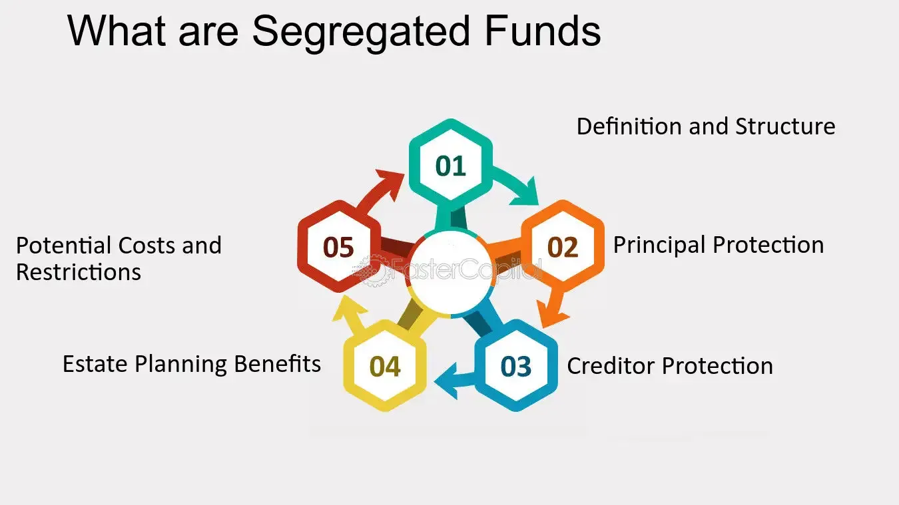

## Table of Contents

## What is a segregated fund?

A segregated fund is a type of investment product offered by insurance companies. It is similar to a mutual fund, but it comes with an insurance feature that can protect some or all of your money if the investment loses value. This insurance feature is called a guarantee, and it can help you feel more secure about your investment.

When you invest in a segregated fund, your money is pooled with other investors' money and managed by a professional. The fund can invest in different assets like stocks, bonds, or other securities. The main difference from a mutual fund is that segregated funds offer the possibility of getting back a certain percentage of your initial investment, usually between 75% to 100%, even if the market goes down. This makes segregated funds a popular choice for people who want to invest but are worried about losing their money.

## How does a segregated fund differ from a mutual fund?

A segregated fund and a mutual fund are similar because they both pool money from many people to invest in different assets like stocks and bonds. They are managed by professionals who decide where to invest the money. But there is a big difference between them. A segregated fund is offered by insurance companies, while a mutual fund is offered by investment companies.

The main difference is that segregated funds come with a special feature called a guarantee. This means if you invest in a segregated fund, you might get back a big part of your money, even if the investments do not do well. Usually, you can get back between 75% to 100% of what you put in. Mutual funds do not have this guarantee, so you could lose money if the market goes down. This makes segregated funds a safer choice for people who want to invest but are worried about losing their money.

## What are the main benefits of investing in segregated funds?

One of the biggest benefits of investing in segregated funds is the guarantee they offer. This means you can get back a big part of your money, usually between 75% to 100%, even if the market goes down. This can make you feel safer when you invest because you know you won't lose everything. It's like having a safety net for your money.

Another benefit is that segregated funds can help you avoid probate. Probate is a legal process that can happen when someone passes away, and it can take a long time and cost a lot of money. With segregated funds, you can name a beneficiary, and the money can go straight to them without going through probate. This makes things easier and faster for your family.

Lastly, segregated funds offer privacy. When you invest in them, the details of your investments are kept private. This is different from mutual funds, where some information might be public. If you care about keeping your financial matters private, segregated funds can be a good choice.

## Can you explain the concept of capital protection in segregated funds?

Capital protection in segregated funds means that you can get back a big part of your money even if the investments don't do well. When you invest in a segregated fund, the insurance company promises to give you back a certain percentage of your initial investment, usually between 75% to 100%, no matter how the market performs. This is called a guarantee, and it helps you feel safer about putting your money into the fund because you know you won't lose everything.

This guarantee is what makes segregated funds different from other investments like mutual funds. With mutual funds, if the market goes down, you could lose a lot of your money. But with segregated funds, the insurance part of the fund protects your money. This makes segregated funds a good choice for people who want to invest but are worried about losing their money. It's like having a safety net for your investment.

## What is the maturity guarantee offered by segregated funds?

The maturity guarantee in segregated funds is a promise made by the insurance company that you will get back a certain percentage of your money when the investment term ends. This is usually between 75% to 100% of what you originally put in. It doesn't matter if the investments in the fund did well or not, you are guaranteed to get back that percentage at the end of the term. This makes segregated funds a safer choice for people who want to invest but are worried about losing their money.

The length of the term for the maturity guarantee can vary, but it is often set for a certain number of years, like 10 years. If you keep your money in the fund until the end of this term, you can take advantage of the guarantee. This feature is what makes segregated funds different from other investments like mutual funds, which don't offer this kind of protection. It gives you peace of mind knowing that a big part of your money is safe, no matter what happens in the market.

## How does the death benefit guarantee work in segregated funds?

The death benefit guarantee in segregated funds is a special feature that helps your family if you pass away. When you invest in a segregated fund, you can name someone as a beneficiary. If you die while your money is in the fund, the insurance company promises to give your beneficiary a certain percentage of your money, usually between 75% to 100% of what you originally put in. This is called the death benefit guarantee, and it's there to help your family get money even if the investments didn't do well.

This guarantee works no matter how the market is doing. It's like a safety net for your loved ones. If the investments in the fund go down, your beneficiary still gets the guaranteed amount. This makes segregated funds a good choice for people who want to make sure their family is taken care of, even if they pass away unexpectedly. It's a way to protect your investment and help your family at the same time.

## What are the typical fees associated with segregated funds?

Segregated funds come with different fees that you need to know about. One of the main fees is the management expense ratio (MER), which is a percentage of the fund's assets that goes towards paying for the management and operation of the fund. The MER for segregated funds is usually higher than for mutual funds because of the extra insurance features like the maturity and death benefit guarantees. This fee can range from about 1.5% to 3% or more of your investment each year.

Another fee you might see is the sales charge, which is what you pay when you buy or sell the fund. There are different ways to pay this fee. You can pay it upfront when you buy the fund, which is called a front-end load, or you can pay it when you sell the fund, which is called a back-end load or deferred sales charge (DSC). The sales charge can be a percentage of your investment, and it can vary depending on the specific fund and how you choose to pay it.

Some segregated funds might also have other fees, like fees for switching between different funds within the same company, or fees for early withdrawal if you take your money out before the end of the guarantee period. It's important to read the fund's prospectus or talk to your financial advisor to understand all the fees you might have to pay, so you can make a good decision about whether a segregated fund is right for you.

## Who should consider investing in segregated funds?

People who are worried about losing their money in the stock market should think about investing in segregated funds. These funds come with a special promise from the insurance company that you can get back a big part of your money, even if the market goes down. This is called a guarantee, and it can be between 75% to 100% of what you put in. If you want to invest but feel safer knowing that your money is protected, segregated funds could be a good choice for you.

Also, if you want to make sure your family gets money quickly and easily if something happens to you, segregated funds can help. You can name someone as a beneficiary, and if you pass away, they will get a guaranteed amount of your investment, no matter how the market is doing. This can help your family avoid a long and costly legal process called probate. So, if you care about protecting your family and keeping your investments private, segregated funds might be right for you.

## How do segregated funds fit into estate planning?

Segregated funds can be a helpful part of estate planning because they let you name a beneficiary. When you do this, the money in the fund can go straight to your beneficiary if you pass away, without going through a long and costly legal process called probate. This makes things easier and faster for your family. Plus, the details of your investments stay private, which can be important if you want to keep your financial matters confidential.

Another big reason segregated funds are good for estate planning is the death benefit guarantee. This means that if you die, your beneficiary is promised to get back a certain percentage of your money, usually between 75% to 100%, no matter how the market is doing. This can give you peace of mind knowing that your family will get a big part of your investment, even if the market goes down. So, if you want to make sure your loved ones are taken care of and your money is protected, segregated funds can be a smart choice for your estate plan.

## What are the tax implications of investing in segregated funds?

When you invest in segregated funds, you need to know about the taxes. If you keep your money in the fund and it makes money, you will have to pay taxes on any gains or income the fund earns each year. This is called taxable income, and it can include things like interest, dividends, or capital gains. The taxes are based on your personal tax rate, so how much you pay depends on how much money you make in total.

If you take money out of the fund, you might have to pay more taxes. If you take out more money than you put in, the extra money is called a capital gain, and you will have to pay tax on half of that gain. But if you take out less money than you put in, you can use the loss to reduce your taxes. Also, if you name a beneficiary and you die, the money they get might be taxed differently depending on who the beneficiary is and how they choose to receive the money. It's a good idea to talk to a tax advisor to understand all the tax rules for segregated funds.

## How do segregated funds perform compared to other investment vehicles?

Segregated funds often have higher fees than other investment vehicles like mutual funds or exchange-traded funds (ETFs) because they come with extra insurance features like guarantees. These higher fees can affect how well your investment grows over time. When you compare the performance of segregated funds to other investments, you need to think about both the returns and the fees. If the fees are too high, they can eat into your returns, making the overall performance of segregated funds less attractive than other options that might have lower fees.

That being said, segregated funds can still be a good choice for some people because of the safety they offer. The guarantees they provide can protect your money if the market goes down, which is something that other investments like mutual funds or ETFs don't offer. So, while the returns might not be as high as other investment vehicles after fees, the peace of mind that comes with knowing a big part of your money is safe can be worth it for people who want to invest but are worried about losing their money.

## What are the regulatory requirements for segregated funds in Canada?

In Canada, segregated funds are regulated by the insurance companies that offer them, and they have to follow rules set by the Canadian Life and Health Insurance Association (CLHIA) and the provincial insurance regulators. These rules are there to make sure that the funds are safe and that the insurance companies can keep their promises, like the guarantees they offer. The insurance companies have to follow strict rules about how much money they need to have in reserve to cover the guarantees, and they have to report regularly to the regulators to show that they are following the rules.

The rules also say that segregated funds have to give investors clear information about the fees, risks, and guarantees. This is to help people understand what they are investing in and make good choices. The funds have to give out a document called a "Fund Facts" sheet, which explains everything in simple language. This helps investors know what to expect and makes sure they are treated fairly.

## What are the essentials of financial planning?

Successful financial planning plays a pivotal role in achieving long-term financial stability and wealth growth. At its core, financial planning involves the careful management and allocation of resources to meet specific financial goals. By incorporating a diverse range of investment vehicles such as stocks, bonds, and segregated funds, investors can effectively balance risk and reward, thereby enhancing the resilience of their investment portfolio.

Diversity in investment is akin to distributing eggs in different baskets, reducing the overall risk associated with market [volatility](/wiki/volatility-trading-strategies). Stocks, known for their potential for high returns, also come with significant risks. Conversely, bonds are often regarded as safer investment options, providing steady but lower returns. Segregated funds, mostly utilized in Canada, combine benefits of mutual funds with insurance protections, offering unique advantages like capital guarantees upon maturity or death. This blend of investment vehicles can mitigate specific risks while leveraging growth opportunities across asset classes.

Strategic allocation involves the distribution of resources across various asset types and is fundamental to achieving investment objectives. This process is often guided by the Modern Portfolio Theory (MPT), which suggests maximizing returns for a given level of risk through optimal asset allocation. The formula often employed in this context is the risk-to-reward ratio: 

$$
\text{Sharpe Ratio} = \frac{E[R_i] - R_f}{\sigma_i}
$$

where:
- $E[R_i]$ is the expected return of the investment,
- $R_f$ is the risk-free rate,
- $\sigma_i$ is the standard deviation of the investment's excess return.

Regularly assessing and realigning financial goals according to market conditions and personal circumstances ensures that the investment strategy remains relevant and effective. Such assessments allow individuals to adjust their portfolios in response to changes in risk tolerance, life stages, or financial objectives.

Another fundamental aspect of financial planning is understanding one's risk tolerance and financial objectives. Risk tolerance, the degree of variability in investment returns that an investor is willing to withstand, is influenced by factors such as age, income, financial goals, and life circumstances. A comprehensive understanding of one's risk appetite allows for crafting a portfolio that not only matches current objectives but also possesses the flexibility to adapt to future demands.

In conclusion, financial planning requires a holistic approach combining a broad spectrum of investment vehicles, strategic allocation, and continuous evaluation of financial goals. By adhering to these principles, investors can construct robust portfolios capable of weathering economic fluctuations while pursuing steady wealth accumulation.

## References & Further Reading

[1]: ["Segregated Funds Explained"](https://www.investopedia.com/terms/s/segregatedfund.asp) by Sun Life Financial

[2]: ["Algorithmic Trading and DMA: An Introduction to Direct Access Trading Strategies"](https://www.amazon.com/Algorithmic-Trading-DMA-introduction-strategies/dp/0956399207) by Barry Johnson

[3]: ["Python for Finance: Mastering Data-Driven Finance"](https://www.amazon.com/Python-Finance-Mastering-Data-Driven/dp/1492024333) by Yves Hilpisch

[4]: ["Modern Portfolio Theory and Investment Analysis"](https://books.google.com/books/about/Modern_Portfolio_Theory_and_Investment_A.html?id=181CEAAAQBAJ) by Edwin J. Elton, Martin J. Gruber, Stephen J. Brown, and William N. Goetzmann

[5]: ["High-Frequency Trading: A Practical Guide to Algorithmic Strategies and Trading Systems"](https://www.amazon.com/High-Frequency-Trading-Practical-Algorithmic-Strategies/dp/1118343506) by Irene Aldridge