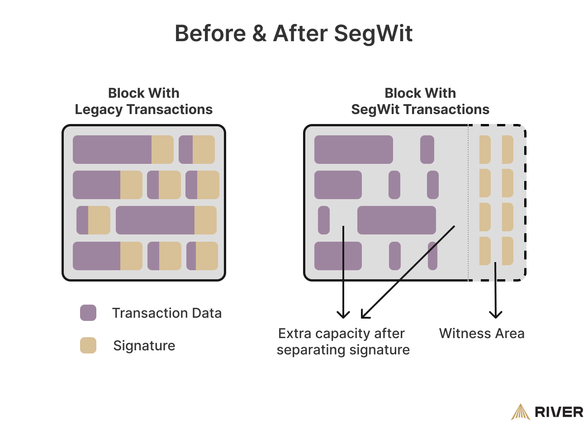

## Table of Contents

## What is Segregated Witness (SegWit)?

Segregated Witness, or SegWit, is a change made to the Bitcoin network to fix some problems and make it work better. Before SegWit, some transactions could get stuck because of how they were made, and this could slow down the whole network. SegWit separates the signature data from the transaction data, which makes the transactions smaller and easier to process. This helps the network handle more transactions at once and makes it faster.

Another good thing about SegWit is that it makes transactions safer. By moving the signature data out of the main part of the transaction, it's harder for someone to change the transaction and trick the network. This also makes it easier to add new features to Bitcoin in the future, like the Lightning Network, which can make transactions even faster and cheaper. Overall, SegWit has made Bitcoin better by fixing problems and opening up new possibilities.

## Why was SegWit introduced to Bitcoin?

SegWit was introduced to Bitcoin to fix a big problem that was slowing down the network. Before SegWit, some transactions could get stuck because of how they were made. This made the whole network slower and less able to handle a lot of transactions at once. By separating the signature data from the transaction data, SegWit made transactions smaller and easier to process. This helped the network to work faster and handle more transactions.

Another reason for introducing SegWit was to make Bitcoin transactions safer. Before SegWit, it was easier for someone to change a transaction and trick the network. By moving the signature data out of the main part of the transaction, SegWit made it harder for anyone to mess with transactions. This not only made Bitcoin more secure but also opened up new possibilities for future improvements, like the Lightning Network, which can make transactions even faster and cheaper.

## How does SegWit improve the Bitcoin network?

SegWit helps the Bitcoin network by making transactions smaller and easier to handle. Before SegWit, transactions could get stuck and slow down the whole network. This happened because the way transactions were made took up a lot of space. SegWit fixes this by taking the signature part of the transaction and putting it in a different place. This makes the main part of the transaction smaller, so the network can process more transactions at once and work faster.

Another way SegWit improves Bitcoin is by making transactions safer. Before SegWit, it was easier for someone to change a transaction and trick the network. By moving the signature part out of the main transaction, SegWit makes it much harder for anyone to mess with transactions. This not only makes Bitcoin more secure but also helps with future improvements. For example, it makes it easier to add things like the Lightning Network, which can make transactions even faster and cheaper.

## What are the main technical changes SegWit brings to the Bitcoin protocol?

SegWit brings a big change to how Bitcoin transactions are made. Before SegWit, the signature part of a transaction was included in the main part of the transaction. This made transactions bigger and harder to process. SegWit fixes this by taking the signature part and putting it in a different place, called the witness. This makes the main part of the transaction smaller, so the network can handle more transactions at once and work faster.

Another important change SegWit makes is how it counts the size of transactions. Before SegWit, every part of a transaction counted the same way. With SegWit, the signature part is counted differently. It's given less weight, which means more transactions can fit into each block. This helps the network process transactions more quickly and efficiently.

## How does SegWit address the problem of transaction malleability?

SegWit helps fix the problem of transaction malleability, which is when someone can change a transaction's ID before it's confirmed on the blockchain. Before SegWit, if someone changed the signature part of a transaction, it would get a new ID. This could cause problems, especially for transactions that depend on other transactions, like in smart contracts or payment channels.

SegWit solves this by moving the signature part of the transaction to a separate place called the witness. Because the signature is no longer part of the main transaction data, changing it doesn't change the transaction's ID. This makes transactions more reliable and secure, helping to prevent issues caused by transaction malleability.

## What is the impact of SegWit on transaction size and block capacity?

SegWit makes transactions smaller by moving the signature part to a different place called the witness. This means the main part of the transaction takes up less space. Because of this, more transactions can fit into each block on the Bitcoin network. Before SegWit, a block could hold about 1 MB of data. With SegWit, the effective capacity of a block can go up to around 4 MB, depending on how many transactions use SegWit.

This increase in block capacity helps the Bitcoin network handle more transactions at once. When transactions are smaller, they are easier and quicker to process. This means the network can work faster and there are fewer delays. Overall, SegWit helps make the Bitcoin network more efficient and able to handle more activity.

## How is SegWit implemented in Bitcoin transactions?

SegWit changes how Bitcoin transactions are made. Before SegWit, the signature part of a transaction was included in the main part of the transaction. This made transactions bigger and harder for the network to process. SegWit fixes this by moving the signature part to a different place called the witness. This makes the main part of the transaction smaller, so more transactions can fit into each block on the Bitcoin network.

When you make a transaction with SegWit, the network counts the size of the transaction differently. The signature part is given less weight, which means it doesn't take up as much space in the block as it used to. This helps the network process transactions more quickly and efficiently. By making transactions smaller and easier to handle, SegWit helps the Bitcoin network work better and handle more transactions at once.

## What are the steps to activate SegWit on the Bitcoin network?

Activating SegWit on the Bitcoin network involved a process called a soft fork. This means that the change was backward compatible, so old nodes on the network could still work with the new rules. To start the process, miners had to signal their support for SegWit. They did this by including a special signal in the blocks they mined. Once a certain number of blocks, specifically 95% of the blocks over a period of two weeks, included this signal, SegWit was activated.

After the signaling period, SegWit was officially activated on the Bitcoin network. This happened on August 24, 2017. Once activated, new transactions could use the SegWit format, which separates the signature part of the transaction into a different place called the witness. This made transactions smaller and helped the network handle more transactions at once. Over time, more and more users and services started using SegWit, improving the overall efficiency and capacity of the Bitcoin network.

## What are the differences between native SegWit and wrapped SegWit addresses?

Native SegWit and wrapped SegWit addresses are two ways to use SegWit on the Bitcoin network. Native SegWit addresses start with "bc1" and are the newer type of address. They are more efficient because they can hold more data in a smaller space. This makes transactions even smaller and helps the network work better. Native SegWit addresses are the best way to use SegWit and are recommended for new transactions.

Wrapped SegWit addresses, on the other hand, start with "3" and are an older type of address. They were created to help people start using SegWit without changing their software right away. Wrapped SegWit still uses SegWit but in a way that's backward compatible with older systems. While they are not as efficient as native SegWit addresses, they helped more people start using SegWit and improve the network. Over time, more people have switched to using native SegWit addresses for their benefits.

## How does SegWit affect the economics of mining and transaction fees?

SegWit changes the way miners earn money from transaction fees. Before SegWit, miners got paid based on the size of the transactions they included in blocks. With SegWit, transactions are smaller because the signature part is moved to a different place. This means more transactions can fit into each block. Miners can include more transactions and earn more fees overall, even if the fee per transaction is lower. This makes mining more profitable because they can process more transactions without changing the block size limit.

SegWit also affects the fees that users pay for transactions. Because transactions are smaller and the network can handle more of them, there's less competition for space in blocks. This can lead to lower fees for users, especially during busy times when the network used to get clogged. With SegWit, users can send transactions more quickly and at a lower cost, making Bitcoin more useful for everyday transactions.

## What are the potential security benefits and risks associated with SegWit?

SegWit brings some big security benefits to Bitcoin. It fixes the problem of transaction malleability, which used to let people change transactions before they were confirmed. By moving the signature part of the transaction to a different place, SegWit makes it much harder for anyone to mess with transactions. This makes Bitcoin safer and more reliable, especially for things like smart contracts and payment channels that depend on other transactions. It also makes it easier to add new features that can make Bitcoin even more secure in the future.

But there are also some risks to think about with SegWit. Because it changes how transactions are made and counted, there could be problems if some parts of the network don't update to support SegWit. This could lead to confusion and mistakes, like sending money to the wrong kind of address. Also, while SegWit makes transactions smaller and easier to process, it doesn't fix all of Bitcoin's problems. So, it's important to keep working on making Bitcoin better and safer, even after SegWit is in place.

## How has the adoption of SegWit evolved since its implementation, and what are the future prospects?

Since SegWit was activated on the Bitcoin network in August 2017, its adoption has grown a lot. At first, not many people used it because they didn't know about it or their software didn't support it. But over time, more and more people started using SegWit as they saw how it could make transactions faster and cheaper. Today, a big part of all Bitcoin transactions use SegWit, which has helped the network work better and handle more activity. Many big services and wallets now support SegWit, making it easier for everyone to use.

Looking ahead, the future of SegWit looks good. More people are likely to start using it as they learn about its benefits. It also makes it easier to add new features to Bitcoin, like the Lightning Network, which can make transactions even faster and cheaper. But there are still some challenges to think about. Not everyone has updated their software to support SegWit, and there are still some problems with the network that SegWit doesn't fix. So, while SegWit has made Bitcoin better, people will need to keep working on making it even safer and more efficient in the future.

## References & Further Reading

[1]: Wuille, P. (2017). ["Segregated Witness Benefits"](https://bitcoinmagazine.com/technical/segregated-witness-part-how-a-clever-hack-could-significantly-increase-bitcoin-s-potential-1450553618) Bitcoin Core. 

[2]: Antonopoulos, A. M. (2017). ["Mastering Bitcoin: Unlocking Digital Cryptocurrencies"](https://books.google.com/books/about/Mastering_Bitcoin.html?id=IXmrBQAAQBAJ) O'Reilly Media.

[3]: Poon, J., & Dryja, T. (2016). ["The Bitcoin Lightning Network: Scalable Off-Chain Instant Payments"](https://lightning.network/lightning-network-paper.pdf).

[4]: Narayanan, A., Bonneau, J., Felten, E., Miller, A., & Goldfeder, S. (2016). ["Bitcoin and Cryptocurrency Technologies: A Comprehensive Introduction"](https://press.princeton.edu/books/hardcover/9780691171692/bitcoin-and-cryptocurrency-technologies) Princeton University Press.

[5]: ["Bitcoin Scaling Aims: Benefits of SegWit"](https://support.blockchain.com/hc/en-us/articles/4417071701140-What-is-SegWit-and-its-benefits) The Bitcoin Manual.