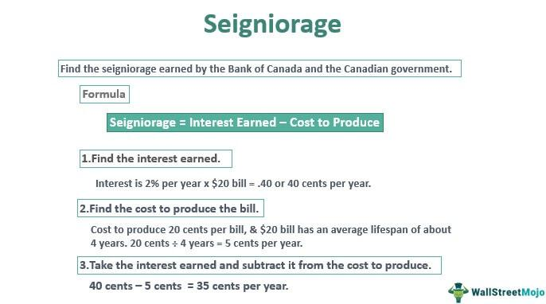

In today's interconnected global economy, understanding complex financial concepts is crucial for informed decision-making. This article examines the intricate relationships between inflation, seigniorage, monetary policy, and algorithmic trading. Each of these components plays a significant role in shaping the financial landscape, influencing everything from government revenues to trading strategies. 

Inflation, a central concept in economics, measures the rate at which the general level of prices for goods and services rises, eroding purchasing power. Its management is critical for economic stability and involves multiple factors such as demand-pull effects, cost-push pressures, and adaptive expectations. Central banks utilize various monetary policy tools to keep inflation within target ranges, affecting asset prices and currency values across financial markets.



Seigniorage represents the profit generated by a government from issuing currency, especially when production costs fall below the currency's face value. This revenue source is strategically significant for funding government expenditures without increasing taxes. However, its complex implications, particularly its potential to contribute to inflationary pressures, demand careful evaluation of economic policies.

Monetary policy, the domain of central banks, involves controlling money supply and interest rates to achieve macroeconomic objectives like inflation control, currency stabilization, and fostering economic growth. The strategies and tools of monetary policy must account for global interconnectedness and external economic conditions that may influence domestic settings.

Algorithmic trading, a key player in modern financial markets, relies heavily on computer algorithms to formulate strategic buying and selling decisions. It integrates macroeconomic variables like inflation into trading models through indices and real-time data feeds, employing strategies such as sector rotation and inflation-protected securities. Advanced analytics, including machine learning, enhance the adaptability of these algorithms to inflationary trends.

We will explore how these elements interact and the implications they hold for both economies and investors. By examining these topics in detail, readers will gain a comprehensive understanding of their importance and impact. Through this knowledge, investors, policymakers, and analysts can navigate the complex financial environment more effectively, making well-informed decisions that contribute to stability and success in an ever-evolving economic landscape.

## Table of Contents

## Understanding Inflation

Inflation represents the rate at which the prices of goods and services in an economy increase over time, resulting in a decrease in the purchasing power of money. This phenomenon is a fundamental aspect of economic analysis due to its wide-reaching implications on consumer behavior, business profitability, and overall economic stability.

Key drivers of inflation are typically categorized into three main types: demand-pull inflation, cost-push inflation, and built-in inflation. Demand-pull inflation occurs when aggregate demand in an economy outpaces aggregate supply, creating upward pressure on prices. This can happen during periods of strong economic growth where consumer spending, business investments, and government expenditures increase substantially.

Cost-push inflation is a result of rising production costs, such as wages and raw materials, which lead producers to raise prices to maintain profit margins. An example of this is when oil prices surge, impacting transportation and production costs across various industries.

Built-in inflation, also known as wage-price inflation, involves a cycle where workers demand higher wages to keep up with rising living costs, and businesses, in turn, increase prices to cover the wage hikes. This can create an inflationary spiral if not controlled by effective monetary policies.

Central banks play a pivotal role in managing inflation by utilizing various monetary tools to maintain economic stability. Primary among these tools is the adjustment of interest rates — central banks may raise rates to curb inflation by cooling economic activity or lower them to stimulate spending and investment when inflation is below target levels. Open market operations, changes in reserve requirements, and the use of quantitative easing are additional instruments employed to influence money supply and achieve targeted inflation rates.

Inflation significantly affects various financial markets, as it is intertwined with asset prices, interest rates, and currency values. Higher inflation generally leads to higher interest rates, which can depress bond prices and affect stock valuations due to increased discount rates on future earnings. Moreover, inflation can sway foreign exchange markets, where currencies from countries with lower inflation rates are often more attractive.

Due to its comprehensive effects, inflation is a critical variable in financial models and economic strategies. Financial analysts and economists often incorporate inflation forecasts into models to predict future values of assets and to assess the real return on investments. Tools such as the Consumer Price Index (CPI) and the Producer Price Index (PPI) provide essential data that help in understanding inflation trends and making informed economic decisions.

In summary, understanding inflation requires recognizing its causes, its impacts on the economy, and the role of central banks in managing it. Accurately predicting and responding to inflation dynamics is vital for economic policy formulation and for investors aiming to optimize portfolios under varying inflationary conditions.

## The Role of Seigniorage in the Economy

Seigniorage represents the profit generated by a government through the issuance of currency. The core idea is that the cost of producing money, such as the physical costs of minting coins or printing banknotes, is typically less than the face value of the currency itself. This discrepancy results in a financial gain for the government. For example, if it costs $0.05 to produce a $1 coin, the seigniorage is $0.95. This profit is not merely a fiscal footnote but serves as a significant revenue source for governments, often used to fund public expenditures without the immediate need for increasing taxes.

However, the concept of seigniorage introduces complexities and broader economic implications, particularly concerning inflation. When a government finances large portions of its expenditures by printing more money, it increases the money supply in the economy. If this increase is not matched by a corresponding increase in economic output, it can lead to inflationary pressures. Essentially, more money chases the same amount of goods and services, thereby driving prices up. This relationship between seigniorage and inflation is crucial for policymakers when designing economic strategies, as careless management could destabilize the economy.

Understanding seigniorage also necessitates an understanding of its role beyond traditional fiat currencies. With the advent of digital currencies, central banks are exploring new forms of seigniorage. Digital currencies, such as central bank digital currencies (CBDCs), have distinct production and distribution processes but similarly offer seigniorage opportunities. The transition to digital forms identifies an evolution in how seigniorage impacts the modern financial system, with potential implications for inflation, monetary policy, and economic stability.

In short, seigniorage is a multifaceted economic tool. By comprehending its dynamics and interactions with broader economic variables like inflation, observers can better understand and potentially predict the outcomes of various government fiscal strategies. These insights are increasingly relevant as modern economies integrate digital financial technologies, reshaping traditional monetary concepts.

## Monetary Policy and Its Influence on Inflation

Monetary policy is a fundamental tool used by central banks to manage economic stability by controlling the money supply and adjusting interest rates. The primary objectives of monetary policy include controlling inflation, stabilizing the currency, and fostering economic growth. This is typically achieved through the manipulation of various financial instruments and economic levers.

Central banks employ different types of monetary policies depending on the prevailing economic conditions. Expansionary monetary policy is used in periods of economic slowdown or recession to stimulate economic activity. This often involves lowering interest rates and increasing the money supply to encourage borrowing and investment. Conversely, contractionary monetary policy is applied to curb excessive inflation during periods of economic overheating. This may involve raising interest rates and reducing the money supply to slow down borrowing and spending.

Effective monetary policy is not solely determined by domestic economic conditions; it must also consider global economic trends and external factors. For instance, exchange rates, international trade balances, and foreign investments can significantly influence a nation's economic environment. Consequently, central banks often coordinate policies on an international level to align with global economic dynamics.

One of the critical aspects of monetary policy is its impact on inflation. Inflation, defined as the rate at which the general level of prices for goods and services rises, leads to a decrease in purchasing power if not managed properly. Central banks aim to maintain a stable inflation rate, usually targeting a specific percentage that is considered conducive to economic health. The tools employed to manage inflation include:

1. **Interest Rate Adjustments**: By altering the benchmark interest rates, central banks influence borrowing costs, consumer spending, and investment. Lower interest rates typically stimulate economic activity, while higher rates aim to limit inflationary pressures by discouraging spending and borrowing.

2. **Open Market Operations**: This involves buying or selling government securities in the open market to regulate the money supply. Purchasing securities injects liquidity into the economy, thus lowering interest rates, whereas selling securities withdraws liquidity, potentially raising rates.

3. **Reserve Requirements**: By changing the reserve ratio, central banks can directly alter the amount of funds banks must hold in reserve, affecting the money available for lending. Lowering reserve requirements increases the money supply, while raising them reduces it.

4. **Forward Guidance**: Central banks may also use communication strategies to influence expectations about future monetary policy actions. Forward guidance aims to shape economic behavior by providing the public and markets with insights into the central bank's policy intentions.

In assessing the effectiveness of monetary policy, it is essential to evaluate its implications on inflation and economic stability. An accurate understanding of these tools and strategies enhances the capability of central banks to navigate complex economic landscapes and achieve their macroeconomic goals. This capability is vital for maintaining economic equilibrium and fostering sustainable growth.

## Algorithmic Trading in the Context of Inflation

Algorithmic trading utilizes sophisticated computer programs to automate the buying and selling of financial instruments. These systems rely on predefined quantitative models and criteria to execute trades with minimal human intervention. Because of their reliance on data, [algorithmic trading](/wiki/algorithmic-trading) models must incorporate macroeconomic variables such as inflation, as this element significantly influences asset prices and market [volatility](/wiki/volatility-trading-strategies).

Inflation impacts algorithmic trading by affecting both the cost of commodities and financial instruments. This is typically accounted for in trading models through the integration of price indices and real-time data feeds, enabling algorithms to quickly adapt to changing economic conditions. Such integration ensures that the trading strategies remain relevant and effective in volatile market environments.

One approach used to manage inflation risks within algorithmic trading is sector rotation. This strategy involves reallocating investments between different economic sectors based on their sensitivity to inflationary trends. For instance, sectors such as consumer staples may perform better during high inflation periods compared to others like technology, allowing traders to optimize returns by adjusting sector allocations.

Another effective strategy is investing in inflation-protected securities, such as Treasury Inflation-Protected Securities (TIPS) in the United States. These financial instruments are designed to protect investors from the erosion of purchasing power due to inflation, providing a predictable return despite rising price levels.

Machine learning and advanced analytics further enhance the ability to predict inflationary trends. These technologies process vast amounts of historical and real-time data to identify patterns indicative of future inflation. By training models on such data, algorithms can make more informed predictions on inflationary movements, allowing for dynamic adjustments in trading strategies. Python, with its rich ecosystem of libraries such as Pandas for managing datasets and Scikit-learn for [machine learning](/wiki/machine-learning), is often used to develop these predictive models. Here is a basic example of using Python to create an inflation prediction model:

```python
import pandas as pd
from sklearn.model_selection import train_test_split
from sklearn.ensemble import RandomForestRegressor

# Sample dataset with economic indicators
data = pd.read_csv('economic_indicators.csv')

# Features and target variable
X = data.drop('InflationRate', axis=1)
y = data['InflationRate']

# Split data into training and test sets
X_train, X_test, y_train, y_test = train_test_split(X, y, test_size=0.2, random_state=42)

# Create and train Random Forest Regressor model
model = RandomForestRegressor(n_estimators=100, random_state=42)
model.fit(X_train, y_train)

# Make predictions
predictions = model.predict(X_test)

# Evaluating the model
from sklearn.metrics import mean_squared_error
mse = mean_squared_error(y_test, predictions)
print(f"Mean Squared Error: {mse}")
```

This code snippet demonstrates the use of a RandomForestRegressor to predict inflation based on economic indicators. Such tools provide algorithmic trading systems with the capability to preemptively adjust to inflation trends, safeguarding against adverse economic impacts.

In summary, algorithmic trading models incorporate inflation data through advanced strategies and cutting-edge technology to maintain their efficacy in erratic financial markets. These methods provide a robust framework to anticipate and mitigate inflationary risks, ensuring optimal trading performance.

## Interplay Between Seigniorage, Monetary Policy, and Algorithmic Trading

Seigniorage, monetary policy, and algorithmic trading are deeply interconnected elements within the financial ecosystem, each influencing and reshaping the landscape in multifaceted ways.

Seigniorage, the profit accrued by a government from issuing currency, affects the overall money supply available within an economy. When a government's seigniorage increases, typically through the issuance of more currency, it risks expanding the money supply. This expansion can lead to inflationary pressures if not managed properly, as there may be more money chasing the same amount of goods and services.

Monetary policy, which is crafted by central banks, includes tools such as [interest rate](/wiki/interest-rate-trading-strategies) adjustments and open market operations to control the inflation rate and stabilize the economy. The interplay between seigniorage and monetary policy is thus evident; excessive seigniorage can compel monetary authorities to tighten the money supply through contractionary measures such as increasing interest rates. This is to counteract any resultant inflation due to increased currency circulation. Conversely, a sound seigniorage practice can give central banks more leeway in employing expansionary policies without the immediate threat of inflation.

Algorithmic trading involves using advanced algorithms to execute trades, often taking into account complex financial models and real-time data. The strategic decisions in algorithmic trading are sensitive to interest rates and economic indicators influenced by monetary policy. When central banks signal a change in monetary policy, such as an interest rate hike, it can lead to algorithmic adjustments in portfolios, especially those involving interest rate-sensitive instruments like bonds or foreign exchange.

Consider a Python algorithm that adjusts a portfolio based on interest rate changes:

```python
def adjust_portfolio(interest_rate_change):
    portfolio = {'bonds': 50, 'equities': 30, 'commodities': 20}

    if interest_rate_change > 0:
        # Decrease bond holdings as bond prices may fall
        portfolio['bonds'] -= 5
        portfolio['equities'] += 3
        portfolio['commodities'] += 2
    else:
        # Increase bond holdings as bond prices may rise
        portfolio['bonds'] += 5
        portfolio['equities'] -= 3
        portfolio['commodities'] -= 2

    return portfolio

# Simulate an interest rate increase
new_portfolio = adjust_portfolio(0.25)
```

Understanding these dynamic interactions is crucial for investors and policymakers. Investors must adjust their strategies to account for inflationary signals from seigniorage and interest rate cues from monetary policies to optimize portfolio performance. Similarly, policymakers must consider how their decisions impact financial markets and the algorithms that drive trading activities.

In essence, by mastering the complexities of seigniorage, monetary policy, and algorithmic trading, market participants can better navigate the financial environment, ensuring that both economic stability and investment strategies are effectively managed.

## Conclusion

The intricate relationship between inflation, seigniorage, monetary policy, and algorithmic trading highlights the multi-layered complexity inherent in modern economics. Each element plays a crucial role in shaping economic outcomes, influencing market behaviors, and determining strategic directions for both governments and investors. Inflation, by affecting purchasing power and price stability, dictates the pace and direction of economic growth. Seigniorage provides governments with a method of revenue generation that can have broad fiscal impacts, including potential inflationary effects. Monetary policy serves as a key mechanism for economic control, targeting these inflationary tendencies while stabilizing currencies and influencing growth trajectories. Algorithmic trading, meanwhile, represents the intersection of technology and finance, adapting swiftly to changes in economic indicators and monetary conditions.

A comprehensive understanding of these components enables investors, policymakers, and analysts to make informed decisions, recognizing how these factors might influence each other and the broader economy. For instance, understanding how monetary policy shifts can influence algorithmic trading strategies or how inflationary pressures might prompt changes in seigniorage policies is crucial for maintaining economic equilibrium and predicting future trends.

As the financial landscape continues to evolve, staying aware of and responsive to these interconnected concepts is essential for success and stability. Algorithmic models continuously incorporate data related to inflation and policy changes, while policymakers must anticipate the effects of digital trading environments on financial stability. Ultimately, this article aims to offer clarity and insight into these crucial financial dynamics, equipping readers with the knowledge needed to navigate and manage the ever-evolving economic environment.

## References & Further Reading

[1]: Bordo, M. D., & Levy, B. (2007). ["The Role of Seigniorage in Monetary Policy."](https://www.nber.org/papers/w23711) National Bureau of Economic Research.

[2]: Mishkin, F. S. (2015). ["The Economics of Money, Banking, and Financial Markets,"](https://www.pearsonhighered.com/assets/preface/0/1/3/4/0134855388.pdf) 11th Edition. Pearson.

[3]: Lopez de Prado, M. (2018). ["Advances in Financial Machine Learning."](https://www.amazon.com/Advances-Financial-Machine-Learning-Marcos/dp/1119482089) Wiley.

[4]: Carney, M. (2012). ["Seigniorage and Inflation Dynamics in the Context of Central Banking."](https://www.weforum.org/stories/2020/02/globalisation-central-banks-finance-economics/) Bank of Canada Review.

[5]: Haldane, A. G. (2014). ["Central Banking in the Digital Age."](https://www.aeaweb.org/articles?id=10.1257/pandp.20181082) Bank of England.