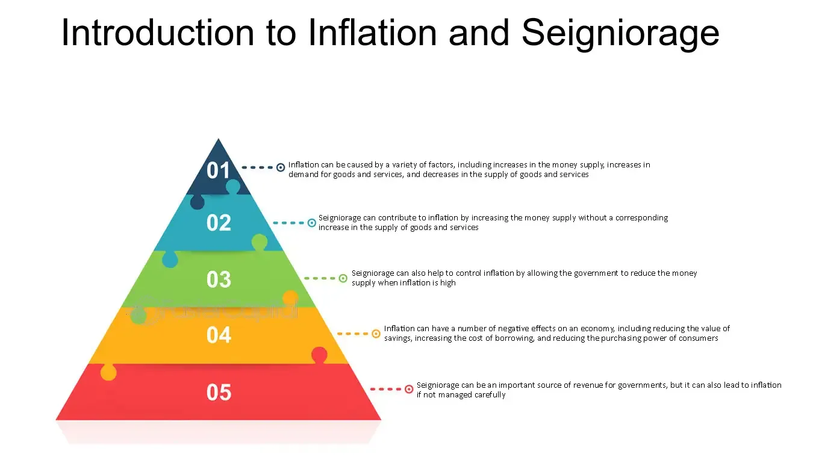

## Table of Contents

## What is seigniorage?

Seigniorage is the profit a government makes when it creates money. When a government prints new money, it can use that money to buy things without having to pay for them directly. The difference between the value of the money created and the cost of producing it is the seigniorage. For example, if it costs 10 cents to print a $1 bill, the government earns 90 cents in seigniorage from that bill.

This concept applies to both physical money, like coins and banknotes, and digital money, like the balances in bank accounts. Seigniorage can be an important source of revenue for governments, especially in countries where other forms of income, like taxes, are hard to collect. However, if a government creates too much money, it can lead to inflation, which means the value of money goes down and prices go up. So, governments need to be careful about how much money they create to balance the benefits of seigniorage with the risks of inflation.

## How is seigniorage generated?

Seigniorage is made when a government or a central bank creates new money. Imagine if you could make money out of thin air! That's kind of what happens. When they print new banknotes or mint new coins, they can spend this money on things they need, like building roads or paying workers. The profit comes from the difference between what it costs to make the money and what the money is worth. For example, if it costs 5 cents to make a $1 coin, the government earns 95 cents in seigniorage from that coin.

This also happens with digital money. When a central bank adds money to bank accounts electronically, it's like they're creating money from nothing. They can then use this money to buy things or pay off debts. The seigniorage here is the full value of the money created because it costs almost nothing to add numbers to a computer. But, governments have to be careful. If they make too much money, it can cause inflation, which means prices go up and the money becomes worth less. So, they need to balance making money from seigniorage with keeping the economy stable.

## Can you explain the relationship between seigniorage and currency issuance?

Seigniorage is the profit a government makes when it creates new money. When a government or a central bank issues new currency, either by printing banknotes, minting coins, or adding digital money to bank accounts, it can use this new money to buy things it needs. The profit comes from the difference between the cost of making the money and the value of the money itself. For example, if it costs 5 cents to print a $1 bill, the government makes a profit of 95 cents from that bill. This profit is what we call seigniorage.

The amount of seigniorage a government can generate depends on how much new currency it issues. If a government creates a lot of new money, it can increase its seigniorage. But, there's a catch. If too much money is created, it can lead to inflation, which means the value of money goes down and prices go up. So, governments need to be careful about how much money they issue to balance the benefits of seigniorage with the risks of inflation. This balance is important for keeping the economy stable and the value of money trustworthy.

## What role does seigniorage play in government finances?

Seigniorage is like a special kind of income for governments. When a government prints new money or adds money to bank accounts electronically, it can use this money to pay for things it needs, like building schools or paying workers. The profit the government makes from creating this money, after subtracting the cost of making it, is called seigniorage. It's a bit like finding money in your pocket that you didn't know was there!

But governments have to be careful with seigniorage. If they make too much new money, it can cause inflation. This means the prices of things go up and the money people have becomes worth less. So, governments need to balance the benefits of getting extra money from seigniorage with the risk of making the economy unstable. It's like walking a tightrope to keep the value of money strong and the economy healthy.

## How does seigniorage affect inflation?

Seigniorage is the money a government makes when it prints new money or adds money to bank accounts. When a government does this, it can use the new money to buy things it needs. But if it makes too much new money, it can cause inflation. Inflation happens when there's too much money chasing too few goods, so prices go up.

Governments have to be careful because if they make too much money, the value of the money goes down. This means that the money people have saved or earn can buy less stuff. So, governments need to balance making money from seigniorage with keeping the economy stable. It's like trying to keep a seesaw level – too much money can tip it the wrong way and cause problems.

## Can you provide historical examples where seigniorage significantly impacted inflation?

One big example of seigniorage causing inflation was in Germany after World War I. The German government printed a lot of money to pay for war debts and to help the economy. They thought this would solve their problems, but it made things worse. The more money they printed, the less it was worth. Prices started going up really fast, and this is called hyperinflation. By 1923, people needed wheelbarrows full of money just to buy a loaf of bread. This shows how too much seigniorage can make money lose its value and cause big problems.

Another example is Zimbabwe in the early 2000s. The government there printed a lot of money to pay for things without raising taxes. They thought it would help, but it led to hyperinflation too. Prices went up so fast that people had to use billions of dollars to buy everyday things. At one point, Zimbabwe had to print a 100 trillion dollar note, which was worth very little. This shows how trying to use seigniorage to solve money problems can make inflation go out of control and hurt the economy.

## What are the mechanisms through which seigniorage can lead to inflationary pressures?

When a government makes new money, it's called seigniorage. They do this by printing more banknotes or adding money to bank accounts. If they make too much new money, there's more money around than there are things to buy. This makes the value of money go down because everyone has more money to spend. When the value of money goes down, prices start to go up. This is called inflation. So, seigniorage can lead to inflation if the government makes too much new money.

Governments need to be careful about how much new money they make. If they make too much, it can cause big problems. People might start expecting prices to keep going up, so they spend their money faster. This can make inflation even worse. It's like a snowball rolling down a hill, getting bigger and bigger. If inflation gets out of control, it can hurt the economy and make life harder for everyone. So, governments have to balance the benefits of making money from seigniorage with the risks of causing inflation.

## How do different monetary policies influence the impact of seigniorage on inflation?

Different monetary policies can change how much seigniorage affects inflation. When a government uses a loose monetary policy, it means they're making a lot of new money. This can increase seigniorage, but it can also cause more inflation because there's more money around than there are things to buy. On the other hand, if a government uses a tight monetary policy, it means they're not making much new money. This can keep seigniorage low and help control inflation, but it might also slow down the economy.

Another way monetary policy can influence seigniorage and inflation is through interest rates. If a government raises interest rates, borrowing money becomes more expensive, and people might spend less. This can help keep inflation in check even if the government is making new money. But if interest rates are low, borrowing is cheaper, and people might spend more, which can make inflation worse if the government is also making a lot of new money. So, governments need to think carefully about their monetary policies to balance the benefits of seigniorage with the risks of inflation.

## What are the potential risks of relying heavily on seigniorage for revenue?

Relying too much on seigniorage for money can be risky. When a government makes a lot of new money, it can cause inflation. Inflation means the value of money goes down and prices go up. If people see prices going up fast, they might start spending their money quickly before it loses even more value. This can make inflation even worse, like a snowball rolling down a hill, getting bigger and bigger. If inflation gets out of control, it can make life really hard for everyone because their money can't buy as much as it used to.

Another risk is that people might start to trust the money less. If they see the government making too much money, they might think it's not worth much. This can make people want to use other kinds of money or save their money in different ways, like in gold or foreign currencies. If too many people stop using the government's money, it can hurt the economy a lot. So, governments need to be careful about how much they rely on seigniorage to make sure they don't cause big problems.

## How can central banks manage seigniorage to minimize its inflationary effects?

Central banks can manage seigniorage to minimize its effects on inflation by being careful about how much new money they make. If they make too much money, it can cause prices to go up because there's more money than there are things to buy. So, they need to balance the money they make with what the economy needs. One way they do this is by setting interest rates. If they raise interest rates, borrowing money becomes more expensive, and people might spend less. This can help keep inflation in check even if the central bank is making new money.

Another way central banks manage seigniorage is by using open market operations. This means they can buy or sell government bonds to control how much money is in the economy. If they see that too much money is causing prices to go up, they can sell bonds to take some money out of circulation. On the other hand, if they need to put more money into the economy without causing inflation, they can buy bonds. By doing these things, central banks can try to keep the economy stable and make sure that seigniorage doesn't cause big problems with inflation.

## What are the debates among economists regarding the optimal use of seigniorage?

Economists have different ideas about how much a government should use seigniorage to make money. Some think it's a good way for governments to get money without having to raise taxes. They say that if a government is careful, it can make some money from seigniorage without causing big problems with inflation. But other economists worry that using seigniorage too much can make prices go up a lot. They think it's better for governments to find other ways to get money, like through taxes, so they don't mess up the economy.

There's also a debate about how to balance seigniorage with keeping the economy stable. Some economists believe that a little bit of inflation can be good for the economy because it encourages people to spend money instead of saving it. They think that using seigniorage to create a small amount of inflation can help keep the economy growing. But others argue that even a little inflation can be risky because it might get out of control. They say that central banks should focus on keeping prices stable and use seigniorage very carefully, if at all.

## How does seigniorage in a digital currency environment differ from traditional currency systems in terms of inflation?

In a digital currency environment, seigniorage works a bit differently than with traditional money. When a government or central bank creates digital money, it costs almost nothing to make. They just add numbers to a computer, so the profit from seigniorage is the full value of the money created. This can be good because it gives the government a way to get money without having to print physical cash. But it can also be risky because it's easier to make a lot of new money quickly, which can cause inflation if they're not careful.

Inflation happens when there's too much money around compared to the things people want to buy. In a digital currency system, if the government makes too much new money, it can lead to prices going up fast. This is because everyone has more money to spend, but there aren't more things to buy. So, governments need to be extra careful with seigniorage in a digital environment to make sure they don't cause big problems with inflation. They might use tools like interest rates or buying and selling bonds to control how much money is in the economy and keep prices stable.

## References & Further Reading

[1]: Bordo, M. D., & Levy, B. (2007). ["The Role of Seigniorage in Monetary Policy."](https://www.nber.org/papers/w23711) National Bureau of Economic Research.

[2]: Mishkin, F. S. (2015). ["The Economics of Money, Banking, and Financial Markets,"](https://www.pearsonhighered.com/assets/preface/0/1/3/4/0134855388.pdf) 11th Edition. Pearson.

[3]: Lopez de Prado, M. (2018). ["Advances in Financial Machine Learning."](https://www.amazon.com/Advances-Financial-Machine-Learning-Marcos/dp/1119482089) Wiley.

[4]: Carney, M. (2012). ["Seigniorage and Inflation Dynamics in the Context of Central Banking."](https://www.weforum.org/stories/2020/02/globalisation-central-banks-finance-economics/) Bank of Canada Review.

[5]: Haldane, A. G. (2014). ["Central Banking in the Digital Age."](https://www.aeaweb.org/articles?id=10.1257/pandp.20181082) Bank of England.