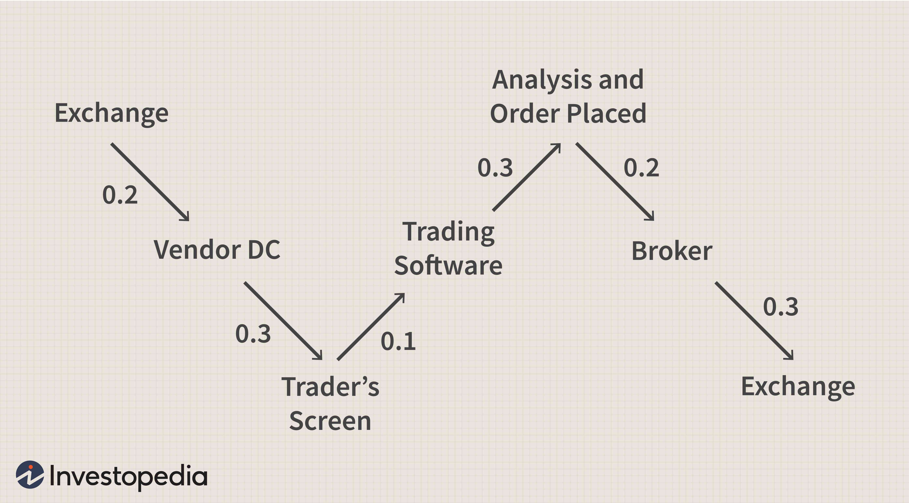

The rise of financial algorithms has transformed the landscape of modern finance, significantly influencing how asset trading is conducted. At the heart of this transformation is algorithmic trading, defined as the use of computer programs and algorithms to execute trades based on predefined criteria. This form of trading allows for the rapid and efficient execution of complex trading strategies, which is crucial in the fast-paced financial markets.

Algorithmic trading's significance is underscored by its ability to process vast amounts of data at high speeds to identify trading opportunities, optimize trade execution, and reduce costs. By automatically assessing market conditions and reacting to changes within milliseconds, algorithmic trading enables financial institutions to leverage data-driven insights to maximize returns while managing risks.



The evolution and growth of trading software have been instrumental in the proliferation of algorithmic trading. Beginning with basic execution algorithms, the software has developed into sophisticated platforms capable of real-time data analysis, machine learning, and artificial intelligence. These advancements have made trading more accessible to a wider range of participants, from large institutional investors to individual traders, thereby democratizing access to financial markets.

In modern finance, the importance of algorithmic trading cannot be overstated. It contributes to market efficiency by facilitating liquidity and tighter spreads, which can lead to more accurate pricing of financial instruments. Moreover, algorithmic trading is essential for handling the growing complexity and scale of global financial markets, ensuring that trades can be executed efficiently and without human error.

The purpose of this article is to provide a comprehensive understanding of the components and impacts of financial algorithms in the context of trading. By exploring the intricacies of these algorithms, their implementation through sophisticated trading software, and their broader implications on financial markets, this article seeks to offer insights into a domain that is constantly reshaping the financial industry. Through this exploration, readers are encouraged to appreciate the transformative power of financial algorithms and consider their potential applications and future developments.

## Table of Contents

## Understanding Financial Algorithms

Financial algorithms are computational processes designed to automate, enhance, or facilitate financial decision-making and trading activities. These algorithms leverage complex mathematical models and data analysis techniques to predict market trends, assess risk, and execute trades efficiently. The adoption and development of financial algorithms have revolutionized trading by providing speed, accuracy, and the capacity to process vast amounts of market data.

### Role in Predicting Market Trends and Making Decisions

Financial algorithms play a critical role in predicting market trends through advanced data analysis. By examining historical data, price patterns, and market indicators, these algorithms can generate predictive models to forecast future market movements. Techniques such as [machine learning](/wiki/machine-learning), time series analysis, and statistical modeling are often employed to enhance the predictive accuracy of these algorithms.

The decision-making component of financial algorithms involves automated execution of trades once specific market conditions are met. For instance, an algorithm might be programmed to buy a stock when its price moves above a certain moving average or when a particular economic indicator shows a favorable outcome. This automated decision-making not only reduces the emotional bias involved in human trading but also allows for instantaneous reaction to market opportunities.

### Types of Financial Algorithms Used in Trading

There are several types of financial algorithms, each designed to cater to different trading strategies and market conditions:

1. **Market-Making Algorithms**: These algorithms provide liquidity to markets by maintaining bid and ask prices for a financial instrument. They profit from the bid-ask spread.

2. **Trend-Following Algorithms**: These algorithms identify and exploit market trends by entering trades in the direction of the trend.

3. **Statistical Arbitrage Algorithms**: These rely on statistical models to detect pricing inefficiencies between related financial instruments and exploit these inefficiencies for profit.

4. **High-Frequency Trading (HFT) Algorithms**: These are designed to execute a large number of orders at extremely fast speeds, capturing short-term market inefficiencies.

### Key Components and Functionalities of Financial Algorithms

The design and implementation of financial algorithms involve several critical components:

- **Data Collection and Processing**: Algorithms rely on vast datasets, including historical prices, economic indicators, and real-time market data. Efficient data processing ensures that the algorithms have access to accurate and timely information.

- **Signal Generation**: This involves identifying trading opportunities based on predefined criteria or models. Signal generation might involve pattern recognition, statistical analysis, or machine learning techniques.

- **Trade Execution**: Once a trading signal is identified, the algorithm must execute the trade efficiently, minimizing market impact and transaction costs.

- **Risk Management**: Algorithms incorporate risk management strategies to protect against potential losses. This can include setting stop-loss levels, position limits, and diversification strategies.

### Role of Quantitative Analysis in Developing Financial Algorithms

Quantitative analysis is the backbone of financial algorithm development. This involves the use of mathematical models, statistical techniques, and computational methods to analyze market data and develop trading strategies. Quantitative analysts, often known as "quants," leverage tools such as regression analysis, stochastic calculus, and machine learning to model financial markets and devise [algorithmic trading](/wiki/algorithmic-trading) strategies.

Python is a preferred language among quants due to its extensive libraries and ease of use for data analysis. Libraries such as NumPy, pandas, and scikit-learn provide robust functionalities for handling large datasets, performing complex calculations, and building predictive models.

```python
import pandas as pd
import numpy as np
from sklearn.linear_model import LinearRegression

# Example of a simple financial algorithm using linear regression to predict stock prices
# Load historical stock prices
data = pd.read_csv('stock_prices.csv')
X = data[['feature1', 'feature2']]  # Example features
y = data['target']  # Target variable, e.g., future stock prices

# Splitting the dataset
X_train, X_test = X[:-100], X[-100:]
y_train, y_test = y[:-100], y[-100:]

# Linear Regression Model
model = LinearRegression()
model.fit(X_train, y_train)

# Making predictions
predictions = model.predict(X_test)
```

In summary, financial algorithms and their development through quantitative analysis have become indispensable tools in modern trading. They provide a systematic approach to predicting market trends and making decisions, thus enhancing the efficiency and effectiveness of financial markets.

## The Emergence of Algorithmic Trading

Algorithmic trading, often referred to as algo trading, represents the use of intricate mathematical models and algorithms to make high-speed, automatic trading decisions. Its origins can be traced back to the 1970s with the introduction of designated order turnaround (DOT) systems on the New York Stock Exchange (NYSE), which allowed for automated order routing and execution. The practice gained significant [momentum](/wiki/momentum) in the 1980s and 1990s with advancements in computing technology and the proliferation of electronic trading platforms. Today, algorithmic trading is a cornerstone of modern financial markets.

Algorithmic trading differs from traditional trading primarily in its speed, efficiency, and reliance on quantitative analysis. Traditional trading depends largely on human intuition and manual execution of trades, often leading to slower and potentially inconsistent trading behaviors. In contrast, algorithmic trading leverages pre-programmed strategies and decision-making processes, enabling rapid execution of large volumes of trades in milliseconds or even microseconds. This disparity is starkly illustrated when human traders might react to market news in minutes or seconds, while algorithms can do so in fractions of a second based on predefined criteria.

Adopting algorithmic trading in financial markets presents several key benefits. First, it reduces transaction costs by minimizing the time between market orders and execution. Algorithms can also execute trades at the most favorable prices by timing trades at optimal market conditions. Furthermore, algorithmic trading contributes to enhanced market [liquidity](/wiki/liquidity-risk-premium) and efficiency by increasing the [volume](/wiki/volume-trading-strategy) of trades and narrowing bid-ask spreads. This increased liquidity means that securities can be bought and sold more easily without causing significant price fluctuations, benefiting all market participants.

However, algorithmic trading also poses several challenges and risks. One significant concern is the potential for market manipulation through techniques such as spoofing, where traders place false orders to mislead other market participants. Additionally, the reliance on software and algorithms introduces the risk of technical failures or programming errors, which can cause substantial financial losses and market disruptions. An infamous example of this risk was the 2010 Flash Crash, where algorithmic trading contributed to a rapid and steep decline in U.S. stock prices.

Regulatory challenges also arise, as algorithmic trading can obscure transparency in the trading process, making it difficult for regulators to oversee market activities effectively. As trading strategies become more complex, ensuring compliance with existing regulations becomes increasingly challenging for both financial institutions and regulators.

In conclusion, while the integration of algorithmic trading into financial markets has revolutionized trade execution and market dynamics, it necessitates careful consideration of the associated risks and the implementation of robust regulatory frameworks to safeguard market integrity and stability.

## Exploring Trading Software

Trading software has become an essential component of modern financial markets, acting as the backbone for executing complex algorithmic strategies. As the sophistication of trading algorithms grows, so too does the need for advanced trading software technologies that can efficiently manage and execute these strategies.

### Overview of Trading Software Technologies

Trading software encompasses a wide range of technologies designed to facilitate the buying and selling of financial instruments. These platforms vary from simple interfaces for day traders to complex systems for institutional clients. At the core of these systems, there are features that enhance order execution, risk management, and market analysis.

### Features and Functionalities of Modern Trading Platforms

Modern trading platforms are equipped with a variety of features that cater to both individual and institutional needs. Key functionalities include:

1. **Real-time Market Data**: Access to up-to-the-second quotes and market information is crucial for making informed trading decisions.

2. **Advanced Charting Tools**: These tools allow users to analyze price movements and market trends through various technical indicators and overlays.

3. **Order Types and Execution Flexibility**: Platforms support a variety of order types, such as market, limit, stop, and conditional orders, providing traders flexibility in execution.

4. **Risk Management Tools**: Integrated risk management features help users mitigate potential losses through stop losses, take profit levels, and position sizing.

5. **Customizable Alerts and Notifications**: Users can configure alerts for price movements, news events, or technical indicators, aiding in timely decision-making.

6. **Analytics and Reporting**: Comprehensive analytics tools enable traders to assess performance metrics and generate detailed reports for strategy evaluation.

### Popular Trading Software Solutions in the Market

Several trading software solutions have gained popularity due to their robust features and reliable performance. Some notable platforms include:

- **MetaTrader 4 and 5 (MT4/MT5)**: Widely used by forex traders, these platforms offer extensive charting tools, multiple order types, and automated trading through expert advisors (EAs).

- **NinjaTrader**: Known for its advanced charting capabilities, market analysis tools, and automated strategy development.

- **Thinkorswim by TD Ameritrade**: Offers a comprehensive suite of tools for options, futures, stocks, and forex trading, with a strong emphasis on technical analysis.

- **Interactive Brokers**: Provides a sophisticated platform for a wide range of asset classes, with support for complex algorithmic trading and extensive market data.

### How Trading Software Enhances the Execution of Financial Algorithms

Trading software plays a critical role in the execution of financial algorithms by providing the infrastructure necessary for rapid, automated trade execution. Key enhancements include:

- **Latency Reduction**: Advanced trading platforms minimize execution delays through optimized data transmission and processing.

- **Scalability**: These platforms can handle large volumes of trades and data, essential for high-frequency trading strategies.

- **Integration Capabilities**: Trading software often supports integration with external data sources and algorithmic models, enhancing decision-making processes through real-time analysis.

### The Role of Automation and AI in Trading Software

Automation and [artificial intelligence](/wiki/ai-artificial-intelligence) (AI) are transforming trading software, allowing for more efficient and accurate executions. Automation facilitates the seamless operation of algorithmic strategies without the need for manual intervention, which is crucial for implementing high-frequency trading and reducing human error.

AI enhances trading by employing machine learning algorithms to predict market trends and optimize trading strategies. These AI models analyze large datasets to identify patterns and adapt strategies to evolving market conditions.

In conclusion, trading software is a dynamic and essential part of the financial landscape, providing the necessary tools and infrastructure to navigate and succeed in algorithmic trading. As technology advances, trading platforms will continue to expand their capabilities, offering even greater efficiencies and opportunities for traders.

## The Mechanics of Algo Trading

Algo trading, or algorithmic trading, operates through the integration of sophisticated algorithms and advanced trading software, enabling rapid and automated decision-making processes in financial markets. Here is a step-by-step overview of how algo trading works.

### How Algo Trading Works: A Step-by-Step Process

1. **Data Collection and Input**: The process begins with collecting and inputting relevant market data into the trading system. This data includes historical prices, volumes, and other relevant market indicators.

2. **Signal Generation**: Based on pre-defined criteria or models, the algorithm generates trading signals. These signals indicate potential buy or sell opportunities.

3. **Order Execution**: Once a signal is generated, the algorithm automatically executes the trade according to programmed instructions. This can include specific parameters such as order size and timing.

4. **Monitoring and Adjustments**: After execution, the trades are continuously monitored. The algorithm can make real-time adjustments to the strategy based on new data or changing market conditions.

5. **Reporting and Analysis**: Finally, the trades are recorded, and reports are generated for analysis. This data is valuable for evaluating the performance of the algorithm and making necessary tweaks.

### Integration of Algorithms and Trading Software

The seamless integration of algorithms with trading software is crucial for efficient algo trading. Algorithms are designed to process vast amounts of data and execute complex strategies, while trading software provides the necessary infrastructure for implementation, including access to market data feeds, order management, and real-time risk assessment.

### Execution Strategies in Algo Trading

Various execution strategies are employed in algo trading, each serving a specific purpose. Some of the most common strategies include:

- **Market Making**: This strategy involves placing buy and sell orders to capture the bid-ask spread, providing liquidity to the market.

- **Trend Following**: This strategy seeks to profit from market trends by entering trades in the direction of prevailing market trends and holding positions until the trend reverses.

- **Statistical Arbitrage**: This involves exploiting statistical anomalies or pricing inefficiencies between related financial instruments.

- **Mean Reversion**: This strategy assumes that asset prices will revert to their mean over time and involves betting on the reversal of temporary price deviations.

### The Role of Backtesting and Optimization

Backtesting is a critical component in the development of robust algorithmic trading strategies. It involves testing a strategy against historical data to evaluate its performance. The goal is to identify potential weaknesses or optimize parameters for better results. Python, with libraries like Pandas and Backtrader, is commonly used for [backtesting](/wiki/backtesting):

```python
import backtrader as bt

# Define a simple moving average crossover strategy
class SmaCross(bt.SignalStrategy):
    def __init__(self):
        sma1 = bt.ind.SMA(period=10)   # short period simple moving average
        sma2 = bt.ind.SMA(period=30)   # long period simple moving average
        self.signal_add(bt.SIGNAL_LONG, sma1 > sma2)

# Create a Cerebro engine instance
cerebro = bt.Cerebro()
cerebro.addstrategy(SmaCross)

# Load data and add it to the engine
data = bt.feeds.YahooFinanceData(dataname='AAPL', fromdate=datetime(2020, 1, 1), todate=datetime(2021, 1, 1))
cerebro.adddata(data)

# Run backtest and gather results
cerebro.run()
cerebro.plot()
```

Optimization seeks to fine-tune strategy parameters to maximize performance metrics such as return, risk-adjusted return, or hit rate, while minimizing drawdowns.

### Case Studies of Successful Algorithmic Trading Implementations

Several firms and funds have successfully implemented algorithmic trading strategies. Renaissance Technologies, for example, is renowned for its Medallion Fund, which employs a variety of sophisticated algorithms to achieve consistently high returns. Quantitative strategies, driven by robust data analysis and mathematical models, form the backbone of its trading operations.

Another notable example is Two Sigma, a firm known for utilizing machine learning and artificial intelligence to inform its algorithmic trading decisions. By continuously iterating on their models and incorporating vast data sets, Two Sigma maintains a competitive edge in the market.

These examples underscore the transformative potential of well-executed algorithmic trading strategies in the financial sector.

## Benefits and Applications of Algo Trading

Algorithmic trading, often referred to as algo trading, offers numerous advantages over traditional manual trading methods, chiefly due to its ability to leverage computer algorithms to execute trades at speeds and frequencies that are impossible for a human trader.

### Advantages of Using Algo Trading Over Manual Trading

1. **Speed**: Algorithms can process vast amounts of market data and execute transactions within milliseconds, allowing traders to respond swiftly to market opportunities and changes, significantly faster than manual trading.

2. **Accuracy**: By reducing the possibility of human error, algo trading ensures a high degree of accuracy in trade execution. Algorithms follow pre-programmed rules and parameters, thereby minimizing the risks associated with manual errors.

3. **Consistency**: Unlike human traders, algorithms can consistently execute trading strategies without deviation, thereby adhering strictly to the predetermined trading rules and strategies.

4. **Cost Reduction**: By automating the trading process, algo trading reduces the need for continuous human intervention, thereby lowering transaction costs associated with manual trading operations.

5. **Backtesting**: Algorithmic trading allows traders to backtest their trading strategies using historical market data to assess their viability and effectiveness before applying them in live markets. This minimizes risk and enhances the potential for profitability.

### Applications of Algo Trading Across Different Asset Classes

Algo trading is implemented across various asset classes, including equities, foreign exchange (Forex), commodities, and futures. For instance, in the equities market, it is used for high-frequency trading ([HFT](/wiki/high-frequency-trading-strategies)) to capitalize on minute price discrepancies. In Forex, it helps traders manage risks by executing trades based on complex mathematical models and quantitative analysis. In commodities and futures, algo trading is utilized to automate hedging strategies and enhance trade execution efficiency under volatile conditions.

### How Financial Institutions Leverage Algo Trading for Competitive Advantage

Financial institutions, including banks, hedge funds, and asset management firms, leverage algorithmic trading to achieve a competitive edge in the financial markets. By utilizing complex algorithms, these institutions can optimize their trade execution processes, manage large volumes of transactions efficiently, and implement sophisticated trading strategies such as [arbitrage](/wiki/arbitrage) and statistical analysis to exploit market inefficiencies. Additionally, algo trading enables them to manage their portfolios dynamically, balancing risks and returns in real time.

### The Influence of Algo Trading on Global Markets and Economies

Algorithmic trading significantly influences global markets and economies by enhancing market efficiency and liquidity. It facilitates tighter bid-ask spreads and reduced transaction costs, contributing to more competitive and transparent financial markets. However, the increased use of algo trading has also been associated with market [volatility](/wiki/volatility-trading-strategies) and flash crashes, wherein rapid execution of algorithms leads to substantial market swings. As a result, while it offers numerous benefits, the potential systemic risks necessitate regulatory oversight and prudent risk management practices.

### Emerging Trends and Future Prospects in Algo Trading

The future of algorithmic trading is poised to be shaped by advancements in technology, specifically in areas such as artificial intelligence (AI) and machine learning (ML). These technologies enable the development of more sophisticated trading algorithms capable of learning from market data and adapting to changing market conditions autonomously. Furthermore, the integration of big data analytics into algo trading processes is expected to enhance predictive accuracy and decision-making capabilities.

Additionally, the application of blockchain technology is anticipated to introduce further efficiencies and transparency in algorithmic trading. As the industry evolves, regulatory frameworks are likely to adapt to ensure market integrity and stability, balancing innovation with the need for robust oversight.

The adoption of algorithms in trading continues to transform financial markets, driving efficiency while presenting new challenges and opportunities for market participants and regulators alike.

## Regulations and Ethical Considerations

Algorithmic trading operates within a complex regulatory landscape, which varies significantly across different jurisdictions. This section explores the regulatory environment, identifying key regulatory bodies, ethical concerns, and how regulations adapt to technological advancements.

### Overview of Regulatory Landscape for Algorithmic Trading

Algorithmic trading, due to its rapid execution and vast market impact, is subject to stern regulatory oversight to ensure market integrity, transparency, and stability. Regulatory frameworks seek to manage systemic risks, protect investors, and ensure fair market conditions. Globally, regulatory bodies focus on incorporating rules that address the specific challenges posed by algorithmic trading, such as market manipulation, systemic risk, and failure of algorithms.

### Key Regulatory Bodies and Their Roles in Algo Trading

Several key regulatory organizations oversee algorithmic trading:

1. **Securities and Exchange Commission (SEC) - United States:** The SEC formulates rules to ensure that algorithmic trading practices do not compromise market integrity. It also enforces disclosure requirements and monitors high-frequency trading (HFT) activity.

2. **Commodity Futures Trading Commission (CFTC) - United States:** The CFTC governs trading in futures and options markets, ensuring that algorithmic trading systems operate in compliance with federal regulations to prevent fraud, manipulation, and abusive practices.

3. **European Securities and Markets Authority (ESMA):** ESMA regulates the European financial markets, implementing directives like MiFID II that require stringent reporting, testing of algorithms, and stable operational practices for algo trading firms.

4. **Financial Conduct Authority (FCA) - United Kingdom:** The FCA imposes guidelines ensuring that trading systems manage risks effectively, including compliance with the UK's Market Abuse Regulation.

### Common Ethical Concerns Associated with Algorithmic Trading

Ethical concerns in algorithmic trading focus mainly on transparency, fairness, and accountability:

- **Market Manipulation:** Algorithms are sometimes used to manipulate markets through strategies like spoofing, where deceptive orders are placed to influence the market price.

- **Fair Access:** High-frequency trading raises issues about preferential access and information asymmetry, as certain participants may gain undue advantages over others.

- **Algorithm Malfunctions:** Erroneous trading decisions by malfunctioning algorithms can lead to significant financial instability, as evidenced by incidents such as the 2010 Flash Crash.

### Steps Towards Ensuring Ethical Practices in the Industry

To promote ethical practices in algorithmic trading, several measures can be adopted:

- **Algorithm Testing and Validation:** Rigorous pre-launch testing and validation of algorithms help minimize the risk of malfunctions and unintended market impacts.

- **Transparency and Disclosure:** Mandating transparency in order placement and execution processes can help mitigate manipulation and ensure fair competition.

- **Ethical Guidelines:** Establishing industry-wide ethical guidelines and promoting adherence can foster a culture of responsibility among algo traders.

### How Regulations are Evolving with Advancements in Technology

As technology in trading continues to advance, regulatory frameworks are also adapting:

- **Real-time Monitoring:** Technological advancements allow regulatory bodies to monitor market activity in real-time, enabling quicker identification of irregularities and misconduct.

- **Machine Learning for Regulation:** Regulators are increasingly utilizing machine learning and data analytics to identify suspicious trading patterns automatically.

- **Regulatory Sandbox:** Some jurisdictions offer a "regulatory sandbox" approach, allowing firms to test innovative trading technologies under a regulator's overview, balancing innovation with safety.

Algorithmic trading poses unique challenges that require dynamic regulatory responses. As technology continues to evolve, regulations too must adapt to ensure that markets remain fair, efficient, and secure for all participants.

## Conclusion

In the growing landscape of financial markets, the deployment of financial algorithms has revolutionized trading practices. These algorithms, at the intersection of technology and finance, have streamlined decision-making processes, enhanced market prediction capabilities, and fostered operational efficiencies. As we look towards the future of trading software and algorithmic strategies, several key trajectories become apparent.

Trading software is continually evolving, integrating advanced technologies such as artificial intelligence and machine learning to refine and optimize trading processes. The focus is shifting towards developing more sophisticated algorithms that not only react to market changes but also anticipate them with greater accuracy. This proactive approach could revolutionize strategic planning in financial markets, offering unprecedented opportunities for traders and institutions alike.

The impact of algorithmic trading on financial markets has been profound. It has enhanced market liquidity, reduced the cost of transactions, and contributed to more stable and efficient markets. However, it also poses challenges, such as increased market volatility and technological risks. As the sector evolves, balancing innovation with risk management and ethical considerations will be crucial.

Readers are encouraged to explore the potential of algorithmic trading and consider its strategic implementation in their financial pursuits. The landscape of financial algorithms is broad and dynamic, offering ample opportunities for learning and innovation.

Feedback and further discussion on this topic are highly encouraged, as ongoing dialogue is essential for understanding and addressing the complexities of algorithmic trading. Engaging with this topic can lead to more informed decisions and a deeper appreciation of the technological advancements shaping the future of finance.

## References & Further Reading

[1]: Bergstra, J., Bardenet, R., Bengio, Y., & Kégl, B. (2011). ["Algorithms for Hyper-Parameter Optimization."](https://dl.acm.org/doi/10.5555/2986459.2986743) Advances in Neural Information Processing Systems 24.

[2]: ["Advances in Financial Machine Learning"](https://www.amazon.com/Advances-Financial-Machine-Learning-Marcos/dp/1119482089) by Marcos Lopez de Prado

[3]: ["Evidence-Based Technical Analysis: Applying the Scientific Method and Statistical Inference to Trading Signals"](https://www.amazon.com/Evidence-Based-Technical-Analysis-Scientific-Statistical/dp/0470008741) by David Aronson

[4]: ["Machine Learning for Algorithmic Trading"](https://github.com/stefan-jansen/machine-learning-for-trading) by Stefan Jansen

[5]: ["Quantitative Trading: How to Build Your Own Algorithmic Trading Business"](https://www.amazon.com/Quantitative-Trading-Build-Algorithmic-Business/dp/1119800064) by Ernest P. Chan