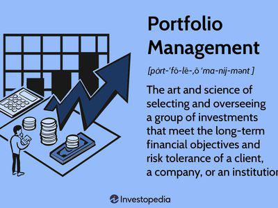

In the fast-paced world of investing, understanding how to effectively manage and benchmark your portfolio's performance is crucial. The dynamic nature of financial markets demands strategies that not only focus on capital appreciation but also on minimizing risk and measuring performance against established standards. This article explores key components of an investment strategy focused on portfolio performance, benchmarking, and algorithmic trading. 

Investors today must equip themselves with a variety of tools and methodologies. Key concepts include risk profiling, which assesses an investor's comfort with various levels of uncertainty and potential financial loss. Understanding your risk profile is essential for aligning investments with your capacity for risk and financial objectives. Asset allocation refers to the strategic division of investments among different asset categories such as equities, fixed income, and alternative investments. This helps in balancing risk and potential returns in accordance with the investor's goals and market conditions.



Ongoing risk assessment is another critical component, ensuring that the investments remain aligned with the investor's risk tolerance and market dynamics. Benchmarking involves comparing the performance of an investment portfolio against a standard or benchmark, such as the S&P 500 or the Russell 2000. This process assists in determining whether the investment strategy is successful or requires adjustment.

One of the most significant advancements in investment strategies is algorithmic trading. This involves using computer algorithms to execute trades based on pre-defined criteria. Algorithmic trading facilitates high-speed decision-making and execution, reduces human error, and enhances the ability to respond to market trends swiftly.

Whether you're a seasoned investor or just beginning, understanding and integrating these concepts can refine your investment approach. By focusing on these elements, investors can aim to optimize returns, manage risk effectively, and stay responsive to evolving market trends.

## Table of Contents

## Understanding Investment Strategy

An investment strategy is a comprehensive plan designed to achieve specific long-term financial objectives. It is crucial for managing risk and optimizing returns in a constantly evolving financial landscape. Key components of an effective investment strategy typically include diversification, risk tolerance assessment, and an understanding of financial goals and investment horizon.

Diversification is a fundamental principle of investment strategy, aimed at reducing risk by allocating investments across various asset classes such as stocks, bonds, and commodities. By spreading investments, the strategy mitigates the impact of adverse market movements on the overall portfolio. In mathematical terms, the effectiveness of diversification can be evaluated using the correlation coefficient. This metric measures the degree to which two asset classes move in relation to each other; a lower correlation between asset classes indicates greater diversification benefits.

Determining risk tolerance is another essential step in crafting a successful investment strategy. Risk tolerance is a measure of an investor's ability and willingness to endure market fluctuations and potential losses. This determination often involves assessing personal financial situations, investment knowledge, and emotional capacity for risk. This process can be formalized using a risk assessment questionnaire or similar tool that quantifies an investor's risk profile.

The investment horizon, or the length of time an investor expects to hold their investments before needing access to their funds, plays an integral role in strategy development. A longer time horizon typically allows for more aggressive investments, given the capacity to weather short-term market [volatility](/wiki/volatility-trading-strategies). Conversely, a shorter investment horizon may necessitate a more conservative approach to protect capital.

Establishing clear financial goals is critical in strategy formulation. These goals can be broad, such as wealth accumulation for retirement, or specific, such as purchasing a home or funding education. Clearly defined goals provide direction and a benchmark against which to measure the success of an investment strategy.

Altogether, the development of an investment strategy requires a thoughtful analysis of risk tolerance, time horizon, and financial objectives, combined with a diversified approach to asset allocation. Ultimately, this strategic blueprint serves to manage risk effectively and optimize potential returns, aligning with the investor's long-term financial aspirations.

## The Role of Portfolio Performance Benchmarking

Benchmarking is a critical component in the evaluation of an investment portfolio's performance. It involves comparing the returns of a portfolio to a predefined standard or index. This process provides insights into whether a portfolio is achieving its investment objectives or if strategic adjustments are necessary.

A benchmark serves as a yardstick to measure the effectiveness of investment decisions. For example, if a portfolio's objective is to outperform a broad equity market index, then comparing its returns to the S&P 500 index would be appropriate. The S&P 500, representing a large fraction of the U.S. equity market, provides a broad view of how well the portfolio is performing relative to the market. Similarly, the Russell 2000 Index, which reflects the performance of 2000 smaller publicly traded U.S. companies, can be used as a benchmark for portfolios focusing on small-cap stocks.

The selection of a benchmark is contingent upon the asset composition and investment strategy of the portfolio. A well-chosen benchmark aligns with the asset classes represented in the portfolio. For instance, if a portfolio is heavily weighted in international stocks, then a global index such as the MSCI World Index may serve as a suitable benchmark.

Benchmarking not only offers a basis for comparison but also reinforces accountability and strategic discipline. Regular review against benchmarks allows investors to identify underperforming assets or sectors within their portfolios. This comparison can illuminate trends and inform decisions about reallocating resources or adjusting investment strategies.

In practice, benchmarking can be effectively conducted using financial tools and software. These tools allow investors to automate the tracking of portfolio performance against selected benchmarks, facilitating timely and informed decision-making.

The quantitative measure of benchmarking can involve simple calculations such as tracking percentage returns over time or more complex metrics, including active return calculation, which represents the difference between the portfolio return and the benchmark return over a certain period:

$$
\text{Active Return} = R_p - R_b
$$

where $R_p$ is the portfolio return and $R_b$ is the benchmark return.

Incorporating benchmarking into portfolio management not only aids in performance assessment but also encourages the alignment of investment practices with long-term financial goals. By providing a concrete framework for evaluation, benchmarking empowers investors to make data-driven decisions that enhance portfolio efficiency and success.

## Algorithmic Trading and Its Impact

Algorithmic trading employs computer algorithms to automatically execute trading orders based on pre-defined criteria, significantly enhancing the efficiency of managing portfolios and exploiting market conditions. This form of trading is heavily reliant on quantitative models that process vast amounts of data to identify patterns and trends, enabling traders to act swiftly in response to market movements.

One of the key advantages of [algorithmic trading](/wiki/algorithmic-trading) is its ability to minimize human error, a common issue in manual trading. By leveraging algorithms that operate based on precise mathematical models and instructions, traders can eliminate the emotional and psychological biases that often hamper decision-making processes. This leads to more consistent and predictable results, allowing for better risk management and adherence to strategic objectives.

High-speed execution is a hallmark of algorithmic trading. The use of sophisticated algorithms and cutting-edge technology enables transactions to be completed in fractions of a second, capitalizing on fleeting market opportunities that would be impossible to exploit manually. This speed is not only essential in reacting to real-time data but also in reducing transaction costs, as it allows traders to take advantage of minor price discrepancies between assets.

Algorithmic trading also enhances the ability to conduct in-depth data analysis to identify market trends. By analyzing historical data and market indicators, algorithms can predict potential market movements and make informed trading decisions. The application of statistical methods, such as regression analysis and [machine learning](/wiki/machine-learning) techniques, can further refine the ability to predict price movements and recognize trading signals.

Incorporating algorithmic trading into an investment strategy offers the potential to improve returns while dynamically managing risk. By systematically implementing predetermined trading strategies, investors can optimize their portfolios by adjusting asset allocations according to market conditions. Algorithms can be tailored to execute complex strategies, such as [arbitrage](/wiki/arbitrage) and [momentum](/wiki/momentum) trading, which seek to profit from short-term price movements or market inefficiencies. 

Python, with its robust libraries for data analysis and financial modeling, is a popular choice for developing algorithmic trading strategies. Below is an example of a simple momentum trading strategy using Python:

```python
import pandas as pd
import numpy as np

def momentum_trading_strategy(prices, window=20):
    """Calculate momentum indicator and generate buy/sell signals."""
    momentum = prices.pct_change(window).shift(1)
    buy_signal = momentum > 0.05
    sell_signal = momentum < -0.05
    return buy_signal, sell_signal

# Example usage with a DataFrame of historical prices
historical_prices = pd.DataFrame({
    'AAPL': [120, 125, 130, 128, 132, 133, 131, 136]
})

buy, sell = momentum_trading_strategy(historical_prices['AAPL'])
```

In summary, algorithmic trading transforms investment strategies by combining high-speed execution, data-driven insights, and reduced error rates. By adopting these techniques, investors can more effectively manage portfolios, respond to market dynamics, and realize financial goals through enhanced trading efficacy.

## Building a Benchmark for Your Portfolio

Creating a benchmark for your portfolio is a strategic process that provides a critical measure against which you can evaluate your investment performance. A custom benchmark should reflect the composition and objectives of your portfolio, aligning it with suitable market indices. This involves selecting the appropriate indices that correspond to the different asset classes represented in your portfolio.

### Using Broad and Specific Indices

To build a benchmark, investors can use broad indices for a general performance comparison. Broad indices, such as the S&P 500 or the MSCI World Index, represent large segments of the market and provide a comprehensive view of performance trends. These indices are particularly useful if your portfolio contains a diversified mix of global equities.

For portfolios with more specific asset allocation strategies, it might be beneficial to use narrower indices. For instance, if your portfolio is heavily weighted in technology stocks, the Nasdaq Composite Index could serve as a more relevant benchmark. Similarly, if your investments are concentrated in small-cap stocks, the Russell 2000 Index may be more appropriate. Choosing indices that closely match your asset allocation ensures a more accurate assessment of portfolio performance.

### Utilizing Financial Tools and Software

The process of constructing and analyzing investment benchmarks can be streamlined using financial tools and software. Many platforms offer portfolio analytics software that can automate the process of benchmark creation and performance evaluation. These tools often feature capabilities such as data importation from various financial institutions, real-time tracking, and sophisticated reporting options. Additionally, they can simulate performance against selected benchmarks, providing insights into how well your asset allocation strategies align with market movements.

Python programming can also facilitate the process of creating custom benchmarks. Investors can use libraries such as `pandas` and `numpy` to handle and analyze financial data, while `matplotlib` can be utilized for visualizing performance against benchmarks. Here is a simple example of how you can use Python to calculate the performance of a portfolio against a benchmark:

```python
import pandas as pd

# Example data
portfolio_returns = pd.Series([0.02, 0.03, 0.015])
benchmark_returns = pd.Series([0.01, 0.025, 0.02])

# Calculate excess return
excess_return = portfolio_returns - benchmark_returns

# Print the excess return
print(excess_return)
```

In this example, `portfolio_returns` and `benchmark_returns` are simplified representations of the returns over a certain period. Calculating the excess return provides insight into how the portfolio's active management performed compared to the benchmark.

Creating a custom benchmark ensures that your investment performance is gauged accurately. By aligning your portfolio with the appropriate indices and leveraging technology, you gain a comprehensive understanding of how well your investment strategies are working, enabling informed strategic adjustments.

## Risk Profile and Asset Allocation

Understanding your risk profile is a foundational aspect of constructing an investment portfolio. The risk profile comprises your capacity to take on risk, your willingness to accept it, and your investment goals. Factors contributing to a risk profile include income stability, investment horizon, and psychological comfort with market volatility. By aligning your investments with your risk profile, you enhance the likelihood of meeting your financial objectives while navigating market fluctuations effectively.

Asset allocation refers to distributing investments across various asset classes, such as stocks, bonds, and commodities, to optimize the balance between risk and reward. This distribution is directly influenced by your risk profile. A diversified portfolio typically mitigates risk, as it reduces exposure to the poor performance of any single investment.

For instance, an individual with a high-risk tolerance and a long investment horizon might favor a portfolio heavily weighted in equities, following the formula:

$$

\text{Equity Allocation (\%)} = 100 - \text{Age} 
$$

Conversely, a risk-averse investor may allocate a greater percentage to fixed-income securities or bonds, which generally offer lower returns but with reduced volatility.

The investment horizon plays a critical role in asset allocation. A longer horizon allows for exposure to volatile asset classes with potentially higher returns, while a shorter horizon necessitates a more conservative approach to preserve capital.

Regularly reviewing and adjusting your portfolio is essential to ensure compliance with your risk profile and financial objectives. Market conditions, personal circumstances, or changes in risk tolerance may prompt these adjustments. Tools such as Modern Portfolio Theory (MPT) can aid in achieving an optimal asset allocation by balancing expected return and risk.

Ultimately, a disciplined approach to understanding and applying risk profiling and asset allocation guides investors toward achieving consistent long-term investment outcomes, aligned with their financial aspirations and risk appetite.

## Ongoing Risk Assessment and Performance Evaluation

Continuously assessing the risk and performance of an investment portfolio in relation to its benchmark is a critical component of effective investment management. This practice helps investors determine whether their strategies are yielding the desired results or if modifications are needed to align with their financial goals.

One key tool in this ongoing assessment is the Sharpe ratio, a measure developed by Nobel laureate William F. Sharpe. It is defined as:

$$
\text{Sharpe Ratio} = \frac{R_p - R_f}{\sigma_p}
$$

Where:
- $R_p$ is the expected portfolio return,
- $R_f$ is the risk-free rate of return,
- $\sigma_p$ is the standard deviation of the portfolio's excess return.

The Sharpe ratio evaluates the risk-adjusted performance of a portfolio, indicating whether returns are primarily due to smart investment choices or exposure to additional risk. A higher Sharpe ratio suggests a more favorable risk-reward balance.

Regular performance reviews are essential for determining the effectiveness of an investment strategy. These evaluations involve comparing the portfolio's performance against predetermined benchmarks. Discrepancies between actual performance and benchmarks allow investors to identify areas in need of adjustment. For instance, if the portfolio's performance lags behind its benchmark, it may indicate that a re-balancing of assets is required.

Moreover, investors can utilize financial software to automate the tracking and analysis of their portfolio's performance. These tools can provide comprehensive insights into trends and anomalies, facilitating timely strategic adjustments. Python, with its vast libraries such as pandas, numpy, and matplotlib, offers powerful capabilities for performing such analyses.

By implementing regular risk assessments and performance evaluations, investors can ensure their portfolios remain aligned with their risk tolerance and financial objectives. This proactive approach allows for strategic re-balancing when necessary and aids in maintaining a disciplined investment strategy.

## Conclusion

By effectively benchmarking and utilizing algorithmic trading strategies, investors can gain insights into performance and market trends. Benchmarking enables a clear comparison of portfolio performance against established standards, such as market indices, providing a framework for evaluating success and identifying areas for improvement. This process facilitates informed decision-making, allowing investors to adjust asset allocations in response to the relative performance of various investments. 

Algorithmic trading bolsters this approach by introducing precision, speed, and data-driven analysis. Through algorithms, trades can be executed at optimal times and under specified conditions, which human traders may miss due to time constraints or emotional bias. This automation helps in managing risk and capturing market opportunities as they emerge.

Optimizing asset allocation becomes more achievable when armed with real-time insights and automated adjustments. Investors can dynamically rebalance portfolios to maintain alignment with financial goals and risk tolerance. This proactive management is crucial for mitigating risks, such as market volatility, and for capitalizing on outperforming asset classes.

Achieving financial goals hinges on staying informed and adaptable. In today's rapidly evolving financial landscape, continuous learning and adaptation are essential. By integrating benchmarking and algorithmic trading into investment strategies, investors position themselves to navigate market changes effectively. This dual approach not only enhances the potential for optimized returns but also reinforces risk management strategies, contributing to the overarching goal of long-term financial success.

## References & Further Reading

[1]: Malkiel, B. G. (2020). ["A Random Walk Down Wall Street: The Time-Tested Strategy for Successful Investing"](https://yourknowledgedigest.org/wp-content/uploads/2020/04/a-random-walk-down-wall-street.pdf). W. W. Norton & Company.

[2]: Bogle, J. C. (2017). ["The Little Book of Common Sense Investing: The Only Way to Guarantee Your Fair Share of Stock Market Returns"](https://www.amazon.com/Little-Book-Common-Sense-Investing/dp/1119404509). John Wiley & Sons.

[3]: Fabozzi, F. J. (2004). ["Handbook of Portfolio Management"](https://www.wiley.com/en-us/Handbook%20of%20Portfolio%20Management-p-x000228096). John Wiley & Sons.

[4]: Sharpe, W. F. (1966). ["Mutual Fund Performance"](https://www.scirp.org/reference/ReferencesPapers?ReferenceID=1451307). Journal of Business, 39(1), 119-138.

[5]: Haugh, M. (2017). ["Algorithmic Trading Despite Volatility"](https://languages-cultures.uq.edu.au/profile/1498/michael-haugh). Finance Train.