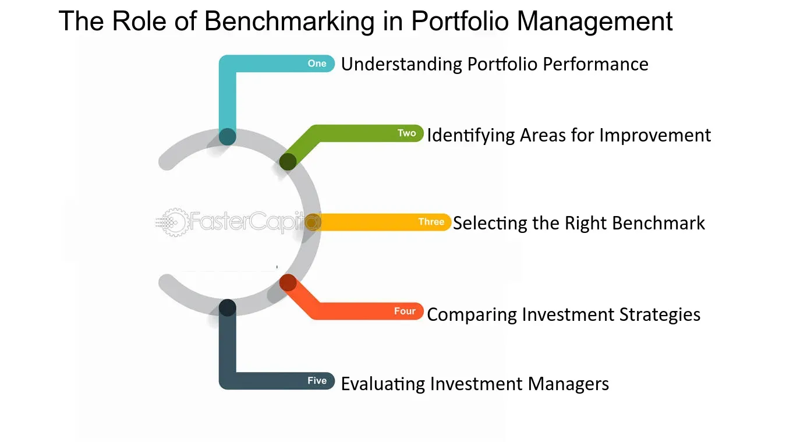

## Table of Contents

## What is a benchmark in the context of portfolio performance?

A benchmark in the context of portfolio performance is a standard or reference point that investors use to compare the performance of their investments. It helps them see if their portfolio is doing better or worse than a specific market or index. For example, if you have a stock portfolio, you might compare it to the S&P 500 to see how well your investments are doing compared to the overall market.

Choosing the right benchmark is important because it should match the type of investments in your portfolio. If you have a portfolio of tech stocks, using the Nasdaq as a benchmark makes more sense than using the Dow Jones, which includes a broader range of industries. By comparing your portfolio to an appropriate benchmark, you can make better decisions about buying, selling, or holding your investments.

## Why is it important to select an appropriate benchmark for a portfolio?

Selecting the right benchmark for your portfolio is key because it helps you see how well your investments are doing compared to something else. If you pick a benchmark that doesn't match your investments, you might get the wrong idea about how good or bad your portfolio is doing. For example, if you have a lot of money in tech companies, using a benchmark like the S&P 500, which has all sorts of companies, won't give you a clear picture of how your tech stocks are doing. You'd be better off using the Nasdaq, which focuses more on tech.

Using the right benchmark also helps you make smarter choices about your investments. When you know if your portfolio is beating or falling behind the benchmark, you can decide if you need to change your strategy. Maybe you'll want to buy more of certain stocks, sell some others, or just keep things as they are. By comparing your portfolio to a fitting benchmark, you get a better sense of whether you're on the right track or if you need to make some adjustments.

## What are the different types of benchmarks used in portfolio management?

There are different kinds of benchmarks used in portfolio management, and each one helps investors in a different way. One common type is a market index benchmark, like the S&P 500 or the Dow Jones Industrial Average. These benchmarks are made up of a group of stocks that represent the overall market or a specific part of it. If you have a portfolio of stocks, you can compare it to these indexes to see how well your investments are doing compared to the market.

Another type of benchmark is a peer group benchmark. This compares your portfolio to similar portfolios managed by other investors or fund managers. For example, if you have a mutual fund focused on growth stocks, you might compare it to other growth stock mutual funds. This helps you see if your fund is doing better or worse than others like it.

There are also custom benchmarks that investors create themselves. These are tailored to match the specific goals and strategies of a portfolio. For instance, if you have a portfolio with a mix of stocks and bonds, you might create a custom benchmark that includes a similar mix. This way, you can see how well your unique strategy is working compared to what you planned.

## How do you identify the right benchmark for a specific investment strategy?

Picking the right benchmark for your investment strategy is all about matching it to what you're trying to do with your money. First, think about what kind of investments you have. If you're mostly into tech stocks, then a benchmark like the Nasdaq, which focuses on technology companies, would be a good fit. On the other hand, if you're investing in a broad range of stocks, something like the S&P 500, which represents the overall market, might be better. The key is to make sure the benchmark reflects the same type of investments you have in your portfolio.

Next, consider your investment goals. Are you looking for growth, income, or a mix of both? If you're aiming for growth, a benchmark that tracks growth stocks would be more appropriate. If you're looking for income, a benchmark focused on dividend-paying stocks or bonds might be better. Also, think about how you want to measure your success. Are you comparing your portfolio to other similar portfolios, or do you want to see how it stacks up against the market as a whole? By understanding your goals and the nature of your investments, you can choose a benchmark that gives you a clear and fair comparison.

## What are the common mistakes to avoid when selecting a benchmark?

One big mistake people make when choosing a benchmark is picking one that doesn't match their portfolio. If you have a lot of money in tech stocks, using a benchmark like the S&P 500, which includes all kinds of companies, won't give you a clear picture of how your tech stocks are doing. You need a benchmark that reflects the same type of investments you have, like the Nasdaq for tech stocks.

Another common error is not thinking about your investment goals. If you're aiming for growth, using a benchmark that focuses on income, like a bond index, won't help you see if you're meeting your goals. You need to pick a benchmark that matches what you're trying to achieve with your money, whether it's growth, income, or a mix of both.

Lastly, some people forget to update their benchmark over time. As your investment strategy changes, your benchmark should change too. If you start investing more in different types of assets, your old benchmark might not be a good fit anymore. Always make sure your benchmark still makes sense for your current portfolio and goals.

## How can you construct a custom benchmark tailored to your portfolio's characteristics?

To construct a custom benchmark that fits your portfolio, you need to start by looking closely at what your portfolio is made of. Think about the different types of investments you have, like stocks, bonds, or real estate. Then, decide how much of each type you have. For example, if you have 60% in stocks and 40% in bonds, your custom benchmark should reflect that same mix. You might choose specific indexes for each part, like the S&P 500 for your stocks and a bond index like the Bloomberg Barclays Aggregate Bond Index for your bonds. By combining these in the right proportions, you create a benchmark that mirrors your portfolio's structure.

Once you have the right mix, you need to keep an eye on your benchmark to make sure it stays a good match for your portfolio. As your investments change over time, you might need to update your benchmark. If you start investing more in international stocks, for instance, you should add an international stock index to your custom benchmark. The goal is to always have a benchmark that gives you a fair comparison, helping you see if your investments are doing well compared to what you planned. By keeping your custom benchmark up to date, you can make better decisions about your money.

## What metrics should be used to evaluate the performance of a portfolio against its benchmark?

To see how well your portfolio is doing compared to its benchmark, you should look at a few key numbers. One important number is the total return, which shows how much your investments have grown over time, including any money you've made from selling investments and any dividends or interest you've received. You can compare this to the total return of your benchmark to see if your portfolio is doing better or worse. Another useful number is the risk-adjusted return, like the Sharpe Ratio, which tells you how much return you're getting for the amount of risk you're taking. If your portfolio has a higher Sharpe Ratio than the benchmark, it means you're getting more return for the risk you're taking.

Another thing to look at is the tracking error, which shows how much your portfolio's performance differs from the benchmark's performance. A low tracking error means your portfolio is closely following the benchmark, while a high tracking error means it's doing something different. You might also want to check the alpha, which measures how much your portfolio has beaten the benchmark after adjusting for risk. A positive alpha means your portfolio is doing better than expected, while a negative alpha means it's not doing as well. By looking at these numbers, you can get a good idea of how your investments are doing compared to your benchmark.

## How do you assess the risk-adjusted performance of a portfolio relative to its benchmark?

To assess how well your portfolio is doing compared to its benchmark, while also considering risk, you can look at the Sharpe Ratio. This number tells you how much extra return you're getting for the risk you're taking. If your portfolio's Sharpe Ratio is higher than the benchmark's, it means you're getting more return for the same amount of risk, which is a good thing. On the other hand, if your portfolio's Sharpe Ratio is lower, it means you're not getting as much return for the risk you're taking, which might make you think about changing your investments.

Another way to see how your portfolio's risk-adjusted performance stacks up against the benchmark is by looking at the alpha. Alpha measures how much your portfolio has beaten the benchmark after adjusting for risk. A positive alpha means your portfolio is doing better than expected, which is great. A negative alpha means it's not doing as well as it should, given the risk you're taking. By comparing these numbers, you can tell if your investments are doing a good job of balancing return and risk compared to the benchmark.

## What are the considerations for updating or changing a benchmark over time?

As your investment goals or the kinds of investments you own change, you might need to update or change your benchmark. If you start investing more in different types of assets, like moving from just stocks to also including bonds or real estate, your old benchmark might not be a good fit anymore. It's important to pick a new benchmark that matches what you're doing now with your money. This way, you can keep a clear picture of how well your investments are doing compared to what you planned.

Also, sometimes the market changes, and the indexes you used for your benchmark might not represent the market the same way anymore. If you notice that your benchmark isn't working well for comparing your portfolio's performance, it's a good idea to switch to a different one. By keeping your benchmark up to date, you make sure you're always comparing your investments to something that makes sense for your current situation. This helps you make better decisions about your money.

## How can statistical methods be applied to enhance benchmark selection and performance analysis?

Statistical methods can help you pick the right benchmark and understand how well your investments are doing. One way to do this is by using regression analysis. This method looks at how closely your portfolio's performance matches the benchmark's performance. If the numbers show a strong match, it means the benchmark is a good choice for comparing your investments. On the other hand, if the numbers show a weak match, you might need to find a different benchmark that fits better. Regression can also help you see if your portfolio is doing better or worse than the benchmark after taking into account the risk you're taking.

Another useful statistical tool is factor analysis, which breaks down the performance of your portfolio and benchmark into different parts, like size, value, or growth. By looking at these factors, you can see what's driving the performance of your investments and compare them to the benchmark. This can help you understand if your portfolio is doing well because of the same reasons as the benchmark, or if there are other things at play. Using factor analysis can give you a deeper look into your investments and help you make smarter choices about your money.

## What role do benchmarks play in regulatory compliance and investor reporting?

Benchmarks are important for making sure that investment managers follow the rules and for telling investors how their money is doing. When investment managers have to report to regulators, they often need to show how their portfolios are doing compared to a benchmark. This helps regulators check if the managers are doing what they said they would do and if they are following the rules. For example, if a manager says they are aiming to beat the S&P 500, they need to show how they are doing compared to that index. This makes everything more open and helps keep things honest.

For investors, benchmarks are a key part of understanding their investment reports. When you get a report on how your portfolio is doing, it will often show how it's doing compared to a benchmark. This helps you see if your investments are doing well or if they need to be changed. By comparing your portfolio to a benchmark, you can make better decisions about your money and feel more confident that you're getting a clear picture of how your investments are doing.

## How do advanced techniques like factor-based models influence benchmark selection and portfolio evaluation?

Factor-based models are a smart way to pick the right benchmark and check how well your investments are doing. These models look at different parts of your investments, like how big the companies are, if they are growing, or if they are undervalued. By understanding these parts, you can choose a benchmark that matches your portfolio better. For example, if your portfolio focuses a lot on small companies that are growing fast, you would want a benchmark that also focuses on those kinds of companies. This way, you can see if your investments are doing well compared to similar investments in the market.

Using factor-based models also helps you see what's really driving your portfolio's performance. If your portfolio is doing better than the benchmark, these models can show you if it's because of the same reasons the benchmark is doing well, or if there are other factors at play. This deeper understanding can help you make better choices about your investments. Maybe you'll see that your portfolio is doing well because of a certain factor, like growth, and you can decide to focus more on that. By using factor-based models, you get a clearer and more detailed picture of how your investments are doing compared to the benchmark.

## What is the Role of Portfolio Performance Benchmarking?

Benchmarking is a critical component in the evaluation of an investment portfolio's performance. It involves comparing the returns of a portfolio to a predefined standard or index. This process provides insights into whether a portfolio is achieving its investment objectives or if strategic adjustments are necessary.

A benchmark serves as a yardstick to measure the effectiveness of investment decisions. For example, if a portfolio's objective is to outperform a broad equity market index, then comparing its returns to the S&P 500 index would be appropriate. The S&P 500, representing a large fraction of the U.S. equity market, provides a broad view of how well the portfolio is performing relative to the market. Similarly, the Russell 2000 Index, which reflects the performance of 2000 smaller publicly traded U.S. companies, can be used as a benchmark for portfolios focusing on small-cap stocks.

The selection of a benchmark is contingent upon the asset composition and investment strategy of the portfolio. A well-chosen benchmark aligns with the asset classes represented in the portfolio. For instance, if a portfolio is heavily weighted in international stocks, then a global index such as the MSCI World Index may serve as a suitable benchmark.

Benchmarking not only offers a basis for comparison but also reinforces accountability and strategic discipline. Regular review against benchmarks allows investors to identify underperforming assets or sectors within their portfolios. This comparison can illuminate trends and inform decisions about reallocating resources or adjusting investment strategies.

In practice, benchmarking can be effectively conducted using financial tools and software. These tools allow investors to automate the tracking of portfolio performance against selected benchmarks, facilitating timely and informed decision-making.

The quantitative measure of benchmarking can involve simple calculations such as tracking percentage returns over time or more complex metrics, including active return calculation, which represents the difference between the portfolio return and the benchmark return over a certain period:

$$
\text{Active Return} = R_p - R_b
$$

where $R_p$ is the portfolio return and $R_b$ is the benchmark return.

Incorporating benchmarking into portfolio management not only aids in performance assessment but also encourages the alignment of investment practices with long-term financial goals. By providing a concrete framework for evaluation, benchmarking empowers investors to make data-driven decisions that enhance portfolio efficiency and success.

## What is the relationship between Risk Profile and Asset Allocation?

Understanding your risk profile is a foundational aspect of constructing an investment portfolio. The risk profile comprises your capacity to take on risk, your willingness to accept it, and your investment goals. Factors contributing to a risk profile include income stability, investment horizon, and psychological comfort with market volatility. By aligning your investments with your risk profile, you enhance the likelihood of meeting your financial objectives while navigating market fluctuations effectively.

Asset allocation refers to distributing investments across various asset classes, such as stocks, bonds, and commodities, to optimize the balance between risk and reward. This distribution is directly influenced by your risk profile. A diversified portfolio typically mitigates risk, as it reduces exposure to the poor performance of any single investment.

For instance, an individual with a high-risk tolerance and a long investment horizon might favor a portfolio heavily weighted in equities, following the formula:

$$

\text{Equity Allocation (\%)} = 100 - \text{Age} 
$$

Conversely, a risk-averse investor may allocate a greater percentage to fixed-income securities or bonds, which generally offer lower returns but with reduced volatility.

The investment horizon plays a critical role in asset allocation. A longer horizon allows for exposure to volatile asset classes with potentially higher returns, while a shorter horizon necessitates a more conservative approach to preserve capital.

Regularly reviewing and adjusting your portfolio is essential to ensure compliance with your risk profile and financial objectives. Market conditions, personal circumstances, or changes in risk tolerance may prompt these adjustments. Tools such as Modern Portfolio Theory (MPT) can aid in achieving an optimal asset allocation by balancing expected return and risk.

Ultimately, a disciplined approach to understanding and applying risk profiling and asset allocation guides investors toward achieving consistent long-term investment outcomes, aligned with their financial aspirations and risk appetite.

## What is the process for Ongoing Risk Assessment and Performance Evaluation?

Continuously assessing the risk and performance of an investment portfolio in relation to its benchmark is a critical component of effective investment management. This practice helps investors determine whether their strategies are yielding the desired results or if modifications are needed to align with their financial goals.

One key tool in this ongoing assessment is the Sharpe ratio, a measure developed by Nobel laureate William F. Sharpe. It is defined as:

$$
\text{Sharpe Ratio} = \frac{R_p - R_f}{\sigma_p}
$$

Where:
- $R_p$ is the expected portfolio return,
- $R_f$ is the risk-free rate of return,
- $\sigma_p$ is the standard deviation of the portfolio's excess return.

The Sharpe ratio evaluates the risk-adjusted performance of a portfolio, indicating whether returns are primarily due to smart investment choices or exposure to additional risk. A higher Sharpe ratio suggests a more favorable risk-reward balance.

Regular performance reviews are essential for determining the effectiveness of an investment strategy. These evaluations involve comparing the portfolio's performance against predetermined benchmarks. Discrepancies between actual performance and benchmarks allow investors to identify areas in need of adjustment. For instance, if the portfolio's performance lags behind its benchmark, it may indicate that a re-balancing of assets is required.

Moreover, investors can utilize financial software to automate the tracking and analysis of their portfolio's performance. These tools can provide comprehensive insights into trends and anomalies, facilitating timely strategic adjustments. Python, with its vast libraries such as pandas, numpy, and matplotlib, offers powerful capabilities for performing such analyses.

By implementing regular risk assessments and performance evaluations, investors can ensure their portfolios remain aligned with their risk tolerance and financial objectives. This proactive approach allows for strategic re-balancing when necessary and aids in maintaining a disciplined investment strategy.

## References & Further Reading

[1]: Malkiel, B. G. (2020). ["A Random Walk Down Wall Street: The Time-Tested Strategy for Successful Investing"](https://yourknowledgedigest.org/wp-content/uploads/2020/04/a-random-walk-down-wall-street.pdf). W. W. Norton & Company.

[2]: Bogle, J. C. (2017). ["The Little Book of Common Sense Investing: The Only Way to Guarantee Your Fair Share of Stock Market Returns"](https://www.amazon.com/Little-Book-Common-Sense-Investing/dp/1119404509). John Wiley & Sons.

[3]: Fabozzi, F. J. (2004). ["Handbook of Portfolio Management"](https://www.wiley.com/en-us/Handbook%20of%20Portfolio%20Management-p-x000228096). John Wiley & Sons.

[4]: Sharpe, W. F. (1966). ["Mutual Fund Performance"](https://www.scirp.org/reference/ReferencesPapers?ReferenceID=1451307). Journal of Business, 39(1), 119-138.

[5]: Haugh, M. (2017). ["Algorithmic Trading Despite Volatility"](https://languages-cultures.uq.edu.au/profile/1498/michael-haugh). Finance Train.