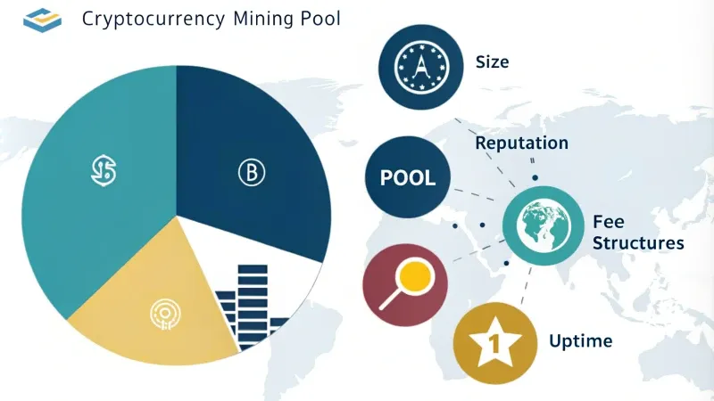

## Table of Contents

## What is a cryptocurrency mining pool?

A cryptocurrency mining pool is a group of miners who work together to solve complex math problems and earn new cryptocurrency. When someone wants to add a new block of transactions to the blockchain, miners compete to solve the puzzle first. By joining a pool, individual miners combine their computing power, increasing their chances of solving the puzzle and earning rewards. The rewards are then split among the pool members based on how much computing power each contributed.

Mining pools make it easier for people with less powerful computers to participate in cryptocurrency mining. Without joining a pool, it might take a long time for an individual miner to solve a puzzle and earn rewards. By working together, miners can earn smaller, more frequent rewards, which can be more reliable than waiting for a big reward that might take a very long time to come. This way, more people can take part in mining and help secure the cryptocurrency network.

## Why should a beginner consider joining a mining pool?

Joining a mining pool can be a good idea for a beginner because it makes mining easier and more reliable. When you mine on your own, it can take a very long time to solve the puzzle and get a reward. But in a pool, you work with other miners, and together you have a better chance of solving the puzzle faster. This means you can get smaller rewards more often, instead of waiting a long time for a big reward that might not come.

Also, mining pools are great for beginners because they don't need a lot of expensive equipment. If you're just starting out, you might not have the powerful computers that some miners use. In a pool, your smaller computer can still help out and earn you some [cryptocurrency](/wiki/cryptocurrency). This way, you can start mining without spending a lot of money upfront, and you can learn how it all works while [earning](/wiki/earning-announcement) rewards along the way.

## How do I choose the right mining pool for my needs?

When choosing a mining pool, think about how much of the total mining power you want the pool to have. If a pool is too big, it might control too much of the network, which can be risky. But if it's too small, you might not get rewards as often. A good rule is to pick a pool that has about 10-20% of the total mining power. This way, you can get rewards often enough without making the network less safe.

Also, consider the fees the pool charges and how it pays out rewards. Some pools take a big cut of your earnings, so look for one with low fees. You should also check how the pool pays out rewards. Some pools pay you as soon as they find a block, while others might make you wait until you've earned a certain amount. Choose a pool that matches how often you want to get paid and how much you're willing to pay in fees.

Lastly, think about how easy the pool is to use and if it has good support. A beginner-friendly pool will have clear instructions and a helpful community. Good customer support can be really important if you run into problems. By considering these things, you can find a mining pool that fits your needs and helps you start mining cryptocurrency successfully.

## What are the different types of mining pools?

There are different types of mining pools, and they work a bit differently from each other. One type is called a proportional pool. In a proportional pool, the rewards are shared among miners based on how much they helped solve the puzzle. If you did more work, you get a bigger share of the reward. Another type is a pay-per-share (PPS) pool. In a PPS pool, you get paid for each share you contribute, no matter if the pool finds a block or not. This means you can get paid more often, but the pool might charge higher fees.

Another type is a peer-to-peer (P2P) pool. In a P2P pool, miners work together without a central server. This can make things more private and secure, but it can also be harder to set up and use. There are also pools that use a scoring system, like the score-based pool. In a score-based pool, miners get points for their work, and these points help decide how much of the reward they get. Each type of pool has its own way of sharing rewards and fees, so you can pick the one that works best for you.

## What fees should I expect when joining a mining pool?

When you join a mining pool, you might have to pay some fees. These fees are how the pool makes money to keep running. The fees can be different depending on the type of pool you join. For example, a pay-per-share (PPS) pool might charge higher fees because you get paid more often, even if the pool doesn't find a block. On the other hand, a proportional pool might have lower fees, but you only get paid when the pool finds a block.

The fees are usually a small part of the rewards you earn from mining. They can be a percentage of your earnings, like 1% to 3%, or a fixed amount per share you contribute. It's a good idea to check the fees before you join a pool so you know how much you'll be paying. This way, you can choose a pool that fits your budget and gives you the best chance to earn more cryptocurrency.

## How does the payout structure work in mining pools?

In mining pools, the payout structure decides how the rewards are shared among the miners. There are different ways pools can do this. In a proportional pool, the rewards are split based on how much work each miner did. If you did more work, you get a bigger share of the reward. This means you only get paid when the pool finds a block, and the amount you get depends on your contribution.

Another type is a pay-per-share (PPS) pool. In a PPS pool, you get paid for each share you contribute, no matter if the pool finds a block or not. This means you can get paid more often, but the pool might charge higher fees. Some pools use a scoring system, where miners get points for their work, and these points help decide how much of the reward they get. Each type of payout structure has its own way of sharing rewards, so you can pick the one that works best for you.

## What is pool hopping and how does it affect mining?

Pool hopping is when miners switch between different mining pools to try and get more rewards. They look for pools that are close to finding a block and jump in to get a share of the reward. Then, they might leave and join another pool that's also close to finding a block. This can help miners earn more cryptocurrency in the short term, but it's not always fair to the pools they're hopping between.

Pool hopping can cause problems for mining pools. When miners keep coming and going, it makes it harder for pools to plan and stay stable. Pools might have to change their rules or rewards to stop people from hopping, which can make things less fair for everyone. In the end, pool hopping can make the whole mining network less stable and less fair for miners who stay loyal to one pool.

## How can I assess the reliability and security of a mining pool?

To assess the reliability of a mining pool, you should look at how long it has been around and how often it pays out rewards. A pool that has been running for a long time and has a good track record is usually more reliable. You can also check reviews and talk to other miners to see if they have had good experiences with the pool. Another thing to consider is how the pool handles downtime and technical issues. A reliable pool will have good support and will fix problems quickly so you can keep mining without too many interruptions.

For security, you need to check if the pool uses strong encryption to keep your data safe. Look for pools that have clear security policies and are open about how they protect your information. You should also see if the pool has ever been hacked or had security problems in the past. A secure pool will have measures in place to stop attacks and will keep your mining rewards safe. By looking at these things, you can choose a mining pool that is both reliable and secure, helping you mine cryptocurrency with peace of mind.

## What are the key factors to consider when comparing mining pool performance?

When comparing mining pool performance, one key [factor](/wiki/factor-investing) to look at is the pool's hash rate, which shows how much computing power the pool has. A higher hash rate usually means the pool can find blocks more often, leading to more frequent payouts for you. Another important thing to check is the pool's fees. Different pools charge different amounts, and these fees can eat into your earnings. So, you want to find a pool with a good balance of a high hash rate and low fees to make sure you're getting the best return on your mining efforts.

Another factor is the payout structure of the pool. Some pools pay you for each share you contribute, while others only pay out when a block is found. The payout frequency and method can affect how much and how often you get paid, so choose one that fits your needs. Lastly, consider the pool's reliability and security. A pool that has been around for a long time and has a good track record is usually more dependable. Also, make sure the pool has strong security measures to protect your data and earnings. By looking at these factors, you can pick a mining pool that will help you mine cryptocurrency successfully.

## How do mining pool algorithms affect my mining efficiency?

Mining pool algorithms can change how well you mine by deciding how rewards are shared among miners. Some pools use a proportional method, where you get paid based on how much you helped solve the puzzle. If you did more work, you get a bigger share of the reward. This can be good if you have a strong computer because you can earn more, but it might not be as fair if you have a weaker one. Other pools use a pay-per-share method, where you get paid for each little bit of work you do, no matter if the pool finds a block or not. This can help you get paid more often, but the pool might charge higher fees, which can lower your overall earnings.

Another type of algorithm is the score-based method, where you earn points for your work, and these points help decide how much of the reward you get. This can be more complicated, but it tries to be fair to everyone. The algorithm a pool uses can affect how much you earn and how often you get paid, so it's important to pick one that fits your needs. If you want to get paid often and don't mind higher fees, a pay-per-share pool might be best. But if you want to keep more of your rewards and are okay with waiting longer, a proportional or score-based pool could be a better choice.

## What advanced features should expert miners look for in a mining pool?

Expert miners should look for mining pools that offer advanced features like customizable payout options. Some pools let you choose how often you want to get paid or how you want your rewards shared. This can help you fit the pool's payouts with your own mining strategy. Another important feature is the ability to use different mining software. Expert miners often have their own favorite software, so a pool that works well with many different kinds can be really useful. Also, pools with good analytics tools can help you see how well you're doing and make better choices about your mining.

Another thing expert miners should look for is strong security features. A good pool will have ways to keep your data and earnings safe, like two-factor authentication and strong encryption. It's also important for the pool to have a good reputation and be open about how they handle security. Expert miners might also want to join pools that have a say in how the pool is run, like voting on changes or new features. This can make the pool more fair and help you feel more involved in the mining community.

## How can I monitor and optimize my mining operations within a pool?

To monitor your mining operations within a pool, you need to keep an eye on how well your computer is working and how much you're earning. Most mining pools have a dashboard where you can see your hash rate, which shows how much computing power you're using, and your earnings over time. It's a good idea to check this dashboard often to make sure everything is running smoothly. If you see your hash rate dropping or your earnings going down, it might mean there's a problem with your setup or the pool itself. You can also use special software that keeps track of your mining and sends you alerts if something goes wrong, so you can fix it quickly.

To optimize your mining operations, you should think about adjusting your mining software settings. Some pools let you change how you want to be paid or how your rewards are shared, so pick the options that fit your needs best. You might also want to try different mining software to see if it works better with your computer. Keeping your equipment cool and running smoothly is important too, so make sure it's in a good spot and clean it often. Joining a pool with a high hash rate can help you find blocks more often, but don't forget to check the fees. By keeping an eye on your mining and making small changes, you can make your mining operations work better and earn more cryptocurrency.

## References & Further Reading

[1]: Bergstra, J., Bardenet, R., Bengio, Y., & Kégl, B. (2011). ["Algorithms for Hyper-Parameter Optimization."](https://dl.acm.org/doi/10.5555/2986459.2986743) Advances in Neural Information Processing Systems 24.

[2]: ["Advances in Financial Machine Learning"](https://www.amazon.com/Advances-Financial-Machine-Learning-Marcos/dp/1119482089) by Marcos Lopez de Prado

[3]: Courtois, N. T., Grajek, M., & Naik, R. (2014). ["Optimizing SHA256 in Bitcoin Mining."](https://link.springer.com/chapter/10.1007/978-3-662-44893-9_12) arXiv.

[4]: Gandal, N., & Halaburda, H. (2016). ["Competition in the Cryptocurrency Market."](https://www.semanticscholar.org/paper/Competition-in-the-Cryptocurrency-Market-Halaburda-Gandal/bc9289eeabeb04437b5d9e469db132f28bb010ad) Journal of Financial Stability, 22.

[5]: ["Quantitative Trading: How to Build Your Own Algorithmic Trading Business"](https://www.amazon.com/Quantitative-Trading-Build-Algorithmic-Business/dp/1119800064) by Ernest P. Chan