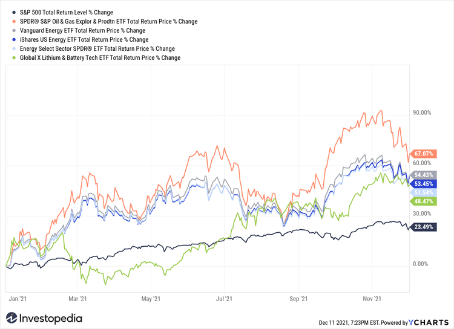

The financial markets are constantly evolving, with innovative investment vehicles such as Exchange-Traded Funds (ETFs) and algorithmic trading reshaping the investment landscape. ETFs have become a cornerstone of modern investing due to their ability to offer diversification and ease of trading, similar to stocks, on public exchanges. They provide investors with an efficient means to access various sectors, commodities, or indices without the need to invest in individual securities.

Algorithmic trading, employing complex algorithms to automate trading decisions, has gained prominence for its speed and precision. It executes trades based on pre-established criteria, eliminating human emotional biases and allowing for rapid market transactions that humans cannot match. By leveraging high-speed computers and sophisticated algorithms, traders can analyze market data and identify trading opportunities in real-time, enhancing the overall trading process's efficiency and execution quality.



This article explores the convergence of ETFs and algorithmic trading, highlighting how they combine to present unique investment opportunities. ETFs offer the liquidity and transparency essential for algorithmic strategies, while algorithms provide the analytical power to capitalize on these assets' inherent flexibility and cost-effectiveness. As investors increasingly seek to optimize their portfolios and outperform the market, the fusion of these two financial innovations offers a compelling avenue for exploration.

By the conclusion of this article, readers will better understand how algorithms can be employed to trade ETFs, the advantages they offer, and the challenges that this sophisticated method entails. This insight will equip investors and traders with the knowledge needed to navigate this dynamic segment of the financial markets, potentially leading to enhanced investment strategies and improved portfolio management.

## Table of Contents

## Understanding ETFs

An ETF, or Exchange-Traded Fund, is a financial product that enables investors to gain exposure to a diversified basket of assets through a single transaction. An ETF typically seeks to replicate the performance of a specific index, commodity, or group of assets by holding a collection of securities in proportions similar to those of the index it tracks. This tracking mechanism provides diversification benefits to investors, as it disperses risk across multiple assets rather than concentrating on a single security.

ETFs are traded on stock exchanges, much like individual stocks. This characteristic allows investors to buy and sell ETF shares throughout the trading day at market prices, providing an advantage over mutual funds, which are generally only traded at the end of the trading day at the net asset value (NAV). As a result, ETFs are favored by both retail and institutional investors for their ease of access and liquidity.

There are several types of ETFs available in the market, catering to a wide range of investment goals and preferences. Stock ETFs, which track equity markets, are among the most popular, offering exposure to various sectors or market capitalizations. Bond ETFs provide access to fixed-income instruments, helping investors manage [interest rate](/wiki/interest-rate-trading-strategies) risk and achieve income-generating objectives. Sector ETFs allow investors to focus on specific industries, such as technology or healthcare, while commodity ETFs offer a way to invest in physical goods like gold, oil, or agricultural products.

One of the primary benefits of ETFs is their cost-effectiveness. They typically incur lower expense ratios than mutual funds due to their passive management style, such as index tracking. Moreover, ETFs often have a tax advantage over mutual funds. When mutual funds experience redemptions, they may need to sell securities and subsequently distribute capital gains to all shareholders. In contrast, the "in-kind" creation and redemption process of ETFs helps to minimize capital gains distributions and improve tax efficiency.

The flexibility that ETFs offer further enhances their appeal to investors. Since ETFs can be bought and sold throughout the trading day, investors have the ability to quickly adjust their positions in response to market developments. This capability facilitates both strategic, long-term investment approaches and tactical, short-term maneuvers, making ETFs suitable for various investment strategies.

## The Basics of Algorithmic Trading

Algorithmic trading, often referred to as algo-trading, involves the use of computer algorithms to automate and execute trading activities. These algorithms are predefined sets of rules or instructions that guide trading decisions and executions, often without the need for human intervention. The primary advantages of this approach are its speed and efficiency, achieving execution rates that far exceed human capabilities.

The speed of [algorithmic trading](/wiki/algorithmic-trading) is achieved through high-frequency trading ([HFT](/wiki/high-frequency-trading-strategies)) systems, which can execute trades in microseconds. This rapid execution is crucial for capitalizing on fleeting market opportunities and price discrepancies that can occur in the blink of an eye. Algorithms can perform diverse tasks, including disparity trades, [market making](/wiki/market-making), [arbitrage](/wiki/arbitrage), and trend-following strategies, accommodating a broad range of trading strategies.

By removing human emotions from trading decisions, algorithms ensure a systematic and disciplined approach based on quantitative analysis. This removal of emotional biases can lead to more consistent and objective decision-making, reducing the risk of human error such as panic buying or selling.

Nevertheless, the rise of algorithmic trading is not without its challenges. Technical failures, such as software glitches or connectivity issues, can lead to significant trading disruptions and unintended market actions. Additionally, a profound understanding of market dynamics and patterns is necessary to design effective algorithms. This requires continuous monitoring and adaptation to market conditions to maintain their effectiveness.

Despite these risks, algorithmic trading represents an essential component of the modern financial landscape, enabling traders to leverage advanced computational tools to optimize trading performance. With careful management and understanding, the benefits of algo-trading—encompassing efficiency, precision, and systematic decision-making—can be maximized.

## Advantages of Algorithmic Trading with ETFs

Combining algorithmic trading with Exchange-Traded Funds (ETFs) offers myriad advantages, particularly in executing trades efficiently within large portfolios. The inherent [liquidity](/wiki/liquidity-risk-premium) of ETFs is a significant [factor](/wiki/factor-investing) that makes them well-suited for algorithmic strategies, which require rapid trade execution. Liquidity refers to the ease with which an asset can be converted into cash without affecting its market price, and ETFs typically provide high liquidity, ensuring trades can be executed swiftly and at desired prices.

Algorithmic trading can efficiently exploit arbitrage opportunities. Arbitrage involves taking advantage of price differences between markets or instruments. For instance, an algorithm can swiftly identify and execute trades to capitalize on discrepancies in [ETF](/wiki/etf-trading-strategies) prices across different exchanges. Additionally, algorithmic systems are adept at performing index rebalancing. Index rebalancing involves adjusting the constituents of an index to maintain its desired allocation. Algorithms can automate this process, ensuring precise execution and optimal market timing.

Moreover, algorithmic trading facilitates the implementation of mean-reversion strategies with ETFs. Mean-reversion strategies involve anticipating that an asset's price will revert to its historical average over time. Algorithms can be programmed to detect such opportunities and execute trades that profit from these price movements. This systematic and data-driven approach reduces the risk of relying on emotional decision-making and enhances the likelihood of capturing profits.

Algorithms can be fine-tuned to exploit short-term market opportunities, allowing them to capture small, frequent gains. By analyzing vast amounts of market data in real-time, these systems can identify micro-trends and execute trades at speeds beyond human capability. This high-frequency trading can lead to substantial profits over time, as the cumulative effect of small gains accumulates.

Overall, employing algorithms in ETF trading significantly minimizes trading costs and enhances execution quality. By reducing human intervention, trades are executed based on defined criteria, minimizing slippage and transaction costs. For many investors, particularly institutions managing large volumes, the cost-effectiveness and precision offered by algorithmic trading with ETFs present a compelling advantage, making it a crucial strategy in modern financial markets.

## Potential Challenges

Algorithmic trading in Exchange-Traded Funds (ETFs) is advancing rapidly, offering numerous benefits; however, it is not without significant challenges that need careful consideration. One of the primary concerns with algorithmic trading, especially when it involves high-frequency trading (HFT), is the potential for unforeseen market [volatility](/wiki/volatility-trading-strategies). The rapid execution of trades can sometimes exacerbate price fluctuations, leading to phenomena such as flash crashes. A flash crash is a very rapid, deep, and volatile fall in security prices occurring within a very short time, often caused by the quick succession of automated sell orders executed by trading algorithms reacting to negative market data or technical triggers.

Another challenge associated with algorithmic trading in ETFs is the considerable cost required to develop and maintain these sophisticated systems. Building a robust algorithmic trading system involves a significant investment in technology infrastructure, including high-performance computing power, advanced software development, and high-speed internet connectivity. Additionally, ongoing maintenance, system upgrades, and continuous performance evaluations demand further financial resources, adding to the overall cost burden for firms and individual traders.

Technical malfunctions or programming errors in algorithmic trading programs can lead to unintended market actions or outcomes. Such glitches can occur due to bugs in the trading code, incorrect parameter settings, or unanticipated interactions with market data feeds, potentially resulting in substantial financial losses. For instance, if a loop in the code does not terminate under certain conditions, it could inadvertently lead to repeated trades, further expanding the risk exposure.

Another layer of complexity involves regulatory scrutiny, which is increasing to ensure fair and transparent trading practices within the domain of algorithmic trading. Regulatory bodies across the globe are implementing stringent rules and monitoring systems to oversee trading activities, emphasizing the need for compliance and ethical trading practices. Maintaining adherence to these regulations requires a comprehensive understanding of the legal framework and might necessitate investments in legal counsel or compliance officers, further increasing operational costs.

In summary, while algorithmic trading in ETFs offers substantial opportunities for efficiency and profitability, challenges such as market volatility, development and maintenance costs, technical vulnerabilities, and regulatory compliance necessitate vigilant and strategic management to mitigate risks and ensure sustainable operation.

## Technical Requirements and Considerations

Deploying algorithmic trading strategies in the context of Exchange-Traded Funds (ETFs) necessitates robust technical infrastructures and competencies. One fundamental requirement is access to real-time market data, which ensures algorithms react promptly to market dynamics. Low-latency execution capabilities are also essential, as they facilitate the swift processing of trades, minimizing slippage and optimizing pricing.

Proficiency in programming is critical for developing and managing algorithmic trading systems. Traders or their teams often need to write custom scripts to handle complex trading strategies. Python is frequently preferred due to its versatility and extensive libraries for financial analysis. An exemplary Python snippet for a simple moving average crossover strategy might look like:

```python
import numpy as np
import pandas as pd

# Generate a mock historical price data series for an ETF
prices = pd.Series([100, 102, 101, 104, 107, 109, 108, 110, 112, 113])

# Calculate short-term and long-term moving averages
short_window = 3
long_window = 5
signals = pd.DataFrame(index=prices.index)
signals['price'] = prices
signals['short_mavg'] = prices.rolling(window=short_window, min_periods=1).mean()
signals['long_mavg'] = prices.rolling(window=long_window, min_periods=1).mean()

# Create signals
signals['signal'] = 0.0
signals['signal'][short_window:] = np.where(signals['short_mavg'][short_window:] 
                                            > signals['long_mavg'][short_window:], 1.0, 0.0)   
signals['positions'] = signals['signal'].diff()

print(signals)
```

Backtesting is another critical component, allowing traders to validate the effectiveness of their algorithms using historical data. This process involves simulating trades over past market conditions to gauge potential profitability and risk. Sophisticated [backtesting](/wiki/backtesting) platforms can provide insights into the algorithm's performance metrics, such as Sharpe ratio, drawdown, and win/loss ratio.

Beyond coding and analysis, a robust technological infrastructure is requisite. This includes reliable servers, secure network connections, and redundant systems to prevent data loss and ensure continuity during market operations. Moreover, continuous monitoring and fine-tuning of algorithms are imperative. Markets are dynamic, and an algorithm that performs well under a certain condition may need adjustments as market conditions evolve.

To summarize, successful deployment of algorithmic trading systems for ETFs involves a synergy of real-time data processing, advanced programming skills, comprehensive backtesting, solid infrastructure, and ongoing optimization. These components collectively ensure that the trading strategy is not only effective under current conditions but also adaptable to future market changes.

## Is Algorithmic Trading in ETFs Profitable?

Algorithmic trading in Exchange-Traded Funds (ETFs) holds significant potential for profitability, driven by the advantageous characteristics of ETFs and the precision that algorithmic strategies offer. One of the primary reasons for the compatibility between ETFs and algorithmic trading is the broad market coverage and the structural efficiency of ETFs. This makes ETFs an attractive target for algorithms that can capitalize on specific market signals.

The liquidity of ETFs is a key factor that enhances the efficacy of algorithmic trading. This liquidity allows for the rapid execution of trades, reducing slippage and market impact, which are crucial for maintaining alignment with algorithmic predictions and strategies. By leveraging precise market signals, algorithms can execute trades without delay, maximizing the opportunity for optimal pricing.

Moreover, the structure of ETFs contributes to lower trading costs, a critical consideration in algorithmic trading where high-frequency transactions are prevalent. The low expense ratios and the competitive pricing mechanisms inherent to ETFs complement the cost-efficiency advantages brought by algorithmic execution, enabling traders to maximize net returns.

Yet, to ensure the profitability of algorithmic trading in ETFs, a comprehensive understanding of market mechanics is essential. The creation and deployment of algorithms should be guided by an in-depth analysis of market conditions and patterns. Algorithms must be continuously refined to adapt to the ever-changing market dynamics. This iterative process involves backtesting strategies using historical market data to ascertain their validity and efficiency before deploying them in live markets.

Additionally, successful algorithmic ETF trading necessitates a balanced integration of advanced technology with strategic foresight. Traders and programmers must not only possess technical expertise but also develop an intuitive understanding of market trends and behaviors. This balance ensures that the automated strategies not only perform well technically but also align with broader market movements and investor goals.

In conclusion, while algorithmic trading in ETFs carries the potential for substantial profitability, its success hinges on the effective amalgamation of sophisticated technology with a strategic approach to market analysis and algorithm refinement. Maintaining this balance can yield competitive advantages for traders, positioning them to harness the full potential of both ETFs and algorithmic trading strategies.

## Conclusion

ETF algorithmic trading is at the forefront of financial innovation, representing a pivotal convergence of technology and finance that promises enhanced precision and efficiency in trading practices. This sophisticated approach to investing takes advantage of the unique properties of Exchange-Traded Funds (ETFs) and the speed of algorithmic strategies to offer substantial benefits. The primary advantages of this method include rapid trade execution and the elimination of emotional biases, which often hinder human traders. By relying on pre-defined algorithms, trades can occur at speeds and frequencies unreachable by manual methods, potentially leading to more efficient market engagement and price discovery.

However, despite its advantages, this approach is not without challenges. The reliance on technology means that investors must navigate potential technical malfunctions and ensure robust systems to prevent unintended trades or system failures. Moreover, high-frequency trading, inherent in some algorithmic strategies, can contribute to market volatility and even trigger events like flash crashes. Therefore, a deep understanding of both the dynamics of ETF markets and the technical aspects of algorithmic trading systems is essential for investors looking to succeed in this area.

As financial markets continue to evolve, those who can effectively master algorithmic strategies in ETF trading are likely to achieve a competitive edge. The synergy between ETFs and algorithmic trading can redefine how investment strategies are developed and implemented, offering innovative ways to enhance portfolio management. A well-informed investor can leverage these advancements to achieve optimal returns while maintaining control over risk and execution quality. Ultimately, this fusion of ETFs and algorithmic trading is poised to transform investment tactics, providing lucrative opportunities for those equipped with technological insight and strategic acumen.

## References & Further Reading

[1]: BlackRock. (2020). ["Understanding ETFs."](https://www.ishares.com/us/about-etfs/what-is-an-etf)

[2]: Lopez de Prado, M. (2018). ["Advances in Financial Machine Learning."](https://www.amazon.com/Advances-Financial-Machine-Learning-Marcos/dp/1119482089) Wiley.

[3]: Chan, E. P. (2008). ["Quantitative Trading: How to Build Your Own Algorithmic Trading Business."](https://github.com/ftvision/quant_trading_echan_book) Wiley Trading.

[4]: Jansen, S. (2020). ["Machine Learning for Algorithmic Trading: Predictive models to extract signals from market and alternative data for systematic trading strategies with Python, 2nd Edition."](https://www.amazon.com/Machine-Learning-Algorithmic-Trading-alternative/dp/1839217715) Packt Publishing.

[5]: Poterba, J. M., & Shoven, J. B. (2002). ["Exchange-Traded Funds: A New Investment Option for Taxable Investors."](https://economics.mit.edu/sites/default/files/publications/Exchange-Traded%20Funds%20A%20New%20Investment%20Option.pdf) National Bureau of Economic Research.