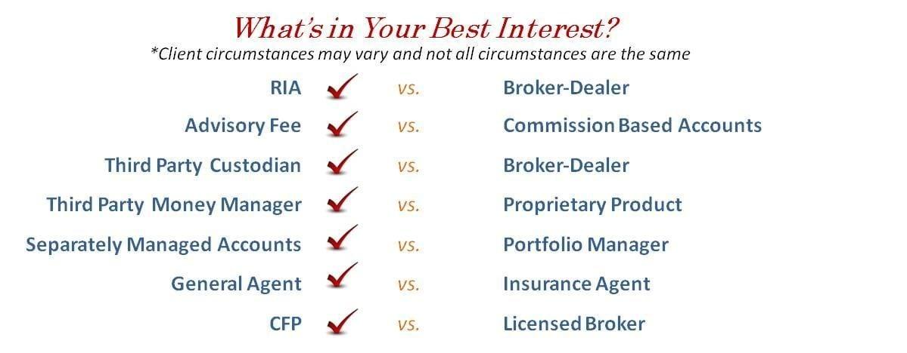

With the rise of algorithmic trading, selecting the right financial broker has become more crucial than ever. Algorithmic trading, characterized by the use of computer algorithms to automate investment strategies, enables traders to execute buy and sell orders at speeds far beyond human capability. This technological advancement allows for the implementation of complex strategies, reducing human error and increasing trading efficiency.

The success of algorithmic trading heavily depends on the choice of a competent financial broker. A broker not only executes trades on behalf of a trader but also provides access to essential financial markets and trading tools. As such, a broker's capabilities significantly impact the performance of algorithmic strategies. Factors such as trading platform technology, regulatory compliance, costs, and customer support are crucial in evaluating a broker's suitability for algorithmic trading.



This article outlines key factors to consider when choosing a broker for algorithmic trading, providing insights into the different types of brokers, the significance of technological infrastructure, and the role of regulatory bodies in ensuring a secure trading environment. By examining these critical aspects, the guide will empower you to make an informed decision when selecting a financial broker that aligns with your specific trading style and financial goals.

## Table of Contents

## Understanding Financial Brokers

A financial broker serves a critical role as an intermediary that grants traders access to various financial markets and assets, including stocks, exchange-traded funds (ETFs), commodities, and more. These brokers facilitate the buying and selling of securities and other financial instruments by bridging the gap between individual or institutional investors and financial exchanges. 

There are primarily two types of brokers: full-service brokers and discount brokers. Full-service brokers offer a comprehensive range of financial services, including investment advice, portfolio management, and planning, albeit usually at a higher cost. These brokers are suitable for clients who require personalized advice and tailored solutions. They may charge higher commissions and fees but compensate for them with valuable insights and recommendations. Examples of full-service brokers include firms like Merrill Lynch and Morgan Stanley.

Conversely, discount brokers provide essential services required for trading, often at a significantly reduced cost compared to their full-service counterparts. These brokers appeal to investors who prefer to make their own trading decisions and are comfortable executing trades with minimal support. Discount brokers facilitate transactions at cost-effective rates, charging lower (or sometimes zero) commissions, which is the primary [factor](/wiki/factor-investing) that distinguishes them from full-service firms. Notable discount brokers include Charles Schwab and Robinhood.

In recent years, the development and adoption of automated trading platforms have further expanded the array of services offered by brokers. These platforms leverage technology to automate trade execution based on pre-defined algorithms or trading strategies. Such innovations enable brokers to offer more diverse and efficient services, optimizing trade execution speed and accuracy. Algorithmic trading, supported by these platforms, allows traders to execute trades based on complex criteria and exploit high-frequency trading opportunities. This technological advance has been instrumental in democratizing access to sophisticated trading tools, making it feasible for both institutional investors and retail traders to implement [algorithmic trading](/wiki/algorithmic-trading) strategies.

Thus, understanding the distinctions between different types of brokers and the evolving capabilities of automated trading platforms is crucial for traders seeking to optimize their market interactions and trading outcomes.

## Algorithmic Trading Basics

Algorithmic trading is the practice of utilizing pre-set algorithms to execute trades automatically, based on defined parameters such as price, time, or other market conditions. At its core, it involves the use of a computer program to follow a specific set of instructions that dictate the actions to be taken in the financial markets. These programs, often referred to as trading bots or quantitative models, execute trades at speeds and frequencies that far outstrip human capability.

One of the primary benefits of algorithmic trading is the reduction in manual input, which can decrease the potential for human error in high-pressure trading environments. This automation allows for the continuous operation and execution of strategies, ensuring that opportunities are not missed due to slow manual intervention. An algorithm can monitor multiple market conditions simultaneously, making split-second decisions and executing orders as soon as the target criteria are met. 

Moreover, algorithmic trading facilitates the [backtesting](/wiki/backtesting) of strategies. Backtesting involves running a trading strategy against historical data to assess its viability using past market conditions. This method allows traders and quantitative analysts to optimize strategies before deploying them in live markets. For instance, a simple moving average crossover strategy can be coded in Python as follows:

```python
import pandas as pd

# Load historical data
data = pd.read_csv('historical_data.csv')
data['MA50'] = data['close'].rolling(window=50).mean()
data['MA200'] = data['close'].rolling(window=200).mean()

# Define buy/sell signals
data['Signal'] = 0
data.loc[data['MA50'] > data['MA200'], 'Signal'] = 1
data.loc[data['MA50'] < data['MA200'], 'Signal'] = -1

# Backtesting logic
data['Return'] = data['close'].pct_change()
data['Strategy'] = data['Signal'].shift(1) * data['Return']

# Calculate cumulative returns
data['Cumulative Strategy Returns'] = (1 + data['Strategy']).cumprod()
```

In the above code, the algorithm determines buy and sell signals based on the crossovers of two moving averages. The cumulative returns of the strategy can then be compared to that of a simple buy-and-hold strategy to evaluate its effectiveness.

Understanding how these algorithms work and their potential applications across various markets is fundamental for both novice and experienced traders venturing into algorithmic trading. The scope of algorithmic trading is vast; from equities and futures to foreign exchange and cryptocurrencies, each market presents unique challenges and opportunities that can be navigated with the use of well-designed algorithms. Successful algorithmic trading requires not only an understanding of these algorithms but also a consideration of market conditions and the regulatory landscape.

## Factors to Consider When Choosing a Broker

When selecting a broker for algorithmic trading, various factors must be evaluated to ensure optimal performance and security.

**Regulation**: Ensuring that a broker is regulated by reputable financial authorities is vital for the security of your investments and compliance with industry standards. Regulatory bodies, such as the Securities and Exchange Commission (SEC) in the United States, the Financial Conduct Authority (FCA) in the United Kingdom, and the Australian Securities and Investments Commission (ASIC), enforce strict guidelines that brokers must adhere to. These regulations help protect investors from fraud and financial mismanagement, guaranteeing that the broker operates within a legal framework.

**Technology**: A broker's trading platform must be efficient, reliable, and capable of executing trades with minimal latency. As algorithmic trading depends heavily on speed and precision, the latency of execution can significantly impact profitability. High-frequency trading algorithms, for example, require response times in milliseconds. Thus, selecting a broker with state-of-the-art technology and robust infrastructure can be a critical determinant in the success of algorithmic trading strategies. Ensuring the platform's uptime and the reliability of servers can prevent potential disruptions during critical trading periods.

**Costs and Fees**: Understanding the fee structure is essential when choosing a broker. Different brokers have varying commission rates, withdrawal fees, and potential hidden charges that could affect net profitability. A lower fee structure can significantly benefit traders executing a high volume of transactions, such as with algorithmic trading strategies. Transparent breakdowns of all possible fees, including any costs related to the use of APIs or advanced trading features, should be provided by the broker to avoid unexpected expenses.

**Support**: Efficient customer support is essential for addressing any concerns and resolving issues promptly. The availability of knowledgeable and accessible customer service teams can mitigate downtime and optimize trading operations. Support should include technical assistance to address software or network difficulties and guidance on utilizing the platform's tools effectively. A broker with robust, multilingual, and 24/7 accessible support can significantly ease the user experience, especially for traders operating in international markets across different time zones.

In conclusion, thoroughly evaluating these aspects when selecting a broker for algorithmic trading can substantially enhance trading performance and security, ultimately supporting your financial objectives.

## Best-Rated Brokers for Algorithmic Trading

### Best-Rated Brokers for Algorithmic Trading

**TradeStation**: TradeStation is renowned for its advanced trading platform, which caters to both beginners and professional traders. Its platform is equipped with robust analytic tools and a broad range of features that facilitate algorithmic trading. The main appeal of TradeStation is its low fee structure, which makes it accessible for new traders while still offering the depth needed by experienced market participants. TradeStation provides the ability for users to develop, test, and automate trading strategies using its proprietary EasyLanguage® programming language, which is specifically designed to create custom trading indicators, strategies, and apps.

**Interactive Brokers**: Known for its comprehensive toolsets and extensive market access, Interactive Brokers (IBKR) is favored by institutional traders. The platform offers a wide array of trading instruments, including stocks, options, futures, and forex across international markets. One of its key features is the Trader Workstation, a high-level trading interface allowing users to perform complex algorithmic and quantitative strategies. Its API support allows for integration with popular programming languages and environments like Python, Java, and C++, enabling traders to execute strategies and perform data analysis. Interactive Brokers is also noted for its competitive pricing structure, offering low commission rates and minimal fees, which can significantly reduce trading costs over time.

**TD Ameritrade**: TD Ameritrade stands out with its zero commission for certain trades and extensive research tools. Its Thinkorswim platform is highly regarded for its innovative features that support algorithmic trading. Thinkorswim includes advanced charting capabilities, a wealth of technical indicators, and a paper trading feature that allows users to test their algorithms without financial risk. Moreover, the platform supports scripting through the thinkScript® language, enabling traders to build custom tools tailored to their needs. For traders interested in real-time strategy adjustment, TD Ameritrade offers powerful APIs that facilitate seamless automation and integration with various software solutions.

When evaluating these brokers, it is essential to consider not only the features offered but also how they align with your algorithmic trading needs and financial goals. Each provides unique tools and platforms that cater to diverse trading strategies, highlighting the importance of analyzing their offerings in the context of your trading requirements.

## The Future of Algorithmic Trading

Algorithmic trading is experiencing rapid advancement, primarily driven by developments in [artificial intelligence](/wiki/ai-artificial-intelligence) (AI) and [machine learning](/wiki/machine-learning). These technologies enable the creation of more sophisticated algorithms capable of learning and adapting to market conditions in real-time. Algorithms are no longer confined to executing pre-defined strategies; they now have the capability to analyze vast datasets, recognize patterns, and make autonomous decisions. This evolution enhances the ability to predict market trends and adjust strategies dynamically, potentially improving profitability.

Financial brokers are responding to these technological advancements by revamping their platforms. They are integrating more comprehensive tools that support advanced strategy development and seamless execution. New features are often centered around improved data analytics, backtesting capabilities, and machine learning modules that allow traders to refine and optimize their algorithms continuously.

As the landscape of finance increasingly shifts towards automation, there is a crucial need for traders to make informed decisions about brokers. Algorithmic trading’s automated nature necessitates a broker whose platform is optimized for low latency and high-frequency trade execution to ensure that trades occur at optimal prices.

This evolution not only transforms the individual trader's experience but also alters the entire financial ecosystem. The growing prevalence of algorithmic trading is influencing market behaviors, as algorithms often account for a significant portion of trading volumes on major exchanges. As a result, the financial markets are becoming faster and more liquid, though also more complex, requiring traders to possess a deeper understanding and adaptability in their strategies. 

In summary, the future of algorithmic trading is heavily tied to the strides being made in AI and machine learning. As these technologies continue to mature, there is an expectation for even more refined trading algorithms and enhanced broker platforms, ultimately pushing the boundaries of automated trading capabilities further.

## Conclusion

Selecting a financial broker for algorithmic trading involves comprehensive research and understanding of your trading needs. The ideal broker should align with your specific trading style, provide reliable tools, and support your overall strategy effectively. With the rise of automated trading systems and sophisticated algorithms, ensuring the broker's platform can handle the demands of low latency and execute trades efficiently is crucial. 

Moreover, the regulatory framework within which a broker operates guarantees a level of safety and compliance, providing peace of mind with regards to the security of your investments. Assessing the cost structure, including commission and hidden fees, helps in identifying any financial impediments that could affect trading profitability. Equally important is evaluating the quality and accessibility of customer support, which can significantly impact your trading experience, particularly in times of technical challenges or urgent concerns.

By considering these factors, traders can optimize their algorithmic trading experience and, consequently, enhance their potential for favorable financial outcomes. Engaging with brokers who prioritize technological advancement, compliance, and customer satisfaction positions traders more competitively in the increasingly automated financial markets landscape.

## References & Further Reading

[1]: Bergstra, J., Bardenet, R., Bengio, Y., & Kégl, B. (2011). ["Algorithms for Hyper-Parameter Optimization."](https://dl.acm.org/doi/10.5555/2986459.2986743) Advances in Neural Information Processing Systems 24.

[2]: ["Advances in Financial Machine Learning"](https://www.amazon.com/Advances-Financial-Machine-Learning-Marcos/dp/1119482089) by Marcos Lopez de Prado

[3]: ["Evidence-Based Technical Analysis: Applying the Scientific Method and Statistical Inference to Trading Signals"](https://www.amazon.com/Evidence-Based-Technical-Analysis-Scientific-Statistical/dp/0470008741) by David Aronson

[4]: ["Machine Learning for Algorithmic Trading"](https://github.com/stefan-jansen/machine-learning-for-trading) by Stefan Jansen

[5]: ["Quantitative Trading: How to Build Your Own Algorithmic Trading Business"](https://www.amazon.com/Quantitative-Trading-Build-Algorithmic-Business/dp/1119800064) by Ernest P. Chan