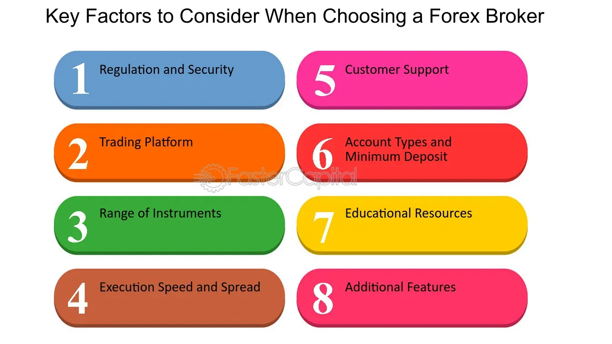

## Table of Contents

## What is a forex broker and why is it important to choose the right one?

A forex broker is a company that helps people buy and sell different currencies from around the world. They provide a platform where you can trade currencies and make money from the changes in their value. Forex brokers also give you tools and information to help you make good trading decisions. They act like a middleman between you and the big markets where currencies are traded.

Choosing the right forex broker is very important because it can affect how well you do in trading. A good broker will have low fees, so you keep more of your money. They should also have a platform that is easy to use and works well, so you can trade without problems. It's also important that the broker is trustworthy and follows the rules, so your money is safe. If you pick a bad broker, you might lose money or have a hard time trading, so it's worth taking the time to find the right one.

## What are the different types of forex brokers and how do they differ?

There are mainly three types of forex brokers: dealing desk (DD), no dealing desk (NDD), and electronic communication network (ECN) brokers. Dealing desk brokers, also known as market makers, create a market for their clients by setting their own buy and sell prices. They make money from the difference between these prices, called the spread. This type of broker might be good for beginners because they often offer educational resources and smaller account sizes, but they can also have conflicts of interest since they might trade against their clients.

No dealing desk brokers, on the other hand, do not set their own prices. Instead, they pass on the best available prices from their liquidity providers to their clients. There are two types of NDD brokers: straight through processing (STP) and electronic communication network (ECN) brokers. STP brokers send client orders directly to their liquidity providers, while ECN brokers connect clients to a network of other traders and liquidity providers. Both types aim to give clients better prices and faster execution, but they might require larger account sizes and charge a commission on each trade.

Choosing between these types of brokers depends on what you need as a trader. If you're new to forex trading, a dealing desk broker might be easier to start with because of the support they offer. But if you're more experienced and want the best possible prices and faster trades, an NDD or ECN broker could be a better fit. Each type has its own pros and cons, so it's important to think about your trading style and goals when picking a broker.

## What are the key regulatory bodies that oversee forex brokers and why is regulation important?

There are several key regulatory bodies that keep an eye on forex brokers to make sure they follow the rules. In the United States, the main one is the Commodity Futures Trading Commission (CFTC), and they work with the National Futures Association (NFA). In the United Kingdom, it's the Financial Conduct Authority (FCA). Other important regulators around the world include the Australian Securities and Investments Commission (ASIC) and the Cyprus Securities and Exchange Commission (CySEC). These bodies make rules that brokers have to follow to protect traders and keep the market fair.

Regulation is important because it helps keep your money safe when you trade forex. When a broker is regulated, it means they have to follow strict rules about how they handle your money and how they do business. This can help stop fraud and make sure that the broker is honest and fair. If something goes wrong, you can go to the regulator for help. So, choosing a regulated broker is a good way to make sure you're trading with someone you can trust.

## How do I evaluate the trading platform offered by a forex broker?

When you want to evaluate the trading platform a forex broker offers, you should first look at how easy it is to use. A good platform should have a simple and clear design so you can find what you need quickly. It should let you place trades easily and show you important information like price charts and news updates. If you're new to trading, you might want a platform with a demo account where you can practice without risking real money. Also, think about whether the platform works well on your computer or phone, because you might want to trade on the go.

Next, think about the features the platform offers. A good trading platform should have tools that help you make smart trading decisions, like technical analysis tools and indicators. It should also let you set up different types of orders, like stop-loss and take-profit orders, to manage your risk. Speed is important too, because you want your trades to go through quickly. Lastly, check if the platform is reliable and doesn't often have technical problems. A stable platform means you can trade without worrying about it crashing at the wrong time.

## What should I consider regarding the spreads and commissions charged by forex brokers?

When you're looking at the spreads and commissions charged by forex brokers, it's important to understand how they can affect your trading costs. The spread is the difference between the price you buy a currency at and the price you sell it at. A smaller spread means you pay less to make a trade, which can be good for your profits. Some brokers charge a commission on top of the spread, especially if they're no dealing desk or ECN brokers. You need to think about whether you'd rather pay a bigger spread with no commission or a smaller spread with a commission. It depends on how often you trade and how much money you're trading with.

It's also helpful to compare the spreads and commissions of different brokers to see which one gives you the best deal. Some brokers might offer lower spreads during certain times or for certain currency pairs, so it's good to know what you're trading. Remember, cheaper isn't always better. Sometimes, a broker with slightly higher costs might give you better service or more tools to help you trade well. So, take your time to look at all the costs and see how they fit with your trading plan.

## How important is customer support and what features should I look for?

Customer support is very important when you choose a forex broker. If you have a problem or a question, you want to be able to get help quickly. Good customer support can make a big difference, especially if you're new to trading. It can help you feel more confident and keep trading without big problems.

When you look for good customer support, think about how easy it is to reach them. They should have different ways to contact them, like phone, email, and live chat. Live chat is often the best because you can get help right away. Also, check if they offer support in your language and if they are available 24/7, since forex markets never close. Good customer support should be friendly, know a lot about trading, and be able to solve your problems fast.

## What are the minimum deposit requirements and how do they affect my choice of broker?

Minimum deposit requirements are the smallest amount of money you need to put into your account to start trading with a forex broker. Different brokers have different minimums, and they can range from very low amounts, like $1, to much higher ones, like thousands of dollars. The minimum deposit you're comfortable with can help you decide which broker to choose. If you're just starting out or don't have a lot of money to invest, you might want a broker with a low minimum deposit so you can begin trading without spending too much.

The minimum deposit can also affect what kind of trading account you can open. Some brokers offer different types of accounts with different features, and the minimum deposit might be different for each one. For example, a basic account might need a small deposit, but it might not give you as many tools or lower fees as a premium account that needs more money. So, when you're choosing a broker, think about how much money you can put in and what kind of account you want, because the minimum deposit can make a big difference in what you get.

## How can I assess the reliability and security of a forex broker?

To assess the reliability and security of a forex broker, start by checking if they are regulated by a well-known financial authority like the CFTC in the U.S., the FCA in the U.K., or ASIC in Australia. Regulation means the broker has to follow strict rules to protect your money and keep their business honest. You can usually find this information on the broker's website or by looking up their name on the regulator's website. Also, read reviews from other traders to see if they had good experiences with the broker. Look for comments about how well the broker keeps their platform running smoothly and if they handle money safely.

Another way to check a broker's reliability and security is to look at their history and reputation. A broker that has been around for a long time and has a good name in the industry is usually more trustworthy. You can also see if they use strong security measures like encryption to protect your personal information and money. Some brokers even have insurance to protect your funds if something goes wrong. By doing your research and choosing a broker with a good track record and strong security, you can feel more confident that your money is safe and that you're trading with someone reliable.

## What tools and educational resources should a good forex broker provide?

A good forex broker should offer a variety of tools to help you trade better. These tools can include charting software that lets you see how currency prices are moving over time. You can use different indicators on these charts to help you decide when to buy or sell. Another useful tool is a trading calculator, which helps you figure out how much money you might make or lose on a trade. Some brokers also give you access to economic calendars that show important news events that can affect currency prices. All these tools together can make your trading easier and more informed.

Educational resources are also important for a good forex broker. They should have guides and tutorials that teach you the basics of forex trading, especially if you're new to it. Videos, webinars, and online courses can help you learn more about different trading strategies and how to use the broker's platform. Many brokers also offer market analysis and daily news updates to keep you up-to-date on what's happening in the forex market. Having these resources can help you grow as a trader and make better decisions.

## How do leverage and margin requirements vary between brokers and what should I be aware of?

Leverage and margin requirements can be different from one forex broker to another. Leverage is like borrowing money from the broker to make bigger trades than you could with just your own money. It's often shown as a ratio, like 50:1, which means for every dollar you have, you can trade with up to 50 dollars. Margin is the amount of your own money you need to put down to open a trade. Brokers might ask for different amounts of margin, and this can change based on the currency pair you're trading and how much leverage you're using. It's important to know these details because they can affect how much risk you're taking and how much money you might lose.

When you're choosing a broker, you should be careful about leverage and margin. High leverage can make your profits bigger, but it can also make your losses bigger if the trade goes the wrong way. So, it's a good idea to start with lower leverage if you're new to trading. Also, make sure you understand the margin requirements because if the market moves against you and your account doesn't have enough money to cover the margin, you might get a margin call. This means you'll have to add more money to your account quickly or your broker might close your trades to limit their risk. Always read the fine print and ask questions if you're not sure about anything.

## What are the withdrawal and deposit options available with different brokers?

Different forex brokers offer various ways to put money into your trading account and take it out. Common ways to deposit money include using a credit or debit card, bank transfer, or e-wallets like PayPal or Skrill. Some brokers might also let you use cryptocurrencies like Bitcoin. It's good to check if there are any fees for depositing money and how long it takes for the money to show up in your account. Withdrawals can usually be done through the same methods, but again, you need to look out for any fees and how long it takes to get your money.

When choosing a broker, think about which deposit and withdrawal options work best for you. Some methods might be faster or cheaper than others. For example, e-wallets often process transactions quicker than bank transfers, but they might have higher fees. Also, make sure the broker supports your preferred currency for deposits and withdrawals, as this can save you from extra conversion fees. Always read the broker's terms and conditions to understand any limits or rules about moving money in and out of your account.

## How can I use broker reviews and ratings to make an informed decision?

Broker reviews and ratings are a great way to learn about different forex brokers before you choose one. You can find these reviews on websites that compare brokers, or on trading forums where real traders share their experiences. When you read reviews, look for comments about how easy the broker's platform is to use, how good their customer support is, and if they have fair fees and spreads. It's also helpful to see if other traders think the broker is reliable and safe with their money. By reading lots of reviews, you can get a good idea of what to expect from a broker.

It's important to be careful with reviews and ratings, though. Some reviews might be fake or written by people who work for the broker, so they might not tell the whole truth. Try to find reviews from trusted sources and look at a lot of them to see if there are common themes. Ratings can give you a quick overview, but they don't always tell you everything you need to know. So, use reviews and ratings as one part of your decision, but also do your own research to make sure you're picking the right broker for you.

## References & Further Reading

[1]: Hill, J., & Ready, M. (2013). ["High Frequency Trading and the Execution Costs of Institutional Investors."](https://onlinelibrary.wiley.com/doi/full/10.1111/fire.12039) The Review of Financial Studies, Volume 26, Issue 1, Pages 226–270.

[2]: Kissell, R. (2013). ["The Science of Algorithmic Trading and Portfolio Management."](https://www.sciencedirect.com/book/9780124016897/the-science-of-algorithmic-trading-and-portfolio-management) Academic Press.

[3]: Cartea, Á., Jaimungal, S., & Penalva, J. (2015). ["Algorithmic and High-Frequency Trading."](https://assets.cambridge.org/97811070/91146/frontmatter/9781107091146_frontmatter.pdf) Cambridge University Press.

[4]: Aldridge, I. (2013). ["High-Frequency Trading: A Practical Guide to Algorithmic Strategies and Trading Systems."](https://www.ahmetbeyefendi.com/wp-content/uploads/2020/07/High-Frequency-Trading-Irene-Aldridge.pdf) Wiley.

[5]: Van Vliet, B. (2018). ["Data Science for Finance: Getting Started with Data Science and Python."](https://scholar.google.com/citations?user=p68dvE8AAAAJ) Technics Publications.

[6]: Murphy, J. J. (1999). ["Technical Analysis of the Financial Markets: A Comprehensive Guide to Trading Methods and Applications."](https://archive.org/details/technicalanalysi0000murp) New York Institute of Finance.

[7]: Narang, R. K. (2013). ["Inside the Black Box: A Simple Guide to Quantitative and High-Frequency Trading."](https://onlinelibrary.wiley.com/doi/book/10.1002/9781118662717) Wiley.