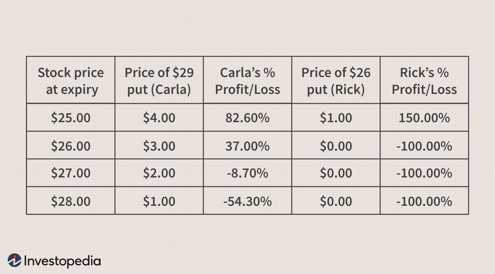

## Table of Contents

## What is a strike price in options trading?

In options trading, the strike price is the set price at which an option can be bought or sold when it is exercised. It's like a target price that both the buyer and seller agree on when they make the option contract. If you have a call option, the strike price is the price you can buy the stock at. If you have a put option, it's the price you can sell the stock at.

The strike price is really important because it helps decide if exercising the option will be profitable. For a call option to be worth exercising, the market price of the stock needs to be higher than the strike price. For a put option, the market price needs to be lower than the strike price. The difference between the market price and the strike price is what can make or lose you money.

## How does the strike price affect the value of an option?

The strike price is super important because it directly affects how much an option is worth. If you have a call option, the value goes up when the stock price is higher than the strike price. This is because you can buy the stock at the lower strike price and then sell it at the higher market price, making a profit. On the other hand, if the stock price is lower than the strike price, the call option loses value because it wouldn't make sense to buy the stock at a higher price than what it's worth in the market.

For a put option, it's the opposite. The value of the put option goes up when the stock price is lower than the strike price. This is because you can sell the stock at the higher strike price even though it's worth less in the market, making you money. If the stock price is higher than the strike price, the put option loses value because selling at the strike price wouldn't be profitable. So, the strike price helps decide if exercising the option will make you money or not, and this affects how much people are willing to pay for the option.

## What are the differences between in-the-money, at-the-money, and out-of-the-money options?

In options trading, an option is called "in-the-money" if exercising it right away would make you money. For a call option, this happens when the stock price is higher than the strike price. For a put option, it's when the stock price is lower than the strike price. Being in-the-money means the option has some real value because you could make a profit if you used it right now.

An option is "at-the-money" when the stock price is exactly the same as the strike price. This means that if you exercised the option right now, you wouldn't make or lose any money. At-the-money options are kind of in the middle and their value mostly comes from the chance that the stock price might move in a way that makes them in-the-money later on.

An option is "out-of-the-money" if exercising it right away would cost you money. For a call option, this is when the stock price is lower than the strike price. For a put option, it's when the stock price is higher than the strike price. Out-of-the-money options don't have any real value if you used them right now, but they could still be worth something because the stock price might change in the future.

## How do you choose a strike price based on your market outlook?

When choosing a strike price, it all depends on what you think the market will do. If you're feeling pretty sure the stock price is going to go up a lot, you might pick a strike price that's higher than where the stock is right now. This is called buying an out-of-the-money call option. It's cheaper to buy, but it won't make you money unless the stock really takes off. On the other hand, if you're not so sure about a big jump but still think the price will go up a bit, you might choose a strike price that's close to the current stock price. This is an at-the-money call option, and it's a bit more expensive but has a better chance of making you money.

If you think the stock price is going to go down, you might want to buy a put option. If you're expecting a big drop, you could go for an out-of-the-money put option with a strike price lower than the current stock price. It's less expensive but needs a bigger drop to pay off. If you think the drop will be smaller, an at-the-money put option, with a strike price near the current stock price, could be a safer bet. It costs more but has a higher chance of making you money if the stock price falls even a little bit. Your choice really depends on how much you think the stock will move and how much risk you're willing to take.

## What role does the expiration date play in selecting a strike price?

The expiration date of an option is really important when you're picking a strike price. It's all about how long you think it will take for the stock price to move in the way you're hoping. If you think the stock will make a big move soon, you might choose a shorter expiration date. This can be cheaper because there's less time for the stock to change, but it also means you have less time for your prediction to come true. If the stock doesn't move fast enough, your option could expire worthless.

On the other hand, if you think it might take longer for the stock to reach your target price, you might go for a longer expiration date. This gives the stock more time to move in your favor, but it will cost you more because there's more time for the stock to go up or down. Longer-dated options are more expensive, but they give you more chances for the stock to hit your strike price before the option expires. So, the expiration date helps you balance how much you're willing to spend with how long you think it will take for your market outlook to play out.

## How can implied volatility influence your choice of strike price?

Implied volatility is like a guess about how much a stock's price might move in the future. It's important when picking a strike price because it affects how much an option costs. If implied volatility is high, it means people think the stock price might change a lot, so options cost more. If you think the stock will move a lot and you want to buy an option, you might choose a strike price that's far from the current price because high volatility gives you a better chance that the stock will reach that price. But remember, these options will be more expensive.

On the other hand, if implied volatility is low, it means people expect the stock price to stay pretty steady. In this case, options are cheaper, but the stock might not move as much. If you still think the stock will move enough to make money, you might pick a strike price that's closer to the current price. This way, even a small move in the stock price could make your option in-the-money. So, implied volatility helps you decide how far away from the current price you want your strike price to be, based on how much you think the stock will move and how much you want to spend on the option.

## What are the financial implications of choosing different strike prices?

Choosing different strike prices can really change how much money you might make or lose. If you pick a strike price that's far away from the current stock price, like an out-of-the-money option, it's cheaper to buy. But it's also riskier because the stock has to move a lot to make you money. If the stock doesn't move enough before the option expires, you could lose all the money you spent on the option. On the other hand, if the stock does move a lot and hits your strike price, you could make a big profit because you bought the option for less.

If you choose a strike price that's close to the current stock price, like an at-the-money option, it's more expensive to buy. But it's also less risky because the stock doesn't have to move as much to make you money. This means you have a better chance of making a profit, but it won't be as big as if you had bought a cheaper out-of-the-money option that paid off. The key is to balance how much you're willing to spend with how much risk you're willing to take, and how much you think the stock will move.

## How do delta and other Greeks help in selecting the right strike price?

Delta is one of the Greeks, which are like special tools that help you understand how options might change in value. Delta tells you how much the price of an option will change if the stock price moves by $1. If you're choosing a strike price, delta can help you see how sensitive your option is to changes in the stock price. For example, if you want an option that will move a lot when the stock price changes, you might pick a strike price with a high delta. But if you want an option that's less sensitive, you might go for a lower delta. This can help you pick a strike price that matches how much you think the stock will move and how much risk you're okay with.

Other Greeks like gamma, theta, and vega also help you choose the right strike price. Gamma tells you how fast the delta changes when the stock price moves, which can help you pick a strike price if you're worried about big swings in the stock. Theta shows how much the option loses value as time goes by, so if you're thinking about how long to hold the option, theta can help you decide on a strike price that won't lose too much value before you can use it. Vega tells you how sensitive the option is to changes in implied volatility, which is important if you think the market's guess about how much the stock will move might change. By looking at all these Greeks together, you can pick a strike price that fits your plan for the stock and how you want to manage your risk.

## What strategies can be used to select strike prices for different trading goals?

If your goal is to make money from a big move in the stock price, you might choose a strike price that's far away from where the stock is now. This is called an out-of-the-money option. It's cheaper to buy, but the stock has to move a lot to make you money. If you think the stock will go up a lot, you'd buy a call option with a high strike price. If you think it will go down a lot, you'd buy a put option with a low strike price. This strategy is good if you want to spend less money upfront but are okay with taking more risk because the stock might not move enough before the option expires.

If you want to make money from a smaller move in the stock price, you might pick a strike price that's close to where the stock is now. This is called an at-the-money option. It's more expensive to buy, but the stock doesn't have to move as much to make you money. If you think the stock will go up a little, you'd buy a call option with a strike price near the current stock price. If you think it will go down a little, you'd buy a put option with a strike price near the current stock price. This strategy is good if you want a better chance of making money but are willing to spend more upfront and take less risk.

If your goal is to protect your stock from going down, you might use a strategy called a protective put. You'd buy a put option with a strike price that's close to where your stock is now. This way, if the stock price drops, you can sell it at the higher strike price and limit your losses. This strategy costs money because you have to buy the put option, but it can save you a lot if the stock price falls a lot. It's like buying insurance for your stock.

## How does the liquidity of an option affect the choice of strike price?

Liquidity is how easy it is to buy or sell an option without the price changing a lot. If an option is very liquid, it means lots of people are trading it, so you can buy or sell it quickly and at a good price. When you're picking a strike price, you might want to choose one that's more liquid because it's easier to get in and out of your trade. If you pick a strike price that's not very liquid, it might be harder to sell your option later, and you might have to sell it for less than you wanted.

If you're looking at different strike prices, you can check how liquid they are by looking at the trading volume and the bid-ask spread. The trading volume is how many options are being traded, and a higher volume usually means more liquidity. The bid-ask spread is the difference between what people are willing to pay for the option and what they're asking for it. A smaller spread means the option is more liquid. So, when you're choosing a strike price, think about how easy it will be to trade that option later on. Picking a more liquid strike price can help you manage your trades better and maybe even save you some money.

## What are some common mistakes to avoid when selecting a strike price?

One common mistake people make when picking a strike price is not thinking about how much the stock might move. If you pick a strike price that's too far away from the current stock price, the stock might not move enough before the option expires, and you could lose all the money you spent on the option. On the other hand, if you pick a strike price that's too close, you might spend more money upfront and not make as much profit if the stock does move a lot. It's important to have a good guess about how much the stock will move and pick a strike price that matches that guess.

Another mistake is not paying attention to how liquid the option is. If you pick a strike price that's not very liquid, it can be hard to sell your option later, and you might have to sell it for less than you wanted. Always check the trading volume and the bid-ask spread to make sure you can get in and out of your trade easily. Also, some people forget to think about how long they want to hold the option. If you pick an expiration date that's too short, the stock might not move enough in time, and if it's too long, you might spend more money than you need to. So, think about how long you think it will take for the stock to hit your strike price and pick an expiration date that fits that timeline.

## How can advanced traders use technical analysis to refine their strike price selection?

Advanced traders can use technical analysis to pick better strike prices by looking at charts and patterns to guess where the stock price might go next. They might use tools like support and resistance levels to find good strike prices. Support is a price where the stock has stopped falling before, so it might be a good place to buy a call option because the stock could bounce back up from there. Resistance is a price where the stock has stopped going up before, so it might be a good place to buy a put option because the stock could start falling from there. Traders also look at trends, like if the stock is going up or down over time, to decide if they should buy a call or a put option and where to set the strike price.

Another way advanced traders use technical analysis is by looking at indicators like moving averages and the Relative Strength Index (RSI). Moving averages help smooth out the price data to see the overall trend more clearly. If a short-term moving average crosses above a long-term one, it might be a good time to buy a call option because the stock could be starting to go up. If the RSI shows the stock is overbought, it might be a good time to buy a put option because the stock could be about to fall. By combining these technical tools, traders can pick strike prices that have a better chance of making money based on what the charts are telling them about where the stock might go next.

## What is Options Trading and How Can It Be Understood?

Options are financial derivatives that provide buyers the right, without the obligation, to purchase or sell an underlying asset at a predetermined strike price before the expiration date of the option. This characteristic offers investors the ability to speculate on price movements, hedge against potential losses, or achieve leverage in their investment portfolios. Different from futures contracts, the holder of an option can choose whether or not to execute the trade, which introduces a layer of strategic flexibility.

Options trading offers substantial versatility to investors. They can utilize options to hedge existing positions, prevent potential losses, or leverage positions to amplify gains. This ability to tailor strategies to specific risk-return profiles makes options an essential tool for managing a wide range of investment circumstances. For instance, buying a call option can enable investors to profit from an upward price movement in the underlying asset without committing significant capital upfront. Conversely, purchasing a put option can provide downside protection, allowing investors to hedge against declines in asset prices.

The choice of strike price is a critical decision in options trading. It significantly influences the potential profit and risk inherent in the strategy. The strike price determines the point at which an option becomes in-the-money (profitable) or out-of-the-money (potentially worthless). Consequently, selecting an appropriate strike price in alignment with market expectations and risk tolerance is imperative for optimizing returns. In mathematical terms, for a call option, the payoff at expiration is calculated as:

$$
\text{Payoff} = \max(0, S - K)
$$

where $S$ is the spot price of the underlying asset, and $K$ is the strike price. For a put option, the payoff formula is:

$$
\text{Payoff} = \max(0, K - S)
$$

Options are categorized into two primary types: calls and puts. A call option gives the holder the right to purchase an asset at the strike price, essentially betting on a rise in the underlying asset's price. In contrast, a put option empowers the holder to sell the asset at the strike price, which is advantageous if the price of the asset is anticipated to decline. These distinct characteristics allow investors to construct varied strategic positions, depending on their market forecasts and investment intentions.

To exemplify, suppose an investor anticipates that a company's stock, currently trading at $50, will increase. They might purchase a call option with a strike price of $55. If, at expiration, the stock's price exceeds $55, the option becomes profitable. Conversely, another investor expecting a decline might purchase a put option with a strike price slightly above the current market price, benefiting if the stock falls below this level.

In summary, the flexibility offered by options trading, through careful selection of the strike price and type of option, enables investors to strategically position themselves according to their market outlooks and financial goals.

## What are the strategies for Risk Management in Options and Algorithmic Trading?

Effective risk management is paramount when engaging in options and algorithmic trading due to these strategies' intrinsic complexity and potential for significant volatility. Investors leverage various techniques to mitigate risks, including hedging, diversification, position sizing, and stop-loss orders.

### Hedging

Hedging is a strategy used to offset potential losses in investments by taking an opposite position in a related asset. Options provide a natural hedging mechanism. For instance, purchasing put options can protect against declines in stock holdings. The Black-Scholes model is often utilized to price options for hedging, which helps in determining the optimal number of options needed to hedge specific positions.

### Diversification

Diversification reduces risk by spreading investments across different financial instruments, industries, or other categories. This approach lowers the impact of a single adverse event on the entire portfolio. In options trading, diversifying across different strike prices and expiration dates can reduce the portfolio's volatility.

### Position Sizing

Position sizing involves determining the amount of capital to allocate to a particular trade. By calculating the risk per trade and setting a maximum loss threshold, traders can ensure that no single trade can significantly harm their financial standing. A common formula used for this is the Kelly Criterion, which helps in calculating the optimal size for a series of bets:

$$
\text{f}^* = \frac{bp - q}{b}
$$

where:
- $f^*$ is the fraction of the portfolio to invest,
- $b$ is the odds received on the wager,
- $p$ is the probability of winning,
- $q$ is the probability of losing (1 - $p$).

### Stop-Loss Orders

Stop-loss orders are pre-set orders to sell an asset when it reaches a particular price point, limiting potential losses. In algorithmic trading, these can be automated to trigger based on specific conditions. For instance, algorithms can adjust stop-loss levels dynamically based on volatility metrics to avoid premature exits caused by short-term market noise.

### Automated Risk Controls with Algorithmic Trading

Algorithmic trading incorporates automated risk controls which bolster an investor's capacity to maintain desired risk levels consistently. These systems utilize large volumes of data to predict potential market movements and adjust positions in real-time. For example, an algorithm could automatically rebalance a portfolio as market conditions change, maintaining the pre-set risk exposure levels.

### Challenges in Risk Management

Implementing effective risk management strategies in options and algorithmic trading does pose challenges. One primary issue is the model risk, stemming from inaccuracies in financial models used for forecasting market movements. Backtesting strategies is essential to verify their effectiveness under historical market conditions. However, overfitting these models to past data might not perform well with future market conditions.

Another significant challenge is the 'flash crash' risk due to technical glitches or erroneous trades that may disrupt markets. Ensuring robust system architecture and incorporating circuit breakers can mitigate such risks.

In conclusion, risk management in options and algorithmic trading necessitates constant vigilance and adaptive strategies to safeguard investments while exploiting market opportunities. By integrating both manual strategies and automated controls, traders can enhance their ability to withstand market volatility and achieve desired financial outcomes.

## References & Further Reading

[1]: Bergstra, J., Bardenet, R., Bengio, Y., & Kégl, B. (2011). ["Algorithms for Hyper-Parameter Optimization."](https://dl.acm.org/doi/10.5555/2986459.2986743) Advances in Neural Information Processing Systems 24.

[2]: ["Advances in Financial Machine Learning"](https://www.amazon.com/Advances-Financial-Machine-Learning-Marcos/dp/1119482089) by Marcos Lopez de Prado

[3]: Black, F., & Scholes, M. (1973). ["The Pricing of Options and Corporate Liabilities."](https://www.cs.princeton.edu/courses/archive/fall09/cos323/papers/black_scholes73.pdf) The Journal of Political Economy, 81(3), 637–654.

[4]: ["Algorithmic Trading: Winning Strategies and Their Rationale"](https://www.wiley.com/en-us/Algorithmic+Trading%3A+Winning+Strategies+and+Their+Rationale-p-9781118460146) by Ernest P. Chan

[5]: Jarrow, R. A. (1992). ["A Guide to Options Markets,"](https://www.jstor.org/stable/2331322) Englewood Cliffs, NJ: Prentice Hall.