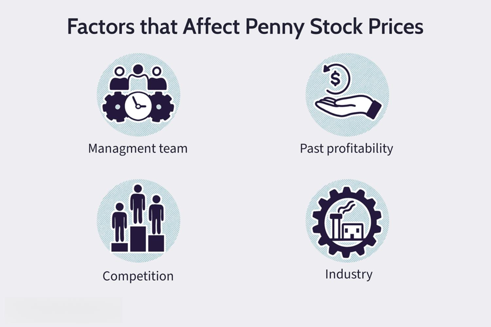

Investment strategies are integral to achieving optimal returns in the continually evolving domain of stock trading. Investors are often challenged to navigate an intricate landscape where various components interact to present both opportunities and risks. Central to these strategies are stock selection and algorithmic trading, with a particular focus on penny stocks offering distinctive features that can significantly influence investment outcomes.

Stock selection remains a foundational activity for any investor. This process involves identifying stocks that align with one's investment goals, risk tolerance, and market outlook. Particularly in the case of penny stocks, which typically trade below $5, investors are tempted by the prospect of high returns. However, these stocks are often associated with smaller companies and are inherently more volatile, requiring robust analysis and due diligence to mitigate risks.



Advancements in technology have introduced algorithmic trading as a powerful tool for investors. By employing automated systems to execute trades based on pre-defined rules and strategies, algorithmic trading enhances efficiency, minimizes emotional biases, and manages large volumes of data. This technical sophistication allows for the integration of complex strategies that can be tailored to individual investment preferences.

The interplay between penny stocks and algorithmic trading provides a unique spectrum of possibilities for investors. By leveraging algorithmic systems, investors can systematically identify optimal trading opportunities within the volatile penny stock market, thus potentially maximizing returns while maintaining control over inherent risks.

This article aims to provide insights into these crucial elements of investment strategies, offering guidance for both novice and experienced investors. By comprehending the dynamics of stock selection, embracing the potential of penny stocks, and harnessing the capabilities of algorithmic trading, investors can make informed decisions to enhance their investment portfolios successfully.

## Table of Contents

## Understanding Stock Selection

Stock selection is the process of choosing stocks that align with an investor's financial goals and risk tolerance. This involves an assessment of various factors such as market trends, company fundamentals, and macroeconomic indicators to make informed decisions that could potentially enhance investment returns.

**Market Trends**: Understanding market dynamics is crucial in stock selection. Market trends offer insights into the overall direction in which stocks or a particular sector are moving. For instance, technological innovations or changes in consumer behavior can influence sectoral performance. Investors often rely on technical analysis tools, such as moving averages or trend lines, to identify bullish or bearish trends. These tools help in visualizing historical price movements, which can inform future stock selection strategies.

**Company Fundamentals**: Evaluating the fundamental aspects of a company is a key component of stock selection. This involves analyzing financial statements like the balance sheet, income statement, and cash flow statements to assess a company's financial health and operational efficiency. Key ratios such as the Price-to-Earnings (P/E) ratio, Debt-to-Equity (D/E) ratio, and Return on Equity (ROE) provide insight into a company’s valuation, leverage, and profitability. For example, a P/E ratio is calculated as:

$$
\text{P/E Ratio} = \frac{\text{Market Price per Share}}{\text{Earnings per Share (EPS)}}
$$

A lower P/E might suggest that a stock is undervalued, whereas a higher P/E could indicate overvaluation, though interpretations can vary based on sector averages and market conditions.

**Macroeconomic Factors**: The broader economic environment significantly impacts stock performance. Indicators such as GDP growth rates, unemployment rates, interest rates, and inflation can influence market sentiment and investor decisions. For example, higher interest rates may lead to increased borrowing costs, potentially negatively affecting companies reliant on debt financing.

**Research and Analysis**: Investors must conduct thorough research to make sound stock selections. This includes investigating industry reports, keeping abreast of current news, and utilizing technological tools for data analysis. Platforms offering real-time market data and analytical software can aid in filtering stocks that meet specific criteria.

Tools such as Bloomberg Terminal or Reuters offer comprehensive databases for financial analysis, while platforms like Yahoo Finance and Google Finance provide free access to news and stock data. Integrating these resources can enhance the decision-making process, enabling investors to remain informed about market developments and company-specific news.

In summary, stock selection requires a multifaceted approach, combining technical analysis, fundamental assessment, and economic context. By leveraging comprehensive research tools and methodologies, investors can align their stock choices with their financial objectives and risk profiles, improving the potential for successful investment outcomes.

## The Allure and Risks of Penny Stocks

Penny stocks are equities that typically trade under $5 per share, offering investors the tantalizing prospect of substantial returns due to their low price points. They are often linked with smaller, emerging companies, which inherently [carry](/wiki/carry-trading) a higher degree of [volatility](/wiki/volatility-trading-strategies) compared to established corporations. The appeal of penny stocks largely stems from their potential for rapid price appreciation, creating opportunities for significant gains within short timeframes. This potential upside can be particularly enticing to investors with a higher risk tolerance.

However, penny stocks also present considerable risks. One of the primary challenges is [liquidity](/wiki/liquidity-risk-premium), which refers to the ease with which stocks can be bought or sold on the market without causing a substantial change in their price. Many penny stocks suffer from low trading volumes, making it difficult for investors to execute trades at desired prices or [exit](/wiki/exit-strategy) positions quickly. This illiquidity can lead to increased price volatility and potential losses.

Moreover, penny stocks frequently come with limited publicly available information. Smaller companies may not be subject to the same rigorous financial disclosure requirements as larger, publicly traded corporations. As a result, investors may find it challenging to obtain reliable data on the company’s financial health, management quality, or strategic direction. This lack of transparency can hinder informed decision-making and elevate the potential for investment pitfalls.

Conducting thorough due diligence is essential for investors looking to navigate the penny stock landscape successfully. This process involves evaluating a company's financial statements, analyzing market trends, and understanding industry dynamics to identify viable investment opportunities. Investors should scrutinize factors such as the company's earnings growth, debt levels, cash flow, and competitive position within its industry. By doing so, investors can mitigate some of the inherent risks associated with penny stocks and enhance their potential for profitable investment outcomes.

In conclusion, while penny stocks can offer substantial rewards, they come with notable risks that require careful consideration and analysis. Investors should adopt a cautious approach, leveraging comprehensive research and due diligence to make informed decisions and minimize potential losses.

## Algorithmic Trading: An Overview

Algorithmic trading involves the use of computerized systems to automate the process of trading financial instruments. These systems utilize pre-defined rules and strategies, allowing for efficient and systematic execution of trades. By relying on technology, traders can minimize emotional biases, which often lead to irrational decision-making. Moreover, these systems are capable of handling large datasets, making them well-suited to the analysis required for informed trading decisions.

A significant advantage of [algorithmic trading](/wiki/algorithmic-trading) is its speed. Computers can execute trades much faster than humans, which is crucial in markets where prices can change in fractions of a second. The ability to quickly enter and exit positions can enhance the potential for profit while reducing exposure to adverse price movements. Accuracy is another critical component of algorithmic trading. By following strict rules, these systems ensure that trades are executed according to the strategy, leaving little room for human error.

Furthermore, algorithmic trading systems offer the capability to execute multiple strategies at once. This flexibility allows investors to pursue diverse trading tactics, such as [arbitrage](/wiki/arbitrage), [market making](/wiki/market-making), or [trend following](/wiki/trend-following), all through a single system. These strategies can be tailored to meet specific investment objectives, whether they involve exploiting inefficiencies or capturing short-term market movements.

For investors, the implementation of algorithmic trading systems offers improved risk management. By systematically adhering to predefined rules, these systems can limit losses and protect against market volatility. Additionally, algorithms can be programmed to optimize returns by identifying and capitalizing on patterns and trends that might not be visible through manual trading.

Overall, the integration of algorithmic trading into investment portfolios has the potential to enhance both efficiency and profitability. By leveraging the speed, accuracy, and multi-strategy capabilities of these systems, traders can better navigate the complexities of financial markets.

## Integrating Penny Stocks with Algo Trading

The integration of algorithmic trading with penny stocks presents a strategic approach that can potentially capitalize on market opportunities while managing risks. Algorithms, by their nature, offer precision in trade execution. They can swiftly process vast amounts of data to identify optimal entry and exit points in penny stock trading. This capacity is particularly advantageous given the high volatility and liquidity issues often associated with penny stocks.

Advanced screening tools and sentiment analysis play pivotal roles in this integration. Screening tools sift through numerous stocks to identify those meeting specific criteria, such as price movements or trading [volume](/wiki/volume-trading-strategy), which are indicative of underlying trends. For instance, a moving average crossover strategy can be implemented in Python as follows:

```python
import pandas as pd

def moving_average_crossover(stock_data, short_window, long_window):
    stock_data['Short_MA'] = stock_data['Close'].rolling(window=short_window, min_periods=1).mean()
    stock_data['Long_MA'] = stock_data['Close'].rolling(window=long_window, min_periods=1).mean()

    stock_data['Signal'] = 0
    stock_data['Signal'][short_window:] = np.where(stock_data['Short_MA'][short_window:] > stock_data['Long_MA'][short_window:], 1, 0)

    stock_data['Position'] = stock_data['Signal'].diff()

    return stock_data
```

This code checks when a short-term moving average crosses above a long-term moving average, producing a buy signal, which could be particularly effective for penny stock trades where timing is crucial.

Moreover, sentiment analysis, which involves parsing news feeds, social media, and market sentiments, can provide additional layers of insight into the market dynamics. This analysis can identify shifts in investor perception that may precede stock price movements, offering a competitive edge in decision-making processes.

Backtesting is an essential component of integrating algorithmic strategies with penny stock trading. It involves simulating strategy performance against historical data to validate its potential efficacy in real-world conditions. The [backtesting](/wiki/backtesting) process not only helps in verifying the strategy's logic but also in fine-tuning the parameters to adapt to penny stock volatility.

Using the `[backtrader](/wiki/backtrader)` library in Python, investors can backtest their strategies to ensure robustness:

```python
import backtrader as bt

class PennyStockStrategy(bt.Strategy):
    def __init__(self):
        self.sma = bt.indicators.SimpleMovingAverage(self.data, period=15)

    def next(self):
        if self.data.close[0] > self.sma[0]:
            self.buy(size=100)
        elif self.data.close[0] < self.sma[0]:
            self.sell(size=100)

cerebro = bt.Cerebro()
cerebro.addstrategy(PennyStockStrategy)
cerebro.run()
```

This strategy indicates buying when the day's closing price is above the 15-day moving average, and selling when it is below, thus providing a systematic approach to penny stock trading.

Through the combined use of algorithms, screening tools, sentiment analysis, and diligent backtesting, investors can effectively navigate the complexities of penny stock trading. This systematic approach helps in managing risks while aiming for optimized returns in a highly dynamic trading environment.

## Risk Management and Best Practices

Effective risk management is a cornerstone of successful investment strategies, especially when dealing with the inherently volatile domain of penny stocks and the precision-driven world of algorithmic trading. Implementing robust risk management practices can significantly mitigate potential losses and enhance the consistency of returns.

One fundamental risk management technique is the use of stop-loss orders. Stop-loss orders are automated instructions to sell a security when it reaches a predetermined price. This method ensures that losses are limited by automatically exiting a position before further losses are incurred. For example, if a penny stock is purchased at $4 and a stop-loss is set at $3.50, the stock will be sold automatically if its price falls to $3.50. This safeguarding mechanism helps investors avoid emotional decision-making during sudden market downturns.

Diversification is another critical strategy in risk management. By spreading investments across various asset classes and sectors, an investor can reduce the impact of any single asset's poor performance. Diversification does not eliminate risk entirely but helps in distributing risk across a wider portfolio. In the context of penny stocks, which tend to have higher volatility, diversification can protect the portfolio from extreme fluctuations that can occur with individual stocks.

Regularly reviewing trading algorithms is essential for maintaining their effectiveness. Algorithms must adapt to new data and evolving market conditions to ensure optimal performance. This could involve backtesting strategies with historical data to assess their potential performance or stress-testing them under different market scenarios. Investors might use Python to perform such backtesting:

```python
import pandas as pd
import numpy as np

def backtest_strategy(data, strategy_func, start_balance):
    balance = start_balance
    for i in range(len(data)):
        decision = strategy_func(data.iloc[:i])
        if decision == 'buy':
            balance -= data['price'].iloc[i]
        elif decision == 'sell':
            balance += data['price'].iloc[i]
    return balance

# Example of a simple moving average strategy
def sma_strategy(data, short_window=40, long_window=100):
    signals = pd.DataFrame(index=data.index)
    signals['short_mavg'] = data['price'].rolling(window=short_window, min_periods=1).mean()
    signals['long_mavg'] = data['price'].rolling(window=long_window, min_periods=1).mean()
    if signals['short_mavg'].iloc[-1] > signals['long_mavg'].iloc[-1]:
        return 'buy'
    elif signals['short_mavg'].iloc[-1] < signals['long_mavg'].iloc[-1]:
        return 'sell'
    return 'hold'
```

Continuous education and staying informed about market news are vital for adapting investment strategies. Market conditions can change rapidly, influenced by economic indicators, geopolitical events, and other factors. Investors can rely on industry reports, financial news platforms, and professional development courses to keep their knowledge current.

Collaborating with financial advisors or experienced traders provides invaluable insights and a broader perspective on market trends and strategies. These professionals can offer tailored advice and identify potential risks that may not be immediately apparent to less experienced investors.

Collectively, these practices form a comprehensive framework for managing risks associated with penny stocks and algorithmic trading, fostering a disciplined approach to investing. Through diligent application of these strategies, investors can navigate the complexities of the stock market with greater confidence.

## Conclusion

The intersection of stock selection, penny stocks, and algorithmic trading presents both challenges and opportunities for investors. This triad showcases the dynamic potential within the stock market, where strategic approaches can leverage unique advantages. By blending traditional investment strategies with cutting-edge technologies, investors are positioned to optimize their portfolios for substantial growth. 

Algorithmic trading, when integrated with careful stock selection, particularly penny stocks, empowers investors to effectively navigate market volatility and seize potential profits. The automated nature of algorithmic trading minimizes human error and emotional bias, while advanced analytics and [machine learning](/wiki/machine-learning) models enhance stock selection processes. By employing statistical methods and real-time data analysis, such systems refine decision-making, allowing for timely entry and exit in trades. A sample Python code snippet that illustrates the basic framework for algorithmic trading may include:

```python
import pandas as pd
import numpy as np

# Sample stock data
data = pd.DataFrame({
    'price': [10, 12, 11, 13, 14, 13, 15],
    'volume': [200, 220, 180, 250, 260, 240, 280]
})

# Simple algorithmic strategy: buy when price dips 5% or more
def buy_signal(data):
    return data['price'].pct_change().apply(lambda x: x <= -0.05)

buy_signals = buy_signal(data)
```

Even with sophisticated systems, remaining vigilant, informed, and adaptable in stock trading is essential. The market's inherent unpredictability necessitates continuous learning and adaptation of strategies. As market conditions evolve, maintaining a keen understanding of economic indicators, financial news, and emerging technologies is crucial.

Informed decision-making and diligent risk management underpin successful investment outcomes. Adopting risk management techniques, such as setting stop-loss orders and diversifying portfolios, mitigates potential losses. By regularly reviewing and fine-tuning trading algorithms, investors enhance their ability to respond to market dynamics effectively.

Conclusively, by strategically aligning stock selection with advanced algorithmic technologies, investors can adeptly navigate the stock market's complexities. Remaining adaptable and committed to informed strategies lays the foundation for potential success in achieving desired investment goals.

## References & Further Reading

[1]: Bergstra, J., Bardenet, R., Bengio, Y., & Kégl, B. (2011). ["Algorithms for Hyper-Parameter Optimization."](https://dl.acm.org/doi/10.5555/2986459.2986743) Advances in Neural Information Processing Systems 24.

[2]: ["Advances in Financial Machine Learning"](https://www.amazon.com/Advances-Financial-Machine-Learning-Marcos/dp/1119482089) by Marcos Lopez de Prado

[3]: ["Evidence-Based Technical Analysis: Applying the Scientific Method and Statistical Inference to Trading Signals"](https://www.amazon.com/Evidence-Based-Technical-Analysis-Scientific-Statistical/dp/0470008741) by David Aronson

[4]: ["Machine Learning for Algorithmic Trading"](https://github.com/stefan-jansen/machine-learning-for-trading) by Stefan Jansen

[5]: ["Quantitative Trading: How to Build Your Own Algorithmic Trading Business"](https://github.com/LucindaYa/quant-resources/blob/master/Quantitative%20Trading%20How%20to%20Build%20Your%20Own%20Algorithmic%20Trading%20Business.pdf) by Ernest P. Chan