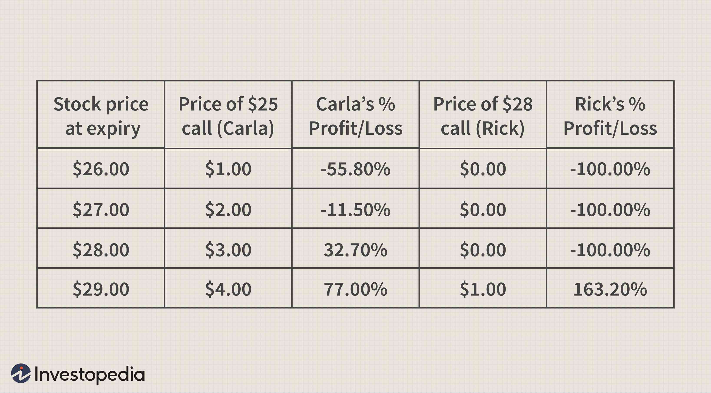

## Table of Contents

## What is a trading coach and why might someone need one?

A trading coach is someone who helps people learn how to trade stocks, forex, or other financial markets. They teach you strategies, help you understand the markets, and give you advice on how to make better trading decisions. A trading coach can be very helpful if you are new to trading or if you want to improve your skills.

Someone might need a trading coach because trading can be hard and confusing. A coach can help you avoid common mistakes and save you time by teaching you the right way to trade from the start. They can also help you stay disciplined and focused, which is important for success in trading.

## How can a beginner identify if they need a trading coach?

A beginner might need a trading coach if they feel overwhelmed by the amount of information and choices in trading. When you start trading, it can be hard to know what to do and where to begin. If you find yourself confused about different trading strategies, unsure about how to read market signals, or making a lot of losing trades, a coach can help you. They can explain things in a way that's easy to understand and guide you through the process.

Another sign that you might need a trading coach is if you're having trouble sticking to a trading plan. Trading requires discipline, and it's easy to let emotions take over and make bad decisions. A coach can help you stay on track, set realistic goals, and keep you motivated. If you feel like you're not making progress or you're losing money because you can't control your emotions, a trading coach can provide the support and guidance you need to improve.

## What qualifications should a trading coach have?

A good trading coach should have a lot of experience in trading themselves. This means they have been trading for many years and have made money doing it. They should know different trading strategies and understand how the markets work. It's also important for a trading coach to have some kind of certification or education in finance or trading. This could be a degree in finance, a certification like a Certified Financial Analyst (CFA), or even a specific trading [course](/wiki/best-algorithmic-trading-courses) they have completed.

Besides experience and education, a trading coach should be good at teaching and communicating. They need to explain complicated ideas in a way that beginners can understand. They should also be patient and able to help you through the ups and downs of learning to trade. It's helpful if they have good reviews or testimonials from other people they have coached. This shows they have a track record of helping others succeed in trading.

## How do you evaluate the experience and track record of a potential trading coach?

To evaluate the experience of a potential trading coach, you should first look at how long they have been trading. A good coach should have many years of experience. Ask them about their trading history and what strategies they use. It's also important to see if they have made money from trading themselves. You can ask for proof of their trading results, but remember that past performance doesn't guarantee future success. Check if they have any formal education or certifications in finance or trading, like a degree or a CFA certification, as this shows they have a solid understanding of the markets.

To check their track record, look for testimonials and reviews from other people they have coached. These should be from real people and show that the coach has helped others improve their trading skills and make money. You can also ask for references and talk to past students to get their opinions. A good trading coach will be happy to share this information with you. Remember, a coach with a strong track record not only has experience but also knows how to teach and help others succeed in trading.

## What are the different coaching styles and which one suits a beginner best?

There are different coaching styles that trading coaches might use. One style is the directive style, where the coach tells you exactly what to do and gives you clear instructions. This can be good for beginners because it gives you a clear path to follow. Another style is the non-directive style, where the coach asks you questions and helps you figure out things on your own. This can be good if you want to learn how to think for yourself. The third style is the collaborative style, where the coach works with you to come up with plans and strategies. This can be good if you want to feel like you're part of the process.

For a beginner, the directive style is often the best. This is because when you're new to trading, you need clear guidance and instructions. A coach who tells you what to do can help you avoid making big mistakes and learn the basics quickly. As you get better at trading, you might want to try the collaborative or non-directive styles. These can help you think more on your own and come up with your own strategies. But at the start, a directive coach can give you the structure and support you need to learn trading well.

## How can intermediate traders benefit from a trading coach?

Intermediate traders can still benefit a lot from a trading coach. Even though they know the basics, they might want to learn new strategies or improve the ones they already use. A coach can help them do this by showing them different ways to trade and helping them understand the markets better. They can also give feedback on what the trader is doing well and what they can do better. This can help the trader make more money and avoid losing money.

A coach can also help intermediate traders stay disciplined and focused. Trading can be hard, and it's easy to get distracted or let emotions take over. A coach can help keep the trader on track and remind them of their goals. They can also help the trader set new goals and come up with a plan to reach them. This support can make a big difference in how successful the trader becomes.

## What specific skills should an expert trader look for in a coach?

An expert trader should look for a coach who has advanced knowledge of the markets and trading strategies. The coach should be able to teach the expert trader new techniques or help them refine their existing strategies. They should also have a deep understanding of risk management and be able to help the trader handle complex trading situations. It's important that the coach has a proven track record of success in trading at an expert level and can share insights that go beyond the basics.

In addition to technical skills, an expert trader should seek a coach who excels in psychological coaching. Trading at an expert level often involves managing stress and maintaining emotional balance. A good coach should be able to help the trader stay disciplined, focused, and resilient in the face of market [volatility](/wiki/volatility-trading-strategies). They should also be able to provide personalized feedback and adapt their coaching style to meet the specific needs of an expert trader, helping them to continually improve and stay ahead in the competitive world of trading.

## How do you assess the compatibility between a trader and a coach?

To assess the compatibility between a trader and a coach, it's important to see if they get along well and share the same goals. The trader should feel comfortable talking to the coach and trust what they say. They should also agree on what the trader wants to achieve, like making more money or learning new strategies. If the coach understands what the trader needs and can help them reach their goals, they are likely to work well together.

Another way to check compatibility is to see if the coach's teaching style matches the trader's learning style. Some traders like a coach who tells them exactly what to do, while others prefer a coach who helps them figure things out on their own. The trader should feel that the coach's way of teaching helps them learn and grow. If the coach and trader can communicate well and the coach's methods make sense to the trader, they will have a good working relationship.

## What are the common pitfalls to avoid when selecting a trading coach?

One common pitfall when [picking](/wiki/asset-class-picking) a trading coach is choosing someone who doesn't have enough experience. A good coach should have traded for many years and made money doing it. If a coach is new to trading or hasn't been successful, they might not be able to help you much. Also, be careful of coaches who promise you'll make a lot of money quickly. Trading is hard, and no one can guarantee big profits. If a coach makes big promises, they might just be trying to get your money.

Another pitfall is not checking if the coach's teaching style works for you. Some coaches give you clear instructions, while others help you figure things out on your own. If their way of teaching doesn't match how you learn best, you might not get much out of the coaching. It's also important to see if you get along with the coach and if they understand what you want to achieve. If you don't feel comfortable with them or if they don't seem to care about your goals, they might not be the right coach for you.

## How can one measure the effectiveness of a trading coach?

One way to measure the effectiveness of a trading coach is by looking at your own trading results. If you start making more money and fewer mistakes after working with the coach, that's a good sign. They should help you learn new strategies and understand the markets better. Also, if you feel more confident and disciplined in your trading, that shows the coach is doing a good job. It's important to keep track of your progress and see if you're reaching the goals you set with your coach.

Another way to measure the effectiveness is by getting feedback from other people who have worked with the same coach. If many people say the coach helped them improve their trading, that's a good sign. You can also ask the coach for references and talk to their past students. A good coach will be happy to share this information with you. Remember, a coach who helps you learn and grow, and who you feel comfortable with, is likely to be effective.

## What are the cost considerations when hiring a trading coach?

When you think about hiring a trading coach, you need to think about the cost. Trading coaches can charge different amounts of money. Some might charge by the hour, and their prices can be from $50 to $200 or even more per hour. Others might have a package deal where you pay a set amount for a certain number of sessions. The cost can depend on how much experience the coach has and how well-known they are. It's important to find a coach who fits your budget but can also help you learn and grow as a trader.

You should also think about what you're getting for the money you spend. A good coach can help you make more money in trading, so it might be worth paying more if they can really help you. But, be careful of coaches who charge a lot but don't have good results or reviews. It's a good idea to talk to the coach about their fees and what they include before you decide to work with them. This way, you can make sure you're getting good value for your money.

## How should a trader transition from being coached to trading independently?

A trader should start transitioning to trading independently by slowly taking on more responsibility for their trades. This means they should begin making their own trading decisions with the guidance of their coach. The coach can still be there to give advice and feedback, but the trader should try to use what they've learned to make choices on their own. As the trader gets more confident, they can start to trade without checking with the coach first. This helps them build the skills and confidence they need to trade on their own.

Once the trader feels ready, they should set a goal to trade completely on their own. They can start by setting a certain number of trades to do without the coach's help. It's important for the trader to keep track of their progress and see if they're doing well without the coach. If they start making good trades and feel confident, they can slowly stop working with the coach. The key is to take it slow and make sure they're ready to trade independently before fully letting go of the coach's guidance.

## References & Further Reading

[1]: Bergstra, J., Bardenet, R., Bengio, Y., & Kégl, B. (2011). ["Algorithms for Hyper-Parameter Optimization."](https://dl.acm.org/doi/10.5555/2986459.2986743) Advances in Neural Information Processing Systems 24.

[2]: ["Advances in Financial Machine Learning"](https://www.amazon.com/Advances-Financial-Machine-Learning-Marcos/dp/1119482089) by Marcos Lopez de Prado

[3]: ["Evidence-Based Technical Analysis: Applying the Scientific Method and Statistical Inference to Trading Signals"](https://www.amazon.com/Evidence-Based-Technical-Analysis-Scientific-Statistical/dp/0470008741) by David Aronson

[4]: ["Machine Learning for Algorithmic Trading"](https://github.com/stefan-jansen/machine-learning-for-trading) by Stefan Jansen

[5]: ["Quantitative Trading: How to Build Your Own Algorithmic Trading Business"](https://github.com/LucindaYa/quant-resources/blob/master/Quantitative%20Trading%20How%20to%20Build%20Your%20Own%20Algorithmic%20Trading%20Business.pdf) by Ernest P. Chan