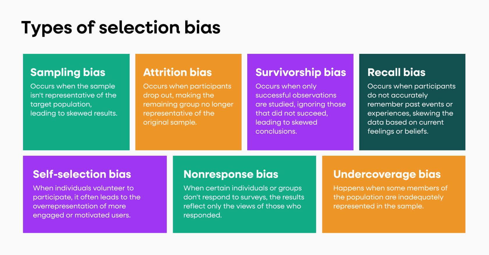

Algorithmic trading, or algo trading, leverages advanced computer systems to execute trades based on pre-set rules and sophisticated statistical models. This approach allows for the automation of trading decisions, enabling rapid execution and the potential for more consistent performance compared to manual methods. Despite its technological advantages, algorithmic trading faces issues that are not dissimilar from those encountered in traditional trading. One major issue is selection bias, a phenomenon that can significantly distort the results of backtesting—a process used to evaluate the viability of trading strategies using historical data.

Selection bias becomes problematic when the historical data or strategies chosen for analysis do not accurately reflect future market conditions. This bias can lead to the development of overly optimistic trading strategies that appear robust in simulations but falter in live market conditions. The skewed results from backtesting due to selection bias can thus mislead traders, impacting their decision-making and ultimately influencing trading outcomes negatively. 

A thorough understanding of selection bias is crucial for algorithmic traders who aim to ensure their strategies are not only theoretically sound but also practically viable. This article will explore the nature of selection bias, its impact on algo trading, and the methodologies traders can utilize to mitigate its effects. By addressing selection bias, traders can work towards developing more reliable and effective trading strategies.

## Table of Contents

## What is Selection Bias?

Selection bias can significantly affect the validity of an analysis, particularly in [algorithmic trading](/wiki/algorithmic-trading), where it can distort the perceived efficacy of trading models. This bias arises when a sample used for analysis is not representative of the broader data set, leading to skewed and unreliable results.

In algorithmic trading, selection bias often manifests when traders choose data sets or strategies based solely on their historical performance without assessing their future reliability. For instance, a trader might construct a strategy by [backtesting](/wiki/backtesting) against historical data that shows favorable results, not accounting for variations that could occur in different market conditions. This approach risks creating a model that appears successful due to unique circumstances within the chosen data set rather than possessing a genuinely effective underlying mechanism. Consequently, when deployed in real-world trading, such a model might fail to produce similar results, as the conditions supporting its success may no longer exist.

Selection bias provides a false representation of a trading strategy's effectiveness. By relying on biased analysis, traders might overestimate a strategy's potential, leading them to implement strategies that are unlikely to succeed under different market conditions. This misjudgment can result in significant financial losses and misallocation of resources.

Addressing selection bias is critical for traders seeking to develop robust, reliable algorithmic trading strategies. By adopting more stringent data selection criteria and validation techniques, traders can reduce the risk of falling prey to this bias and improve the accuracy of their trading models' predictions.

## How Selection Bias Affects Algo Trading

Selection bias can significantly undermine the effectiveness of algorithmic trading strategies by generating an over-optimistic impression of their potential returns. This often occurs when traders rely on historical data that, intentionally or unintentionally, presents a skewed perspective of market conditions. For instance, by selecting data from periods of economic prosperity as the basis for backtesting, traders may develop strategies that perform exceptionally well under those specific conditions but fall short when applied to a broader or different temporal dataset.

Moreover, survivorship bias is another prevalent form of selection bias impacting algo trading. This happens when only companies that have survived until the present are included in historical datasets, excluding those that went bankrupt or were otherwise unsuccessful. This can create a distorted view of the market landscape, leading to trading models that appear more reliable than they truly are. As a result, these models may fail when applied to real markets where not all companies are guaranteed success, affecting the assumed reliability and profitability of the trading strategy.

Another consequence of selection bias is the potential creation of strategies overly dependent on specific market conditions. A strategy that seems robust during backtesting may rely on conditions that do not hold over time, such as low [volatility](/wiki/volatility-trading-strategies) or stable economic indicators. When market conditions inevitably change, these strategies may underperform, causing potential financial losses.

In summary, selection bias affects algorithmic trading by providing a false sense of the strategy's success. Traders must be cautious and employ thorough validation techniques to ensure that their models are resilient across varying market conditions.

## Common Causes of Selection Bias in Algo Trading

Selection bias can severely affect the validity of algorithmic trading strategies by skewing the data and results, ultimately causing these strategies to underperform in real market conditions. Several common causes contribute to this bias:

### Data Snooping

Data snooping, also known as data mining bias, occurs when traders excessively search through historical data to identify patterns or correlations that might not hold true outside the analyzed dataset. Traders may inadvertently optimize a strategy to fit these historical anomalies, mistaking noise for genuine market trends. A classic symptom of data snooping is when a trading model performs exceptionally well on past data but poorly on future data. To mitigate data snooping, traders should employ out-of-sample testing and cross-validation techniques to validate their models on new data.

### Survivorship Bias

Survivorship bias arises when an analysis focuses only on entities that have persisted until the end of the study period, thus ignoring those that have disappeared due to failure. In stock trading, this typically means analyzing only the companies that are currently successful while excluding those that went bankrupt or underperformed. This bias can give an overly optimistic view of a trading strategy's performance, as the dataset selectively omits unsuccessful entities. To avoid survivorship bias, historical datasets must include both currently active and delisted stocks to reflect a more realistic market scenario.

### Cherry-Picking

Cherry-[picking](/wiki/asset-class-picking) involves selectively using data that supports a predetermined conclusion or hypothesis while disregarding data that contradicts it. This can lead traders to an exaggerated confidence in their strategy's effectiveness by ignoring potential risks or real-world variability. An example is selecting a particular economic period for backtesting that coincidentally aligns with good performance while ignoring less favorable periods. To counteract cherry-picking, traders need to ensure comprehensive data coverage across different market conditions and to systematically document and justify all data selections during the research process.

By recognizing and addressing these sources of selection bias, traders can improve the robustness and success rate of their algorithmic trading strategies, reducing overfitting and enhancing adaptability to varying market conditions.

## Techniques to Mitigate Selection Bias

To mitigate selection bias in algorithmic trading, utilizing Out-of-Sample Testing, Cross-Validation, and Robust Reporting are crucial strategies.

**Out-of-Sample Testing**: One effective technique to combat selection bias involves reserving a segment of your data exclusively for validation. By dividing your dataset into in-sample and out-of-sample portions, you can develop your model using the in-sample data and test its performance on the out-of-sample data. This process helps ensure that the trading strategy is not tailored to historical noise but can perform in new, unseen data. A common approach is the use of a split, such as an 80/20 partition, where 80% of the data is used for model training and the remaining 20% is reserved for out-of-sample testing.

**Cross-Validation**: Another robust statistical method to address selection bias is cross-validation. This technique partitions the available data into multiple subsets or 'folds.' A popular variant is k-fold cross-validation, where the data is divided into k subsets. The model is trained k times, each time using k-1 folds for training and the remaining fold for validation. This ensures that each observation is used for both training and validation, providing a more generalized analysis of the model's performance. The formula for k-fold cross-validation error can be expressed as:

$$
\text{CV Error} = \frac{1}{k} \sum_{i=1}^{k} \text{error}_i
$$

where $\text{error}_i$ is the error evaluated on the i-th fold.

**Robust Reporting**: Systematic documentation is another cornerstone in mitigating selection bias. By thoroughly documenting each step of the trading model development process, including data selection criteria, preprocessing steps, and model parameter settings, traders can track potential sources of bias. This documentation creates a transparent development workflow, making it easier to identify and adjust elements that may introduce selection bias.

In summary, by applying methodologies like out-of-sample testing, cross-validation, and robust reporting, traders can substantially reduce the impact of selection bias in algorithmic trading. These practices not only improve the reliability of trading models but also facilitate ongoing refinement and validation in dynamic market conditions.

## Conclusion

Selection bias is a critical consideration in the development of algorithmic trading strategies. Recognizing and addressing this bias allows traders to more accurately evaluate the potential success of their strategies in real-world applications, thereby reducing the risk of overfitting and misjudged expectations. By systematically identifying and accounting for the various forms of selection bias, such as data snooping and survivorship bias, traders can develop strategies that are more likely to perform consistently under diverse market conditions. 

Continual learning and adaptation are vital for minimizing selection bias, as financial markets and datasets continuously evolve. Employing techniques like out-of-sample testing, cross-validation, and robust reporting fosters a discipline that not only highlights potential biases but also helps in refining trading models over time. By engaging in these practices, traders enhance the reliability of their strategies, ultimately leading to improved trading performance and greater confidence in decision-making processes.

## References & Further Reading

[1]: Tetlock, P. C. (2007). ["Giving Content to Investor Sentiment: The Role of Media in the Stock Market."](https://onlinelibrary.wiley.com/doi/abs/10.1111/j.1540-6261.2007.01232.x) The Journal of Finance.

[2]: Aronson, D. R. (2006). ["Evidence-Based Technical Analysis: Applying the Scientific Method and Statistical Inference to Trading Signals."](https://www.amazon.com/Evidence-Based-Technical-Analysis-Scientific-Statistical/dp/0470008741) Wiley.

[3]: Lopez de Prado, M. (2018). ["Advances in Financial Machine Learning."](https://www.amazon.com/Advances-Financial-Machine-Learning-Marcos/dp/1119482089) Wiley.

[4]: Chan, E. P. (2009). ["Quantitative Trading: How to Build Your Own Algorithmic Trading Business."](https://github.com/ftvision/quant_trading_echan_book) Wiley.

[5]: Jansen, S. (2020). ["Machine Learning for Algorithmic Trading."](https://github.com/stefan-jansen/machine-learning-for-trading) Packt Publishing.

[6]: Bergstra, J., Bardenet, R., Bengio, Y., & Kégl, B. (2011). ["Algorithms for Hyper-Parameter Optimization."](https://dl.acm.org/doi/10.5555/2986459.2986743) Advances in Neural Information Processing Systems 24.