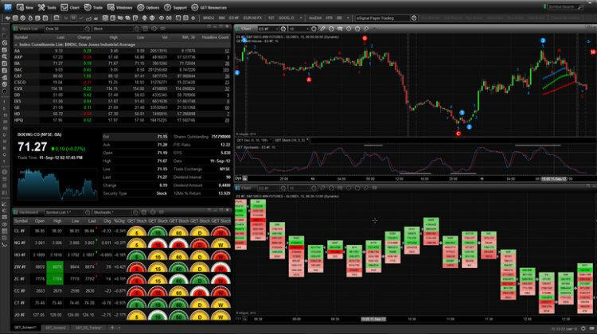

Day trading has emerged as a popular investment strategy, primarily due to the significant role technology plays in its evolution. The advent of advanced investment tools, sophisticated trading software, and algorithmic trading mechanisms has substantially increased the efficiency and accessibility of day trading. These innovations enable traders to execute transactions swiftly and analyze vast amounts of market data in real-time, providing a competitive edge in the fast-paced world of financial markets.

Investment tools such as trading platforms, charting software, and live news feeds are fundamental to the modern-day trader's toolkit, allowing for informed and timely decision-making. Trading software enhances this experience by offering automated order placements, real-time monitoring, and advanced analytical capabilities. Algorithmic trading, which utilizes computer programs to follow specific trading rules, further expands a trader's ability to manage complex strategies, minimizing human error and emotional biases.



Throughout this article, we explore the essential tools every day trader should consider. We discuss how trading software functions and what makes algorithmic trading increasingly crucial to contemporary trading strategies. Additionally, we examine the leading platforms available for day traders and highlight the key features that should be considered when selecting trading software. By the conclusion of this guide, you will have a well-rounded understanding of the investment tools and algorithmic techniques that are transforming day trading.

## Table of Contents

## Understanding Day Trading Investment Tools

Day trading involves the rapid buying and selling of financial instruments, such as stocks, currencies, or commodities, within a single trading day. This method of trading demands precision and swift decision-making, as the aim is to capitalize on short-term market movements. To achieve this, day traders rely heavily on a suite of investment tools that facilitate effective decision-making and execution.

One of the most critical tools for day traders is a robust trading platform. These platforms serve as the trader's primary interface with the financial markets, providing the functionalities required for executing trades, analyzing data, and managing portfolios. Trading platforms offer various features, including real-time market data and the ability to set custom alerts, which are invaluable for traders who need to react quickly to market changes.

Charting tools are another essential component of a day trader’s toolkit. These tools enable traders to visualize market trends, patterns, and potential movement forecasts through various types of charts, such as candlestick or bar charts. By analyzing these charts, traders can identify technical indicators, such as moving averages or the Relative Strength Index (RSI), which provide insights into market [momentum](/wiki/momentum) and potential reversal points.

Real-time news feeds are also vital for [day trading](/wiki/day-trading-spy) success. Financial markets can be heavily influenced by news events, including economic reports, political developments, or company announcements. Having access to timely and accurate news data allows traders to anticipate market moves and adjust their strategies accordingly. Platforms often integrate news services that provide tailored alerts based on specific criteria set by the trader.

To successfully leverage these tools, day traders must combine technical analysis with fundamental news data. Technical analysis involves using historical price data and technical indicators to predict future price movements. In contrast, [fundamental analysis](/wiki/fundamental-analysis) focuses on evaluating financial statements, economic data, and geopolitical events that may impact the market. By marrying these two analytical approaches, traders can make more informed decisions and potentially increase their profitability.

In summary, day trading necessitates a harmonious interaction between various investment tools. Trading platforms, charting tools, and real-time news feeds provide the necessary infrastructure for analyzing and anticipating market moves swiftly. Through the effective use of these tools, augmented by a combination of technical and fundamental analysis, day traders can enhance their decision-making capability and strive for successful trades within the rapid pace of the market.

## Trading Software: Key Features and Benefits

Trading software is a crucial component for day traders seeking to interact with financial markets and execute trades with speed and precision. These software solutions provide a comprehensive suite of tools that facilitate the comprehensive management of trading activities.

**Key Features**

1. **Automated Order Placement**: Trading software often includes features for automating the order placement process. By using predefined criteria or strategies, traders can automatically submit trade orders without constant manual input. This automation reduces reaction times and allows traders to capitalize on short-lived market opportunities. 

2. **Real-time Monitoring**: The ability to access and monitor real-time market data is essential for effective day trading. Trading platforms integrate continuous data feeds that present live market prices, enabling traders to make informed decisions promptly. Alerts and notifications can be customized to draw attention to significant market changes.

3. **Advanced Charting Capabilities**: Comprehensive charting tools provided by trading software help traders analyze market trends and patterns. These tools often include a range of technical indicators, drawing tools, and visualization options, allowing traders to perform technical analysis to predict future price movements.

**Benefits of Trading Software**

- **Increased Speed**: Modern trading software enhances the speed of executing trades, which is paramount in day trading where timing is critical. Automated systems can execute trades in milliseconds, far faster than human capabilities.

- **Accuracy**: Trading programs reduce the likelihood of human error by executing trades based on precise algorithmic criteria. This precision increases the reliability of trading actions compared to manual processes.

- **Complex Strategy Handling**: Trading software is adept at managing sophisticated trading strategies that may include multiple buying and selling conditions. For example, a trader could implement the following simple moving average crossover strategy using Python pseudocode:

    ```python
    short_window = 40
    long_window = 100

    signals = pd.DataFrame(index=df.index)
    signals['signal'] = 0.0

    # Creating short moving average
    signals['short_mavg'] = df['Close'].rolling(window=short_window, min_periods=1, center=False).mean()

    # Creating long moving average
    signals['long_mavg'] = df['Close'].rolling(window=long_window, min_periods=1, center=False).mean()

    # Generating signals (1 for buy, 0 for sell)
    signals['signal'][short_window:] = np.where(signals['short_mavg'][short_window:] > signals['long_mavg'][short_window:], 1.0, 0.0)

    # Generating positions diff
    signals['positions'] = signals['signal'].diff()
    ```

**Algorithmic Trading Integration**

Some trading platforms offer [algorithmic trading](/wiki/algorithmic-trading) functionalities, enabling traders to design, test, and deploy algorithms to manage trading strategies programmatically. This feature allows traders to optimize strategies using historical data and minimize emotional decision-making by adhering to preset rules.

**Costs Consideration**

When evaluating trading software, it is crucial to understand its cost structure, including commissions and subscription fees. These costs can significantly impact the overall profitability of trading activities. Traders should assess pricing models relative to the features offered, ensuring alignment with their trading [volume](/wiki/volume-trading-strategy) and strategy needs. A transparent understanding of the fee structure can help mitigate unexpected expenses and improve net returns.

In summary, trading software is indispensable for modern-day traders aiming to enhance their operational efficiency and execution prowess. By leveraging advanced features and understanding their associated costs, traders can optimize their strategies for better market performance.

## The Role of Algorithmic Trading

Algorithmic trading utilizes computer programs to automate trading activities, executed based on predefined parameters such as timing, price, or volume. This methodology not only streamlines the trading process, minimizing human intervention, but also enhances efficiency by executing trades at optimal conditions. At the core of algorithmic trading lies the capacity to manage multiple data inputs and respond faster than a human trader, a feature that is particularly beneficial in today's fast-paced markets.

A primary advantage of algorithmic trading is its ability to eliminate emotional decision-making, a common pitfall in manual trading. Algorithms adhere strictly to the given rules, ensuring consistent execution irrespective of market conditions or human sentiment. This consistency helps maintain discipline in trading strategies, leading to potentially higher returns and minimizing losses due to irrational decisions.

For day traders dealing with high volumes of transactions, algorithmic trading offers significant benefits. These systems can execute trades in milliseconds, faster than human perception, which is crucial when capitalizing on fleeting market opportunities. Moreover, algorithms can simultaneously scan and respond to multiple markets and securities, increasing the scope and efficiency of operations.

However, success in algorithmic trading relies heavily on the proper design and implementation of trading strategies. Traders must possess a comprehensive understanding of both the financial markets and programming to craft algorithms that can handle complex market scenarios. To illustrate, let's consider a simple moving average crossover strategy in Python using a library such as pandas:

```python
import pandas as pd

# Load historical market data
data = pd.read_csv('historical_data.csv')

# Calculate short and long moving averages
data['short_ma'] = data['price'].rolling(window=50).mean()
data['long_ma'] = data['price'].rolling(window=200).mean()

# Generate trading signals
data['signal'] = 0
data['signal'][50:] = np.where(data['short_ma'][50:] > data['long_ma'][50:], 1, 0)
data['positions'] = data['signal'].diff()

# Positions where 1 indicates a buy and -1 indicates a sell
print(data[['price', 'short_ma', 'long_ma', 'positions']])
```

In this example, the algorithm generates buy and sell signals based on the crossing of short-term and long-term moving averages, a popular strategy in technical analysis. Such a system can be expanded with additional complexities and tailored to specific market conditions, underscoring the importance of algorithmic strategy customization.

Deploying algorithmic trading requires robust risk management practices and continuous monitoring to adapt to market changes. As financial markets evolve, so do the risks and opportunities presented to traders, necessitating regular refinement of algorithmic strategies. Mastery of these concepts ensures traders can capitalize on technological advancements, leading to overall improved trading performance.

## Top Trading Platforms for Day Traders in 2025

[Interactive Brokers](/wiki/interactive-brokers-api), E*Trade, and TradeStation stand out as leading platforms for day traders in 2025, each offering a suite of features designed to enhance trading efficiency and effectiveness.

Interactive Brokers is renowned for its advanced charting tools and real-time data access, making it a preferred choice for experienced traders. The platform supports a wide range of financial instruments, including stocks, options, futures, and [forex](/wiki/forex-system), allowing traders to diversify their portfolios. It also offers competitive pricing models, with low commissions and a tiered pricing structure suitable for high-volume traders.

E*Trade provides an intuitive user interface coupled with comprehensive trading capabilities. Its automated trading features and robust mobile app make it an attractive option for traders seeking flexibility and ease of use. E*Trade also caters to algorithmic traders by offering tools for creating and testing custom algorithms. Additionally, its educational resources and customer support contribute to a supportive trading environment.

TradeStation is tailored for tech-savvy traders who require high-performance and customizable trading platforms. Known for its powerful analytical tools and scripting language, EasyLanguage, TradeStation allows users to develop proprietary trading strategies. Like the other platforms, TradeStation emphasizes real-time market data and fast execution speeds, essential for successful day trading.

Choosing the right trading platform hinges on individual needs, costs, and the desired user experience. While some platforms allow traders to create custom algorithms, others offer pre-built systems for easier algorithmic trading integration. Testing different platforms and thoroughly understanding their pricing models and unique features are crucial steps before committing, as these factors significantly impact trading success and profitability.

## Evaluating Features and Functionality

When choosing trading software for day trading, evaluating features and functionality is essential to ensure that the platform aligns with your trading strategy and needs. A critical aspect to consider is platform independence, which refers to the software's ability to operate across various operating systems and devices, providing seamless access whether on a desktop, tablet, or smartphone. This flexibility is vital for traders who need to monitor and execute trades on the go.

Analytical capabilities are another significant feature to assess. Trading software should offer robust tools for technical analysis, such as advanced charting capabilities and a wide range of technical indicators. This helps traders to analyze price movements, identify trends, and make informed trading decisions. Additionally, software that supports multiple asset classes allows traders to diversify their portfolios and explore different markets, such as stocks, forex, futures, and cryptocurrencies.

Backtesting is a valuable feature to look for when selecting trading software. It enables traders to test their strategies against historical data to determine their viability and potential profitability before risking real capital. A user-friendly interface is also crucial, as it ensures that the software is easy to navigate, making trading more efficient and less prone to errors.

Integration with algorithmic trading is increasingly important as more traders adopt automated strategies. Software that supports this integration allows for the development and implementation of custom algorithms, providing the ability to optimize trades based on predetermined rules and parameters. If high-frequency trading ([HFT](/wiki/high-frequency-trading-strategies)) is part of your strategy, it is essential to select a platform capable of handling large volumes of transactions swiftly and with minimal latency.

Understanding the need for additional data feeds and charting tools is also critical. Depending on your trading strategy, you might require real-time data feeds for the latest market information or advanced charting tools for detailed market analysis. These additions can significantly enhance your trading capabilities and provide a competitive edge.

Lastly, security and data privacy measures of the trading platform are paramount. As trading involves sensitive personal and financial information, ensuring that the platform employs robust security protocols is vital to protecting your data and strategies against cyber threats. Evaluating the software's security features, such as encryption, two-[factor](/wiki/factor-investing) authentication, and secure data storage, can safeguard your trading activities from unauthorized access and potential breaches.

## Conclusion: Making the Right Choice

Selecting the right day-trading software and tools is a personal decision that significantly impacts trading success. The complex landscape of available platforms and tools requires traders to perform a thorough evaluation to ensure alignment with their individual needs and strategies.

One of the most critical steps in this process is evaluating the features of different trading platforms. Traders should assess whether the platform offers advanced charting capabilities, real-time data feeds, and the ability to execute orders efficiently. Additionally, the cost structure of each platform, including subscription fees and commissions, should be carefully considered. Balancing these costs with the functionalities provided helps traders maximize their profitability.

Algorithmic trading, a powerful tool for modern traders, opens opportunities to execute complex strategies with precision and speed. However, it demands a strong understanding of both programming and market dynamics. Traders should approach algorithmic trading with strategic planning, ensuring they have the necessary resources and knowledge to design and implement effective algorithms.

Leveraging technology effectively can greatly enhance trading performance and potential profits. Tools that allow for automation and data-driven decision-making can provide a significant edge. Staying informed of the latest advancements in trading technology is equally important. As the trading landscape evolves, new tools and features are continually introduced, offering opportunities for traders to refine and optimize their strategies.

In conclusion, making a careful selection of day-trading software and tools requires a nuanced understanding of one’s trading style and objectives. By prioritizing features, weighing costs, and embracing technological advancements, traders can improve their chances of achieving consistent success in the competitive world of day trading.

## References & Further Reading

[1]: Bergstra, J., Bardenet, R., Bengio, Y., & Kégl, B. (2011). ["Algorithms for Hyper-Parameter Optimization."](https://dl.acm.org/doi/10.5555/2986459.2986743) Advances in Neural Information Processing Systems 24.

[2]: ["Advances in Financial Machine Learning"](https://www.amazon.com/Advances-Financial-Machine-Learning-Marcos/dp/1119482089) by Marcos Lopez de Prado

[3]: ["Evidence-Based Technical Analysis: Applying the Scientific Method and Statistical Inference to Trading Signals"](https://www.amazon.com/Evidence-Based-Technical-Analysis-Scientific-Statistical/dp/0470008741) by David Aronson

[4]: ["Machine Learning for Algorithmic Trading"](https://github.com/stefan-jansen/machine-learning-for-trading) by Stefan Jansen

[5]: ["Quantitative Trading: How to Build Your Own Algorithmic Trading Business"](https://www.amazon.com/Quantitative-Trading-Build-Algorithmic-Business/dp/1119800064) by Ernest P. Chan