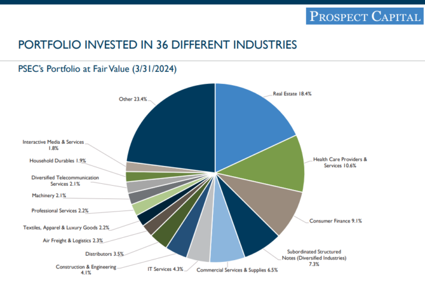

## Table of Contents

## What are dividend stocks and why are they important for investors?

Dividend stocks are shares of companies that regularly pay out a portion of their profits to shareholders. These payments, called dividends, are usually given out every three months. Many companies that pay dividends are big and stable, like utility companies or big banks. When you own these stocks, you get a regular income from the dividends, which can be a nice bonus on top of any increase in the stock's price.

Dividend stocks are important for investors because they provide a steady income. This can be especially helpful for people who are retired or need regular money coming in. Also, reinvesting dividends can help grow your investment over time. When you use the dividends to buy more shares, you can earn even more dividends in the future. This can make your investment grow faster than if you just relied on the stock price going up.

## How do you identify a company that pays dividends?

To find a company that pays dividends, you can start by looking at financial websites or using stock market apps. These platforms often have a section where you can see if a company pays dividends and how much. You can also check the company's investor relations page on their website. They usually list their dividend history and when they plan to pay the next dividend. Another way is to look at stock market news or financial news, where they often talk about companies that pay dividends.

Once you know a company pays dividends, it's good to check how reliable they are. Some companies have a long history of paying dividends regularly, which can be a good sign. You can look at their "dividend yield," which shows how much dividend you get for each dollar you invest. A higher yield might look good, but be careful because sometimes a high yield can mean the company is in trouble. Also, think about the company's overall health and future plans. A strong and stable company is more likely to keep paying dividends in the future.

## What is dividend yield and how is it calculated?

Dividend yield is a way to see how much money you get from a stock's dividends compared to its price. It tells you the percentage of the stock's price that you get back in dividends each year. For example, if a stock costs $100 and pays $5 in dividends every year, the dividend yield is 5%.

To calculate the dividend yield, you take the yearly dividend per share and divide it by the stock's current price. Then, you multiply the result by 100 to turn it into a percentage. So, if a company pays a quarterly dividend of $0.50 per share, the yearly dividend is $2 (4 quarters times $0.50). If the stock price is $40, the dividend yield is ($2 / $40) * 100, which equals 5%.

## What are the key factors to consider when selecting dividend stocks?

When [picking](/wiki/asset-class-picking) dividend stocks, it's good to first look at the company's history of paying dividends. Some companies have been paying dividends for many years without missing a payment. This shows they are stable and can be trusted to keep paying dividends. Also, check the dividend yield, which is how much dividend you get for each dollar you invest. A high yield might seem good, but it can also mean the company is in trouble. So, it's important to find a balance and not just go for the highest yield.

Another important thing to consider is the company's overall health and future plans. A company that is doing well and growing is more likely to keep paying dividends. Look at their profits, how much debt they have, and what they plan to do in the future. If a company is making good money and has plans to grow, it's more likely to keep paying dividends. Also, think about the industry the company is in. Some industries, like utilities or big banks, are known for paying steady dividends, which can be a good sign.

## How does a company's payout ratio affect its suitability as a dividend stock?

A company's payout ratio is how much of its profits it gives out as dividends. This number is important when you are thinking about buying a dividend stock. If a company has a low payout ratio, it means it is keeping a lot of its profits. This can be good because it shows the company is strong and can use that money to grow or save for hard times. But, if the payout ratio is too low, it might mean the dividends are not very high, which could be a problem if you want a lot of income from your stocks.

On the other hand, a high payout ratio means the company is giving out most of its profits as dividends. This can be good if you want a high income from your stocks. But, it can also be risky. If the company runs into trouble, it might not have enough money left to keep paying those high dividends. So, when picking a dividend stock, you need to find a good balance. A payout ratio that is not too high or too low can be a sign of a company that can keep paying dividends and still grow.

## What role does a company's financial health play in dividend stock selection?

A company's financial health is really important when you are picking dividend stocks. If a company is doing well financially, it is more likely to keep paying dividends. You can check its financial health by looking at things like how much profit it makes, how much debt it has, and how well it manages its money. A company that makes good profits and doesn't have too much debt is in a strong position. This means it can keep paying dividends even if times get tough.

Also, a financially healthy company can grow and become even stronger. When a company is growing, it can make more money and pay even bigger dividends in the future. If you pick a company that is financially strong, you are more likely to get a steady income from dividends. So, always look at a company's financial health before deciding to buy its stock for the dividends.

## How can sector diversification impact your dividend stock portfolio?

Sector diversification means spreading your dividend stock investments across different types of businesses. This can help make your portfolio safer. If you put all your money into one type of business, like banks, and something bad happens to banks, your whole portfolio could lose money. But if you have stocks in different sectors, like banks, utilities, and tech companies, a problem in one sector might not hurt your whole portfolio as much. This way, you can still get dividends even if one sector is doing badly.

Also, different sectors can do well at different times. For example, when the economy is growing, tech companies might do better, but when things slow down, utility companies might be more stable. By having stocks in different sectors, you can balance out the ups and downs. This can help you get a steady income from dividends no matter what is happening in the economy. So, sector diversification can make your dividend stock portfolio more stable and help you keep getting dividends over time.

## What are the differences between high-yield and growth-oriented dividend stocks?

High-yield dividend stocks are companies that pay a lot of money to their shareholders compared to the price of their stock. These stocks often have a high dividend yield, which means you get more money back from your investment each year. But, high-yield stocks can be riskier. Sometimes, a company might offer a high yield because its stock price has gone down a lot, which can be a sign that the company is not doing well. So, while high-yield stocks can give you a big income, they might also be less stable and more likely to cut their dividends if things go wrong.

Growth-oriented dividend stocks, on the other hand, are from companies that are growing and usually pay smaller dividends compared to their stock price. These companies might not give you as much money right away, but they are often reinvesting their profits to grow their business. Over time, this can lead to bigger dividends and a higher stock price. Growth-oriented stocks are usually seen as safer because the companies are doing well and have a good future ahead. So, while you might not get as much income right now, you could see your investment grow more over time.

## How do tax considerations influence the selection of dividend stocks?

When picking dividend stocks, taxes can play a big role. In many countries, dividends are taxed differently than other types of income. For example, in the U.S., qualified dividends are taxed at a lower rate than regular income. This means if you are in a high tax bracket, you might want to choose stocks that pay qualified dividends to keep more of your money. On the other hand, if you are in a lower tax bracket, the difference might not matter as much, so you can focus more on other factors like the company's financial health or growth potential.

Another thing to think about is where you keep your dividend stocks. If you put them in a tax-advantaged account like an IRA or a 401(k), you might not have to pay taxes on the dividends right away. This can be a good way to let your investments grow without losing money to taxes each year. But if your stocks are in a regular investment account, you'll have to pay taxes on the dividends every year. So, depending on your tax situation, you might want to choose different types of dividend stocks or think about where to hold them to get the best after-tax return.

## What advanced metrics can be used to assess the sustainability of dividends?

When you want to see if a company can keep paying dividends, you can look at something called the payout ratio. This is the part of the company's profits that it gives out as dividends. A lower payout ratio means the company is keeping more money, which can be good because it shows they have money to grow or save for tough times. But if the payout ratio is too high, it might mean the company is giving out almost all its profits, which could be risky if things go bad. So, a payout ratio that is not too high or too low can be a sign of a company that can keep paying dividends.

Another useful metric is the free cash flow. This is the money the company has left after it pays for everything it needs to run its business. If a company has a lot of free cash flow, it means it has money to pay dividends, grow, and handle any problems that come up. You can compare the free cash flow to the dividends the company pays. If the free cash flow is much higher than the dividends, it's a good sign that the company can keep paying them. But if the dividends are more than the free cash flow, it might mean the company is using other money to pay dividends, which can be risky.

## How can historical dividend data be used to predict future performance?

Looking at a company's past dividends can help you guess if they will keep paying dividends in the future. If a company has been paying dividends for a long time without missing a payment, it's a good sign they will keep doing it. This is because companies that have a history of paying dividends usually want to keep their shareholders happy. They also have good ways to make money and manage their finances. So, if a company has a long history of steady or growing dividends, it's more likely they will keep paying them.

But, past dividends don't always tell you everything. Things can change, like the economy or the company's business. If a company's profits go down or they have more debt, they might not be able to pay the same dividends in the future. Also, if a company's stock price goes down a lot, the dividend yield might look high, but it could be a warning sign. So, while historical dividend data is helpful, you should also look at the company's current financial health and future plans to get a full picture of what might happen with their dividends.

## What strategies can be employed to optimize a portfolio of dividend stocks for long-term income and growth?

To make your dividend stock portfolio work well for long-term income and growth, you need to pick a mix of different kinds of companies. You want some high-yield stocks that give you a lot of money right away, but you also want some growth-oriented stocks that might not pay as much now but can grow bigger over time. By having both types, you can get steady income and also see your investments grow. Another good idea is to spread your money across different industries. This way, if one type of business has a bad time, your whole portfolio won't be hurt as much. You can still get dividends from the other industries that are doing well.

Also, think about how the company is doing now and what it plans to do in the future. Look at things like their profits, how much debt they have, and their free cash flow. A company that is making good money and has plans to grow is more likely to keep paying dividends and even increase them over time. Don't forget about taxes too. If you can, put some of your dividend stocks in special accounts like an IRA where you won't have to pay taxes on the dividends right away. This can help your investments grow faster. By paying attention to these things, you can build a dividend stock portfolio that gives you a good income now and keeps growing for the future.

## References & Further Reading

[1]: Zuckerman, G. (2019). ["The Man Who Solved the Market: How Jim Simons Launched the Quant Revolution."](https://www.amazon.com/Man-Who-Solved-Market-Revolution/dp/073521798X) Penguin Random House.

[2]: Heaton, J.B., Polson, N.G., & Witte, J.H. (2017). ["Deep learning for finance: deep portfolios."](https://arxiv.org/abs/1602.06561) Applied Stochastic Models in Business and Industry, 33(1), 3-12.

[3]: Lowenstein, R. (2000). ["When Genius Failed: The Rise and Fall of Long-Term Capital Management."](https://archive.org/details/whengeniusfailed00lowe) Random House.

[4]: ["Advances in Financial Machine Learning"](https://www.amazon.com/Advances-Financial-Machine-Learning-Marcos/dp/1119482089) by Marcos Lopez de Prado.

[5]: ["Machine Learning for Algorithmic Trading"](https://github.com/stefan-jansen/machine-learning-for-trading) by Stefan Jansen.