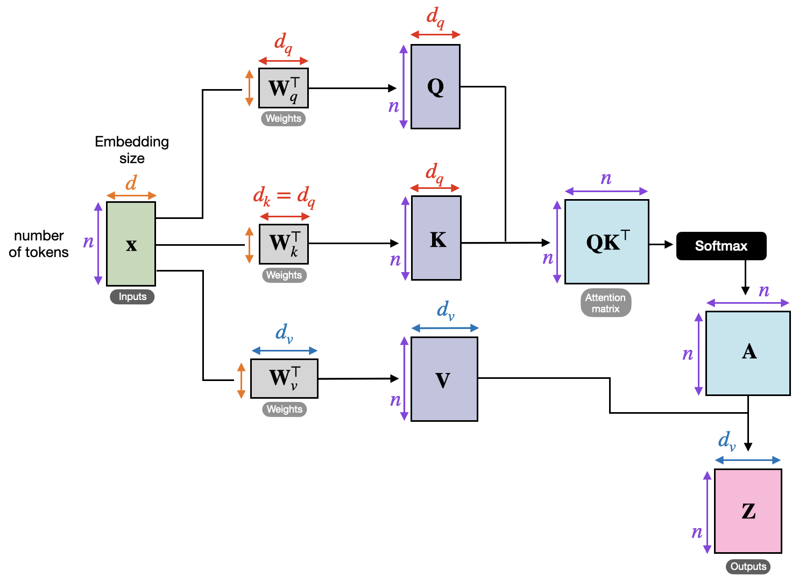

## Table of Contents

## What is self-attention in the context of machine learning?

Self-attention is a mechanism used in machine learning, especially in models like transformers, to help the model understand which parts of the input data are most important. Imagine you're reading a sentence and you want to understand the main idea. You would focus more on certain words that seem more relevant. Self-attention works similarly by allowing the model to weigh the importance of different parts of the input data relative to each other. This helps the model to better understand the context and relationships within the data.

In technical terms, self-attention computes a weighted sum of the input data. It does this by creating three vectors for each input: Query, Key, and Value. The attention score is calculated by taking the dot product of the Query and Key vectors, and then this score is used to weigh the Value vector. The formula for this can be written as $$ \text{Attention}(Q, K, V) = \text{softmax}\left(\frac{QK^T}{\sqrt{d_k}}\right)V $$, where $Q$, $K$, and $V$ are the Query, Key, and Value matrices, and $d_k$ is the dimension of the keys. This process allows the model to focus on different parts of the input as needed, making it very effective for tasks like language translation or text generation.

## How does self-attention differ from traditional attention mechanisms?

Self-attention differs from traditional attention mechanisms mainly in how it processes the input data. Traditional attention mechanisms often involve comparing an input sequence to a separate context or memory, focusing on how relevant parts of the context are to the input. For example, in a sequence-to-sequence model for machine translation, the encoder might produce a context vector that the decoder uses to focus on different parts of the source sentence. In contrast, self-attention looks at the relationships within the input itself, without needing an external context. It allows each position in the input sequence to attend to all other positions, helping the model understand the internal structure and dependencies within the data.

To illustrate, consider a sentence like "The cat sat on the mat." With self-attention, the model can understand that "cat" and "mat" are related because they often appear together in similar contexts, even without looking at external information. This is done by computing attention scores between all pairs of words in the sentence. The formula for self-attention is $$ \text{Attention}(Q, K, V) = \text{softmax}\left(\frac{QK^T}{\sqrt{d_k}}\right)V $$, where $Q$, $K$, and $V$ are derived from the input itself. This self-referential approach makes self-attention particularly powerful for tasks where understanding the internal relationships within the data is crucial, such as in natural language processing.

## Can you explain the basic components of a self-attention layer?

A self-attention layer is made up of a few key parts that work together to help a [machine learning](/wiki/machine-learning) model understand which parts of the input are most important. The first part involves creating three vectors for each part of the input: the Query, Key, and Value vectors. These vectors are created by multiplying the input by three different weight matrices. The Query vector helps figure out what we're looking for, the Key vector helps us find where to look, and the Value vector gives us the actual information we want.

The next part is calculating the attention scores. This is done by taking the dot product of the Query and Key vectors for each pair of input parts. The scores are then scaled by dividing them by the square root of the dimension of the Key vector, and passed through a softmax function to turn them into weights that add up to 1. The formula for this step is $$ \text{Attention}(Q, K, V) = \text{softmax}\left(\frac{QK^T}{\sqrt{d_k}}\right)V $$. These weights are then used to create a weighted sum of the Value vectors, which gives us the final output of the self-attention layer. This output helps the model focus on the most relevant parts of the input, making it better at understanding and processing the data.

## What is the purpose of using self-attention in neural networks?

Self-attention helps neural networks understand which parts of the input are most important. Think of it like reading a sentence and focusing on the key words to understand the main idea. In a [neural network](/wiki/neural-network), self-attention lets the model look at all the parts of the input at once and figure out which ones are most relevant to each other. This makes the model better at understanding the context and relationships within the data, which is really helpful for tasks like translating languages or understanding text.

The way self-attention works is by creating three vectors for each part of the input: Query, Key, and Value. The model then calculates attention scores by taking the dot product of the Query and Key vectors. These scores are used to weigh the Value vectors, creating a weighted sum that focuses on the most important parts of the input. The formula for this is $$ \text{Attention}(Q, K, V) = \text{softmax}\left(\frac{QK^T}{\sqrt{d_k}}\right)V $$. This process helps the model pay attention to the right things, making it smarter and more effective at processing complex data.

## How does self-attention help in understanding the context within a sequence?

Self-attention helps in understanding the context within a sequence by allowing each part of the sequence to look at all other parts. Imagine you're reading a sentence and want to understand the main idea. You focus on certain words that seem more important. Self-attention works the same way by figuring out which parts of the input are most relevant to each other. This helps the model understand the relationships and context within the sequence, making it better at tasks like translating languages or understanding text.

The way self-attention works is by creating three vectors for each part of the input: Query, Key, and Value. The model then calculates attention scores by taking the dot product of the Query and Key vectors. These scores are used to weigh the Value vectors, creating a weighted sum that focuses on the most important parts of the input. The formula for this is $$ \text{Attention}(Q, K, V) = \text{softmax}\left(\frac{QK^T}{\sqrt{d_k}}\right)V $$. This process helps the model pay attention to the right things, making it smarter and more effective at processing complex data.

## What are the key mathematical operations involved in computing self-attention?

Self-attention involves a few key mathematical operations to figure out which parts of the input are most important. First, the input is transformed into three vectors: Query, Key, and Value. This is done by multiplying the input by three different weight matrices. Then, the attention scores are calculated by taking the dot product of the Query and Key vectors for each pair of input parts. These scores are scaled by dividing them by the square root of the dimension of the Key vector, which helps stabilize the gradients during training. The scaled scores are then passed through a softmax function, which turns them into weights that add up to 1.

Next, these weights are used to create a weighted sum of the Value vectors. This weighted sum is the final output of the self-attention layer, which helps the model focus on the most relevant parts of the input. The formula for computing self-attention is $$ \text{Attention}(Q, K, V) = \text{softmax}\left(\frac{QK^T}{\sqrt{d_k}}\right)V $$. This process allows the model to understand the relationships and context within the input data, making it better at tasks like language translation or text understanding.

## How do query, key, and value matrices contribute to the self-attention mechanism?

In the self-attention mechanism, the query, key, and value matrices are created from the input data to help the model understand which parts are most important. The query matrix represents what the model is looking for, the key matrix helps find where to look, and the value matrix provides the actual information that the model needs. These matrices are derived by multiplying the input by three different weight matrices. This transformation allows each part of the input to be compared with every other part, helping the model focus on the most relevant pieces of information.

The attention scores are calculated by taking the dot product of the query and key matrices. These scores are then scaled by dividing them by the square root of the dimension of the key matrix, and passed through a softmax function to turn them into weights that add up to 1. The formula for this is $$ \text{Attention}(Q, K, V) = \text{softmax}\left(\frac{QK^T}{\sqrt{d_k}}\right)V $$. These weights are used to create a weighted sum of the value matrix, which gives the final output of the self-attention layer. This process helps the model understand the relationships and context within the input data, making it better at tasks like language translation or text understanding.

## What are some common challenges and limitations of implementing self-attention?

Implementing self-attention can be challenging due to its computational complexity. As the input sequence gets longer, the number of calculations needed grows quickly. This is because self-attention looks at every part of the input with every other part, which can slow things down a lot. For example, if you have a long piece of text, the model has to compare every word with every other word, which can be time-consuming and require a lot of memory. This makes it hard to use self-attention for very long sequences without special tricks or modifications.

Another limitation is that self-attention can sometimes struggle to capture long-range dependencies. While it's good at understanding relationships between nearby parts of the input, it can be less effective at understanding connections between parts that are far apart. This can be a problem for tasks like understanding long documents or complex sentences where the important information might be spread out. To address this, researchers have come up with techniques like using multiple layers of attention or combining self-attention with other types of neural network layers to help the model see the bigger picture.

## How can self-attention be optimized for better performance and efficiency?

Self-attention can be optimized for better performance and efficiency by using a technique called multi-head attention. This means splitting the query, key, and value matrices into several smaller parts, or "heads," and then computing the attention for each head separately. By doing this, the model can focus on different parts of the input at the same time, which helps it understand the data better. The formula for multi-head attention is $$ \text{MultiHead}(Q, K, V) = \text{Concat}(\text{head}_1, \text{head}_2, ..., \text{head}_h)W^O $$, where each head is computed using the self-attention formula $$ \text{head}_i = \text{Attention}(QW_i^Q, KW_i^K, VW_i^V) $$. This approach can make the model more efficient because it can process multiple aspects of the input in parallel.

Another way to optimize self-attention is by using sparse attention mechanisms. Instead of looking at every part of the input with every other part, sparse attention only looks at certain parts. This can save a lot of time and memory, especially for long sequences. For example, a model might only look at nearby parts of the input or use a pattern to decide which parts to focus on. This can make the model faster and able to handle longer sequences without using too much memory. By carefully choosing which parts of the input to pay attention to, sparse attention can help the model work better and more efficiently.

## What are some advanced techniques or variations of self-attention used in recent models?

One advanced technique used in recent models is called "multi-head attention." This technique splits the query, key, and value matrices into several smaller parts, called "heads." Each head computes the attention separately, allowing the model to focus on different parts of the input at the same time. This can help the model understand the data better and process it more efficiently. The formula for multi-head attention is $$ \text{MultiHead}(Q, K, V) = \text{Concat}(\text{head}_1, \text{head}_2, ..., \text{head}_h)W^O $$, where each head is computed using the self-attention formula $$ \text{head}_i = \text{Attention}(QW_i^Q, KW_i^K, VW_i^V) $$. By doing this, the model can capture different types of relationships within the input, making it more powerful and versatile.

Another variation is "sparse attention," which helps make self-attention more efficient, especially for long sequences. Instead of looking at every part of the input with every other part, sparse attention only looks at certain parts. This can save a lot of time and memory. For example, a model might only look at nearby parts of the input or use a pattern to decide which parts to focus on. This approach can make the model faster and able to handle longer sequences without using too much memory. By carefully choosing which parts of the input to pay attention to, sparse attention can help the model work better and more efficiently.

## How does multi-head attention enhance the capabilities of self-attention?

Multi-head attention enhances the capabilities of self-attention by allowing the model to focus on different parts of the input at the same time. Imagine you're trying to understand a sentence. Instead of just looking at it once, you can look at it several times, each time focusing on different words or phrases. Multi-head attention does something similar by splitting the query, key, and value matrices into several smaller parts, called "heads." Each head computes the attention separately, which lets the model capture different types of relationships within the input. This makes the model more powerful and versatile because it can understand the data from multiple angles.

The formula for multi-head attention is $$ \text{MultiHead}(Q, K, V) = \text{Concat}(\text{head}_1, \text{head}_2, ..., \text{head}_h)W^O $$, where each head is computed using the self-attention formula $$ \text{head}_i = \text{Attention}(QW_i^Q, KW_i^K, VW_i^V) $$. By doing this, the model can process multiple aspects of the input in parallel, which not only helps it understand the data better but also makes it more efficient. This approach allows the model to be more effective at tasks like language translation or text understanding, where understanding different parts of the input is crucial.

## Can you discuss a real-world application where self-attention has significantly improved model performance?

One real-world application where self-attention has significantly improved model performance is in machine translation. Before self-attention, models like recurrent neural networks (RNNs) and [long short](/wiki/equity-long-short)-term memory (LSTM) networks were commonly used. These models processed words one at a time, which made it hard for them to understand the whole sentence at once. With self-attention, models can look at all the words in a sentence together. This helps them understand the context better and translate sentences more accurately. For example, the transformer model, which uses self-attention, has become the standard for machine translation because it can handle long sentences and capture relationships between words more effectively.

Another example is in natural language processing, particularly in tasks like text summarization. Self-attention allows models to identify the most important parts of a long document and focus on them to create a summary. This is much harder for traditional models that process text sequentially. By using self-attention, models can weigh the importance of different sentences or phrases and produce summaries that capture the main ideas of the text. The formula for self-attention, $$ \text{Attention}(Q, K, V) = \text{softmax}\left(\frac{QK^T}{\sqrt{d_k}}\right)V $$, helps the model understand which parts of the input are most relevant, making it a powerful tool for summarizing long texts accurately and efficiently.