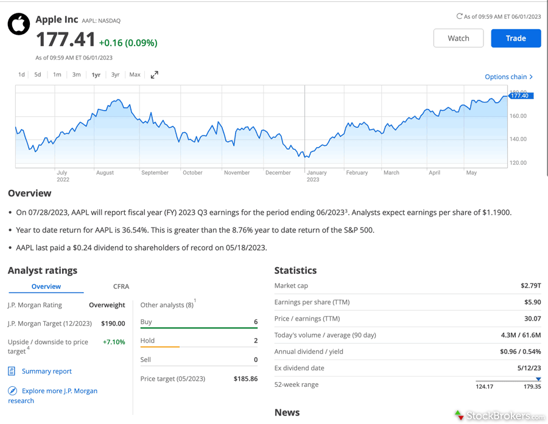

## Table of Contents

## What is self-directed stock analysis?

Self-directed stock analysis is when people research and decide which stocks to buy on their own, without help from a professional. They use different tools and information to understand how a company is doing and if its stock might be a good investment. This can include looking at financial statements, news about the company, and what experts are saying.

Doing your own stock analysis can be rewarding because it helps you learn more about investing and the companies you're interested in. However, it can also be challenging because there's a lot of information to go through, and it can be hard to know if you're making the right choices. It's important to take your time, keep learning, and maybe start with small investments as you get more comfortable with the process.

## Why should someone consider doing their own stock analysis?

Someone should consider doing their own stock analysis because it gives them control over their investments. When you do your own research, you decide which companies to invest in based on what you learn. This can make you feel more confident about your choices because you know why you're buying a certain stock. Plus, it can save you money since you won't have to pay a financial advisor to do the work for you.

Another reason to do your own stock analysis is that it helps you learn a lot about the stock market and how businesses work. As you look into different companies, you'll understand more about what makes them successful or why they might be struggling. This knowledge can be useful not just for investing, but also in other parts of your life, like understanding the economy or making better career decisions. Over time, the skills you develop can make you a smarter investor and help you build a stronger financial future.

## What are the basic financial statements one should understand for stock analysis?

For stock analysis, it's important to understand three main financial statements: the income statement, the balance sheet, and the cash flow statement. The income statement shows how much money a company made and spent over a certain time, like a year or a quarter. It tells you if the company made a profit or a loss by showing revenues, expenses, and net income. This helps you see if the company is good at making money.

The balance sheet is like a snapshot of what the company owns and owes at a specific time. It lists assets, which are things the company owns like cash or buildings, and liabilities, which are debts the company needs to pay. The difference between assets and liabilities is called equity, which shows the net worth of the company. This statement helps you understand the company's financial health and stability.

The cash flow statement tracks the actual cash coming in and going out of the company. It's divided into three parts: operating activities, which show cash from the company's main business; investing activities, which show cash used for buying or selling assets; and financing activities, which show cash from loans or issuing stock. This statement is important because it shows if the company can pay its bills and how it's managing its cash.

## How can beginners start analyzing stocks without advanced tools?

Beginners can start analyzing stocks by first looking at a company's financial statements, which are usually available for free on the company's website or through financial news websites. The three main statements to focus on are the income statement, which shows if the company is making a profit; the balance sheet, which shows what the company owns and owes; and the cash flow statement, which shows how the company is managing its cash. By reading these statements, beginners can get a basic understanding of a company's financial health without needing advanced tools.

Another simple way to start is by reading news articles and analyst reports about the company. These can be found on financial news websites or through search engines. News articles can give you an idea of what's happening with the company and its industry, while analyst reports can provide expert opinions on whether the stock is a good buy. By combining this information with the financial statements, beginners can start to make informed decisions about which stocks to consider investing in.

## What are key financial ratios and metrics to look at when analyzing a stock?

When analyzing a stock, one of the key financial ratios to look at is the price-to-earnings (P/E) ratio. This ratio compares the price of a stock to the company's earnings per share. A high P/E ratio might mean that investors think the company will grow a lot in the future, while a low P/E ratio might mean the stock is undervalued or the company is not growing as fast. Another important ratio is the debt-to-equity ratio, which shows how much debt the company has compared to its equity. A high debt-to-equity ratio can be risky because it means the company has a lot of debt, which it needs to pay back.

Another useful metric is the return on equity (ROE), which shows how well the company is using its money to make more money. A high ROE means the company is good at turning its equity into profit. The dividend yield is also important if you want to earn money from dividends. It shows how much a company pays out in dividends each year compared to its stock price. A high dividend yield can be attractive, but you need to check if the company can keep paying those dividends. By looking at these ratios and metrics, beginners can get a better idea of a company's financial health and whether its stock is a good investment.

## How do you evaluate a company's competitive position in its industry?

To evaluate a company's competitive position in its industry, you need to look at how it compares to other companies. One way to do this is by looking at its market share, which shows how much of the market the company controls. A bigger market share usually means the company is doing well and has a strong position. You can also look at the company's products or services and see if they are better or cheaper than what other companies offer. If a company has something unique that others don't, like a special technology or a well-known brand, it can have a competitive advantage.

Another important thing to consider is the company's financial performance compared to its competitors. Look at financial ratios like profit margins, which show how much money the company makes after paying for its costs. If a company has higher profit margins than its competitors, it might be more efficient or have a better business model. Also, think about how the company is growing. Is it getting bigger faster than other companies in the industry? If so, it might be taking market share away from its competitors, which is a good sign for its competitive position.

## What role does market sentiment play in stock analysis?

Market sentiment is what people think and feel about the stock market or a specific stock. It can make stock prices go up or down even if the company's financials haven't changed. For example, if lots of people are excited about a company because of good news, they might buy its stock, and the price will go up. On the other hand, if people are worried or scared, they might sell the stock, and the price will go down.

Understanding market sentiment can help you make better decisions about when to buy or sell a stock. You can look at things like news articles, social media, and surveys to see what people are thinking. If everyone is feeling positive, it might be a good time to buy because the stock price could keep going up. But if everyone is feeling negative, it might be a good time to wait or sell because the price could drop more. Just remember, market sentiment can change quickly, so it's important to keep an eye on it along with the company's financials.

## How can technical analysis complement fundamental analysis in stock picking?

Technical analysis and fundamental analysis are two different ways to look at stocks, but they can work well together. Fundamental analysis looks at a company's financials, like its income statement, balance sheet, and cash flow statement. It helps you understand if a company is making money, growing, and a good investment based on its business. On the other hand, technical analysis looks at stock price charts and patterns. It tries to predict where the stock price might go next by looking at past price movements and trading volume. By using both, you can get a fuller picture of a stock. Fundamental analysis tells you if the stock is worth buying based on the company's health, while technical analysis helps you decide when to buy or sell based on the stock's price movement.

For example, if you find a company that looks good based on its financials, you might use fundamental analysis to decide to buy its stock. But you could use technical analysis to figure out the best time to buy. If the stock's price chart shows a pattern that suggests the price is about to go up, you might decide to buy then. On the flip side, if you see the stock's price might be about to drop, you could wait or sell. By combining both types of analysis, you can make smarter decisions about which stocks to buy and when to buy or sell them. This can help you do better in the stock market.

## What advanced valuation methods can be used to assess stock prices?

One advanced valuation method to assess stock prices is the discounted cash flow (DCF) analysis. This method tries to figure out what a company is worth by looking at how much money it will make in the future. You take the company's expected future cash flows and discount them back to today's value using a discount rate, which shows how much you value money now compared to money later. If the value you get from the DCF is higher than the current stock price, the stock might be a good buy because it's undervalued. But if the value is lower, the stock might be overvalued.

Another advanced method is the comparable company analysis, where you compare the company you're looking at to similar companies. You look at things like price-to-earnings (P/E) ratios, price-to-sales (P/S) ratios, and other financial metrics to see how the company stacks up against its peers. If the company's ratios are lower than its competitors, it might be undervalued, and if they're higher, it might be overvalued. This method helps you see if the stock price makes sense compared to other companies in the same industry.

A third method is the residual income model, which looks at the company's book value and the extra income it earns above its cost of equity. You start with the company's book value per share and add the present value of expected future residual income. Residual income is the profit left after paying for the cost of equity, which is the return shareholders expect. If the value you calculate is higher than the current stock price, the stock might be undervalued. This method is useful because it focuses on the company's ability to generate income above what investors expect.

## How do macroeconomic factors influence individual stock performance?

Macroeconomic factors are big things that affect the whole economy, like interest rates, inflation, and unemployment. These things can change how people feel about the economy and how much money they want to spend or invest. For example, if interest rates go up, it can make borrowing money more expensive for companies. This might make them less likely to grow or invest in new projects, which can hurt their stock prices. On the other hand, if interest rates go down, borrowing becomes cheaper, and companies might do more business, which can help their stock prices go up.

Another way macroeconomic factors affect individual stock performance is through inflation. If inflation is high, it means prices are going up, and people might have less money to spend on things. This can hurt companies that sell things people don't need, like luxury items, because people might not buy them as much. But some companies, like those that sell food or medicine, might not be hurt as much because people need those things no matter what. Also, if unemployment is high, people might not have as much money to spend, which can hurt companies that rely on people buying their products or services. So, understanding these big economic factors can help you figure out how they might affect the stocks you're looking at.

## What are some common pitfalls to avoid in self-directed stock analysis?

One common pitfall in self-directed stock analysis is getting too emotional about your investments. It's easy to feel excited about a stock when it's going up and want to buy more, or feel scared when it's going down and want to sell. But making decisions based on how you feel instead of what the facts say can lead to bad choices. It's important to stay calm and stick to your plan, even when the market is going crazy. Another mistake is not doing enough research. Sometimes people hear about a hot stock from a friend or on the news and jump in without looking at the company's financials or understanding the industry. This can lead to buying stocks that aren't as good as they seem.

Another pitfall is overconfidence. Just because you've made some good picks in the past doesn't mean you'll always be right. The stock market can be unpredictable, and even the best investors make mistakes. It's important to keep learning and not think you know everything. Also, some people focus too much on short-term gains and forget about the long term. They might buy and sell stocks too quickly, trying to make a quick profit, but this can lead to missing out on bigger gains over time. It's better to think about where you want to be in the future and make investment choices that help you get there.

## How can one stay updated and continuously improve their stock analysis skills?

Staying updated and improving your stock analysis skills starts with reading a lot. You should read financial news every day from places like Bloomberg, Reuters, or The Wall Street Journal. These websites give you the latest news about companies and the economy, which can help you make better decisions about stocks. Also, try to read books about investing and the stock market. There are many good books out there that can teach you new things and help you understand how to analyze stocks better. Joining online forums or groups where people talk about investing can also be helpful. You can learn from other people's experiences and get new ideas for your own analysis.

Another way to improve is by practicing. You can use a stock market simulator to practice buying and selling stocks without using real money. This lets you try out different strategies and see what works best for you. It's also a good idea to keep a journal of your investment decisions. Write down why you bought or sold a stock and what you learned from it. Over time, you can look back at your journal to see where you made good choices and where you can do better. Finally, consider taking courses or getting a certification in finance or investing. These can give you a deeper understanding of the stock market and help you stay updated with the latest tools and techniques.

## Is Stock Analysis a Vital Component?

Stock analysis is essential for investors aiming to identify and capitalize on potential investment opportunities. This process involves thoroughly evaluating a company's financial health, assessing its market position, and estimating its growth potential. By employing different analytical techniques, investors can make more informed decisions.

One widely used method is [fundamental analysis](/wiki/fundamental-analysis), which focuses on examining a company's financial statements and key ratios. This technique provides insights into a firm's intrinsic value and performance by analyzing factors such as revenue, earnings, assets, and liabilities. Investors often calculate ratios like the Price-to-Earnings (P/E) ratio, which compares a company's share price to its earnings per share (EPS), to determine if a stock is over or undervalued. The formula for the P/E ratio is:

$$
\text{P/E ratio} = \frac{\text{Market Value per Share}}{\text{Earnings per Share (EPS)}}
$$

Another critical approach is technical analysis, which relies on historical market data to forecast future price movements. This method assumes that all necessary information is already reflected in the stock's price and that patterns and trends tend to repeat over time. Technical analysts use tools such as moving averages, trend lines, and various indicators like the Relative Strength Index (RSI) to analyze price patterns and trading volumes. For instance, a simple moving average is calculated using:

$$
\text{SMA} = \frac{\sum_{i=1}^{n} \text{Price}_i}{n}
$$

where $n$ is the number of periods.

The integration of both fundamental and technical analysis provides a comprehensive view of a stock's potential, allowing investors to identify opportunities that align with their financial goals and risk tolerance. By understanding a company's underlying value and market behavior, investors can enhance their ability to make decisions that could lead to financial success.

## References & Further Reading

[1]: Bergstra, J., Bardenet, R., Bengio, Y., & Kégl, B. (2011). ["Algorithms for Hyper-Parameter Optimization."](https://dl.acm.org/doi/10.5555/2986459.2986743) Advances in Neural Information Processing Systems 24.

[2]: ["Advances in Financial Machine Learning"](https://www.amazon.com/Advances-Financial-Machine-Learning-Marcos/dp/1119482089) by Marcos Lopez de Prado

[3]: ["Evidence-Based Technical Analysis: Applying the Scientific Method and Statistical Inference to Trading Signals"](https://www.amazon.com/Evidence-Based-Technical-Analysis-Scientific-Statistical/dp/0470008741) by David Aronson

[4]: ["Machine Learning for Algorithmic Trading"](https://github.com/stefan-jansen/machine-learning-for-trading) by Stefan Jansen

[5]: ["Quantitative Trading: How to Build Your Own Algorithmic Trading Business"](https://www.amazon.com/Quantitative-Trading-Build-Algorithmic-Business/dp/1119800064) by Ernest P. Chan