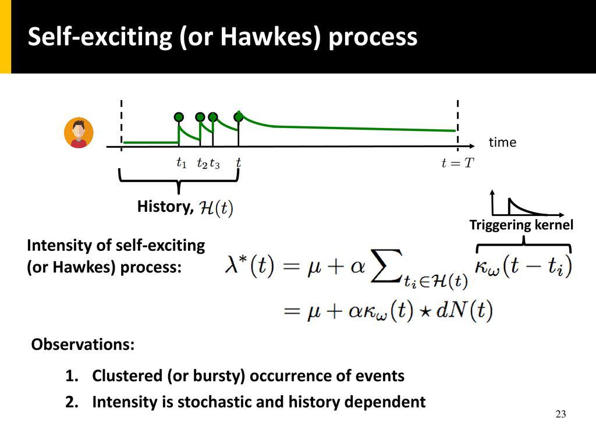

Self-exciting processes, often referred to as Hawkes processes, play a significant role in understanding market microstructure, particularly in the context of high-frequency trading. These processes are a type of point process where the occurrence of an event increases the probability of subsequent events occurring in a short timeframe. This characteristic makes them advantageous for modeling the temporal clustering of trades, a common phenomenon in financial markets.

In financial markets, past trading activity is crucial since trades are not isolated. A trade can trigger related trades by influencing traders' perceptions and decisions. For instance, a large purchase might signal to other traders an underlying trend, prompting additional buying. Such dynamics can be captured by self-exciting processes, providing a more accurate reflection of market behavior compared to traditional models which might assume independence of events.



The introduction of Hawkes processes in finance offers profound implications for algorithmic trading strategies. By quantifying the influence of past events on future trading activity, these processes enable the development of predictive models that can better anticipate price movements and optimize trade executions. This article aims to elucidate the concept of self-exciting processes, detailing their application in finance and their advantages over other models.

The following sections will elaborate on the mathematical foundations of self-exciting processes, explore their applications in market microstructure, and examine how they can be harnessed for developing advanced algorithmic trading strategies. Additionally, real-world applications and case studies will be presented to highlight the effectiveness of these models, concluding with a discussion on current challenges and future directions in this evolving field.

## Table of Contents

## Understanding Self-Exciting Processes

Self-exciting processes, notably Hawkes processes, are a class of stochastic processes where the occurrence of an event increases the probability of subsequent events occurring in the near future. This contrasts with classical Poisson processes, which are memoryless, meaning that the occurrence of an event does not affect the likelihood of future events. In a Poisson process, the events occur independently, and the intervals between events follow an exponential distribution.

Hawkes processes are characterized by their ability to model phenomena where events cluster in time, influenced by their preceding occurrences. The mathematical foundation of a Hawkes process is grounded in its conditional intensity function, $\lambda(t)$, which is defined as:

$$
\lambda(t) = \mu + \sum_{t_i < t} \phi(t - t_i)
$$

In this equation, $\mu$ represents the baseline intensity, or the rate of event occurrence when there are no prior events, and $\phi(t - t_i)$ is the impact function describing how much influence past events $t_i$ have on the current intensity at time $t$. This impact is often modeled through a decay function, typically exponential, which captures the fading influence of older events over time:

$$
\phi(t - t_i) = \alpha e^{-\beta(t - t_i)}
$$

Here, $\alpha$ denotes the amplitude or strength of the self-excitation, and $\beta$ determines the rate at which the excitation effect decays. These parameters, $\alpha$ and $\beta$, are crucial in defining the characteristics of the process. They dictate how strongly and how quickly the process returns to its baseline intensity after an event.

In financial markets, self-exciting processes are particularly useful in modeling the clustering of trades. A simple example involves the trade activities in a liquid stock. Suppose a large buy order enters the market, leading to an upward price movement. This price increase might trigger [algorithmic trading](/wiki/algorithmic-trading) strategies or motivate other traders to enter the market to take advantage of this trend, resulting in subsequent buy orders and further price movements. This phenomenon can result in a cascade of trading activity that could not be effectively captured by a classical Poisson process. 

Python code, which might be used to simulate a basic Hawkes process with specified parameters, could look like this:

```python
import numpy as np
import matplotlib.pyplot as plt

def simulate_hawkes_process(mu, alpha, beta, T):
    events = []
    s = 0
    intensity = mu
    while s < T:
        u = np.random.uniform(0, 1)
        w = -np.log(u) / intensity
        s += w
        if s < T:
            D = np.random.uniform(0, 1)
            lambda_s = mu + alpha * np.sum(np.exp(-beta * (s - np.array(events))))
            if D <= lambda_s/intensity:
                events.append(s)
        intensity = mu + alpha * np.sum(np.exp(-beta * (s - np.array(events))))
    return np.array(events)

# Parameters
mu = 0.5
alpha = 0.8
beta = 1.2
T = 10

# Simulating
events = simulate_hawkes_process(mu, alpha, beta, T)

# Plot
plt.scatter(events, np.zeros_like(events), marker='x')
plt.title('Simulated Hawkes Process')
plt.xlabel('Time')
plt.show()
```

By using this simulation, one can visualize the clustering of events over time, providing insights into how financial trades might be driven by past activities. The ability of Hawkes processes to incorporate historical events into current state predictions makes them a powerful tool in understanding and analyzing financial market behaviors.

## Applications in Market Microstructure

Self-exciting processes, particularly Hawkes processes, are invaluable for understanding the intricacies of market microstructure, notably within high-frequency trading environments. These processes effectively model the dynamic nature of financial markets by capturing the clustering of trades over time, reflecting how events influence subsequent events' likelihood. This characteristic is particularly evident in the heavy-tailed nature of financial event distributions.

In financial markets, events such as trades or order arrivals are often not independent; instead, they tend to cluster in time, a phenomenon described by the heavy-tailed distribution of inter-event times. This means that high-intensity periods characterized by frequent trading follow quieter periods more frequently than would be expected under a simple Poisson process. Hawkes processes model this clustering effectively by utilizing a conditional intensity function, typically given by:

$$
\lambda(t) = \mu + \sum_{t_i < t} \phi(t - t_i)
$$

where $\mu$ is the baseline intensity, and $\phi(t - t_i)$ is the impact of past events, capturing the self-excitement property inherent in market trades. This framework enables the representation of periods of intense trading activity, aligning with the observed market behavior better than traditional models.

In terms of bid-ask spread dynamics, self-exciting processes offer insights into the temporal structure and flow behavior of order [books](/wiki/algo-trading-books). During periods of high trading activity, bid-ask spreads can widen or narrow depending on the flow of orders and execution speed, which Hawkes processes can model by incorporating both the frequency and the impact of trades on subsequent market movements.

Comparatively, traditional models such as time-homogeneous Poisson processes assume that market events occur independently at a constant average rate. While simpler, they fail to account for the clustering of trades and the endogenous nature of market activity, which are prevalent in financial markets. This lack of flexibility limits their ability to capture the intricate behaviors observed in high-frequency trading environments.

In contrast, self-exciting models, by accounting for the history-dependent nature of trade occurrences, provide a more nuanced and realistic representation of market microstructure. They allow traders and analysts to develop strategies that exploit the clustering of trades to predict future market movements, thus enhancing the potential for profit maximization and risk management in trading operations.

## Algorithmic Trading Strategies

Self-exciting processes, particularly Hawkes processes, have found significant utility in developing advanced algorithmic trading strategies. These processes provide a robust framework for modeling the clustering of trades and predicting short-term price movements, an invaluable capability in fast-paced financial markets.

The core advantage of using self-exciting processes lies in their ability to capture the temporal dependencies in trade arrivals. In a trading environment, the likelihood of a trade occurring often depends on prior trading activity; Hawkes processes model this by adjusting their intensity or rate function based on recent events. The intensity function $\lambda(t)$ of a Hawkes process is defined as:

$$
\lambda(t) = \mu + \sum_{t_i < t} \alpha e^{-\beta(t-t_i)}
$$

where $\mu$ represents the baseline intensity, and $\alpha$ and $\beta$ are parameters controlling the amplitude and decay of the self-excitement, respectively. This formulation allows the process to exhibit a clustering effect by increasing the intensity with each event, subsequently decaying back to its base level over time.

In algorithmic trading, self-exciting processes are utilized to forecast future trade volumes and price jumps. By adjusting trading strategies based on the calculated probabilities of imminent trades, traders can better predict short-term market trends. For instance, if the model indicates a high probability of successive trades, a trader might opt for [momentum](/wiki/momentum)-based strategies to capitalize on expected price movements.

Quantitative trading strategies employing Hawkes processes often leverage statistical [arbitrage](/wiki/arbitrage) opportunities. For example, traders can develop strategies that analyze the intensities of trade occurrences across correlated asset pairs, exploiting transient price discrepancies. The models help identify periods of increased trading activity where price adjustments may be more pronounced.

Backtesting these strategies involves simulating the trading model on historical data to evaluate its effectiveness and resilience. One of the key challenges in implementing Hawkes processes in real-time trading systems is the intensive computation required to continuously update the intensity function as new data arrives. Ensuring the model's ability to adapt and execute trades instantaneously demands substantial computational resources and optimized algorithms. Additionally, even a robust backtest does not guarantee future performance, mainly due to evolving market conditions and behavioral shifts not captured by historical data.

Heavy reliance on high-frequency data and the need for precise model parameterization further complicate real-time deployment. Accurate estimation of parameters like $\alpha$, $\beta$, and $\mu$ requires careful consideration of market microstructure and noise reduction techniques. Robust implementation not only necessitates sophisticated computational infrastructure but also meticulous calibration processes to maintain predictive accuracy and efficient trade execution.

In sum, self-exciting processes represent a potent tool in the arsenal of algorithmic trading strategies, offering enhanced predictive capabilities and nuanced understanding of market dynamics. Despite the challenges, their application in algorithmic trading remains a burgeoning area of interest, marrying statistical sophistication with practical trading acumen.

## Case Studies and Real-World Applications

Self-exciting processes, particularly Hawkes processes, have become instrumental in the development of robust trading strategies. Case studies highlight their efficacy in capturing the nuanced dynamics of financial markets, influencing both trading performance and risk management.

### Case Study Examples

One notable case study involves the implementation of Hawkes processes to optimize high-frequency trading ([HFT](/wiki/high-frequency-trading-strategies)) strategies. By modeling the intensity of trade arrivals as a function of historical events, traders have been able to anticipate periods of increased market activity. This results in more effective trade placement and execution, maximizing profitability in the microsecond realms of HFT. The self-exciting nature of Hawkes processes captures the clustering of trades, a characteristic often observed during volatile market conditions.

Another case study focuses on asset allocation and portfolio management. Hawkes processes have been employed to model the co-movement of asset prices and anticipate risk contagion or systemic events. By understanding how financial shocks propagate through markets, fund managers can devise more resilient portfolios that withstand sudden market shifts.

### Impact on Trading Performance and Risk Management

These models enhance trading performance by allowing for the better temporal deployment of trading capital. Traders can schedule their activities to coincide with predicted [liquidity](/wiki/liquidity-risk-premium) bursts, achieving improved price impact management. This temporal accuracy is essential for executing large orders with minimal market disruption.

Risk management benefits from these models through enhanced prediction of clustering effects—a common occurrence in financial crises. By recalibrating risk exposure dynamically, firms can maintain operational integrity even during periods of extreme market stress.

### Adoption by Firms and Technology Platforms

Several leading trading firms and technology platforms have integrated self-exciting processes into their algorithmic trading systems. Large financial institutions and proprietary trading desks leverage specialized software solutions that embed Hawkes process frameworks, providing traders with actionable insights and automated decisions based on real-time data analysis. This integration represents a significant step forward from traditional models that often assume independent and identically distributed trade occurrences.

### Empirical Research Findings

Empirical research supports the adoption of self-exciting processes in financial markets. Studies have shown that these processes provide a superior fit for modeling market data with heavy tails and clustering, outperforming classical Poisson-based models. For instance, research has demonstrated improved log-likelihood values when applying Hawkes processes to high-frequency trade data, validating their efficacy in capturing real-market behaviors.

In summary, the application of self-exciting processes in finance extends beyond theoretical exploration to practical implementation. Through enhanced modeling of trade dynamics and clustering, Hawkes processes offer a compelling tool for developing advanced trading strategies and robust risk management practices.

## Challenges and Future Directions

Modeling complex market behaviors with self-exciting processes involves several challenges that must be addressed for effective implementation. A primary challenge is accurately capturing the non-linear and dynamic nature of financial markets. Self-exciting processes, such as Hawkes processes, assume that past events increase the likelihood of future events occurring in a clustering manner. This characteristic is suitable for modeling phenomena like trade clustering and order arrivals but requires accurate parameter estimation and specification of the decay functions. The choice of parameters, like the intensity and decay rate, heavily influences the model's precision and its ability to reflect real market conditions.

From a data perspective, implementing self-exciting processes necessitates high-frequency financial data. Detailed tick-by-tick data, capturing every trade and quote change, is essential for these models to function effectively. This requirement poses significant challenges in terms of data collection, storage, and processing, particularly for firms lacking sophisticated infrastructure. Additionally, the presence of noise in financial data can obscure the true underlying patterns that self-exciting processes aim to capture, necessitating advanced filtering and cleaning techniques.

On the computational front, the implementation of self-exciting processes can be resource-intensive. The models involve complex calculations, especially when estimating parameters through methods such as maximum likelihood estimation or Bayesian inference. These calculations can become computationally prohibitive with increasing data size and model complexity. Efficient algorithms and high-performance computing resources are often required to handle these tasks within reasonable timeframes.

The integration of [machine learning](/wiki/machine-learning) techniques with self-exciting processes presents a promising avenue for enhancing model performance. Machine learning methods can assist in the adaptive tuning of model parameters, allowing the self-exciting process to better capture changes in market dynamics over time. For example, [reinforcement learning](/wiki/reinforcement-learning) could dynamically adjust intensity parameters in response to shifting market conditions, improving the model's predictive accuracy.

Looking ahead, future improvements and innovations in the modeling of market microstructure may focus on the hybridization of self-exciting processes with other advanced quantitative techniques. This could involve the development of models that combine the stochastic nature of self-exciting processes with the pattern recognition capabilities of neural networks. Such hybrid models might offer enhanced predictive capabilities and resilience against market disruptions.

In conclusion, while self-exciting processes offer powerful tools for modeling market microstructure, they present challenges in terms of data requirements, computational demands, and parameter estimation. However, by integrating machine learning techniques and exploring hybrid modeling approaches, the potential to improve these models and their application in financial markets is significant. Continued research and technological advancements are expected to drive future innovations, enhancing our ability to model and understand complex market behaviors.

## Conclusion

Self-exciting processes, or Hawkes processes, have demonstrated significant importance in comprehending and modeling market microstructure due to their ability to capture the intricate temporal dependencies observed in financial markets. These processes effectively describe how past events can influence the likelihood of future occurrences, an essential feature for understanding the dynamics of high-frequency trading environments. By accounting for event clustering, they offer a more accurate depiction of financial markets compared to classical models like the Poisson process.

Throughout this article, we have underscored the utility of self-exciting processes in algorithmic trading. These processes are integral to predicting price movements and optimizing trade execution by their unique ability to model the clustering of trades and the heavy-tailed behavior of market events. The flexibility and robustness of Hawkes processes make them valuable tools in developing [quantitative trading](/wiki/quantitative-trading) strategies, enabling traders to respond more effectively to market fluctuations.

Looking ahead, the potential of self-exciting processes in improving financial models is substantial. By integrating these processes with advanced machine learning techniques, there is potential to further enhance model accuracy and computational efficiency. Such advancements could lead to more sophisticated trading algorithms capable of adapting to evolving market conditions with greater precision. As these models continue to evolve, they promise to play a crucial role in the future of market microstructure modeling, offering deeper insights and improved risk management strategies for financial professionals.

## References & Further Reading

[1]: Bacry, E., Mastromatteo, I., & Muzy, J.-F. (2015). ["Hawkes processes in finance."](https://arxiv.org/abs/1502.04592) Market Microstructure and Liquidity, 1(01), 1550005. 

[2]: Bowsher, C. G. (2007). ["Modelling security market events in continuous time: intensity based, multivariate point process models."](https://www.sciencedirect.com/science/article/pii/S030440760600251X) Review of Economic Studies, 74(3), 377-413.

[3]: Embrechts, P., & Liniger, T. (2008). ["Multivariate Hawkes processes: An application to financial data."](https://www.jstor.org/stable/pdf/44806678.pdf) Journal of Applied Probability, 45(A), 367-378.

[4]: Aït-Sahalia, Y., Cacho-Diaz, J., & Laeven, R. J. (2015). ["Modeling financial contagion using mutually exciting jump processes."](https://www.sciencedirect.com/science/article/pii/S0304405X15000264) Journal of Financial Economics, 117(3), 585-606.

[5]: Muni Toke, I. (2011). ["'Market Making' and 'Mean Reversion' backtests revisited with Hawkess processes."](https://www.cis.upenn.edu/~mkearns/papers/marketmaking.pdf) HAL Archives.