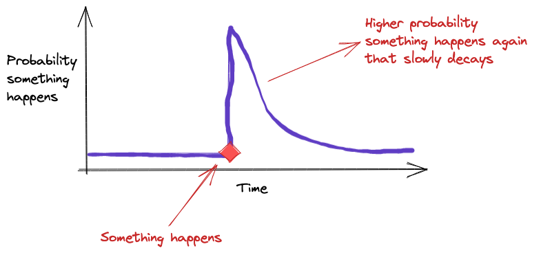

## Table of Contents

## What are self-exciting processes in the context of market microstructure?

Self-exciting processes in market microstructure refer to situations where past events in the market can influence future events. Imagine that when a big order comes in and causes a price change, it might encourage other traders to jump in and trade more, causing even more price changes. This creates a cycle where the market activity keeps feeding on itself, like a chain reaction.

These processes are important because they help explain why markets can sometimes become very active and volatile. For example, if a stock price starts to drop quickly, it might make more people want to sell, which makes the price drop even more. Understanding self-exciting processes can help traders and researchers predict how the market might behave and manage risks better.

## How do self-exciting processes influence market dynamics?

Self-exciting processes can make markets more active and unpredictable. When a big event happens, like a large trade or a sudden price change, it can cause more people to start trading. This creates a cycle where one action leads to another, making the market busier and more volatile. For example, if a stock's price starts to go up, more people might want to buy it, pushing the price even higher.

This cycle can lead to big swings in prices and trading volumes. If everyone starts buying or selling at the same time because of what they see happening, it can create a snowball effect. This means that small events can grow into big market movements. Understanding these self-exciting processes helps traders and investors prepare for and manage sudden changes in the market.

## Can you explain the basic mathematical models used to describe self-exciting processes in markets?

One of the main mathematical models used to describe self-exciting processes in markets is the Hawkes process. Imagine it like this: if you drop a stone into a pond, the ripples spread out and can make other stones fall in, causing more ripples. In the Hawkes process, events like trades or price changes are the stones, and the ripples are how these events influence future events. The model uses a mathematical formula to show how the chance of a new event happening depends on how long ago past events occurred and how strong their impact was. This helps us see how activity in the market can build up over time.

Another model is the autoregressive conditional duration (ACD) model. Think of this like a weather forecast for market events. Just as weather patterns can predict future rain or sunshine, the ACD model uses past times between events to predict how long it might be until the next event happens. It looks at the time gaps between trades or price changes and uses them to guess when the next one will come. This model helps traders understand the timing of market movements and can be useful for planning when to buy or sell.

## What is the Hawkes process and how is it applied in market microstructure?

The Hawkes process is a mathematical model that helps us understand how events in the market can trigger more events. Imagine you're playing a game where throwing one ball can cause more balls to be thrown. In the market, if a big trade happens, it can make other people want to trade too. The Hawkes process uses a formula to show how the chance of a new event, like another trade, depends on when past events happened and how strong their effect was. It's like tracking the echoes of market activity, where each echo can start a new wave of action.

In market microstructure, the Hawkes process is used to study things like how trades and price changes happen over time. Researchers and traders use it to see patterns and predict what might happen next. For example, if a stock's price suddenly jumps, the Hawkes process can help figure out how likely it is that more trades will follow, and how soon. This is useful for understanding why markets can get busy and change quickly, and it helps people make better decisions about when to buy or sell.

## How do self-exciting processes relate to market volatility and liquidity?

Self-exciting processes can make the market more volatile. When a big trade happens, it can cause more people to start trading, leading to more price changes. This can create a cycle where the market keeps getting busier and prices keep moving up and down a lot. Imagine if one person starts running in a quiet park, and then more people join in, making the park very busy and lively. That's how self-exciting processes can make the market feel like it's on a roller coaster, with prices going up and down quickly.

These processes also affect market [liquidity](/wiki/liquidity-risk-premium), which is how easy it is to buy or sell things in the market. When a lot of people are trading because of self-exciting events, there are more buyers and sellers around. This can make it easier to find someone to trade with, increasing liquidity. But if everyone wants to trade at the same time, it can also lead to sudden changes in liquidity. It's like a busy market where sometimes it's easy to find what you need, but other times it's hard because everyone is trying to buy or sell at once.

## What empirical evidence supports the existence of self-exciting processes in financial markets?

There is a lot of real-world data that shows self-exciting processes happen in financial markets. Researchers have looked at things like how often trades happen and how prices change over time. They found that when a big trade or a sudden price change happens, it often leads to more trades and more price changes soon after. For example, studies on stock markets have shown that after a big buy or sell order, there's a higher chance of more orders coming in right after. This is like seeing a crowd get excited and start moving after someone starts running in a quiet place.

Another piece of evidence comes from looking at how markets behave during big events, like financial crises. During these times, the market can get very busy and prices can move a lot. Researchers have used models like the Hawkes process to show that these big moves can start a chain reaction, where one event leads to another. This helps explain why markets can become very volatile and why it can be hard to predict what will happen next. It's like watching a storm grow bigger as more and more clouds join in, making the weather more unpredictable.

## How can self-exciting processes be used to predict market movements?

Self-exciting processes can help us guess what might happen in the market next. Imagine you see a lot of people suddenly start buying a stock. Using models like the Hawkes process, we can look at how past trades have led to more trades and figure out if this pattern might keep going. If a big trade happens and it's followed by more trades, we can use this information to predict that there might be even more trades soon. This can help traders decide when it's a good time to buy or sell.

These models also help us understand how the market might get busier or calmer. If we see that after a big price change, more people start trading, we can predict that the market might stay busy for a while. This can be useful for planning when to make a move in the market. By looking at how events in the market cause more events, we can get a better idea of what might happen next and be ready for it.

## What are the limitations of using self-exciting processes in market analysis?

Using self-exciting processes in market analysis can be tricky because they don't always capture everything that happens in the market. These models focus on how past events can cause more events, but they might miss other important things like news, economic reports, or changes in how people feel about the market. For example, if a company announces a new product, it can change how people trade, but self-exciting models might not see this coming because they're looking at past trades, not news.

Another problem is that self-exciting models can be hard to use right. They need a lot of math and computer power to work well, and if you don't set them up correctly, they might give you wrong guesses about what will happen next. Also, these models can sometimes make the market seem more predictable than it really is. Just because a big trade happened and more trades followed before, it doesn't mean it will always happen that way. Markets can be surprising, and self-exciting models can't always keep up with all the surprises.

## How do self-exciting processes interact with other market microstructure theories?

Self-exciting processes work together with other market microstructure theories to help us understand how markets work. One important theory is the order-driven market model, which looks at how buy and sell orders affect prices. Self-exciting processes can show how a big order can lead to more orders, making the market busier. This can help explain why prices might change a lot after a big trade. By combining these ideas, we can see how the market reacts to different events and how one event can lead to another.

Another theory is the dealer market model, where dealers help people buy and sell. Self-exciting processes can show how dealers might start trading more if they see a lot of activity. This can affect how easy it is to buy or sell things in the market, which is called liquidity. When self-exciting processes are busy, dealers might have to work harder to keep up with all the trades, which can make the market more exciting but also more unpredictable. By looking at both self-exciting processes and dealer market models, we get a fuller picture of what's happening in the market.

## Can you discuss advanced statistical methods for estimating parameters in self-exciting models?

Estimating the parameters in self-exciting models like the Hawkes process can be tricky, but there are some advanced statistical methods that help. One popular method is Maximum Likelihood Estimation (MLE). Imagine you're trying to guess how likely it is that a certain pattern of trades will happen again. MLE looks at all the past data and tries to find the best numbers that make the model fit the data well. It's like trying to find the perfect key that unlocks the puzzle of how events in the market trigger more events. This method can be hard to use because it needs a lot of math and computer power, but it gives us a good guess about how strong the impact of past events is and how long it lasts.

Another method is Bayesian estimation, which is like making educated guesses based on what we already know. Imagine you start with some ideas about how the market works, and then you update those ideas as you see more data. Bayesian methods use this approach to figure out the parameters of self-exciting models. They can be really helpful because they let us include our own knowledge about the market, which can make our guesses more accurate. But they can also be complicated because they need us to think carefully about what we believe and how sure we are about it. Both MLE and Bayesian methods help us understand self-exciting processes better, but they each have their own challenges and ways of working.

## What are the current research trends and future directions in studying self-exciting processes in market microstructure?

Current research in self-exciting processes within market microstructure is focusing on making models better and more accurate. Scientists are trying to mix self-exciting models with other theories, like how dealers and orders affect the market. They are also using new ways to estimate the model's parameters, like using [machine learning](/wiki/machine-learning) to find patterns in big data sets. This can help us understand how events in the market trigger more events even better. Another big trend is looking at how self-exciting processes work in different markets, like cryptocurrencies, where things can change very quickly.

In the future, researchers want to use self-exciting processes to help predict what might happen in the market more accurately. They are thinking about using these models to create tools that traders can use every day. Another direction is to study how self-exciting processes can help us understand and manage risks better. For example, if we can see how one event might lead to another, we can be ready for big changes in the market. As technology gets better, researchers hope to use more real-time data to make their models even more useful and up-to-date.

## How do self-exciting processes affect high-frequency trading strategies?

Self-exciting processes can make high-frequency trading strategies more exciting and risky. Imagine high-frequency traders as fast runners in a race. They use computers to buy and sell things very quickly, often in just a few seconds. When a big trade happens and causes more trades, like in a self-exciting process, these traders can jump in to make money from the busy market. But it's also risky because the market can change very fast, and they might lose money if they don't keep up with all the quick changes.

To handle self-exciting processes, high-frequency traders use special computer programs that can spot patterns and make trades very fast. These programs look at past trades and try to guess what might happen next. If they see a big trade that could lead to more trades, they might decide to buy or sell right away. This can help them make money when the market gets busy, but they always have to be ready for surprises because the market can be unpredictable.

## What is the process of understanding self-exciting processes?

Self-exciting processes, notably Hawkes processes, are a class of stochastic processes where the occurrence of an event increases the probability of subsequent events occurring in the near future. This contrasts with classical Poisson processes, which are memoryless, meaning that the occurrence of an event does not affect the likelihood of future events. In a Poisson process, the events occur independently, and the intervals between events follow an exponential distribution.

Hawkes processes are characterized by their ability to model phenomena where events cluster in time, influenced by their preceding occurrences. The mathematical foundation of a Hawkes process is grounded in its conditional intensity function, $\lambda(t)$, which is defined as:

$$
\lambda(t) = \mu + \sum_{t_i < t} \phi(t - t_i)
$$

In this equation, $\mu$ represents the baseline intensity, or the rate of event occurrence when there are no prior events, and $\phi(t - t_i)$ is the impact function describing how much influence past events $t_i$ have on the current intensity at time $t$. This impact is often modeled through a decay function, typically exponential, which captures the fading influence of older events over time:

$$
\phi(t - t_i) = \alpha e^{-\beta(t - t_i)}
$$

Here, $\alpha$ denotes the amplitude or strength of the self-excitation, and $\beta$ determines the rate at which the excitation effect decays. These parameters, $\alpha$ and $\beta$, are crucial in defining the characteristics of the process. They dictate how strongly and how quickly the process returns to its baseline intensity after an event.

In financial markets, self-exciting processes are particularly useful in modeling the clustering of trades. A simple example involves the trade activities in a liquid stock. Suppose a large buy order enters the market, leading to an upward price movement. This price increase might trigger [algorithmic trading](/wiki/algorithmic-trading) strategies or motivate other traders to enter the market to take advantage of this trend, resulting in subsequent buy orders and further price movements. This phenomenon can result in a cascade of trading activity that could not be effectively captured by a classical Poisson process. 

Python code, which might be used to simulate a basic Hawkes process with specified parameters, could look like this:

```python
import numpy as np
import matplotlib.pyplot as plt

def simulate_hawkes_process(mu, alpha, beta, T):
    events = []
    s = 0
    intensity = mu
    while s < T:
        u = np.random.uniform(0, 1)
        w = -np.log(u) / intensity
        s += w
        if s < T:
            D = np.random.uniform(0, 1)
            lambda_s = mu + alpha * np.sum(np.exp(-beta * (s - np.array(events))))
            if D <= lambda_s/intensity:
                events.append(s)
        intensity = mu + alpha * np.sum(np.exp(-beta * (s - np.array(events))))
    return np.array(events)

# Parameters
mu = 0.5
alpha = 0.8
beta = 1.2
T = 10

# Simulating
events = simulate_hawkes_process(mu, alpha, beta, T)

# Plot
plt.scatter(events, np.zeros_like(events), marker='x')
plt.title('Simulated Hawkes Process')
plt.xlabel('Time')
plt.show()
```

By using this simulation, one can visualize the clustering of events over time, providing insights into how financial trades might be driven by past activities. The ability of Hawkes processes to incorporate historical events into current state predictions makes them a powerful tool in understanding and analyzing financial market behaviors.

## What are the applications in market microstructure?

Self-exciting processes, particularly Hawkes processes, are invaluable for understanding the intricacies of market microstructure, notably within high-frequency trading environments. These processes effectively model the dynamic nature of financial markets by capturing the clustering of trades over time, reflecting how events influence subsequent events' likelihood. This characteristic is particularly evident in the heavy-tailed nature of financial event distributions.

In financial markets, events such as trades or order arrivals are often not independent; instead, they tend to cluster in time, a phenomenon described by the heavy-tailed distribution of inter-event times. This means that high-intensity periods characterized by frequent trading follow quieter periods more frequently than would be expected under a simple Poisson process. Hawkes processes model this clustering effectively by utilizing a conditional intensity function, typically given by:

$$
\lambda(t) = \mu + \sum_{t_i < t} \phi(t - t_i)
$$

where $\mu$ is the baseline intensity, and $\phi(t - t_i)$ is the impact of past events, capturing the self-excitement property inherent in market trades. This framework enables the representation of periods of intense trading activity, aligning with the observed market behavior better than traditional models.

In terms of bid-ask spread dynamics, self-exciting processes offer insights into the temporal structure and flow behavior of order [books](/wiki/algo-trading-books). During periods of high trading activity, bid-ask spreads can widen or narrow depending on the flow of orders and execution speed, which Hawkes processes can model by incorporating both the frequency and the impact of trades on subsequent market movements.

Comparatively, traditional models such as time-homogeneous Poisson processes assume that market events occur independently at a constant average rate. While simpler, they fail to account for the clustering of trades and the endogenous nature of market activity, which are prevalent in financial markets. This lack of flexibility limits their ability to capture the intricate behaviors observed in high-frequency trading environments.

In contrast, self-exciting models, by accounting for the history-dependent nature of trade occurrences, provide a more nuanced and realistic representation of market microstructure. They allow traders and analysts to develop strategies that exploit the clustering of trades to predict future market movements, thus enhancing the potential for profit maximization and risk management in trading operations.

## What are Algorithmic Trading Strategies?

Self-exciting processes, particularly Hawkes processes, have found significant utility in developing advanced algorithmic trading strategies. These processes provide a robust framework for modeling the clustering of trades and predicting short-term price movements, an invaluable capability in fast-paced financial markets.

The core advantage of using self-exciting processes lies in their ability to capture the temporal dependencies in trade arrivals. In a trading environment, the likelihood of a trade occurring often depends on prior trading activity; Hawkes processes model this by adjusting their intensity or rate function based on recent events. The intensity function $\lambda(t)$ of a Hawkes process is defined as:

$$
\lambda(t) = \mu + \sum_{t_i < t} \alpha e^{-\beta(t-t_i)}
$$

where $\mu$ represents the baseline intensity, and $\alpha$ and $\beta$ are parameters controlling the amplitude and decay of the self-excitement, respectively. This formulation allows the process to exhibit a clustering effect by increasing the intensity with each event, subsequently decaying back to its base level over time.

In algorithmic trading, self-exciting processes are utilized to forecast future trade volumes and price jumps. By adjusting trading strategies based on the calculated probabilities of imminent trades, traders can better predict short-term market trends. For instance, if the model indicates a high probability of successive trades, a trader might opt for [momentum](/wiki/momentum)-based strategies to capitalize on expected price movements.

Quantitative trading strategies employing Hawkes processes often leverage statistical [arbitrage](/wiki/arbitrage) opportunities. For example, traders can develop strategies that analyze the intensities of trade occurrences across correlated asset pairs, exploiting transient price discrepancies. The models help identify periods of increased trading activity where price adjustments may be more pronounced.

Backtesting these strategies involves simulating the trading model on historical data to evaluate its effectiveness and resilience. One of the key challenges in implementing Hawkes processes in real-time trading systems is the intensive computation required to continuously update the intensity function as new data arrives. Ensuring the model's ability to adapt and execute trades instantaneously demands substantial computational resources and optimized algorithms. Additionally, even a robust backtest does not guarantee future performance, mainly due to evolving market conditions and behavioral shifts not captured by historical data.

Heavy reliance on high-frequency data and the need for precise model parameterization further complicate real-time deployment. Accurate estimation of parameters like $\alpha$, $\beta$, and $\mu$ requires careful consideration of market microstructure and noise reduction techniques. Robust implementation not only necessitates sophisticated computational infrastructure but also meticulous calibration processes to maintain predictive accuracy and efficient trade execution.

In sum, self-exciting processes represent a potent tool in the arsenal of algorithmic trading strategies, offering enhanced predictive capabilities and nuanced understanding of market dynamics. Despite the challenges, their application in algorithmic trading remains a burgeoning area of interest, marrying statistical sophistication with practical trading acumen.

## References & Further Reading

[1]: Bacry, E., Mastromatteo, I., & Muzy, J.-F. (2015). ["Hawkes processes in finance."](https://arxiv.org/abs/1502.04592) Market Microstructure and Liquidity, 1(01), 1550005. 

[2]: Bowsher, C. G. (2007). ["Modelling security market events in continuous time: intensity based, multivariate point process models."](https://www.sciencedirect.com/science/article/pii/S030440760600251X) Review of Economic Studies, 74(3), 377-413.

[3]: Embrechts, P., & Liniger, T. (2008). ["Multivariate Hawkes processes: An application to financial data."](https://www.jstor.org/stable/pdf/44806678.pdf) Journal of Applied Probability, 45(A), 367-378.

[4]: Aït-Sahalia, Y., Cacho-Diaz, J., & Laeven, R. J. (2015). ["Modeling financial contagion using mutually exciting jump processes."](https://www.sciencedirect.com/science/article/pii/S0304405X15000264) Journal of Financial Economics, 117(3), 585-606.

[5]: Muni Toke, I. (2011). ["'Market Making' and 'Mean Reversion' backtests revisited with Hawkess processes."](https://www.cis.upenn.edu/~mkearns/papers/marketmaking.pdf) HAL Archives.