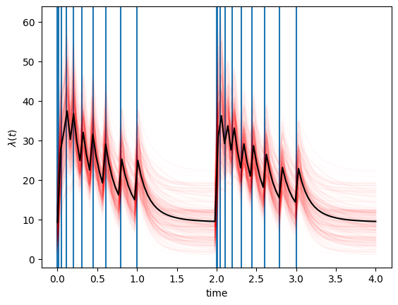

## Table of Contents

## What is a self-exciting process?

A self-exciting process is when something causes itself to happen more. Imagine you have a toy that spins faster the more you play with it. The more it spins, the more fun you have, so you play with it even more. This is like a self-exciting process because the spinning makes you want to play more, which makes it spin even faster.

In real life, self-exciting processes can be seen in things like earthquakes. After a big earthquake, there can be many smaller ones because the first big one changed the ground. These smaller quakes can then cause even more quakes. It's like the earth is shaking itself more and more because of the first shake. This is why understanding self-exciting processes is important in many areas, not just toys or earthquakes.

## How do self-exciting processes differ from other stochastic processes?

Self-exciting processes are special kinds of stochastic processes. Stochastic processes are events that happen randomly over time, like the weather changing or a dice roll. What makes self-exciting processes different is that they can cause themselves to happen more often. For example, after a big earthquake, the chance of more earthquakes goes up because the first one changed the ground. This is different from other stochastic processes, where each event is usually independent and doesn't affect the chances of the next event happening.

In simple terms, if you think of a coin toss as a stochastic process, each flip is independent. The result of one flip doesn't change the chance of heads or tails on the next flip. But in a self-exciting process, it's like if you got heads, the coin might be more likely to land on heads again because of something the first heads did. This connection between events is what sets self-exciting processes apart from other stochastic processes, making them unique and important to study in fields like seismology, finance, and more.

## What are some common applications of self-exciting processes?

Self-exciting processes are used a lot in studying earthquakes. When a big earthquake happens, it can make the ground more likely to shake again. Scientists use self-exciting models to predict where and when aftershocks might happen. This helps them warn people and keep them safe. By understanding these processes, experts can better prepare for future earthquakes and reduce damage.

Another place where self-exciting processes are important is in finance. In the stock market, big price changes can lead to more big changes. If a stock's price suddenly goes up or down a lot, it can make people trade more, causing even more price changes. This is called a self-exciting process because the first big change excites more changes. Financial experts use these models to understand market behavior and manage risks better.

Self-exciting processes also show up in social media. When someone posts something that gets a lot of likes or shares, it can lead to more posts like it. This creates a cycle where popular posts make more popular posts. Companies use this to figure out what kind of content will spread quickly and engage users. Understanding these patterns helps them create better strategies for social media marketing.

## Can you explain the concept of a Hawkes process?

A Hawkes process is a special kind of self-exciting process that's used to study events that can cause more events to happen. Imagine you have a toy that beeps. Every time it beeps, it makes other toys around it more likely to beep too. The more beeps there are, the more beeps you'll hear in the future. This is similar to a Hawkes process, where each event increases the chance of more events happening soon after.

In real life, Hawkes processes are used to understand things like earthquakes and stock market changes. After a big earthquake, smaller earthquakes called aftershocks are more likely to happen because the ground has been disturbed. In the stock market, a big price change can lead to more big changes because it makes people trade more. By using Hawkes processes, scientists and financial experts can predict when and where these events might happen next, helping them make better decisions and plans.

## What is the role of the triggering function in self-exciting processes?

The triggering function in self-exciting processes is like a special rule that tells us how much one event makes other events more likely to happen. Think of it as a way to measure how much a big earthquake makes smaller earthquakes more likely, or how a big price change in the stock market can lead to more price changes. The triggering function helps us see this connection clearly by showing how strong the effect of one event is on future events.

For example, in a Hawkes process, the triggering function is really important because it tells us how much each event increases the chance of more events happening soon after. If the triggering function is strong, it means that one event can cause a lot of other events. If it's weak, the effect is smaller. By understanding the triggering function, scientists and experts can predict and manage things like earthquakes or stock market changes better, making their predictions more accurate and helpful.

## How do you estimate parameters in a self-exciting process model?

Estimating parameters in a self-exciting process model is like trying to figure out the rules of a game by watching how it's played. You look at the data, which is like watching the game, and try to find the best numbers that make the model fit the data well. One common way to do this is by using a method called maximum likelihood estimation. This method tries different numbers for the parameters until it finds the ones that make the model most likely to have produced the data you see. It's like trying different keys in a lock until you find the one that fits perfectly.

Another way to estimate parameters is through simulation-based methods, like Markov Chain Monte Carlo (MCMC). This method is a bit like playing the game many times with different rules to see which rules work best. You run the model with different sets of parameters many times and see which set of parameters makes the model's results look most like the real data. This can be more complicated but can give you a good idea of how certain you can be about the parameters you choose. Both methods help you understand the self-exciting process better by finding the best numbers to describe how events trigger more events.

## What are the challenges in forecasting with self-exciting processes?

Forecasting with self-exciting processes is tricky because these models depend a lot on past events to predict future ones. Imagine trying to guess when a toy will beep next if every beep makes other toys more likely to beep. You need to keep track of all the beeps and how they affect each other. If you miss even one beep, your prediction might be way off. This makes it hard to get accurate forecasts because you need very good, complete data to make the model work right.

Another challenge is that self-exciting processes can change over time. In the real world, things like earthquakes or stock market changes don't always follow the same pattern. What worked to predict events last year might not work this year because the rules can change. This means you have to keep updating your model, which can be a lot of work. Plus, even small mistakes in your model can lead to big errors in your predictions, making it tough to trust the forecasts you make.

## How can self-exciting processes be used to model seismic activities?

Self-exciting processes, like the Hawkes process, are really helpful for understanding earthquakes. Imagine an earthquake happens. It can make the ground more likely to shake again with smaller quakes called aftershocks. The Hawkes process helps scientists see how the first big quake can cause more quakes. By using this model, they can predict where and when these aftershocks might happen. This is important because it helps them warn people and keep them safe from future quakes.

But using self-exciting processes to model seismic activities has some challenges. It's hard because you need to know about every earthquake that happens. If you miss even one, your predictions can be wrong. Also, the rules of how earthquakes happen can change over time. What worked last year might not work this year. So, scientists have to keep updating their models to make sure they are accurate. Even with these challenges, self-exciting processes are a powerful tool for understanding and predicting earthquakes.

## What is the impact of self-exciting processes on financial market modeling?

Self-exciting processes, like the Hawkes process, are used a lot in financial market modeling to understand how big price changes can lead to more big changes. Imagine a stock's price suddenly goes up or down a lot. This can make people trade more, causing even more price changes. This cycle is called a self-exciting process because the first big change excites more changes. Financial experts use these models to predict when and how big these changes might be, helping them manage risks and make better decisions about buying and selling stocks.

However, using self-exciting processes in financial markets has its challenges. It's hard because you need very good data to make the model work right. If you miss even one big price change, your predictions can be off. Also, the market can change over time, so what worked to predict price changes last year might not work this year. This means experts have to keep updating their models to stay accurate. Even with these challenges, self-exciting processes are a powerful tool for understanding and predicting how financial markets move.

## How do self-exciting processes handle the clustering of events?

Self-exciting processes are really good at understanding why events happen in groups, or clusters. Imagine you're playing with a toy that beeps. When it beeps once, it makes other toys around it more likely to beep too. This is like how a big earthquake can cause smaller earthquakes, called aftershocks, to happen close together in time and space. The self-exciting process helps us see this pattern by showing how one event can make more events happen soon after. This is important because it helps scientists and experts predict when and where these clusters might happen next.

But, figuring out these clusters can be tricky. You need to know about every event that happens, like every beep or every earthquake. If you miss even one, your predictions can be wrong. Also, the rules of how these events happen can change over time. What worked to predict clusters last year might not work this year. So, experts have to keep updating their models to make sure they are accurate. Even with these challenges, self-exciting processes are a powerful tool for understanding why events happen in groups and how to predict them better.

## What advanced techniques exist for analyzing self-exciting processes?

Advanced techniques for analyzing self-exciting processes include using [machine learning](/wiki/machine-learning) and [artificial intelligence](/wiki/ai-artificial-intelligence). These methods help experts understand complex patterns better. For example, they can use neural networks to learn from a lot of data and predict when and where events like earthquakes or big stock market changes might happen next. These advanced techniques are good at finding hidden patterns that simpler models might miss. By using machine learning, scientists and financial experts can make more accurate predictions and better understand how events trigger each other.

Another advanced technique is called Bayesian inference. This method helps experts update their models as new data comes in. Imagine you're trying to guess where a toy will beep next. Every time it beeps, you learn more about the pattern. Bayesian inference lets you use this new information to make your guesses better. It's like getting smarter with every new piece of data. This technique is really useful for self-exciting processes because it helps experts keep their models up to date and accurate, even when the rules change over time.

## Can you discuss the limitations and future research directions in self-exciting processes?

Self-exciting processes have some limitations that make them hard to use. One big problem is that they need a lot of good data to work right. If you miss even one event, like a small earthquake or a stock price change, your predictions can be wrong. Also, the way events happen can change over time, so what worked to predict things last year might not work this year. This means experts have to keep updating their models, which can be a lot of work. Another issue is that even small mistakes in the model can lead to big errors in predictions, making it tough to trust the forecasts.

In the future, research on self-exciting processes could go in some exciting directions. One idea is to use more advanced machine learning and artificial intelligence to find hidden patterns in the data. These methods could help make predictions more accurate and help experts understand how events trigger each other better. Another direction is to improve how models are updated with new data, using techniques like Bayesian inference to keep the models current and reliable. By focusing on these areas, scientists and experts can make self-exciting processes even more useful for predicting things like earthquakes and stock market changes.

## What are Self-Exciting Processes?

Self-exciting processes are statistical models where the occurrence of events increases the likelihood of future events in the short term. At the core of self-exciting processes is the mechanism by which past events influence the rate at which subsequent events happen. This characteristic distinguishes them from other stochastic processes, where the likelihood of an event is often independent of the history.

Key features of self-exciting processes include temporal clustering of events, where periods of high activity may follow the occurrence of an event due to the increased intensity function. This feature is mathematically represented by self-exciting point processes, commonly exemplified by the Hawkes process. The intensity function, $\lambda(t)$, of a Hawkes process might be expressed as:

$$
\lambda(t) = \mu + \sum_{t_i < t} \phi(t - t_i)
$$

where $\mu$ is the baseline intensity, $t_i$ are past events, and $\phi$ is the kernel function modeling the influence of past events. The self-exciting nature of this process is captured by $\phi$, ensuring that each past event increases the likelihood of future events for some period.

Self-exciting processes are observed both in natural systems and financial markets. In seismology, aftershocks following a major earthquake exemplify a natural application, while in finance, trade arrivals or market orders tend to cluster, echoing similar patterns as financial [agents](/wiki/agents) react to new information.

The relevance of self-exciting processes in finance and trading is due to their ability to model and predict clustered market behaviors effectively. In markets, sudden shifts are often followed by a cascade of similar actions by traders, leading to volatile phases that self-exciting processes can anticipate more reliably than traditional models. By capturing these dynamics, self-exciting processes become crucial tools for understanding temporal dependencies and interactions within financial markets, enhancing predictive modeling and adaptive strategies for [algorithmic trading](/wiki/algorithmic-trading).

## References & Further Reading

[1]: Aït-Sahalia, Y., & Laeven, R. J. A. (2018). ["The Economics of Option Trading and Hedging."](https://www.semanticscholar.org/paper/Mutual-Excitation-in-Eurozone-Sovereign-CDS-Ait-Sahalia-Laeven/4b99bc070e8554842d1000bdfa0c1455d688cda0) Journal of Financial Economics, 128(1), 58-82.

[2]: Bauwens, L., & Hautsch, N. (2009). ["Modelling Financial High Frequency Data Using Point Processes."](https://link.springer.com/chapter/10.1007/978-3-540-71297-8_41) In: F. Longin (Ed.), Extreme Events in Finance (pp. 355-400). Springer.

[3]: Hawkes, A. G. (1971). ["Spectra of Some Self-Exciting and Mutually Exciting Point Processes."](https://www.dcscience.net/Hawkes-Biometrika-1971.pdf) Biometrika, 58(1), 83-90.

[4]: Bacry, E., Mastromatteo, I., & Muzy, J. F. (2015). ["Hawkes Processes in Finance."](https://arxiv.org/abs/1502.04592) Market Microstructure and Liquidity, 1(1), 1550005.

[5]: Bowsher, C. G. (2007). ["Modelling Security Market Events in Continuous Time: Intensity Based, Multivariate Point Process Models."](https://www.sciencedirect.com/science/article/pii/S030440760600251X) Review of Economic Studies, 74(3), 771-791.

[6]: Guillaume, F., & Schitter, C. (2022). ["A Practical Guide to Understanding and Implementing Systems that use Hawkes Processes in Algorithmic Trading."](https://academic.oup.com/qje/article/140/1/403/7926978)

[7]: Rambaldi, M., & Bacry, E. (2016). ["The Integer-Valued Auto-Regressive Process and Its Applications in Finance."](https://www.tandfonline.com/doi/full/10.1080/14697688.2016.1260759) Economic Modelling, 56(1), 1-17.