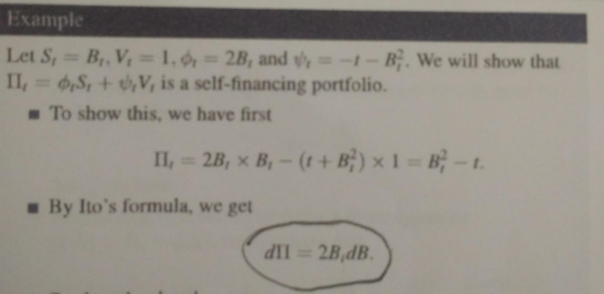

## Table of Contents

## What is a self-financing portfolio?

A self-financing portfolio is a type of investment strategy where the money used to buy and sell assets comes only from the portfolio itself. This means that once you start the portfolio, you don't need to add more money from outside. Instead, any profits or losses from the investments are used to make new investments or cover losses.

For example, if you buy stocks with the money in your portfolio and those stocks go up in value, you can sell them and use that money to buy more stocks or other investments. If the stocks go down in value, you might have to sell other assets in your portfolio to cover the loss. The key idea is that the portfolio manages itself without needing extra money from you.

## How does a self-financing portfolio differ from other types of investment portfolios?

A self-financing portfolio is different from other types of investment portfolios because it doesn't need more money added to it after it starts. Once you put money into a self-financing portfolio, you use only the money and profits from the investments inside it to buy and sell assets. This means that if your investments do well, you can keep buying more without adding extra money. If they do poorly, you use other assets in the portfolio to cover losses. Other types of portfolios might need you to keep adding money to buy new investments or to cover losses.

In contrast, other investment portfolios, like a regular savings or retirement account, often rely on regular contributions from the investor. For example, you might put money into your retirement account every month. This extra money helps to grow your investments over time. A self-financing portfolio, on the other hand, doesn't depend on these regular contributions. It's designed to be self-sustaining, using its own performance to manage growth and losses.

## What are the basic principles behind creating a self-financing portfolio?

Creating a self-financing portfolio involves setting up a collection of investments that can grow and manage themselves without needing more money from you. The first principle is to start with a good amount of money to buy different kinds of investments, like stocks, bonds, or real estate. Once you have these investments, the idea is to use the money you make from them to buy more investments or to cover any losses. This means you need to pick investments that have the potential to grow in value over time.

Another important principle is to keep an eye on how your investments are doing and be ready to make changes. If some of your investments are doing well, you can sell them to buy more of other investments or different ones that might do better. If some are doing poorly, you might need to sell other assets in your portfolio to cover the losses. This requires a balance between taking risks to grow your portfolio and being careful not to lose too much money. By managing your portfolio this way, you can keep it going without adding more money from outside.

## What types of assets are typically included in a self-financing portfolio?

A self-financing portfolio usually includes a mix of different types of assets. The most common ones are stocks, which are shares in a company that can go up or down in value. Another popular asset is bonds, which are like loans you give to a company or government that pay you back with interest over time. Some people also include real estate, which means owning property that can be rented out or sold for a profit. These assets are chosen because they have the potential to grow in value or provide income, which can then be used to buy more investments.

In addition to these main assets, a self-financing portfolio might also include other types of investments like mutual funds or exchange-traded funds (ETFs), which are collections of stocks or bonds managed by professionals. Some people also add commodities, like gold or oil, which can be a good way to spread out risk. The key is to pick a variety of assets that work well together, so if one type of investment goes down, others might go up, helping to keep the portfolio balanced and growing on its own.

## How can someone start building their own self-financing portfolio?

To start building your own self-financing portfolio, you first need to decide how much money you can put into it at the beginning. This money will be used to buy your first set of investments, like stocks, bonds, or real estate. It's important to choose a variety of assets so that your portfolio can grow on its own. You might want to look at different kinds of stocks, some bonds for steady income, and maybe even some real estate if you can afford it. The key is to pick investments that have the potential to go up in value or provide you with regular income.

Once you have your initial investments, you need to keep an eye on how they are doing. If some of your investments are doing well, you can sell them and use the money to buy more investments or different ones that you think might do better. If some are not doing so well, you might have to sell other assets in your portfolio to cover the losses. This means you need to be ready to make changes and balance taking risks with being careful. By managing your portfolio this way, you can keep it going without needing to add more money from outside.

## What are the risks associated with a self-financing portfolio?

One big risk of a self-financing portfolio is that it can be hard to recover if things go badly. If your investments lose a lot of value, you might have to sell other assets in your portfolio to cover the losses. But if all your investments are going down at the same time, you might run out of money to keep the portfolio going. This means you need to be careful and pick a good mix of investments to spread out the risk.

Another risk is that you might not have enough money to take advantage of new investment opportunities. If you see a good chance to buy a new stock or property, but your portfolio isn't making enough money, you might miss out. This can slow down the growth of your portfolio and make it harder to keep it self-financing. So, it's important to keep a close eye on your investments and be ready to make changes when needed.

Lastly, managing a self-financing portfolio takes a lot of time and knowledge. You need to understand how different investments work and how they might do in the future. If you don't have enough experience, you might make bad choices that hurt your portfolio. It's a good idea to learn as much as you can and maybe even get help from a financial advisor to make smart decisions.

## How does rebalancing work in a self-financing portfolio?

Rebalancing in a self-financing portfolio means adjusting your investments to keep them in line with your original plan. Imagine you start with half your money in stocks and half in bonds. Over time, if your stocks go up a lot, you might end up with more money in stocks than you wanted. To fix this, you sell some stocks and use that money to buy more bonds. This way, you keep your portfolio balanced the way you want it.

Rebalancing is important because it helps manage risk and keep your portfolio growing on its own. If you don't rebalance, your portfolio might become too focused on one type of investment, which can be risky. By selling some of the investments that did well and buying more of the ones that didn't, you can spread out your risk and make sure your portfolio stays self-financing. It's like keeping a garden healthy by trimming the plants that grew too much and watering the ones that need more care.

## What role does diversification play in a self-financing portfolio?

Diversification is really important in a self-financing portfolio. It means spreading your money across different types of investments, like stocks, bonds, and real estate. When you do this, you're not putting all your eggs in one basket. If one type of investment goes down, others might go up, which helps keep your portfolio safe and growing. This is key for a self-financing portfolio because it needs to keep making money to buy more investments or cover losses without you adding more cash.

By having a mix of investments, you can handle the ups and downs of the market better. For example, if the stock market has a bad year, your bonds might still give you steady income. This balance helps your portfolio stay strong and keep going on its own. Diversification makes it easier to rebalance your portfolio too, because you have different options to choose from when you need to make changes. This way, your self-financing portfolio can keep running smoothly and grow over time.

## How can one measure the performance of a self-financing portfolio?

To measure the performance of a self-financing portfolio, you can look at how much money it has made or lost over time. One way to do this is by calculating the total return, which shows the percentage increase or decrease in the value of your portfolio. You can also compare your portfolio's performance to a benchmark, like a stock market index, to see if it's doing better or worse than the market as a whole. Another useful measure is the risk-adjusted return, which looks at how much return you're getting for the amount of risk you're taking. This can help you see if your portfolio is growing enough to make up for the risks you're taking.

Another important thing to check is how well your portfolio is doing at staying self-financing. This means looking at whether the money you're making from your investments is enough to keep buying new ones or covering losses without you adding more money. You can do this by keeping track of your cash flow, which is the money coming in and going out of your portfolio. If your portfolio is making enough money to keep itself going, that's a good sign that it's performing well as a self-financing portfolio.

## What advanced strategies can be used to optimize a self-financing portfolio?

One advanced strategy to optimize a self-financing portfolio is using options and derivatives. These are special kinds of investments that can help you make money or protect your portfolio from big losses. For example, you can buy options that let you buy or sell stocks at a certain price in the future. This can help you make more money if the stock goes up, or lose less money if it goes down. Using these tools takes a lot of knowledge and skill, so it's important to learn about them or get help from a financial expert.

Another strategy is to use a technique called dollar-cost averaging. This means you use the money you make from your investments to buy more investments over time, instead of all at once. By spreading out your buying, you can avoid buying everything at a high price and end up with a better average cost. This can help your portfolio grow more smoothly and reduce the risk of big losses. Both of these strategies can help make your self-financing portfolio stronger and more likely to keep growing on its own.

## How do tax considerations affect the management of a self-financing portfolio?

Tax considerations can have a big impact on how you manage a self-financing portfolio. When you buy and sell investments, you might have to pay taxes on the money you make. This can affect how much money you have left to keep your portfolio going. For example, if you sell a stock for a profit, you'll owe taxes on that profit. This means you'll have less money to buy new investments or cover losses. It's important to think about these taxes when you're deciding when to sell your investments, because they can change how much money you actually get to keep and use in your portfolio.

To manage your self-financing portfolio in a way that reduces your tax bill, you can use some smart strategies. One way is to hold onto your investments for more than a year before selling them. In many places, if you do this, you'll pay a lower tax rate on your profits. Another strategy is to use tax-advantaged accounts, like retirement accounts, where you don't have to pay taxes on your investments until you take the money out. By planning your buys and sells with taxes in mind, you can keep more money in your portfolio and help it grow better on its own.

## What are the latest trends and innovations in self-financing portfolio management?

One of the latest trends in self-financing portfolio management is the use of [artificial intelligence](/wiki/ai-artificial-intelligence) (AI) and [machine learning](/wiki/machine-learning). These technologies help investors make better decisions by analyzing lots of data quickly. AI can look at how different investments are doing and suggest when to buy or sell them. This can make it easier to keep your portfolio balanced and growing on its own. Some people even use AI to find new investment opportunities that they might not have thought of before. This can help make your self-financing portfolio stronger and more likely to keep making money.

Another innovation is the rise of robo-advisors. These are online services that use computer programs to manage your investments for you. Robo-advisors can create a self-financing portfolio for you and then keep an eye on it, making changes when needed. They often use low-cost investments like ETFs, which can help your portfolio grow without you having to add more money. Robo-advisors are becoming more popular because they make it easier for people to manage their own portfolios without needing a lot of time or knowledge. This can be a big help for anyone trying to keep their self-financing portfolio running smoothly.

## What is a Self-financing Portfolio?

A self-financing portfolio is a critical concept in financial mathematics, where the purchase or acquisition of new assets is completely funded by the sale or liquidation of existing assets within the portfolio itself. Importantly, this process occurs without any external inflow or outflow of capital. This characteristic is particularly vital for maintaining a portfolio's solvency over time, ensuring the portfolio can dynamically adjust its asset allocation in response to changing market conditions.

Mathematically, a self-financing portfolio in a discrete-time setting can be represented as follows: Let $V_t$ denote the value of the portfolio at time $t$, and let $\Delta V_t$ represent the change in portfolio value from time $t$ to $t+1$. The portfolio is self-financing if:

$$
\Delta V_t = \sum_{i=1}^{n} \Delta h_{i,t} S_{i,t}
$$

where $\Delta h_{i,t}$ is the change in the number of shares of asset $i$ held by the portfolio, and $S_{i,t}$ is the price of asset $i$ at time $t$. There is no requirement for $\Delta V_t$ to include external funding. 

In continuous-time finance, self-financing portfolios are frequently modeled using stochastic differential equations, capturing the dynamic evolution of asset prices $S(t)$ and the corresponding holdings. This allows for continuous rebalancing of the portfolio:

$$
dV(t) = \sum_{i=1}^{n} h_i(t) \, dS_i(t)
$$

where $dV(t)$ is the differential change in the value of the portfolio, and $h_i(t)$ is the holding of asset $i$ at time $t$.

The concept of self-financing portfolios is foundational in risk management and derivatives pricing. It supports the creation of replicating portfolios that can price and hedge derivative products without necessitating additional capital. This aligns with the principles used in models such as the Black-Scholes framework, where self-financing conditions are essential for deriving differential equations that underpin option pricing strategies.

Overall, self-financing portfolios enable traders and financial engineers to manage investment strategies that dynamically react to market movements without relying on external funding, ensuring that the portfolio's integrity is maintained in a capital-efficient manner.

## What is the Mathematical Definition?

The mathematical definition of a self-financing portfolio can be articulated in both discrete and continuous time settings, offering a rigorous framework for its application in financial markets.

In a discrete time framework, a self-financing portfolio is characterized by its ability to adjust asset positions without the need for additional capital or external funding. Mathematically, if $V_t$ represents the value of the portfolio at time $t$, consisting of assets $X_t^i$ with respective prices $S_t^i$, then the change in the portfolio value between times $t$ and $t+1$ should satisfy the condition:

$$
V_{t+1} - V_t = \sum_{i} X_{t+1}^i S_{t+1}^i - \sum_{i} X_t^i S_t^i
$$

Here, the change in the portfolio value is solely due to changes in asset prices and positions, implying that any rebalancing of the portfolio is funded internally rather than through external resources.

In continuous time, the dynamics of a self-financing portfolio are modeled using stochastic differential equations. Suppose $X_t$ represents the quantity vector of assets held and $S_t$ the price vector of these assets. The portfolio value $V_t$ is then $V_t = X_t \cdot S_t$, where $\cdot$ denotes the dot product. The self-financing condition in a continuous setting can be described by the stochastic differential equation:

$$
dV_t = X_t \cdot dS_t
$$

where $dS_t$ represents the differential price changes of the asset. The self-financing condition ensures that the incremental change in the portfolio's value, $dV_t$, is purely a function of the current asset holdings $X_t$ and the stochastic changes in asset prices $dS_t$. This reflects the principle that changes in portfolio value arise merely from market movements rather than from additional investment or withdrawal.

The continuous time framework often employs Itô calculus for more complex modeling, with Itô's lemma being a crucial tool in describing the evolution of prices and portfolio values in a stochastic environment. Such mathematical rigor underpins the formulation of strategies in [algorithmic trading](/wiki/algorithmic-trading) and derivative pricing.

## What are the applications in algorithmic trading?

Algorithmic trading systems frequently incorporate self-financing portfolios, offering a robust framework for executing trading strategies that do not rely on additional capital injection. These portfolios enable traders to adjust their asset allocations either continuously or at discrete intervals, responding efficiently to changing market signals. The capability to reallocate assets within the portfolio ensures that traders can maintain their strategies in various market conditions without requiring extra funding.

In the context of high-frequency trading ([HFT](/wiki/high-frequency-trading-strategies)), the use of self-financing portfolios is particularly crucial. HFT systems demand rapid trade execution and aim to minimize transaction costs, both of which are facilitated by the self-financing nature of these portfolios. By conducting trades through a carefully managed sequence of asset sales and purchases within the portfolio, HFT systems can limit the need for external capital, thus optimizing their operation for speed and cost-effectiveness.

Mathematically, the implementation of self-financing portfolios in trading systems often involves formulating strategies that can dynamically adjust asset positions in response to real-time data. For instance, a typical algorithm might employ a strategy represented by:

$$
\Delta W = \Delta \sum_{i=1}^{n} h_i \cdot \Delta S_i
$$

Here, $\Delta W$ is the change in the portfolio's wealth, $h_i$ represents the holdings of asset $i$, and $\Delta S_i$ denotes the change in the price of asset $i$. This equation ensures that the rebalancing of the portfolio results purely from internal movements within the portfolio's existing assets, adhering to the self-financing condition.

Moreover, modern trading platforms often leverage technology to implement these strategies programmatically. For instance, a Python script might be used to perform trades based on market signals, thus maintaining a self-financing stance:

```python
def rebalance_portfolio(portfolio, market_data):
    for asset, (holding, price) in portfolio.items():
        new_price = market_data.get(asset)
        if new_price:
            # Calculate the new holding based on strategy
            portfolio[asset] = (holding, new_price)
    return portfolio

# Example usage
portfolio = {'Asset_A': (100, 50), 'Asset_B': (200, 30)}
market_data = {'Asset_A': 52, 'Asset_B': 29}
updated_portfolio = rebalance_portfolio(portfolio, market_data)
```

In this simplified example, the `rebalance_portfolio` function adjusts asset holdings based on the latest market data, thereby allowing the portfolio to remain self-financing through internal rebalancing. Maintaining a self-financing position is critical for traders who seek to leverage algorithmic strategies for efficient and effective trading performance in the fast-paced environment of today's financial markets.

## What are Self-financing Portfolios and how do they relate to Risk Management?

Self-financing portfolios serve a crucial role in risk management by creating replicating portfolios capable of hedging against market risks. These portfolios mimic the behavior of a target financial instrument or set of cash flows by dynamically adjusting asset holdings, thereby eliminating or mitigating exposure to undesirable risks. 

The concept of self-financing portfolios is pivotal in the derivation of the Black-Scholes equation, a fundamental tool for options pricing. The Black-Scholes model assumes a risk-neutral environment where a self-financing portfolio can be constructed to replicate the payoff of a European call or put option. This replication involves dynamically buying and selling the underlying asset and a risk-free bond to ensure the portfolio's value matches the option's payoff at expiration. The strategy requires no additional capital once initiated, relying solely on reallocating existing capital.

The mathematical expression captures the self-financing condition as:

$$
dV_t = \Delta_t \, dS_t + \text{Bond}_t \, dB_t
$$

where $V_t$ is the portfolio value, $\Delta_t$ represents the number of shares of the underlying asset, $dS_t$ is the change in the asset price, and $\text{Bond}_t \, dB_t$ is the bond component’s contribution. The absence of inflow or outflow of additional funds in this equation underscores the self-financing nature of the portfolio.

Self-financing portfolios are indispensable for derivative pricing and risk management strategies. By accurately replicating the payoffs of derivatives without additional capital expenditure, financial institutions can manage risk effectively. This ability enables the crafting of various hedging strategies that protect against fluctuations in market variables, such as interest rates and stock prices, by synthesizing the risk profile of complex financial instruments.

Developing these strategies involves sophisticated modeling techniques that consider various risk factors, using numerical methods and programming to simulate portfolio dynamics under different market scenarios. One common approach for such simulations is the Monte Carlo method, frequently implemented in Python for its robust libraries and numerical capabilities. Here is a sample code snippet that initializes a basic Monte Carlo simulation for option pricing:

```python
import numpy as np

def monte_carlo_simulation(num_simulations, num_timesteps, initial_price, drift, volatility):
    dt = 1 / num_timesteps
    price_paths = np.zeros((num_timesteps, num_simulations))
    price_paths[0] = initial_price

    for t in range(1, num_timesteps):
        random_shocks = np.random.standard_normal(num_simulations)
        price_paths[t] = price_paths[t - 1] * np.exp((drift - 0.5 * volatility**2) * dt 
                                             + volatility * np.sqrt(dt) * random_shocks)

    return price_paths

# Example parameters
num_simulations = 10000
num_timesteps = 100
initial_price = 100
drift = 0.05
volatility = 0.2

simulated_prices = monte_carlo_simulation(num_simulations, num_timesteps, initial_price, drift, volatility)
```

Through such rigorous methodologies, self-financing portfolios continue to be indispensable in navigating the complex landscape of financial risks, ensuring robustness and stability without the need for additional capital inflows.

## References & Further Reading

[1]: Björk, T. (2009). ["Arbitrage Theory in Continuous Time."](https://www.academia.edu/38191641/Tomas_Bjork_Arbitrage_Theory_in_Continuous_Time_Oxford_Finance_2009_) Oxford University Press.

[2]: Hull, J. C. (2017). ["Options, Futures, and Other Derivatives."](https://elibrary.pearson.de/book/99.150005/9781292410623) Pearson.

[3]: Wilmott, P. (2006). ["Paul Wilmott Introduces Quantitative Finance."](https://www.amazon.com/Paul-Wilmott-Introduces-Quantitative-Finance/dp/0470319585) John Wiley & Sons.

[4]: Shreve, S. E. (2004). ["Stochastic Calculus for Finance I: The Binomial Asset Pricing Model."](https://link.springer.com/book/10.1007/978-0-387-22527-2) Springer.

[5]: Luenberger, D. G. (1998). ["Investment Science."](https://www.amazon.com/Investment-Science-David-G-Luenberger/dp/0199740089) Oxford University Press.

[6]: Black, F., & Scholes, M. (1973). ["The Pricing of Options and Corporate Liabilities."](https://www.cs.princeton.edu/courses/archive/fall09/cos323/papers/black_scholes73.pdf) Journal of Political Economy, Vol. 81, No. 3, pp. 637-654.

[7]: Lopez de Prado, M. (2018). ["Advances in Financial Machine Learning."](https://books.google.com/books/about/Advances_in_Financial_Machine_Learning.html?id=oU9KDwAAQBAJ) Wiley.