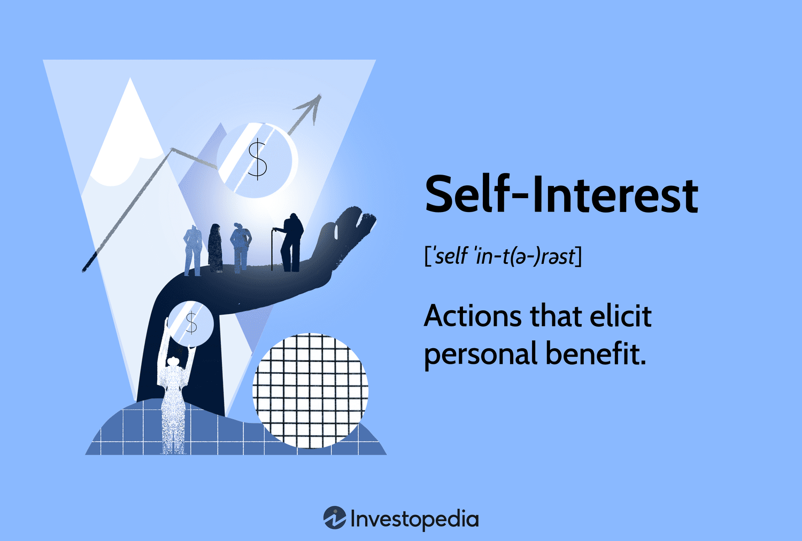

## Table of Contents

## What is self-interest in the context of economics?

Self-interest in economics means that people make choices based on what they think is best for themselves. This idea is important in understanding how economies work. For example, when someone decides to buy a product, they do it because they believe it will make them happier or better off. Economists believe that self-interest drives a lot of economic activity, like buying, selling, and working.

However, self-interest doesn't mean people only care about themselves. It can also include looking after family or friends. Economists like Adam Smith argued that when people pursue their own self-interest, it can actually benefit society as a whole. This idea is known as the "invisible hand," where individual actions lead to good outcomes for everyone. So, self-interest is a key part of how economists explain why people do what they do in the economy.

## How does self-interest influence individual economic decisions?

Self-interest plays a big role in the choices people make about money and resources. When someone decides to buy something, they do it because they think it will make their life better. For example, if a person buys a new phone, they believe it will help them stay connected or make their daily life easier. This focus on what's good for oneself drives many economic decisions, like choosing a job that pays well or saving money for the future.

But self-interest isn't just about being selfish. It can also mean taking care of people you care about. For instance, a parent might work hard to provide for their family, which is a form of self-interest because it makes them feel good to see their family happy and secure. So, while people might seem to be looking out for themselves, their actions often have a positive impact on others too. This is why economists say that self-interest can lead to good things for everyone in the economy.

## Can you explain Adam Smith's concept of the 'invisible hand' in relation to self-interest?

Adam Smith's idea of the 'invisible hand' is about how people doing what's best for themselves can end up helping everyone else. He said that when people make choices based on their own self-interest, like buying things they want or working at jobs they like, it's like an invisible force guiding the economy. This 'invisible hand' makes sure that goods and services get to where they're needed, even though people aren't trying to help everyone on purpose.

For example, if a farmer grows more food because he wants to make more money, he's acting out of self-interest. But by doing this, he's also making sure there's more food for everyone to buy. So, even though he's just trying to do what's best for himself, his actions help the whole community. This is what Adam Smith meant by the 'invisible hand' – it's how self-interest can lead to good things for society without anyone planning it.

## What is the difference between self-interest and selfishness in economic theory?

In economic theory, self-interest and selfishness are often mixed up, but they are different. Self-interest means people make choices based on what they think is best for themselves. This can include looking after their own needs, but also taking care of people they care about, like family or friends. Economists see self-interest as a good thing because it drives the economy. When people work for a better job or buy things they need, they're helping the economy grow, even if they're just thinking about themselves.

On the other hand, selfishness is more about only caring about yourself and not thinking about how your actions affect others. A selfish person might take more than they need, even if it means others go without. This can harm the economy and society because it doesn't help everyone. While self-interest can lead to positive outcomes for the community, selfishness can create problems and make things unfair. So, self-interest is about doing what's good for you while still considering others, but selfishness is about only doing what's good for you, no matter what.

## How does self-interest affect market competition?

Self-interest drives market competition because people and businesses want to do what's best for themselves. When a business tries to make more money, they might lower prices or make better products. This makes other businesses do the same thing because they don't want to lose customers. So, self-interest makes companies compete with each other, which can lead to better products and lower prices for everyone.

But self-interest can also make the market unfair sometimes. If a big company only cares about making more money, they might do things that hurt smaller businesses or customers. For example, they might charge too much or make it hard for new businesses to start. This is why rules and laws are important to make sure self-interest doesn't harm the market too much.

## What role does self-interest play in the supply and demand model?

Self-interest is a big part of the supply and demand model. On the demand side, people buy things because they think it will make them happier or better off. This is self-interest at work. For example, if a lot of people want to buy a new phone, the demand goes up. This happens because everyone is trying to do what's best for themselves, which makes the price of the phone go up too.

On the supply side, businesses make things because they want to make money. This is also self-interest. If a company sees that a lot of people want to buy a new phone, they might make more phones to sell. This can make the supply go up, and if there are a lot of phones, the price might go down. So, self-interest on both sides helps decide how much of something is made and how much it costs.

## How do economists measure self-interest in economic models?

Economists measure self-interest in economic models by looking at how people make choices. They use something called utility, which is a way to measure how happy or satisfied a person is with their choices. When someone buys a product or chooses a job, economists assume they're trying to get the most utility possible. This means they're acting out of self-interest. Economists use math and data to see how these choices affect things like prices and how much of something is made.

To make this more real, economists might do surveys or experiments to see what people actually do. For example, they might ask people how much they would pay for a new phone or how many hours they would work for a certain amount of money. By looking at these answers, economists can see how self-interest drives people's decisions. This helps them build better models to understand the economy.

## What are the ethical implications of self-interest in economic policy?

Self-interest in economic policy can be tricky because it can lead to good things but also bad things. When people and businesses act in their own self-interest, it can help the economy grow. For example, if a company makes better products to make more money, it can create jobs and make things cheaper for everyone. This is why some economic policies try to let people and businesses do what's best for themselves. But self-interest can also cause problems. If people only care about themselves, they might do things that hurt others, like polluting the environment or not paying workers fairly. So, economic policies need to find a balance to make sure self-interest doesn't hurt society.

Ethical issues come up when self-interest leads to unfairness. For instance, if rich people use their power to make laws that help them get richer, it can leave poor people behind. This is why many people think economic policies should have rules to stop this from happening. Governments might make laws to protect workers, the environment, and make sure everyone has a fair chance. These rules try to make sure that while people can follow their self-interest, it doesn't harm others. Balancing self-interest with fairness is a big challenge in making good economic policies.

## How does self-interest impact public goods and externalities?

Self-interest can make it hard to have enough public goods, like parks or clean air. These are things everyone can use, but no one person wants to pay for them because they can use them even if they don't pay. If everyone acts out of self-interest and doesn't want to pay, there won't be enough money to keep these goods nice. So, governments often have to step in and use taxes to make sure we have enough public goods for everyone.

Self-interest also affects externalities, which are the good or bad effects of someone's actions on others. When people act in their own interest, they might not think about these effects. For example, a factory might pollute a river to save money, but this hurts people who live nearby. This is a negative externality. On the other hand, if someone plants a garden that makes the neighborhood prettier, that's a positive externality. Governments can use laws and taxes to make sure people think about these effects and don't just do what's best for themselves.

## Can self-interest lead to market failures? If so, how?

Self-interest can lead to market failures when people only think about what's good for them and not about others. One way this happens is with public goods. Things like clean air or parks are used by everyone, but no one wants to pay for them because they can use them even if they don't pay. If everyone acts out of self-interest and doesn't want to pay, there won't be enough money to keep these goods nice. This means we don't have enough public goods, which is a market failure.

Another way self-interest can cause market failures is through externalities. These are the good or bad effects of someone's actions on others. When people act in their own interest, they might not think about these effects. For example, a factory might pollute a river to save money, but this hurts people who live nearby. This is a negative externality and a market failure because the factory doesn't pay for the harm it causes. Governments often step in with laws and taxes to fix these problems and make sure self-interest doesn't lead to too many market failures.

## What are some criticisms of self-interest as a driving force in economics?

Some people say that self-interest isn't always good for the economy. They think that if everyone only cares about themselves, it can make the world unfair. Rich people might get richer and poor people might stay poor. For example, if a big company only wants to make more money, they might pay their workers very little or pollute the environment. This can hurt a lot of people and make the economy less fair.

Another criticism is that self-interest can make people ignore important things like public goods. Things like clean air or good roads are important for everyone, but no one wants to pay for them if they can use them for free. If everyone acts out of self-interest and doesn't want to pay, we won't have enough of these important things. This can make the economy work badly and leave people worse off.

## How have modern economic theories evolved in their treatment of self-interest?

Modern economic theories have changed how they think about self-interest. They've started to see that people don't always just care about themselves. Instead, people often think about others too, like their family or friends. This is called "other-regarding preferences." Economists now build models that include these ideas. They look at how people might be willing to help others even if it means they don't get as much for themselves. This makes the models more realistic because it shows how people really act, not just how they act when they're only thinking about themselves.

Another big change is that modern theories look at how self-interest can lead to problems like unfairness and hurting the environment. Economists now talk about things like externalities, which are the good or bad effects of someone's actions on others. They also think about how self-interest can make it hard to have enough public goods, like clean air or good roads. To fix these problems, modern economic theories suggest that governments should make rules and taxes to balance self-interest with what's good for everyone. This helps make sure that the economy works well for all people, not just for those who are trying to get ahead on their own.

## References & Further Reading

[1]: Smith, Adam. ["The Wealth of Nations."](https://www.ibiblio.org/ml/libri/s/SmithA_WealthNations_p.pdf) CreateSpace Independent Publishing Platform.

[2]: MacKenzie, Donald. ["An Engine, Not a Camera: How Financial Models Shape Markets."](https://academic.oup.com/mit-press-scholarship-online/book/20588) MIT Press.

[3]: ["Flash Boys: A Wall Street Revolt"](https://en.wikipedia.org/wiki/Flash_Boys) by Michael Lewis.

[4]: Lopez de Prado, Marcos. ["Advances in Financial Machine Learning."](https://www.amazon.com/Advances-Financial-Machine-Learning-Marcos/dp/1119482089) Wiley.

[5]: Chan, Ernest P. ["Quantitative Trading: How to Build Your Own Algorithmic Trading Business."](https://github.com/ftvision/quant_trading_echan_book) Wiley.

[6]: Aldridge, Irene. ["High-Frequency Trading: A Practical Guide to Algorithmic Strategies and Trading Systems."](https://www.amazon.com/High-Frequency-Trading-Practical-Algorithmic-Strategies/dp/1118343506) Wiley.